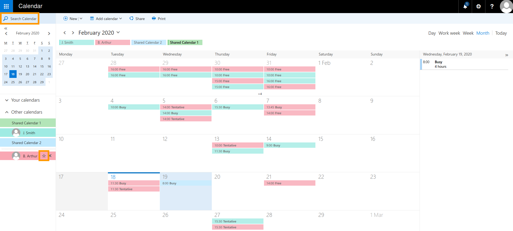

**Last updated 19th February 2020**

## Objective

This Exchange feature allows you to grant other people access to your calendars.

**This guide explains how to share calendars and retrieve them using the Outlook Web App (OWA).**

## Requirements

- an [OVHcloud Exchange solution](https://www.ovhcloud.com/en-ca/emails/hosted-exchange/) already set up
- access to your Exchange account (email address and password)

## Instructions

### Step 1: Selecting a calendar to share

Log in to your Exchange account via the [OVHcloud webmail](https://www.ovh.com/ca/en/mail/). Switch to the "Calendar" interface by clicking on the "app launcher" in the top left-hand corner and then selecting the `Calendar`{.action} icon.

{.thumbnail}

On the left you can see the list of available calendars in this account. Right-click on the one to share and select `Sharing permissions`{.action} from the context menu.

{.thumbnail}

### Step 2: Inviting and authorising calendar users

In the new window, add users to share the calendar with. Start typing to display suggestions from your contacts, enter a full email address or use the search option via `Search directory`{.action}. 

{.thumbnail}

Below, you can define a subject line for the email that will be sent to accept the calendar sharing.

{.thumbnail}

For each user, these access permissions can be specified:

|Name|Description|
|---|---|
|Availability only|Shows availability but no details regarding calendar events.|
|Limited details|Shows availability, titles and locations of events.|
|Full details|Shows all event information.|
|Editor|Allows to edit your calendar.|
|Delegate|Allows to edit your calendar and share it further.|

Please note that for external contacts, only the first three options will be available. When you have finished adding recipients, confirm by clicking on `Send`{.action}. Sharing invitations will now be sent out.

### Step 3: Retrieving a shared calendar

Invitations to share a calendar can be accepted directly from the confirmation email by clicking on the blue `Accept`{.action} button.

{.thumbnail}

The shared calendar will then be available in the "Calendar" interface in this account under "Other calendars".

> [!primary]
>
It's generally possible to share calendars with external users but there may be compatibility issues depending on the email client or web service used. Please find further information about this in the official [Microsoft documentation](http://go.microsoft.com/fwlink/?LinkId=57561).
>

### Changing calendar permissions

You can change existing permissions on shared calendars or revoke access to them. To do this, navigate to the "Calendar" section, right-click on the respective calendar and choose `Permissions..`{.action} from the context menu. In the new window, simply delete users from the list or change their access permissions. Remember to confirm with the `Save`{.action} button.

{.thumbnail}

### Using calendars in OWA

Here is an example of the OWA "Calendar" section with multiple calendars displayed:

{.thumbnail}

Clicking on a calendar in the list adds or removes them from the overview display in the middle. You can also add availability calendars of people from your organisation if you use the search field. Once added, they can be bookmarked as a "favourite" by clicking on the star symbol.

## Go further

[Using the Outlook Web App with an Exchange account](/ca/en/microsoft-collaborative-solutions/exchange_2016_outlook_web_app_user_guide)

[Sharing folders in OWA](/pages/web/microsoft-collaborative-solutions/owa_directory_sharing)

[Creating contact groups](/pages/web/microsoft-collaborative-solutions/feature_groups)

Join our community of users on <https://community.ovh.com/en/>.
