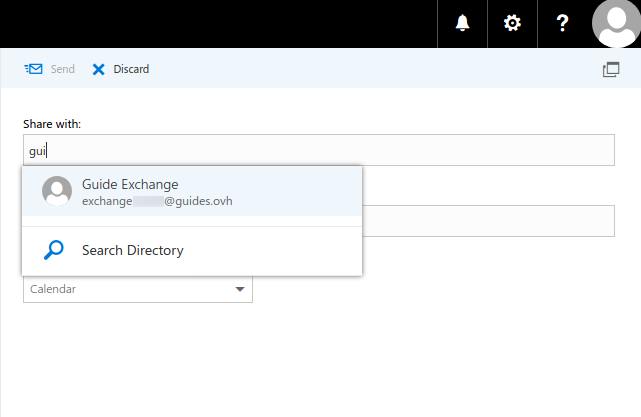

**Dernière mise à jour le 19/02/2020**

## Objectif

Grâce à cette fonction d’Exchange, autorisez l'accès à vos calendriers par d’autres utilisateurs.

**Ce guide vous explique comment partager et afficher vos calendriers depuis l'interface Outlook Web App (OWA).**

## Prérequis

- Avoir souscrit une offre [solution Exchange OVHcloud](https://www.ovhcloud.com/fr/emails/hosted-exchange/) 
- Avoir accès à votre compte Exchange (adresse e-mail et mot de passe)

## En pratique

### Étape 1 : Sélectionnez le calendrier à partager

Connectez-vous à votre compte Exchange via l’interface [Webmail OVHcloud](https://www.ovh.com/fr/mail/). Ouvrir la page « Calendrier » en cliquant sur « App Launcher » visible sur le coin supérieur gauche de l’écran. Sélectionnez l’icône `Calendrier`{.action}.

{.thumbnail}

À gauche de l’écran, vous trouvez la liste des calendriers existant pour ce compte.  Effectuez un clique droit sur le calendrier à partager et sélectionnez `Autorisations de partage`{.action} dans le menu contextuel.

{.thumbnail}

### Étape 2 : Invitez et donnez autorisation aux utilisateurs du calendrier

Ajoutez des utilisateurs avec lesquels partager le calendrier sur la nouvelle fenêtre qui s'affiche ci-dessous. Commencez à saisir un contact pour afficher les suggestions. Entrez les adresses e-mail complètes ou lancez une recherche en cliquant sur `Rechercher dans l'annuaire `{.action}. 

{.thumbnail}

Vous pouvez saisir l’objet de l'e-mail qui sera envoyé afin d’accepter le partage du calendrier.

{.thumbnail}

Les autorisations d’accès suivantes peuvent être spécifiées pour chaque utilisateur :

|Nom|Description|
|---|---|
|Disponibilité uniquement|Présente les disponibilités sans donner de détails sur les événements du calendrier.|
|Détails limités|Présente les disponibilités, les titres et les points d’événements.|
|Tous les détails|Donne toutes les informations sur les événements|
|Editeur|Permet d’éditer votre calendrier|
|Délégué|Permet d’éditer votre calendrier, mais aussi de le partager.|

Veuillez noter que pour les contacts externes, seul les trois premières options sont disponibles. Après avoir ajouté tous les destinataires, confirmez en cliquant sur `Envoyer`{.action}. C’est alors que les invitations seront envoyées.

### Étape 3 : Récupérer un calendrier partagé

Les invitations de partage de calendrier peuvent être directement acceptées en cliquant sur le bouton bleu `Accepter`{.action} apparaissant sur l’ e-mail de confirmation.

{.thumbnail}

Le calendrier partagé devient disponible sur l’interface « Calendrier » du compte, sous la rubrique « Autres calendriers ».

> [!primary]
>
Il est possible de partager des calendriers avec des contacts externes, mais des problèmes de compatibilité peuvent se poser en fonction du service de messagerie Web du client. Veuillez trouver davantage d’informations sur ce sujet en consultant la page officielle de la [documentation de Microsoft ](https://support.microsoft.com/fr-fr/help/10106/how-to-open-a-shared-calendar-from-an-outlook-sharing-invitation).
>

### Modifier les autorisations sur le calendrier

Vous pouvez modifier les autorisations définies sur les calendriers partagés ou révoquer l’accès à ceux-ci.  Pour le faire, ouvrez la section « Calendrier », faites un clic droit sur le calendrier à modifier et choisir `Autorisations..`{.action} du menu contextuel. Dans la fenêtre qui s’ouvre, supprimez simplement les utilisateurs de la liste ou modifiez leurs autorisations d’accès. N’oubliez pas de confirmer la modification grâce au bouton  `Enregistrer`{.action} 

{.thumbnail}

### Partager des calendriers via l’interface OWA

Cette image montre un exemple de la section «Calendrier» d’ OWA comportant plusieurs calendriers :

{.thumbnail}

Cliquer sur un calendrier de la liste a pour effet de l’ajouter ou de le retirer de la vue d’ensemble qui s’affiche au milieu. Vous pouvez également ajouter les calendriers de disponibilité des membres de votre entreprise grâce au champ de recherche. Une fois introduits dans la liste, ils peuvent être ajoutés aux « favoris » en cliquant sur le symbole en forme d’étoile.

## Aller plus loin

[Consulter son compte Exchange depuis l’interface OWA](https://docs.ovh.com/fr/microsoft-collaborative-solutions/exchange-2016-guide-utilisation-outlook-web-app/)

[Partager un dossier depuis l’interface OWA](/pages/web/microsoft-collaborative-solutions/owa_directory_sharing)

[Créer un groupe de contacts](/pages/web/microsoft-collaborative-solutions/feature_groups)

Échangez avec notre communauté d'utilisateurs sur <https://community.ovh.com/en/>.
