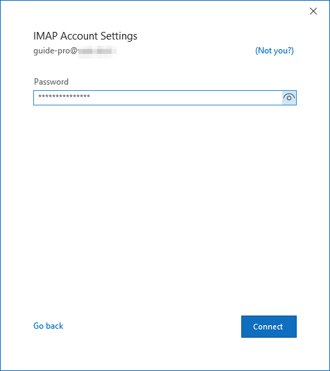

> [!primary]
> Diese Übersetzung wurde durch unseren Partner SYSTRAN automatisch erstellt. In manchen Fällen können ungenaue Formulierungen verwendet worden sein, z.B. bei der Beschriftung von Schaltflächen oder technischen Details. Bitte ziehen Sie im Zweifelsfall die englische oder französische Fassung der Anleitung zu Rate. Möchten Sie mithelfen, diese Übersetzung zu verbessern? Dann nutzen Sie dazu bitte den Button "Beitragen" auf dieser Seite.
>

## Ziel

E-Mail Pro Accounts können auf verschiedenen, kompatiblen E-Mail-Clients eingerichtet werden. So können Sie Ihr bevorzugtes Gerät für Ihre E-Mail-Adressen verwenden.

 

> [!warning]
> In dieser Anleitung erläutern wir die Verwendung einer oder mehrerer OVHcloud Lösungen mit externen Tools. Die durchgeführten Aktionen werden in einem bestimmten Kontext beschrieben. Denken Sie daran, diese an Ihre Situation anzupassen.
>
> Wir empfehlen Ihnen jedoch, sich bei Schwierigkeiten an einen [spezialisierten Dienstleister](https://partner.ovhcloud.com/de/directory/) zu wenden, und/oder Ihre Fragen in der OVHcloud Community zu stellen. Leider können wir Ihnen für externe Dienstleistungen keine weitergehende Unterstützung anbieten. Weitere Informationen finden Sie am [Ende dieser Anleitung](#gofurther).
>

## Voraussetzungen

- Sie verfügen über einen [E-Mail Pro Account](https://www.ovhcloud.com/de/emails/email-pro/){.external}.
- Microsoft Outlook ist auf Ihrem Gerät installiert.
- Sie verfügen über Anmeldeinformationen für die E-Mail-Adresse, die Sie konfigurieren möchten.

## In der praktischen Anwendung

### Account hinzufügen

- **Wenn Sie die Anwendung zum ersten Mal starten**: Es öffnet sich ein Konfigurationsassistent und Sie werden dazu aufgefordert, Ihre E-Mail-Adresse einzugeben.

- **Falls Sie bereits einen Account eingerichtet haben**: Klicken Sie am oberen Rand Ihres Bildschirms auf `Datei`{.action} und anschließend auf `Konto hinzufügen`{.action}.

- Geben Sie nun Ihre E-Mail-Adresse ein und klicken Sie auf `Erweiterte Optionen`{.action}. Setzen Sie den Haken neben `Ich möchte mein Konto manuell einrichten`{.action} und klicken Sie anschließend auf `Verbinden`{.action}. 

{.thumbnail}

> [!primary]
>
> In dieser Anleitung verwenden wir als Serverbezeichnung: pro**?**.mail.ovh.net. Das „?“ muss mit der jeweils passenden Nummer Ihres zuständigen Servers für den einzurichtenden Email Pro Dienst ersetzt werden.
> 
> Sie finden diese Information im [OVHcloud Kundencenter](https://www.ovh.com/auth/?action=gotomanager&from=https://www.ovh.de/&ovhSubsidiary=de), wenn Sie den betreffenden `E-Mail Pro`{.action} Dienst auswählen. Der Servername wird im Kasten **Verbindung** auf der Seite `Allgemeine Informationen`{.action} angezeigt.
>

| | |
|---|---|
|{.thumbnail}|Wählen Sie zwischen IMAP und POP aus der Liste der Kontotypen.  Wir empfehlen die Verwendung von IMAP.|
|Geben Sie das Passwort Ihrer E-Mail-Adresse ein und klicken Sie auf `Weiter`{.action}. |{.thumbnail}|
|{.thumbnail}|Wenn Outlook Ihre Adresse nicht automatisch konfigurieren konnte, öffnet sich dieses Fenster.  Klicken Sie auf `Einstellungen des Accounts ändern`{.action} |
|Geben Sie als **Eingangserver** ein:  - **pro**?**.mail.ovh.net** (ersetzen Sie "?" mit der Nummer Ihres Servers)  - Port **993** - Verschlüsselungsmethode **SSL/TLS**  Geben Sie als **Ausgangserver** ein:  - **pro**?**.mail.ovh.net** (ersetzen Sie "?" mit der Nummer Ihres Servers) - Port **587** - Verschlüsselungsmethode **STARTTLS**  Klicken Sie auf `Weiter`{.action}, um zu bestätigen. |{.thumbnail}|

Für eine **POP** Konfiguration verwenden Sie die folgenden Werte:

|Servertyp|Servername|Verschlüsselung|Port|
|---|---|---|---|
|Eingangsserver|pro**?**.mail.ovh.net (ersetzen Sie "?" mit der Nummer Ihres Servers)|SSL/TLS|995|
|Ausgangsserver|pro**?**.mail.ovh.net (ersetzen Sie "?" mit der Nummer Ihres Servers)|STARTTLS|587|

### E-Mail-Adresse verwenden

Sobald Ihre E-Mail-Adresse eingerichtet ist, können Sie sie verwenden. Sie können ab sofort E-Mails versenden und empfangen.

OVHcloud bietet auch eine Webanwendung an, mit der Sie über Ihren Webbrowser auf Ihre E-Mail-Adresse zugreifen können: <https://www.ovh.de/mail/>. Sie können sich mit den Login-Daten Ihrer E-Mail-Adresse anmelden. Bei Fragen zu dessen Verwendung können Sie unsere Anleitung zur [Outlook Web App](/pages/web_cloud/email_and_collaborative_solutions/using_the_outlook_web_app_webmail/email_owa) heranziehen.

### Backup Ihrer E-Mail-Adresse

Wenn Sie eine Änderung vornehmen, die den Verlust der Daten Ihres E-Mail-Accounts zur Folge haben könnte, empfehlen wir Ihnen eine vorherige Sicherung des betreffenden E-Mail-Accounts. Lesen Sie hierzu den Abschnitt zu **Windows** in unserer Anleitung "[E-Mail-Adresse manuell migrieren](/pages/web_cloud/email_and_collaborative_solutions/migrating/manual_email_migration#uber-windows-exportieren)".

### Bestehende Einstellungen ändern

Wenn Ihr E-Mail-Account bereits eingerichtet ist und Sie auf die Account-Einstellungen zugreifen müssen, um diese zu ändern:

- Wählen Sie `Datei`{.action} **(1)** in der Menüleiste oben und wählen Sie dann das Konto, das Sie ändern möchten, im Dropdown-Menü aus.
- Klicken Sie unten auf `Accounteinstellugen`{.action} **(2)**.
- Klicken Sie unten auf `Servereinstellungen`{.action} **(3)**, um zur Konfigurationsansicht zu gelangen.

{.thumbnail}

Das Fenster ist in zwei Bereiche unterteilt, für **eingehende** und **ausgehende** Einstellungen. Klicken Sie auf die jeweilige Auswahl, um die Konfiguration zu ändern.

> [!primary]
>
> In dieser Anleitung verwenden wir als Serverbezeichnung: pro**?**.mail.ovh.net. Das „?“ muss mit der jeweils passenden Nummer Ihres zuständigen Servers für den einzurichtenden Email Pro Dienst ersetzt werden.
> 
> Sie finden diese Information im [OVHcloud Kundencenter](https://www.ovh.com/auth/?action=gotomanager&from=https://www.ovh.de/&ovhSubsidiary=de), wenn Sie den betreffenden `E-Mail Pro`{.action} Dienst auswählen. Der Servername wird im Kasten **Verbindung** auf der Seite `Allgemeine Informationen`{.action} angezeigt.
>

{.thumbnail}

## Weiterführende Informationen 

[Konfiguration Ihrer MX Plan Adresse mit Outlook für Windows](/pages/web_cloud/email_and_collaborative_solutions/mx_plan/how_to_configure_outlook_2016)

[Konfiguration von Exchange auf Outlook 2016 für Windows](/pages/web_cloud/email_and_collaborative_solutions/microsoft_exchange/how_to_configure_outlook_2016)

Für den Austausch mit unserer User Community gehen Sie auf <https://community.ovh.com/en/>.
