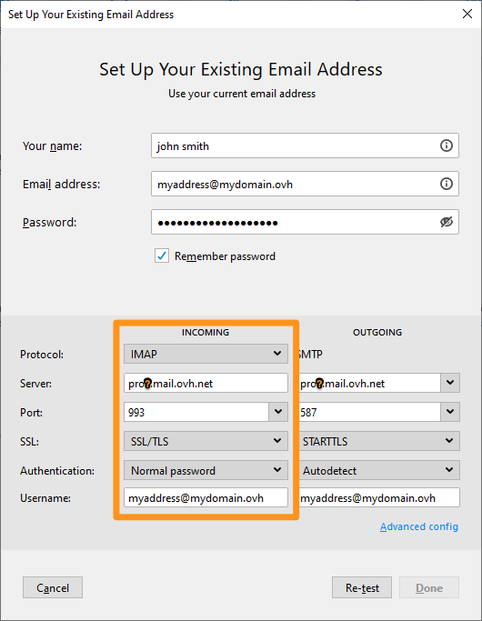
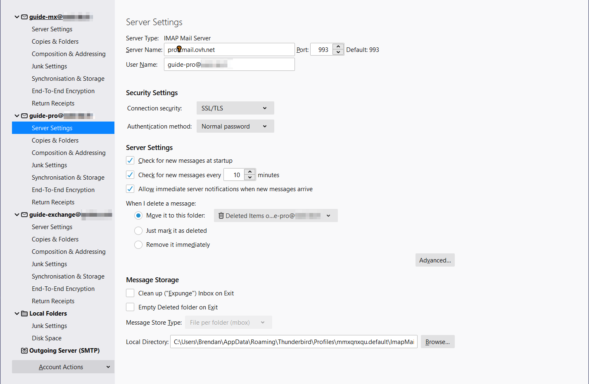

> [!primary]
> Questa traduzione è stata generata automaticamente dal nostro partner SYSTRAN. I contenuti potrebbero presentare imprecisioni, ad esempio la nomenclatura dei pulsanti o alcuni dettagli tecnici. In caso di dubbi consigliamo di fare riferimento alla versione inglese o francese della guida. Per aiutarci a migliorare questa traduzione, utilizza il pulsante "Contribuisci" di questa pagina.
>

**Ultimo aggiornamento: 26/08/2021**

## Obiettivo

Gli account Email Pro possono essere configurati su client di posta compatibili, per permetterti di utilizzare il tuo account email dal dispositivo che preferisci. Thunderbird è un client di posta gratuito e gratuito.

**Questa guida ti mostra come configurare il tuo indirizzo email Email Pro su Thunderbird su Windows.**

> [!warning]
>
> OVHcloud mette a tua disposizione servizi di cui tu sei responsabile per la configurazione e la gestione. Garantirne quotidianamente il corretto funzionamento è quindi responsabilità dell’utente.
> 
> Questa guida ti aiuta a eseguire le operazioni necessarie alla configurazione del tuo account. Tuttavia, in caso di difficoltà o dubbi, ti consigliamo di contattare un fornitore specializzato o l’amministratore del servizio. OVHcloud non può fornirti alcuna assistenza. Per maggiori informazioni consulta la sezione “Per saperne di più” di questa guida.
> 

## Prerequisiti

- Disporre di un account email [Email Pro](/products/web-cloud-email-collaborative-solutions-email-pro)
- Aver installato il software Thunderbird sul tuo Windows
- Disporre delle credenziali associate all’indirizzo email da configurare
 
## Procedura

> [!primary]
>
> Nel nostro esempio abbiamo utilizzato come nome del server "pro**?**.mail.ovh.net", dove "?" dovrà essere sostituito con il numero che indica il server del servizio Email Pro.
>
> Questa informazione è disponibile nello [Spazio Cliente OVHcloud](https://www.ovh.com/auth/?action=gotomanager&from=https://www.ovh.it/&ovhSubsidiary=it){.external}, sezione `Web Cloud`{.action}, selezionando `Email Pro`{.action}. Il nome del server è visibile nel riquadro **Connessione** della scheda `Informazioni generali`{.action}.
> 

### Aggiungi l'account

- Durante il primo avvio dell’applicazione un assistente di configurazione apparirà sullo schermo e ti inviterà a inserire il tuo indirizzo e-mail.

- **Se è già stato impostato** un account: clicca su `File`{.action} nella barra dei menu in alto nello schermo, poi `Nuovo`{.action} e infine `Ricevi un nuovo account di posta...`{.action}.

| | |
|---|---|
|{.thumbnail}|Nella finestra che appare inserisci queste 3 informazioni:  - Nome completo (Nome visualizzato) - Indirizzo di posta elettronica  - Password|
|Clicca su `Configura manualmente...`{.action} per inserire le impostazioni del server **IN ENTRATA**:  - Protocollo **IMAP**  - Server **pro?.mail.ovh.net** (sostituisci "**?**" con il numero del tuo server) - Port **993**  - SSL **SSL/TLS**  - Autenticazione **Password normale**  - Identificativo **del tuo indirizzo email completo**|{.thumbnail}|
|{.thumbnail}|Inserisci le impostazioni del server **USCENTE**:  - Protocollo **SMTP**  - Server **pro?.mail.ovh.net** (sostituisci "**?**" con il numero del tuo server) - Port **587**  - SSL **STARTTLS**  - Autenticazione **Password normale**  - Identificativo **del tuo indirizzo email completo**  Per completare la configurazione, clicca su `Fine`{.action}|

Nell'ambito di una configurazione in **POP**, i valori sono i seguenti:

|Tipo di server|Nome del server|Metodo di cifratura|Porta|
|---|---|---|---|
|In entrata|pro**?**.mail.ovh.net (la menzione **"?"** è da sostituire con il numero del tuo server)|SSL/TLS|995|
|In uscita|pro**?**.mail.ovh.net (la menzione **"?"** è da sostituire con il numero del tuo server)|STARTTLS|857|

### Utilizza l'indirizzo email

Una volta configurato l’indirizzo email, non ti resta che utilizzarlo! A partire da questo momento puoi inviare e ricevere messaggi.

OVHcloud propone anche un'applicazione Web che permette di accedere al tuo indirizzo email da un browser Internet. disponibile alla pagina <https://www.ovh.it/mail/> accessibile utilizzando le credenziali del tuo account. Se hai bisogno di aiuto per effettuare questa operazione, consulta [il tuo account Exchange dall'interfaccia OWA](/pages/web_cloud/email_and_collaborative_solutions/using_the_outlook_web_app_webmail/email_owa).

### Recuperare un backup del tuo indirizzo email

Se è necessario effettuare un'operazione che potrebbe comportare la perdita dei dati del tuo account email, ti consigliamo di effettuare un backup preliminare dell'account email in questione. Per effettuare questa operazione consulta il paragrafo "**Esporta**" nella sezione "**Thunderbird**" della nostra guida [Migrare manualmente il tuo indirizzo email](/pages/web_cloud/email_and_collaborative_solutions/migrating/manual_email_migration#esportare).

### Modifica i parametri esistenti

> [!primary]
>
> Nel nostro esempio abbiamo utilizzato come nome del server "pro**?**.mail.ovh.net", dove "?" dovrà essere sostituito con il numero che indica il server del servizio Email Pro.
>
> Questa informazione è disponibile nello [Spazio Cliente OVHcloud](https://www.ovh.com/auth/?action=gotomanager&from=https://www.ovh.it/&ovhSubsidiary=it){.external}, sezione `Web Cloud`{.action}, selezionando `Email Pro`{.action}. Il nome del server è visibile nel riquadro **Connessione** della scheda `Informazioni generali`{.action}.
> 

Se il tuo account email è già configurato e devi accedere alle impostazioni dell'account per modificarle:

- Seleziona `Strumenti`{.action} dalla barra dei menu in alto nello schermo.
- Clicca su `Impostazioni account`{.action}.

{.thumbnail}

- Per modificare i parametri legati alla **ricezione** delle tue email, clicca su `Impostazioni server`{.action} nella colonna di sinistra sotto il tuo indirizzo email.

{.thumbnail}

- Per modificare le impostazioni relative **all'invio** delle tue email, clicca su `Server in uscita (SMTP)`{.action} in basso a sinistra.
- Clicca sull'indirizzo email corrispondente nella lista e poi clicca su `Modifica`{.action}.

{.thumbnail}

## Per saperne di più

Contatta la nostra Community di utenti all’indirizzo <https://community.ovh.com/en/>.