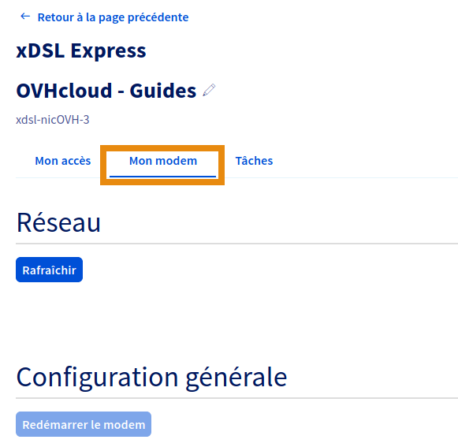

**Dernière mise à jour le 16/02/2022**

## Objectif

L'Auto Configuration Server (ACS) est une couche de traduction entre votre modem et notre outil de configuration à distance disponible sur l'espace client OVHcloud. Le modem communique avec nos infrastructures au travers du CPE WAN Management Protocol (CWMP) qui a plusieurs spécificités par rapport à la communication REST utilisée par l'espace client et l'API OVHcloud.

> [!primary]
>
> Depuis le 01/09/2020, l'ACSv2 est disponible. C'est un changement d'infrastructure majeur venant remplacer l'ACSv1 après huit années de loyaux services. Ce changement nous permet de proposer une nouvelle fonctionnalité : le choix de l'ACS backend. À l'heure actuelle, trois backends sont disponibles pour l'ACS, « Legacy » (par défaut), « Stable » et « Beta ».
>

**Apprenez à modifier votre backend ACS.**

## Prérequis

- Disposer d’un [accès internet xDSL ou fibre OVHcloud](https://www.ovhtelecom.fr/offre-internet/){.external}.
- Être connecté à l'[espace client OVHcloud](https://www.ovh.com/auth?onsuccess=https%3A%2F%2Fwww.ovhtelecom.fr%2Fmanager&ovhSubsidiary=fr){.external} dans la partie `Accès Internet`{.action}.
- Cette fonctionalité est disponible même si la configuration à distance est désactivée.

## En pratique

### Étape 1 : Accéder à l'outil de configuration à distance

Connectez-vous à votre [espace client OVHcloud](https://www.ovh.com/auth?onsuccess=https%3A%2F%2Fwww.ovhtelecom.fr%2Fmanager&ovhSubsidiary=fr){.external}, partie « Télécom ». Cliquez sur `Accès Internet`{.action} puis sélectionnez le pack et l’accès à Internet concerné. Assurez-vous d'être positionné sur l'onglet `Mon modem`{.action}.

{.thumbnail}

Dans le cadre « Configurations avancées », reportez-vous aux éléments de la partie `ACS`. Vous retrouverez dans cette dernière une liste déroulante vous permettant de choisir le backend cible.

### Étape 2 : Choisir un backend ACS

Trois backends sont disponibles, vous devez choisir celui sur lequel vous souhaitez migrer. Le backend par défaut est « Legacy ».

- Legacy: Le backend de l'ACSv1. Sélectionner ce backend configure le modem pour qu'il communique avec l'ancienne infrastructure.
- Stable: Le backend par défaut de l'ACSv2. Sélectionner ce backend ne permet pas de profiter immédiatement des nouvelles fonctionnalités, mais il permet de profiter d'une meilleure stabilité avec des changements moins fréquents et éprouvés sur le backend beta.
- Beta: Ce backend permet de profiter immédiatement des nouvelles fonctionnalités, mais peut être sujet à des instabilités dûes à des changements plus fréquents et moins éprouvés.

### Étape 3 : Appliquer la modification

> [!warning]
>
> Changer le backend ACS réinitialise le modem. Si vous n'utilisez pas notre outil de configuration à distance, la configuration du modem sera perdue. Pensez à la sauvegarder au préalable.
>

Une fois le backend choisi, sélectionnez-le dans la liste déroulante et cliquez sur le bouton `Valider`{.action}.

Une tâche va alors modifier l'URL du serveur ACS sur le modem, puis va initier une réinitialisation du modem. Si vous utilisez notre outil de configuration à distance, la configuration présente dans l'espace client OVHcloud sera de nouveau appliquée quand le modem aura terminé la réinitialisation.

{.thumbnail}

### Expert : Modifier le backend directement via l'API OVHcloud

Cette méthode s'adresse aux utilisateurs expert uniquement. Nous ne serons pas en mesure de vous fournir une assistance.

> [!primary]
>
> Pour en savoir plus sur l'utilisation des API, consultez le guide [Premiers pas avec les API OVHcloud](/pages/manage_and_operate/api/first-steps).
>

Rendez-vous sur le lien <https://api.ovh.com/console/> puis connectez-vous avec votre identifiant client OVHcloud. 

Dès lors, utilisez les trois API ci-dessous afin de configurer le backend ACS.

> [!api]
>
> @api {GET} /xdsl/{serviceName}/modem/availableACSBackend
>

Permet de récupérer les backends ACS disponibles pour votre modem.

> [!api]
>
> @api {GET} /xdsl/{serviceName}/modem
>

Permet de récupérer différentes informations sur votre modem, y compris le backend actuellement utilisé par votre modem.

> [!api]
>
> @api {PUT} /xdsl/{serviceName}/modem
>

Modifiez le champ `acsBackend` pour appliquer le changement de backend ACS.

## Aller plus loin

Échangez avec notre communauté d'utilisateurs sur <https://community.ovh.com>.
