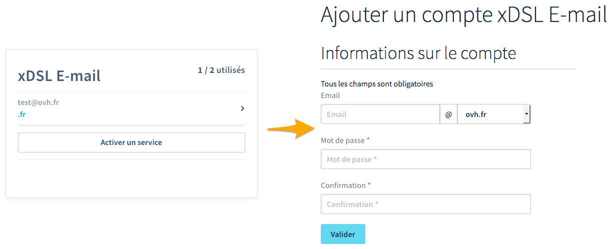

**Dernière mise à jour le 10/10/2022**

## Objectif

Vous avez la possibilité de bénéficier d'adresses E-mail avec nos offres FTTH/xDSL OVHcloud. Ces adresses permettent d'envoyer et de recevoir vos messages depuis l'appareil de votre choix.

**Découvrez comment activer  les adresses e-mail incluses dans votre offre FTTH/xDSL et comment y accéder.**

## Prérequis

- Disposer d'une [offre xDSL ou FTTH compatible](https://www.ovhtelecom.fr/adsl/){.external}.
- Avoir encore la possibilité de créer des adresses e-mail dans le cadre de votre offre.
- Être connecté à votre [espace client OVHcloud](https://www.ovhtelecom.fr/manager/index.html#/){.external}.

## En pratique

### Étape 1 : activer son adresse xDSL E-mail

Pour démarrer la manipulation, connectez-vous à votre [espace client OVHcloud](https://www.ovhtelecom.fr/manager/index.html#/){.external}, partie `Télécom`{.action}. Cliquez sur `Accès Internet`{.action} puis choisissez l'offre concernée. 

Cliquez sur le bouton `Activer un service`{.action} se trouvant dans la rubrique « xDSL E-mail ». Sur la nouvelle page qui s'affiche, remplissez les informations demandées :

|Information|Description|
|---|---|
|E-mail|Renseignez le nom que portera votre adresse e-mail (votre « prénom.nom », par exemple).|
|Mot de passe|Définissez le mot de passe de cette adresse, puis confirmez-le.|

{.thumbnail}

Cliquez sur `Valider`{.action} pour lancer la création de l'adresse e-mail. Répétez cette manipulation si vous souhaitez créer une seconde adresse e-mail.

> [!primary]
>
> Pour des raisons de sécurité, nous vous invitons à respecter les conditions indiquées lors du choix du mot de passe. Nous vous recommandons également :
>
> - de ne pas utiliser deux fois le même mot de passe ;
>
> - de choisir un mot de passe qui n'a aucun rapport avec vos informations personnelles (évitez les mentions à votre nom, prénom ou date de naissance, par exemple) ;
>
> - de renouveler régulièrement vos mots de passe ;
>
> - de ne pas noter sur un papier ou de vous envoyer vos mots de passe sur votre adresse e-mail, mais plutôt d'utiliser un logiciel du type « gestionnaire de mots de passe » ;
>
> - de ne pas enregistrer vos mots de passe dans votre navigateur internet, même si ce dernier vous le propose.
>

### Étape 2 : utiliser votre adresse e-mail

Il ne reste plus qu'à utiliser votre adresse e-mail. Pour cela, OVHcloud met à disposition un applicatif en ligne (webmail). Ce dernier est accessible à l'adresse <https://www.ovh.com/fr/mail/> ; vous devrez y renseigner les identifiants relatifs à votre adresse e-mail nouvellement créée.

Si vous souhaitez configurer votre adresse e-mail sur un logiciel de messagerie ou un appareil (comme un smartphone ou une tablette), consultez nos tutoriels dédiés sur </products/web-cloud-email-collaborative-solutions-email-pro>.

Si vous éprouvez des difficultés lors de la configuration de votre adresse, nous vous recommandons de faire appel à un [prestataire spécialisé](https://partner.ovhcloud.com/fr/) et/ou de contacter l’éditeur du client de messagerie utilisé. Les paramètres mentionnés dans le tableau ci-dessus peuvent vous être demandés.

## Aller plus loin

Échangez avec notre communauté d'utilisateurs sur <https://community.ovh.com>.