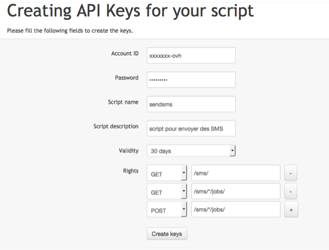

**Última actualización: 04/11/2019**

## Objetivo

Los SMS se utilizan con frecuencia para difundir información práctica, informar del estado de un pedido o una transacción, enviar alertas relativas a acontecimientos imprevistos o recordar citas. 

**Esta guía explica cómo enviar SMS con PHP usando la API RESTful de OVHcloud.**

## Requisitos

- Tener un entorno de desarrollo en PHP.
- Disponer de una cuenta de SMS en OVHcloud con saldo de SMS.

## Procedimiento

### 1. Descargar el wrapper PHP para la API de OVHcloud

Vaya al proyecto [https://github.com/ovh/php-ovh](https://github.com/ovh/php-ovh).

Con el gestor de dependencias [Composer](https://getcomposer.org/), podrá integrar rápidamente el wrapper PHP.

Cree el archivo **composer.json** siguiendo las instrucciones de GitHub, que se encuentran en el archivo **README.md**, en el apartado **Quickstart**.

Descargue en su proyecto el directorio **./vendor/ovh/ovh/** y el archivo **autoload.php**, que permite gestionar todas las dependencias y las importaciones.

{.thumbnail}


### 2. Generar las claves

Para utilizar el servicio de SMS con la API, es necesario disponer de unas claves. Dichas claves se generan una sola vez para identificar la aplicación que enviará SMS. Es posible configurar su validez.

Genere las claves para su script (se crean todas a la vez) desde esta página:
[https://api.ovh.com/createToken](https://eu.api.ovh.com/createToken/index.cgi?GET=/sms&GET=/sms/*/jobs/&POST=/sms/*/jobs/) (si accede desde este enlace, tendrá automáticamente los permisos necesarios para seguir los pasos que se explican en esta guía).

{.thumbnail}

En el ejemplo de la imagen, hemos configurado los permisos para tener acceso a la información de la cuenta, ver los envíos pendientes y enviar SMS.

- GET /sms
- GET /sms/*/jobs/
- POST /sms/*/jobs/

El asterisco (\*) activa las llamadas a la API para todas sus cuentas de SMS. En caso de que gestione varias cuentas de SMS en la misma cuenta de OVHcloud, puede restringir las llamadas a una sola cuenta sustituyendo `/sms` por `/sms/NOMBRE_DE_LA_CUENTA` y `/sms/*/` por `/sms/NOMBRE_DE_LA_CUENTA/`.

De este modo, obtendrá las siguientes claves para su script:

- Application Key: identifica la aplicación
- Application Secret: autentifica la aplicación
- Consumer Key: autoriza a la aplicación para que acceda a las llamadas a la API elegidas

{.thumbnail}

Una vez que el entorno esté listo y haya generado las claves, ya puede escribir su script de PHP.


### 3. Utilizar un SDK para PHP

Para simplificarle la tarea, hemos creado un SDK para PHP, que puede encontrar [aquí](https://github.com/ovh/php-ovh-sms).


### 4. Conectarse a la API

Pruebe la conexión a la API mostrando, por ejemplo, los detalles de cada cuenta de SMS:

```php
<?php
/**
 * Muestra el detalle de cada cuenta de SMS.
 * 
 * Vaya a https://eu.api.ovh.com/createToken/index.cgi?GET=/sms&GET=/sms/*/jobs/&POST=/sms/*/jobs/
 * para generar las claves de acceso a la API para:
 *
 * GET /sms
 * GET /sms/*/jobs/
 * POST /sms/*/jobs/
 */

require __DIR__ . '/vendor/autoload.php';
use \Ovh\Api;

$endpoint = 'ovh-eu';
$applicationKey = "your_app_key";
$applicationSecret = "your_app_secret";
$consumer_key = "your_consumer_key";

$conn = new Api(    $applicationKey,
                    $applicationSecret,
                    $endpoint,
                    $consumer_key);
     
$smsServices = $conn->get('/sms/');
foreach ($smsServices as $smsService) {

    print_r($smsService);
}

?>
```

Al ejecutar este script, obtendrá la lista de sus cuentas de SMS.


### 5. Enviar el primer SMS

Para enviar SMS, utilice la siguiente llamada a la API:

> [!api]
>
> @api {POST} /sms/{serviceName}/jobs
>

> [!primary]
>
> **Sólo para cuentas OVHcloud en Francia excluyendo DOM-TOM:**
> 
> El parámetro **senderForResponse** permite utilizar un número corto para enviar SMS directamente, sin tener que crear un remitente alfanumérico (por ejemplo, su nombre).
> 
> Los números cortos también permiten recibir respuestas de los destinatarios de sus SMS, lo que puede ser útil para encuestas de satisfacción, aplicaciones de votación, juegos...
>


```php
<?php
/**
 * Envía un SMS y luego muestra la lista de SMS pendientes de envío.
 * 
 * Vaya a https://eu.api.ovh.com/createToken/index.cgi?GET=/sms&GET=/sms/*/jobs/&POST=/sms/*/jobs/
 * para generar las claves de acceso a la API para:
 *
 * GET /sms
 * GET /sms/*/jobs/
 * POST /sms/*/jobs/
 */

require __DIR__ . '/vendor/autoload.php';
use \Ovh\Api;

$endpoint = 'ovh-eu';
$applicationKey = "your_app_key";
$applicationSecret = "your_app_secret";
$consumer_key = "your_consumer_key";

$conn = new Api(    $applicationKey,
                    $applicationSecret,
                    $endpoint,
                    $consumer_key);
     
$smsServices = $conn->get('/sms/');
foreach ($smsServices as $smsService) {

    print_r($smsService);
}

$content = (object) array(
	"charset"=> "UTF-8",
	"class"=> "phoneDisplay",
	"coding"=> "7bit",
	"message"=> "Ya están disponibles los SMS de OVHcloud en api.ovh.com",
	"noStopClause"=> false,
	"priority"=> "high",
	"receivers"=> [ "+3460000000" ],
	"senderForResponse"=> true,
	"validityPeriod"=> 2880
);
$resultPostJob = $conn->post('/sms/'. $smsServices[0] . '/jobs/', $content);

print_r($resultPostJob);

$smsJobs = $conn->get('/sms/'. $smsServices[0] . '/jobs/');
print_r($smsJobs);
        
?>
```


Este es un ejemplo de respuesta:

```
sms-XXXXXX-1
Array
(
    [totalCreditsRemoved] => 1
    [invalidReceivers] => Array
        (
        )

    [ids] => Array
        (
            [0] => 26929925
        )

    [validReceivers] => Array
        (
            [0] => +3460000000
        )

)
Array
(
)
```


En la respuesta anterior se indica la cuenta de SMS (ServiceName) y el crédito consumido (1, correspondiente a un destinatario válido). También puede ver que no hay ningún SMS pendiente de envío.


## Más información

En la consola de la API ([https://api.ovh.com/console/#/sms](https://api.ovh.com/console/#/sms)) podrá descubrir otras llamadas que le permitirán integrar servicios de SMS, tales como permitir la respuesta a los SMS (solo para las cuentas de OVHcloud Francia), envío masivo con un archivo CSV, envío de publicidad, seguimiento de los acuses de recibo...

Interactúe con nuestra comunidad de usuarios en <https://community.ovh.com/en/>.