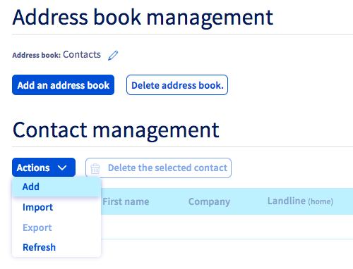
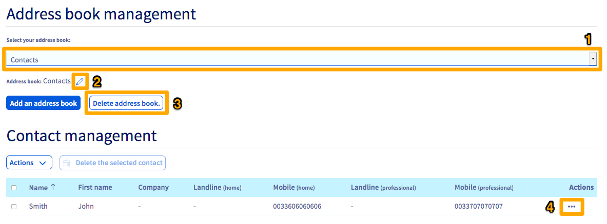

> [!primary]
> Questa traduzione è stata generata automaticamente dal nostro partner SYSTRAN. I contenuti potrebbero presentare imprecisioni, ad esempio la nomenclatura dei pulsanti o alcuni dettagli tecnici. In caso di dubbi consigliamo di fare riferimento alla versione inglese o francese della guida. Per aiutarci a migliorare questa traduzione, utilizza il pulsante "Contribuisci" di questa pagina.
>

**Ultimo aggiornamento: 05/08/2022**

## Obiettivo

Tutti gli account SMS OVHcloud possono utilizzare una o più rubriche. Questa guida ti mostra come creare le rubriche nel tuo Spazio Cliente.

## Prerequisiti

- Disporre di un account SMS OVHcloud attivo
- Disporre di un programma di fogli di calcolo o un editor di testo
- Avere accesso allo [Spazio Cliente OVHcloud](https://www.ovh.com/auth/?action=gotomanager&from=https://www.ovh.it/&ovhSubsidiary=it){.external}, sezione `Télécom`{.action} > `SMS`{.action}

{.thumbnail}

## Procedura

### Step 1: crea una rubrica di contatti nel tuo Spazio Cliente

Accedi allo [Spazio Cliente OVHcloud](https://www.ovh.com/auth/?action=gotomanager&from=https://www.ovh.it/&ovhSubsidiary=it). Quindi seleziona `SMS`{.action}.

Clicca sull'account SMS interessato e seleziona `Contatti`{.action} > `Rubrica`{.action}.

{.thumbnail}

Seleziona la scheda `Rubrica Indirizzi`{.action}.

Clicca su `Aggiungi Rubrica Indirizzi`{.action} e assegna un nome alla tua nuova lista di contatti.

{.thumbnail}

### Step 2: aggiungi contatti nella tua rubrica

Una volta creata la rubrica indirizzi, esistono vari metodi per aggiungere i contatti.

### Aggiungi contatti dallo Spazio Cliente

Seleziona il pulsante `Azioni`{.action} e clicca su `Aggiungi`{.action}.

{.thumbnail}

A questo punto, inserisci le informazioni del contatto che vuoi aggiungere.

{.thumbnail}

Compila i campi richiesti e conferma l’operazione per salvare le modifiche. Il contatto verrà quindi aggiunto alla rubrica. Per aggiungere altri contatti, effettua la stessa operazione.

### Aggiungi contatti multipli tramite l’importazione di file di contatti dallo Spazio Cliente

#### Prepara il file nel foglio di calcolo

Per utilizzare o creare un documento nel formato foglio di calcolo, sarà necessario presentarlo come mostrato qui di seguito e esportarlo nel formato “.csv.”.

{.thumbnail}

La maggior parte dei fogli di calcolo non sono compatibili con il formato internazionale dei numeri di telefono e fax (+39xxxxxxxxx). Pertanto sarà necessario modificare il formato delle cellule contenenti i numeri (workPhone, workMobile,...). Per farlo, seleziona le colonne interessate e applica un formato “Texte”.

{.thumbnail}

Quando il documento è pronto, salvalo nel formato foglio di calcolo per modificarlo ulteriormente.

Allo stesso modo, salvalo o esportalo nel formato “.csv” per consentirne l’importazione.

> [!primary]
>
> **Consigli**
>
>Salva il file foglio di calcolo nel formato .csv (separatore: punto e virgola).
>
>I caratteri speciali come gli accenti non sono accettati nell’importazione del file “.csv”. Pertanto i contatti contenenti questo tipo di caratteri non saranno importati.
>
>I numeri devono rispettare il formato internazionale +39xxxxxxxxx.
>
>Ti consigliamo di creare rubriche indirizzi con un massimo di 2000 contatti.
>
>Tutti i contatti dovranno essere sullo stesso foglio di calcolo.
>
>

#### Importa il file nel tuo Spazio Cliente

Dallo Spazio Cliente OVHcloud, seleziona il pulsante `Azioni`{.action} e clicca su `Importa`{.action}.

{.thumbnail}

Nel pop-up che appare, clicca su `File di contatto`{.action}, seleziona il file “.csv” e infine conferma l’operazione.

{.thumbnail}

Attendi alcuni secondi durante il caricamento del file nel tuo Spazio Cliente.

### Step 3: modifica o elimina una rubrica indirizzi

Per modificare il nome di una rubrica, seleziona la tua lista di contatti nel menu a tendina (1) (se hai creato diverse rubriche) e clicca sulla matita (2) accanto al nome della rubrica. 

Per eliminare una rubrica, selezionala nel menu a tendina (1) e clicca su `Elimina rubrica indirizzi`{.action} (3).

Per modificare o eliminare un contatto, clicca sui tre puntini`...`{.action} nella colonna “Azioni” (4) accanto al contatto corrispondente. A questo punto, puoi selezionare l’opzione che desideri.

{.thumbnail}

## Per saperne di più

Contatta la nostra Community di utenti all’indirizzo [https://community.ovh.com/en/](https://community.ovh.com/en/).
