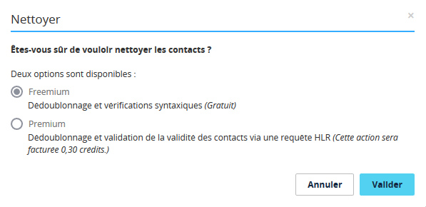

**Dernière mise à jour le 26/03/2018**

## Principes
Les requêtes HLR vous permettent de savoir si un numéro de téléphone mobile est valide avant de lui envoyer un SMS.
Si le numéro est valide, le résultat vous permettra de connaître l'opérateur sur lequel le téléphone est enregistré.

## Usages
Optimisation de campagne SMS : Vous envoyer un nombre important de SMS, vous souhaitez vous assurer un haut niveau de délivrabilité et éviter les échecs d'envoi ?
En utilisant le HLR Lookup vous vérifiez la validité du numéro avant de consommer un SMS.

{.thumbnail}
Nettoyer des listes de numéros : Vous disposez de fichiers clients, vous souhaitez qualifier les numéros de mobiles ?
Le HLR Lookup vous indique si le numéro est actif et attribué.
Vous tenez ainsi à jour votre fichier client et vos données conservent leur valeur.

{.thumbnail}

## Connexion à l'interface
Connectez-vous à votre [espace client](https://www.ovhtelecom.fr/manager/), rubrique Telecom. Sélectionnez ensuite SMS dans les menus de gauche.

Cliquez ensuite sur le compte SMS désiré.

{.thumbnail}

## Section HLR
Sélectionnez l'onglet SMS.

{.thumbnail}
Cliquez ensuite sur la partie HLR

{.thumbnail}

## Nouvelle requête HLR
Renseignez le numéro que vous souhaitez tester puis cliquez sur Envoyer la requête.

{.thumbnail}
Chaque requête est facturée 0.1 crédit SMS. Vous pouvez retrouver nos tarifs SMS sur notre [page dédiée](https://www.ovhtelecom.fr/sms/tarifs.xml).

## Consulter les requêtes passées
Vous retrouverez les résultats de vos requêtes dans le tableau ci-dessous :

{.thumbnail}

## Les différents états
Les rapport HLR vous informeront des points suivants :

- la date de la requête HLR
- le coût de la requête HLR
- le statut de la requête HLR
- le numéro du destinataire
- l'opérateur du destinataire
- le statut actif/inactif du destinataire
- la joignabilité du destinataire
- le statut porté du destinataire
- le statut en itinérance du destinataire.

## Importation du fichier de destinataires
Rendez vous dans la partie Contacts et ajoutez votre fichier .csv que vous aurez préalablement hébergé sur un [service adapté](https://plik.root.gg).

Le fichier .csv devra comporter une colonne numbers afin d'être reconnu.
Vous avez également la possibilité de créer un fichier numbers.txt avec la liste de numéros de vos contacts, au format international, avec un contact par ligne.

{.thumbnail}

## Nettoyer le fichier
Une fois votre carnet chargé sur l'espace client, sélectionnez le et procédez au nettoyage.

{.thumbnail}
Deux options vous sont proposées :

- Freemium : Dédoublonnage et vérifications syntaxiques (Gratuit).
- Premium : Dédoublonnage et vérification de la validité des contacts via une requête HLR (Cette action sera facturée 0.1 crédit SMS par contact)

{.thumbnail}
Le nettoyage de la base dédoublonnera vos contacts et éliminera ceux qui sont invalides.
Le fichier nettoyé remplacera l'ancien qui sera sauvegardé et accessible. Vous recevrez un rapport par e-mail à la fin de l'opération.

