**Dernière mise à jour le 17/05/2022** 
 
## Objectif
 
La configuration en file d'appels permet de rediriger un appel entrant vers plusieurs lignes. Cette solution rend notamment possible la création d'une stratégie permettant d'éviter la perte d'appels.

Vous pouvez ainsi décider, lorsqu'un appel entrant arrive sur votre numéro principal, de faire sonner plusieurs lignes en même temps ou l'une après l'autre.
 
**Découvrez comment configurer intégralement une file d'appels.**
 
## Prérequis
 
- Disposer d'un [numéro alias](https://www.ovhtelecom.fr/telephonie/numeros/){.external} dans votre compte OVHcloud.
- Être connecté à l’[espace client OVHcloud](https://www.ovh.com/auth/?action=gotomanager&from=https://www.ovh.com/fr/&ovhSubsidiary=fr){.external}.

> [!primary]
>
> Une file d'appels ne peut être configurée **que sur un numéro alias**.
> Consultez notre [FAQ](/pages/web_cloud/email_and_collaborative_solutions/internet/phone_and_fax/voip/faq-voip) pour plus d'informations sur les différences entre un numéro alias et une ligne SIP.
>

## En pratique

Connectez-vous à votre [espace client OVHcloud](https://www.ovh.com/auth/?action=gotomanager&from=https://www.ovh.com/fr/&ovhSubsidiary=fr){.external}, dans la section `Télécom`{.action}. 
Cliquez ensuite sur `Télécom`{.action} et choisissez le numéro alias sur lequel vous souhaitez configurer la file d'appels.
 
### Étape 1 : appliquer la configuration

- Si votre numéro n'est actuellement pas configuré, cliquez sur l'onglet `Configuration`{.action}, sélectionnez `File d'appels`{.action} puis cliquez sur `Paramétrer`{.action}.

- Si votre numéro a déjà une configuration en place, cliquez sur l'onglet `Configuration`{.action} puis sur `Changer de configuration`{.action}. Sélectionnez ensuite `File d'appels`{.action} et cliquez sur `Paramétrer`{.action}. Vous devrez alors confirmer la perte de la configuration actuellement en place.

{.thumbnail}

### Étape 2 : paramétrer la file d'appels
 
Une fois la configuration de file d'appels appliquée, les menus de configuration vous sont présentés.

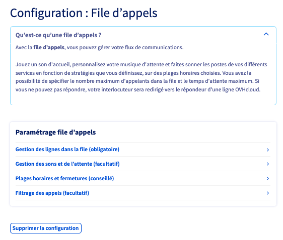{.thumbnail}

Pour revenir à cette page à tout moment, cliquez sur l'onglet `Mon numéro`{.action} puis, dans le cadre « Configuration », cliquez sur `Paramétrer la configuration`{.action}.

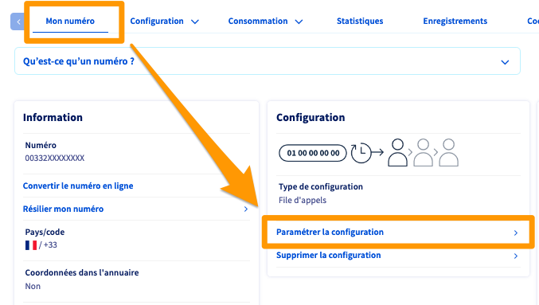{.thumbnail}
 
Quatre menus principaux vous sont proposés :

|Menu|Détails|
|---|---|
|Gestion des lignes dans la file |Ce menu permet de gérer les membres de la file d'appels ainsi que divers paramètres de cette dernière. Ce paramétrage est obligatoire pour que la file d'appels puisse fonctionner.|
|Gestion des sons et de l'attente |Ce menu permet de personnaliser et améliorer l'expérience des personnes qui vous contactent. Ce paramétrage est facultatif mais néanmoins fortement conseillé.|
|Plages horaires et fermetures|Ce menu permet de définir les horaires d'ouverture (habituels ou exceptionnels) de votre file d'appels. Nous vous recommandons d'effectuer ce paramétrage.|
|Filtrage des appels|Ce menu permet de définir des listes blanches ou noires, afin d'autoriser uniquement certains correspondants à vous joindre ou, au contraire, de rejeter automatiquement les appels en provenance de certains numéros.|

Poursuivez la lecture de cette documentation selon le ou les paramètres que vous souhaitez réaliser.

- [Gérer la file d'appels et ses lignes (obligatoire)](#manage-lines).
- [Gérer les sons et l'attente (conseillé)](#manage-sounds).
- [Gérer les plages horaires et les fermetures (facultatif)](#manage-agenda).
- [Gérer le filtrage des appels (facultatif)](#manage-filters).
- [Gérer les enregistrement d'appels (facultatif)](#manage-records)

#### 2.1 Gérer la file d'appels et ses lignes 

Depuis le menu « Configuration », cliquez sur `Gestion des lignes dans la file`{.action}.

##### 1. Ajouter une ligne à la file

Sur la page qui s'affiche, dans la partie « Organisation de vos lignes », cliquez sur le bouton `+ Ajouter une ligne`{.action} pour ajouter une nouvelle ligne à votre file d'appels.

{.thumbnail}

Complétez ensuite les informations demandées.

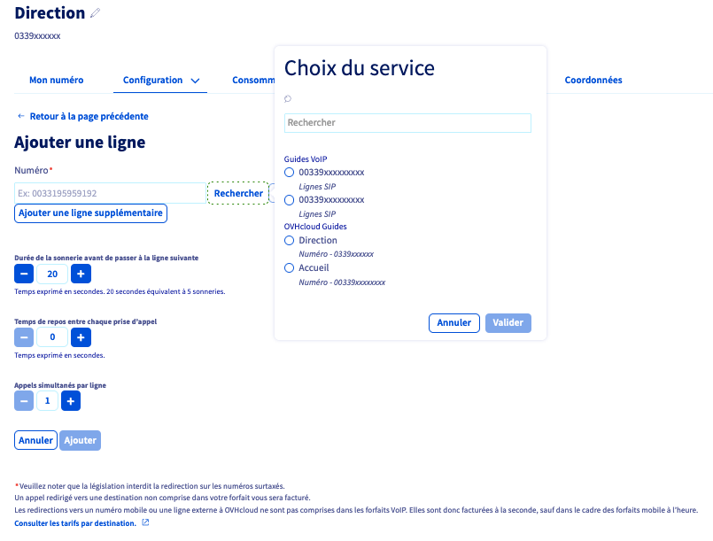{.thumbnail}

|Option|Détails|
|---|---|
|Numéro|Il s'agit du ou des numéros de lignes que vous souhaitez ajouter en tant que membres à la file d'appels.   Cliquez sur le bouton `Rechercher`{.action} pour afficher la liste des lignes et numéros rattachés à votre compte. Sélectionnez celui que vous souhaitez ajouter, puis cliquez sur `Valider`{.action}.  S'il n'apparaît pas dans la liste, entrez manuellement le numéro au format international (par exemple, 0033 pour une ligne en France) dans la zone de texte.   Pour ajouter un ou plusieurs membres supplémentaires, cliquez sur `Ajouter une ligne supplémentaire`{.action}.|
|Durée de la sonnerie avant de passer à la ligne suivante|Permet de définir la durée pendant laquelle la ligne sonnera. Une fois ce temps écoulé et selon la stratégie d'appels de la file, l'appel sera alors transmis vers un autre membre de la file.|
|Temps de repos|Permet de définir la durée pendant laquelle le membre ne prendra pas d'appel après avoir raccroché.|
|Appels simultanés|Permet de définir le nombre d'appels simultanés que la ligne pourra recevoir.|

Une fois ces informations complétées, cliquez sur le bouton `Valider`{.action} pour réaliser l'ajout. 

> [!warning]
>
> Comme précisé dans le menu de configuration, les conditions particulières suivantes s'appliquent :
>
> - La législation interdit la redirection sur des numéros surtaxés.
> - Un appel redirigé vers une destination non-comprise dans votre forfait vous sera facturé.
> - Les redirections vers un numéro mobile ou une ligne externe à OVHcloud ne sont pas comprises dans les [forfaits VoIP](https://www.ovhtelecom.fr/telephonie/voip/#offers). Elles sont donc facturées à la seconde, sauf dans le cadre des forfaits mobile à l’heure.
>
> Consultez les [tarifs de la téléphonie OVHcloud](https://www.ovhtelecom.fr/telephonie/decouvrez/tarifs_telephonie.xml) pour plus de détails.

##### 2. Configurer une stratégie d’appels

Dès qu'au moins une ligne est présente dans votre file, vous avez la possibilité de configurer une stratégie d'appels pour cette dernière. Pour cela, en dessous du tableau de vos lignes, faites vos choix parmi les options proposées.

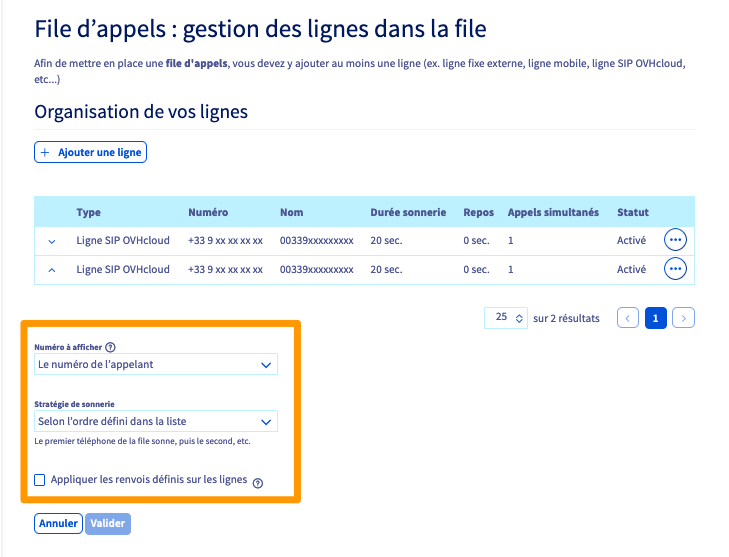{.thumbnail}

- **« Numéro à afficher »** : définissez le numéro qui sera visible sur le téléphone de la personne qui reçoit l’appel ;

- **« Stratégie de sonnerie »** : définissez la manière dont les lignes de votre file d'appels sonneront. Selon celle choisie, vous serez peut-être amené à [modifier l'ordre des lignes de la file](/pages/web_cloud/email_and_collaborative_solutions/internet/phone_and_fax/voip/les_files_d_appels#3-organiser-les-lignes-de-la-file-dappels) ;

- **« Appliquer les renvois définis sur les lignes »** : définissez si les renvois d'appels configurés sur les lignes de la file doivent être appliqués ou non. Sauf besoin spécifique, nous vous conseillons de laisser cette option décochée. 

Une fois vos choix effectués, cliquez sur le bouton `Valider`{.action}.

##### 3. Organiser les lignes de la file d’appels

Vous avez la possibilité d'organiser les lignes dans votre file d'appels depuis le tableau où celles-ci apparaissent. 
Pour cela, utilisez les flèches à gauche de chacune des lignes pour les déplacer jusqu'à leurs positions adéquates. 

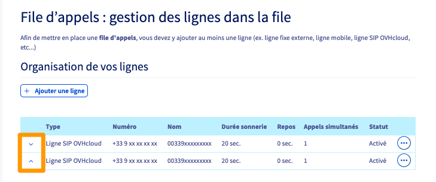{.thumbnail}

Une fois vos modifications effectuées, cliquez sur le bouton `Valider`{.action}.

##### 4. Modifier ou supprimer une ligne 

Depuis le tableau des lignes de votre file d'appels, cliquez sur le bouton `...`{.action} à droite de la ligne concernée et sélectionnez `Modifier`{.action} ou `Supprimer`{.action}.

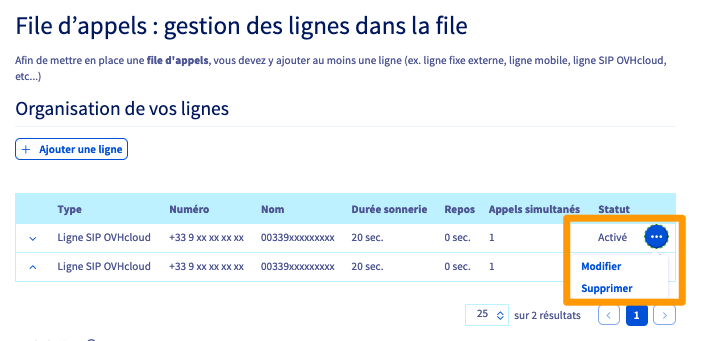{.thumbnail}

La modification vous permet d'affiner les réglages de sonnerie de chaque ligne mais aussi d'activer/désactiver une ligne au sein de la file d'appels, en passant son `Statut`{.action} à `Activé` ou `Désactivé`.

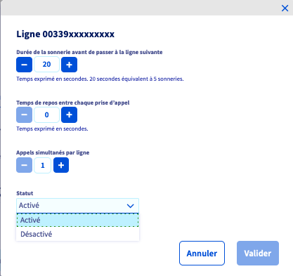{.thumbnail}

#### 2.2 Gérer les sons et l'attente 

Dans le menu « Configuration », cliquez sur `Gestion des sons et de l'attente`{.action}. Plusieurs actions sont alors possibles depuis cette page. 

##### Configuration de l'attente

> [!warning]
>
> La création des annonces sonores est de votre responsabilité. En cas de difficultés, nous vous conseillons de faire appel à un [prestataire spécialisé](https://partner.ovhcloud.com/fr/) car OVHcloud ne sera pas en mesure de créer ces fichiers pour vous.
>  Sachez qu'il est possible de créer des fichiers-sons via le logiciel open source et gratuit [Audacity](https://www.audacityteam.org/){.external}.
> Nous vous rappelons que l'utilisation d'une musique non libre d'utilisation commerciale nécessite de s'acquitter de droits de diffusion auprès des sociétés d'auteurs/compositeurs/producteurs.

Vous avez la possibilité d'ajouter deux sons :

- **l'annonce avant mise en attente** : ce son sera joué intégralement avant que le correspondant ne rentre dans la file d'attente (et donc, avant qu'une ligne sonne). Privilégiez une annonce courte, par exemple un message de bienvenue citant le nom de votre entreprise.

- **la musique d'attente** : ce son sera joué pendant que le client patiente dans la file d'attente et jusqu'au décrochage de l'appel par une ligne. Cette musique d'attente étant jouée en boucle, privilégiez une annonce plus longue, afin d'éviter une répétition trop fréquente et donc désagréable pour vos appelants.

Pour ajouter un son, cliquez sur le bouton `Ajouter un son`{.action} puis suivez les étapes de téléversement. Cliquez enfin sur le bouton `Valider`{.action} en bas de la page pour confirmer les changements.

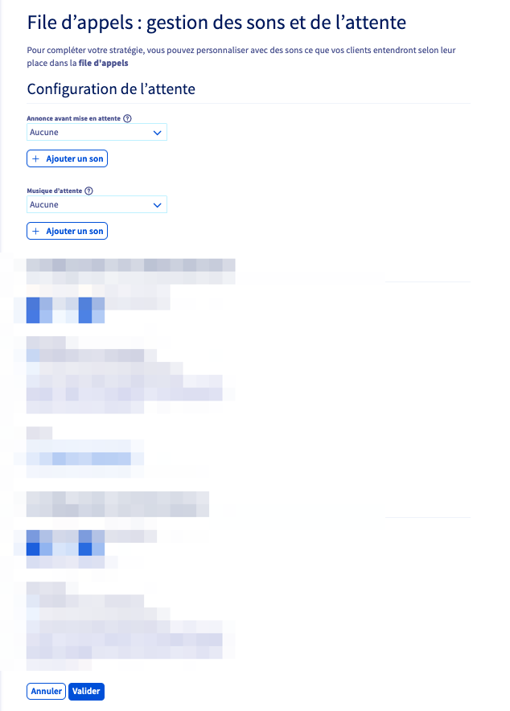{.thumbnail}

##### Configuration du débordement

Depuis cette partie, définissez le nombre maximum d'appelants pouvant être en attente simultanément dans la file. Si ce nombre venait à être dépassé, vous pouvez définir un comportement à adopter parmi les deux possibilités suivantes de débordement :

- **Renvoyer sur un répondeur** : le ou les appelants concernés par le débordement seront alors renvoyés vers le répondeur de votre choix. Pour le sélectionner, cochez d'abord la case `Renvoyer sur un répondeur`{.action}. Cliquez ensuite sur `Ajouter un répondeur`{.action} et sélectionnez le répondeur d'une vos ligne SIP.

- **Jouer une annonce de débordement** : le ou les appelants concernés par le débordement entendront alors l'annonce que vous avez définie. Pour la téléverser, cochez d'abord la case `Jouer une annonce de débordement`{.action}. Cliquez ensuite sur `Ajouter un son`{.action}, puis suivez les étapes qui apparaissent jusqu'à finalisation.

Cliquez enfin sur le bouton `Valider`{.action} en bas de la page pour confirmer les changements.

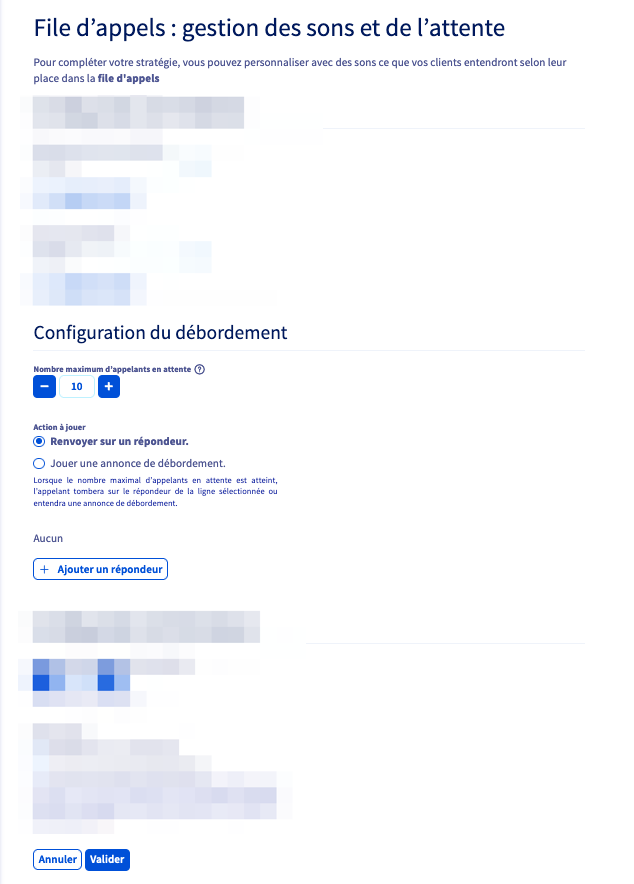{.thumbnail}

##### Configuration de fermeture

Définissez ici la durée maximale pendant laquelle un appelant attendra dans la file. Si cette durée venait à être dépassée, choisissez le comportement à adopter parmi deux possibilités :

- **Renvoyer sur un répondeur** : le ou les appelants concernés seront alors renvoyés vers le répondeur de votre choix. Pour le sélectionner, cochez d'abord la case `Renvoyer sur un répondeur`{.action}. Cliquez ensuite sur `Ajouter un répondeur`{.action} et sélectionnez le répondeur d'une vos ligne SIP.

- **Jouer une annonce de fermeture** : le ou les appelants concernés entendront alors l'annonce que vous avez définie. Pour l'envoyer, cochez d'abord la case `Jouer une annonce de fermeture`{.action}. Cliquez ensuite sur `Ajouter un son`{.action}, puis suivez les étapes qui apparaissent jusqu'à finalisation.

Cliquez enfin sur le bouton `Valider`{.action} en bas de la page pour confirmer les changements.

{.thumbnail}

#### 2.3 Gérer les plages horaires et les fermetures 

Depuis le menu « Configuration », cliquez sur `Plages horaires et fermetures`{.action}. Plusieurs actions sont alors possibles depuis cette page. 

##### 1. Activer ou désactiver les plages horaires

Utilisez les boutons `Activées`{.action} ou `Désactivées`{.action} afin de définir si vous souhaitez utiliser ou non les plages horaires mises en place.
Si votre numéro est déjà en production, nous vous conseillons de définir vos plages horaires et leur configuration **avant** de les activer.

{.thumbnail}

##### 2. Configuration des créneaux horaires

Définissez ici des scénarios de redirection que vous pourrez utiliser ensuite pour vos plages horaires. 

Pour cela, dans la partie « Configuration des créneaux horaires », cliquez sur le pictogramme en forme d'engrenage à droite de chaque créneau 
Vous devrez y sélectionner ou renseigner un numéro ou un répondeur vers lequel les appels seront redirigés. 
Par défaut, la sélection est positionnée sur « Un numéro externe ». Vous pouvez bien entendu modifier ce choix en cliquant dessus.

Finalisez votre choix en cliquant sur le bouton `Modifier`{.action}.

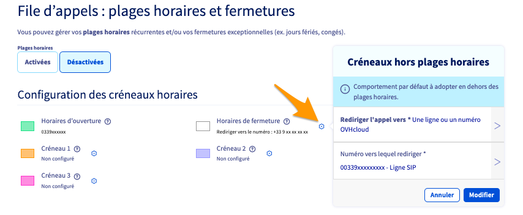{.thumbnail}

##### 3. Définir les plages horaires

Une fois les créneaux configurés à votre convenance, dans la partie « Gestion des plages horaires et des fermetures » de la page, vous pouvez définir des plages horaires et ler attribuer des créneaux.

Cliquez sur un horaire et modifiez la plage associée, ou cliquez sur l’horaire de début souhaité puis glissez en maintenant le clic jusqu’à l’horaire de fin. 
Utilisez le bouton `Répéter`{.action} pour, par exemple, appliquer le même créneau sur plusieurs jours de la semaine. 
Définissez ensuite le créneau à appliquer grâce au bouton `Rediriger les appels vers`{.action}, puis validez l’ajout de la plage horaire en cliquant sur `Ajouter`{.action}.

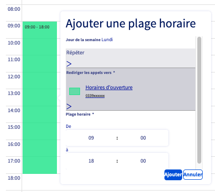{.thumbnail}

Vous pouvez également **déplacer des plages existantes**. Pour ce faire, cliquez sur ces dernières, et en maintenant le clic, glissez-les dans le tableau des horaires. 
Pour **supprimer une plage**, cliquez sur celle-ci, puis sur `Supprimer`{.action}.

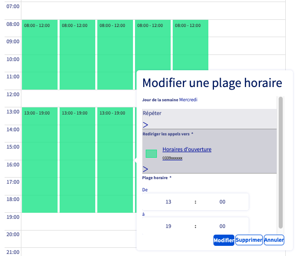{.thumbnail}

Dès que toutes vos plages horaires sont configurées, cliquez sur le bouton `Valider`{.action} pour sauvegarder ces changements. 

##### 4. Définir des fermetures exceptionnelles

Une fois les plages horaires créées à votre convenance, vous avez la possibilité de définir des fermetures exceptionnelles.

Celles-ci vous permettront de fermer votre file d’appels sur des plages horaires normalement considérées comme étant ouvertes. Pour cela, toujours dans la partie « Gestion des plages horaires et des fermetures », cliquez sur `Gérer les fermetures exceptionnelles`{.action}.

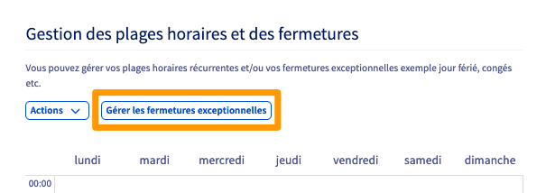{.thumbnail}

> [!primary]
>
> Les fermetures exceptionnelles complètent vos plages horaires paramétrées. Il est donc indispensable que ces dernières soient activées pour que les fermetures exceptionnelles soient prises en compte.
>

Sur la page qui apparaît, positionnez vos fermetures exceptionnelles sur le calendrier en cliquant sur les jours concernés. Complétez les informations demandées :
 
|Information|Description|
|---|---|
|Plage horaire/journée entière|Choisissez si la fermeture exceptionnelle concerne uniquement une plage horaire ou une journée entière.|
|Objet|Définissez un titre vous permettant d'identifier cette fermeture exceptionnelle dans le tableau.|
|Catégorie|Choisissez un créneau qui permettra de rediriger les appels reçus pendant la fermeture exceptionnelle. Si nécessaire, vous avez la possibilité de configurer les créneaux au-dessus du tableau de planification.|
|Du/au|Définissez la date et l'heure (si nécessaire) de la fermeture exceptionnelle.|
|Description|Vous pouvez ajouter une description plus détaillée à la fermeture exceptionnelle.|

Une fois les informations complétées, cliquez sur `Créer l'événement`{.action}. Répétez cette manipulation afin d'ajouter toutes les fermetures exceptionnelles que vous souhaitez créer. Cliquez finalement sur le bouton `Valider`{.action} pour sauvegarder ces changements.

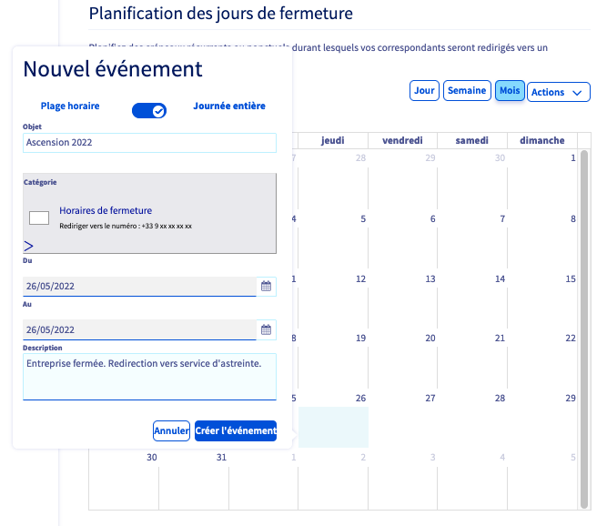{.thumbnail}

#### 2.4 Gérer le filtrage des appels 

Depuis le menu « Configuration », cliquez sur `Filtrages des appels`{.action}. Plusieurs actions sont alors possibles depuis cette page. 

##### 1. Configurer les filtrages d'appels

Vous avez la possibilité de mettre en place un filtrage s’appliquant aux appels entrants. 

{.thumbnail}

Quatre configurations sont proposées :

|Configuration|Description|
|---|---|
|Rejeter automatiquement les appels anonymes|Permet de rejeter automatiquement les appels entrants provenant d'un correspondant anonyme. Pour gérer son activation, utilisez les boutons `Activé`{.action} ou `Désactivé`{.action}.|
|Aucun filtrage|Permet de ne pas appliquer le filtrage des appels entrants selon une liste noire ou blanche. Ce choix n'annule pas le rejet des appels anonymes s'il est activé.|
|Appels entrants refusés (liste noire)|Les numéros ou les tranches de numéros inscrits dans la liste ne peuvent plus vous contacter.|
|Appels entrants autorisés (liste blanche)|Seuls les numéros ou les tranches de numéros inscrits dans la liste sont autorisés à vous contacter.|

Cliquez sur le bouton `Valider`{.action} pour sauvegarder ces changements.

##### 2. Configurer et gérer les listes

Dans la partie « Configuration des listes », vous avez la possibilité d'ajouter des numéros ou des types de numéros à la liste blanche ou à la liste noire. 

{.thumbnail}

Pour cela, complétez les informations demandées :

|Informations|Description|
|---|---|
|Type de liste|Choisissez parmi la liste noire ou la liste blanche.|
|Ajout automatique de certains types de numéros dans la liste|Permet d'ajouter de manière automatique des types de numéros. Faites votre choix dans la liste proposée ou laissez la sélection sur « Aucun ».|
|Ajouter un numéro|Spécifiez le numéro que vous souhaitez ajouter à la liste. Celui-ci doit être au format international (par exemple, 0033 pour un numéro en France).|

Une fois les listes complétées, appuyez sur `Appliquer`{.action}.

En dessous de la configuration des listes, dans la partie « Détails de vos listes », un tableau vous permet de visualiser les numéros ainsi que les types de numéros ajoutés à vos listes. Si nécessaire, vous avez la possibilité de filtrer l'affichage de ce tableau grâce la barre de recherche ou le bouton filtre situés au-dessus de celui-ci.

Pour **supprimer des éléments de vos listes**, sélectionnez-les dans le tableau en cochant la case située à gauche de ces derniers. Cliquez ensuite sur le bouton `Actions`{.action} puis sur `Supprimer les éléments sélectionnés`{.action}. Confirmez alors la suppression.

{.thumbnail}

### Gérer les enregistrement d'appels 

La configuration file d'appels vous permet d'enregistrer les appels entrants. Les enregistrements sont automatiquement supprimés de nos serveurs au bout de 60 jours.

Cliquez sur l'onglet `Enregistrements`{.action}. 

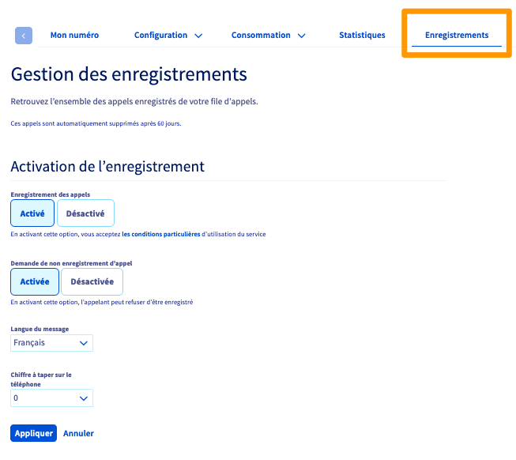{.thumbnail}

Cliquez sur le bouton `Activé`{.action} sous « Enregistement des appels » pour activer ceux-ci. Cette activation vaut pour acceptation des [conditions particulières](https://www.ovh.com/fr/support/documents_legaux/conditions_particulieres_du_service_d_enregistrement_des_communications_telephoniques.pdf) d'utilisation du service.

Vous pouvez laisser le choix à vos appelants de ne pas être enregistrés. Pour cela, cliquez sur le bouton `Activée`{.action} sous « Demande de non enregistement des appels ». Choisissez alors la touche que vos appelants devront composer pour ne pas être enregistrés.

Validez vos choix en cliquant sur `Appliquer`{.action}.

Un tableau vous donnera accès aux enregistrements d'appels, vous permettant de les télécharger ou de les supprimer.

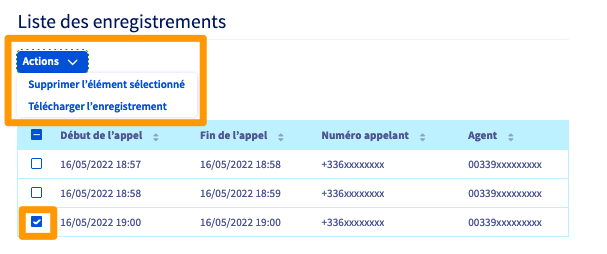{.thumbnail}

## Aller plus loin

Échangez avec notre communauté d'utilisateurs sur <https://community.ovh.com>.
