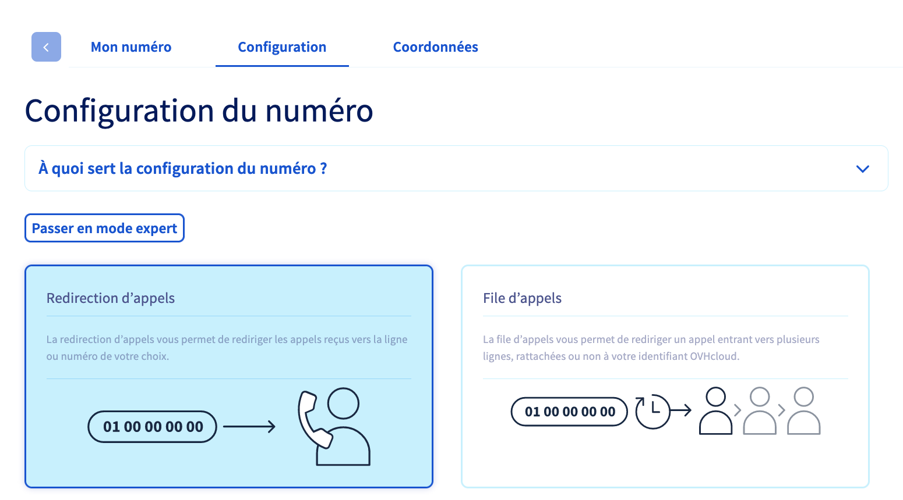
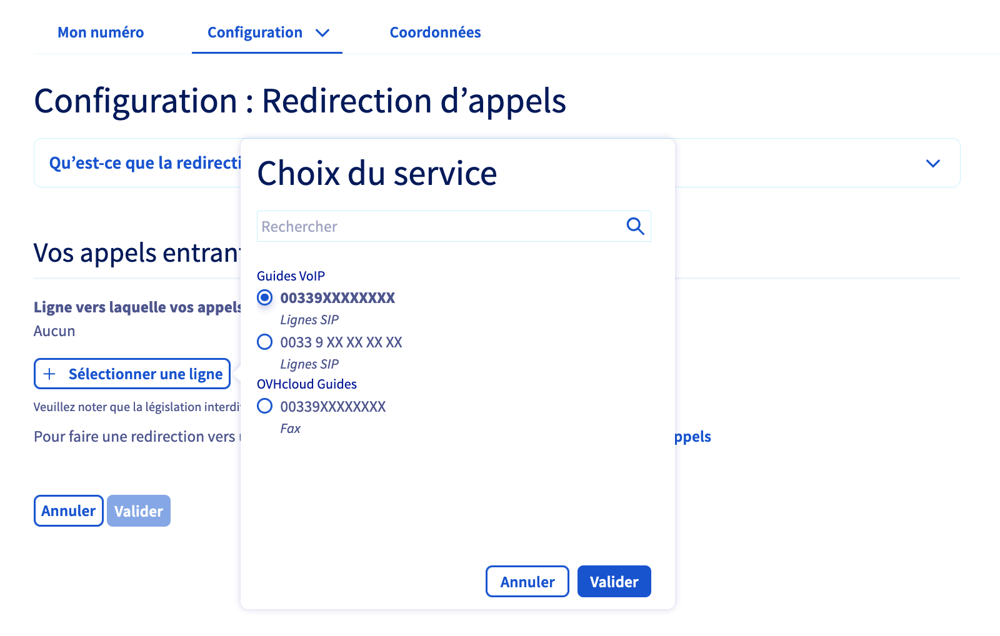
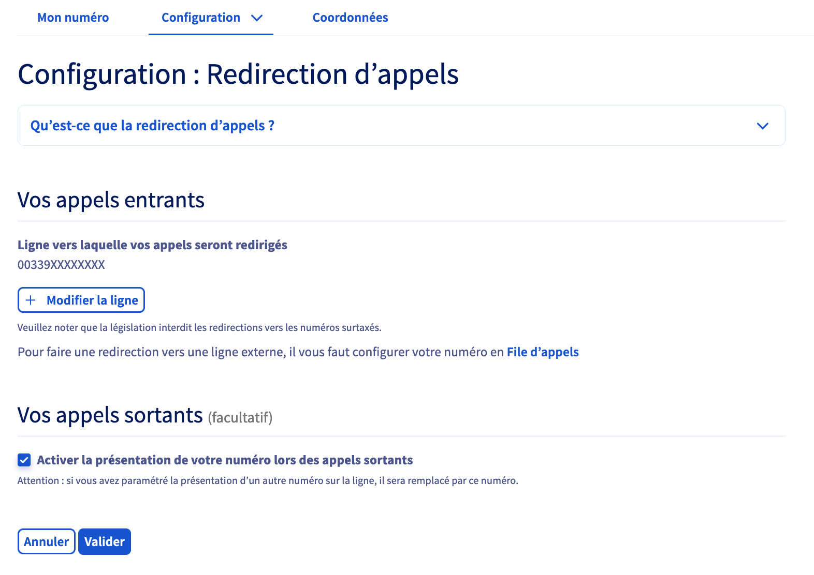

**Dernière mise à jour le 07/07/2022**

## Objectif

La redirection permet de rediriger vers une ligne SIP OVHcloud les appels reçus sur un numéro alias OVHcloud. 
Cette configuration permet notamment la réception d'appels sur votre numéro principal.

**Découvrez comment configurer une redirection d'appels sur votre numéro OVHcloud.**

> [!primary]
>
> Pour obtenir plus de détails sur la différence entre un **numéro alias** et une **ligne SIP**, consultez notre [FAQ](/pages/web_cloud/email_and_collaborative_solutions/internet/phone_and_fax/voip/faq-voip#ligne-ou-numero).
>

## Prérequis

- Disposer d'un [numéro alias fourni par OVHcloud](https://www.ovhtelecom.fr/telephonie/numeros/){.external} ou d'un [numéro porté](/pages/web_cloud/email_and_collaborative_solutions/internet/phone_and_fax/voip/demander_la_portabilite_de_mon_numero) depuis un autre opérateur.
- Disposer d'[une ligne SIP OVHcloud](https://www.ovhtelecom.fr/telephonie/voip/){.external}.
- Être connecté à l'[espace client OVHcloud](https://www.ovh.com/auth?onsuccess=https%3A%2F%2Fwww.ovhtelecom.fr%2Fmanager&ovhSubsidiary=fr){.external}, partie `Télécom`{.action}.

{.thumbnail}
 
## En pratique

Pour débuter la manipulation, connectez-vous à votre [espace client OVHcloud](https://www.ovhtelecom.fr/manager/#/){.external} et assurez-vous de vous situer dans la partie « Télécom ». Cliquez sur `Téléphonie`{.action} puis sélectionnez, parmi les numéros alias qui s'affichent, celui sur lequel vous souhaitez configurer la redirection de vos appels entrants.

Cliquez sur l'onglet `Configuration`{.action}. 
Parmi les configurations proposées, choisissez `Redirection d'appels`{.action} puis cliquez sur le bouton `Paramétrer`{.action}.

{.thumbnail}

Dans la partie « **Vos appels entrants** », cliquez d'abord sur le bouton `+ Sélectionner une ligne`{.action}. 
Choisissez alors, parmi les lignes affichées, celle vers laquelle vous souhaitez rediriger les appels reçus sur votre numéro. Cliquez ensuite sur le bouton `Valider`{.action} pour confirmer votre sélection.

{.thumbnail}

La ligne sélectionnés apparaît alors sous la mention « Ligne vers laquelle vos appels seront redirigés ».

Choisissez ensuite, dans la partie « **Vos appels sortants** », si vous souhaitez activer ou non la présentation de votre numéro alors lors d'un appel sortant.

Vous pouvez ainsi, lorsque vous émettez un appel depuis votre ligne SIP OVHcloud, présenter votre numéro alias (et non plus la ligne OVHcloud) sur les téléphones de vos destinataires.

Si vous souhaitez activer cette fonctionnalité, cochez la case située à côté de « Activer la présentation de votre numéro lors des appels sortants ».

{.thumbnail}

Une fois vos choix effectués, cliquez sur `Valider`{.action} afin d'appliquer la configuration. 
Patientez quelques instants afin que celle-ci soit prise en compte.

## Aller plus loin

Échangez avec notre communauté d'utilisateurs sur <https://community.ovh.com>.
