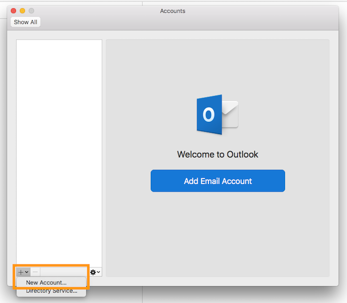

**Stand 29.06.2018**

## Einleitung

Exchange Accounts können auf verschiedenen, kompatiblen E-Mail-Clients eingerichtet werden. So können Sie Ihre E-Mail-Adresse von dem von Ihnen bevorzugten Gerät aus verwenden.

**In dieser Anleitung erfahren Sie, wie Sie Ihren Exchange Account auf Outlook 2016 für Mac einrichten.**

## Voraussetzungen

- Sie besitzen ein [Exchange](https://www.ovhcloud.com/de/emails/hosted-exchange/){.external} Angebot.
- Die Microsoft Outlook Anwendung ist auf Ihrem Mac installiert.
- Sie haben die Login-Daten der E-Mail-Adresse, die Sie einrichten möchten.

> [!primary]
>
> Sie verwenden Outlook 2016 für Windows? Die entsprechende Dokumentation finden Sie hier: [Konfiguration von Exchange auf Outlook 2016 für Windows](/pages/web_cloud/email_and_collaborative_solutions/microsoft_exchange/how_to_configure_outlook_2016){.external}
>

## Beschreibung

### Schritt 1: Account hinzufügen

Nachdem Sie die Outlook Anwendung auf Ihrem Gerät gestartet haben, können Sie einen Account auf zwei Arten hinzufügen:

- **Wenn Sie die Anwendung zum ersten Mal starten**, öffnet sich ein Konfigurationsassistent und Sie werden dazu aufgefordert, Ihre E-Mail-Adresse einzugeben.

- **Wenn Sie bereits einen Account eingerichtet haben**, klicken Sie am oberen Rand Ihres Bildschirms auf `Tools`{.action} und anschließend auf `Konten`{.action}. Klicken Sie im angezeigten Fenster auf `+`{.action} und anschließend auf `Neues Konto`{.action}.

{.thumbnail}

Klicken Sie nun auf Ihre E-Mail-Adresse und dann auf `Weiter`{.action}. Falls eine Auswahl verschiedener Anbieter angezeigt wird, wählen Sie `Exchange`{.action} aus. Geben Sie anschließend die geforderten Informationen ein.

|Information|Beschreibung|
|---|---|
|Methode|Lassen Sie **Benutzername und Kennwort** stehen (standardmäßig ausgewählt).|
|E-Mail-Adresse|Geben Sie einen Namen für diesen Account ein, damit Sie ihn später von anderen Accounts in Ihrer Outlook App unterscheiden können.|
|DOMAIN\\Benutzername oder E-Mail-Adresse|Geben Sie die vollständige E-Mail-Adresse ein.|
|Kennwort|Geben Sie das Passwort der E-Mail-Adresse ein.|
|Server|Je nach DNS-Konfiguration Ihrer Domain kann die Angabe des Servers optional sein. Falls notwendig, tragen Sie hier den Server ein, auf dem Ihr Exchange Dienst gehostet ist. Sie finden die Angaben zum Server im [OVHcloud Kundencenter](https://www.ovh.com/auth/?action=gotomanager&from=https://www.ovh.de/&ovhSubsidiary=de){.external}, indem Sie den entsprechenden Exchange Dienst auswählen, auf den Tab `Allgemeine Informationen`{.action} klicken und dort in den Bereich `Verbindung`{.action} gehen.|

Nachdem Sie alle Informationen eingegeben haben, klicken Sie auf `Weiter`{.action}. Sind die Angaben korrekt, wird die Verbindung zu Ihrem Account hergestellt.

Sie können eine Test-E-Mail versenden, um zu überprüfen, ob der Account korrekt eingerichtet ist.

{.thumbnail}

### Schritt 2: E-Mail-Adresse verwenden

Ihre E-Mail-Adresse ist nun fertig konfiguriert und Sie können jetzt Nachrichten versenden und empfangen.

OVHcloud bietet Ihnen außerdem eine Webanwendung mit [kollaborativen Funktionen](https://www.ovhcloud.com/de/emails/){.external}. Diese ist über <https://www.ovhcloud.com/de/mail/> verfügbar. Sie können sich mit den Login-Daten Ihrer E-Mail-Adresse anmelden.

## Weiterführende Informationen

[Konfiguration Ihrer E-Mail-Adresse aus dem MX Plan Angebot oder einem Webhosting Angebot auf Outlook 2016 für Mac](/pages/web_cloud/email_and_collaborative_solutions/mx_plan/how_to_configure_outlook_2016_mac){.external}

[Konfiguration von E-Mail Pro auf Outlook 2016 für Mac](/pages/web_cloud/email_and_collaborative_solutions/email_pro/how_to_configure_outlook_2016_mac){.external}

Für den Austausch mit unserer User Community gehen Sie auf <https://community.ovh.com/en/>.