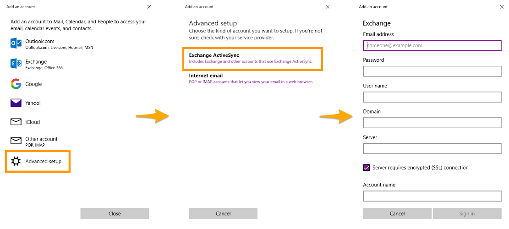

**Ultimo aggiornamento: 13/07/2018**

## Obiettivo

Gli account Exchange possono essere configurati su client di posta compatibili, per permetterti di utilizzare il tuo account email dal dispositivo che preferisci.

**Scopri come configurare un account Exchange con l’applicazione Posta per Windows 10.**

## Prerequisiti

- Disporre di un’offerta [Exchange](https://www.ovhcloud.com/it/emails/){.external}
- Aver installato l’applicazione Posta sul proprio dispositivo
- Disporre delle credenziali associate all’account email da configurare

## Procedura

### Step 1: aggiungi il tuo account

Una volta avviata l’applicazione Posta sul tuo dispositivo, puoi aggiungere un nuovo account in due modi diversi.

- **al primo utilizzo dell’applicazione**: si apre una finestra che ti consente di cliccare su `Aggiungi account`{.action}

- **se hai già impostato un account**: clicca su `Account`{.action} nella barra del menu di sinistra e poi su `Aggiungi account`{.action} nel menù che appare a destra.

{.thumbnail}

Nella finestra che apparirà, clicca su `Configurazione avanzata`{.action} e seleziona `Exchange ActiveSync`{.action} come tipo di account.

Inserisci le informazioni richieste:

|Informazione|Descrizione|
|---|---|
|Indirizzo di posta|Inserisci l’indirizzo email completo|
|Password|Digita la password associata all’indirizzo email|
|Nome utente|Inserisci l’indirizzo email completo|
|Settore|Lasciare il campo vuoto|
|Server|Seleziona il server che ospita il tuo servizio Exchange Puoi ritrovarlo nel tuo [Spazio Cliente OVHcloud](https://www.ovh.com/auth/?action=gotomanager&from=https://www.ovh.it/&ovhSubsidiary=it){.external} nella scheda `Informazioni generali`{.action} del servizio Exchange corrispondente, poi sotto la voce `Connessione`{.action}|
|Il server richiede una connessione cifrata (SSL)|Non rimuovere la spunta da questa casella|
|Nome dell’account|Inserisci un nome che ti permetterà di riconoscere questo account tra quelli presenti nella tua applicazione Posta|

Una volta inseriti tutti i dati, clicca su `Connetti`{.action}. Se i dati inseriti sono corretti, la connessione andrà a buon fine.

A questo punto appare una finestra che ti consente di aggiungere l’account e ti fornisce informazioni sui cambiamenti di alcune funzionalità del tuo dispositivo. Leggi le informazioni prima di confermare l’aggiunta dell’account.

Per verificare la corretta configurazione dell’account esegui un test di invio.

{.thumbnail}

### Step 2: utilizza il tuo account

Una volta configurato l’indirizzo email, non ti resta che utilizzarlo: da questo momento puoi infatti inviare e ricevere messaggi.

OVHcloud ti propone un'applicazione Web che dispone di [funzionalità collaborative](https://www.ovhcloud.com/it/emails/){.external}. Accedi a questo link <https://www.ovhcloud.com/it/mail/> utilizzando le credenziali del tuo account.

## Per saperne di più

[Configurare un indirizzo email incluso nella soluzione MX Plan o in una soluzione di hosting Web con l’applicazione Posta per Windows 10](/pages/web_cloud/email_and_collaborative_solutions/mx_plan/how_to_configure_windows_10){.external}

[Configurare un account Email Pro con l’applicazione Posta per Windows 10](/pages/web_cloud/email_and_collaborative_solutions/email_pro/how_to_configure_windows_10){.external} (in inglese)

Contatta la nostra Community di utenti all’indirizzo <https://community.ovh.com/en/>.