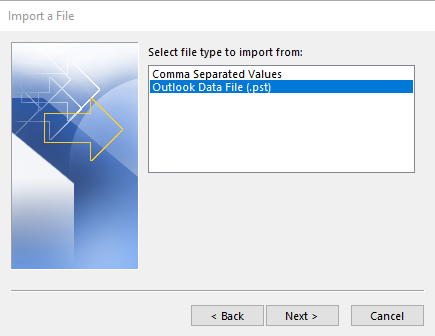
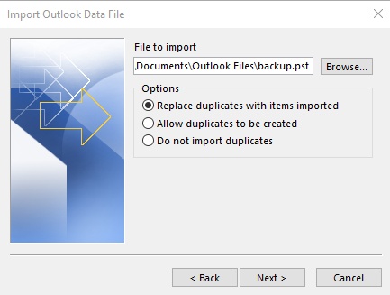
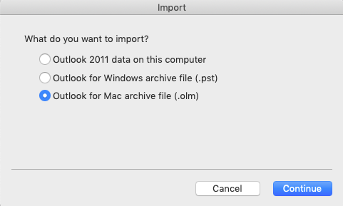
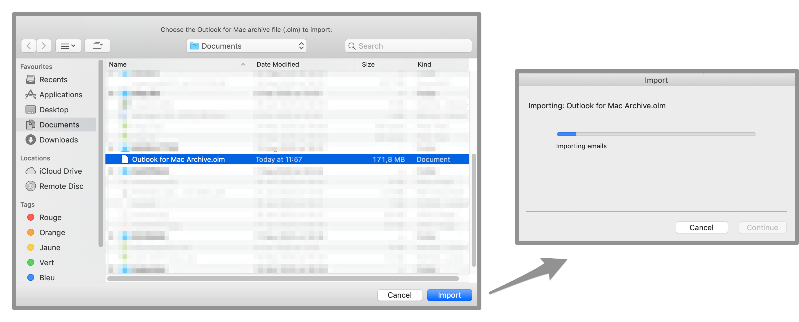
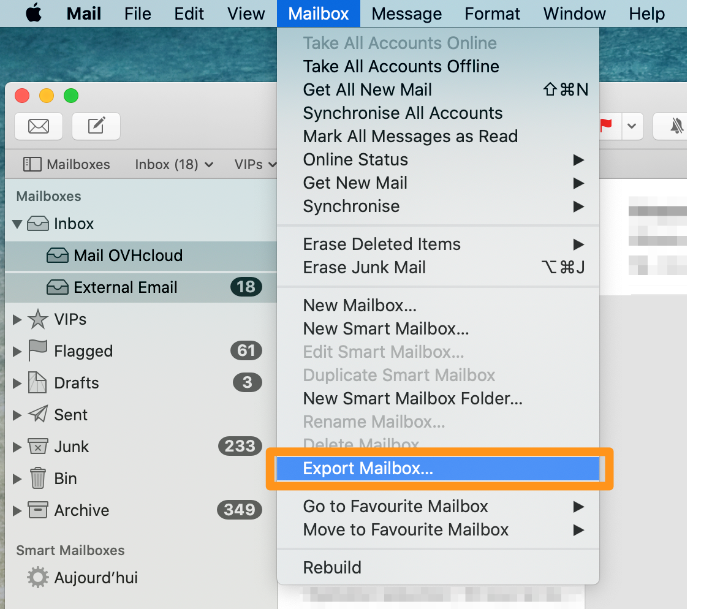
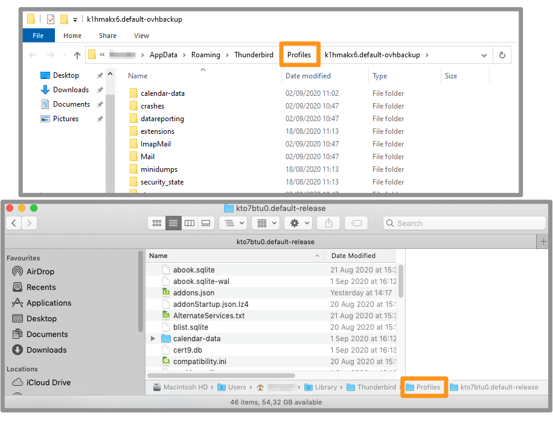
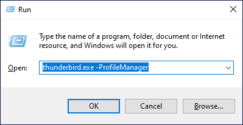
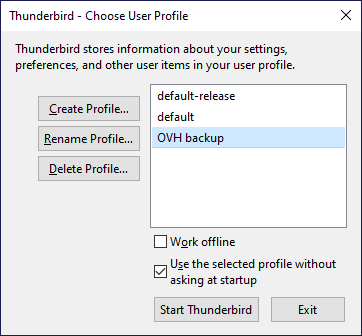
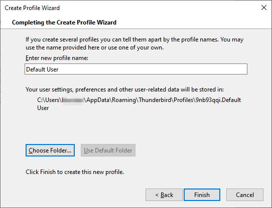

> [!primary]
> Esta tradução foi automaticamente gerada pelo nosso parceiro SYSTRAN. Em certos casos, poderão ocorrer formulações imprecisas, como por exemplo nomes de botões ou detalhes técnicos. Recomendamos que consulte a versão inglesa ou francesa do manual, caso tenha alguma dúvida. Se nos quiser ajudar a melhorar esta tradução, clique em "Contribuir" nesta página.
>

## Objetivo

[A migração automática](/pages/web_cloud/email_and_collaborative_solutions/migrating/migration_omm){.external} de um endereço de e-mail é possível através da nossa ferramenta [OVH Mail Migrator](https://omm.ovh.net/){.external}. Também pode migrar manualmente o seu endereço de e-mail através dos softwares de e-mail.

**Saiba como migrar manualmente o seu endereço de e-mail.**

> [!warning]
>
> A responsabilidade sobre a configuração e a gestão dos serviços que a OVHcloud disponibiliza recai sobre o utilizador. Assim, deverá certificar-se de que estes funcionam corretamente.
>
> Este manual fornece as instruções necessárias para realizar as operações mais habituais. No entanto, se encontrar dificuldades, recomendamos que recorra a um [prestador de serviços especializado](https://partner.ovhcloud.com/pt/directory/) e/ou que contacte o editor do serviço. Não poderemos proporcionar-lhe assistência técnica. Para mais informações, aceda à secção deste manual intitulada: "Quer saber mais?"
>

## Requisitos

- Ter um serviço de e-mail na OVHcloud, como uma oferta [Exchange](https://www.ovhcloud.com/pt/emails/){.external}, [E-mail Pro](https://www.ovhcloud.com/pt/emails/email-pro/){.external} ou MX Plan (através da oferta MX Plan ou incluída numa oferta de [alojamento web da OVHcloud](https://www.ovhcloud.com/pt/web-hosting/){.external}).
- Ter dados de acesso relativos às contas de e-mail que pretende migrar (as contas de origem).
- Ter dados de acesso relativos às contas de e-mail OVHcloud que recebem os dados migrados (as contas de destino).

## Instruções

> [!primary]
> Em primeiro lugar, verifique se a migração automática é possível através da nossa ferramenta [OVH Mail Migrator](https://omm.ovh.net/){.external}. Para isso, consulte o guia [Migrar contas de e-mail através do OVH Mail Migrator](/pages/web_cloud/email_and_collaborative_solutions/migrating/migration_omm){.external}.

Neste manual, realizámos as operações nos 3 softwares de e-mail mais utilizados, **Outlook**, **Mail** para Mac OS e **Thunderbird**.

As instruções que se seguem dividem - se em duas partes:

- **A exportação**. Isto permite-lhe extrair uma cópia de segurança completa do seu endereço de e-mail e migrá-lo para outro computador, software de mensagens, ou importar para outra conta. Se tiver de migrar elementos de um endereço de e-mail para outro endereço que esteja configurado no mesmo software de correio, é possível copiar/colar ou deslizar/colocar um para o outro. No entanto, recomendamos que utilize o sistema de exportação do software que utiliza.

- **Importação**. Isto permite-lhe aplicar um backup que realizou no seu novo computador ou novo software. Verifique que o ficheiro de backup a importar é compatível com o software de e-mail que utiliza.

### Outlook

Se possui uma conta de e-mail [Exchange OVHcloud](https://www.ovhcloud.com/pt/emails/hosted-exchange/), é possível exportá-la diretamente para o formato PST a partir da Área de Cliente.

Aceda à Área de [Cliente OVHcloud](https://www.ovh.com/auth/?action=gotomanager&from=https://www.ovh.pt/&ovhSubsidiary=pt){.external} e dirija-se à secção `Web Cloud`{.action}. Selecione `Microsoft`{.action}, a seguir, `Exchange`{.action}. Clique no nome do serviço Hosted Exchange em questão.

No separador `Contas de e-mail`{.action}, clique no botão `...`{.action} à direita da conta de e-mail a exportar e, a seguir, em `Exportar no formato PST`{.action}.

{.thumbnail}

De seguida, será necessário aguardar o tempo de exportação que pode levar alguns minutos a várias horas, consoante o tamanho da exportação. No final, basta voltar ao botão `Exportar em formato PST`{.action} para obter um link para descarregar o ficheiro.

{.thumbnail}

#### Exportar a partir do Windows

- Clique em `ficheiro` no canto superior esquerdo, depois em `Abrir e exportar` e, por fim, em `importar/exportar`.

{.thumbnail}

- Selecione `Exportar dados para um ficheiro` e clique em `Seguinte`.

{.thumbnail}

- Selecione `Ficheiro de dados Outlook (.pst)` e clique em `Seguinte`.

{.thumbnail}

- Selecione o nome da conta de e-mail a exportar.

> [!primary]
> Só pode exportar uma conta de cada vez.

Selecione bem `Incluir as sub-pastas` e clique em `Seguinte`.

{.thumbnail}

- Escolha a pasta de destino do seu backup e introduza um nome para este ao clicar em `Percorrer`. Selecione a opção adequada e clique em `Terminar`.

{.thumbnail}

A exportação do seu ficheiro começa. Ao criar um ficheiro, ser-lhe-á pedido que defina uma palavra-passe. É facultativo.

{.thumbnail}

#### Importar a partir do Windows

- Clique em `ficheiro` no canto superior esquerdo, depois em `Abrir e exportar` e, por fim, em `importar/exportar`.

{.thumbnail}

- Selecione `Importar a partir de outro programa ou ficheiro` e clique em `Seguinte`.

{.thumbnail}

- Selecione `Ficheiro de dados Outlook (.pst)` e clique em `Seguinte`.

{.thumbnail}

- Escolha o seu ficheiro de backup clicando em `Percorrer`. Selecione a opção adequada e clique em `Terminar`.

{.thumbnail}

- Se tiver definido uma palavra-passe no ficheiro de backup, introduza-a e clique em `OK`.

- Selecione `Importar os elementos na pasta ativa` e clique em `Terminar`.

A importação do seu backup inicia-se.

#### Exportar a partir do Mac OS

No separador `Ferramentas` da janela Outlook, clique em `Exportar`.

{.thumbnail}

Na janela "Exportar para um ficheiro de arquivo (.olm)", selecione os elementos que deseja adicionar ao seu ficheiro de backup e clique em `Continuar`.

{.thumbnail}

De seguida, selecione a pasta de destino para o seu backup e clique em `Registar`.

{.thumbnail}

Aparecerá uma janela de progresso, clique em `Continuar` no final da operação. O seu ficheiro de backup será encontrado na pasta escolhida.

#### Importar a partir do Mac OS

No separador `Ferramentas` da janela Outlook, clique em `Importar`.

{.thumbnail}

Escolha o formato de backup que vai importar e depois clique em `Continuar`.

{.thumbnail}

Selecione o seu ficheiro de backup e clique em `importar`.

{.thumbnail}

Aparecerá uma janela de progresso, clique em `Continuar` no final da operação. O seu backup é implementado no seu Outlook.

### Mail no Mac OS

#### Exportar

Na coluna da esquerda, selecione uma ou várias contas de e-mail. Clique em `Caixa de correio` no menu horizontal e, a seguir, em `Exportar a caixa de correio`.

{.thumbnail}

Selecione a pasta à sua escolha ou crie uma nova pasta e clique em `Escolher`.

{.thumbnail}

A sua exportação é apresentada sob a forma de um ficheiro ".mbox".

#### Importar

Clique em `Ficheiro` no menu horizontal e, a seguir, em `Importar caixas de correio`.

{.thumbnail}

Selecione o seu ficheiro de backup no formato ".mbox" e depois clique em `Continuar`.

{.thumbnail}

Na coluna da esquerda, os e-mails importados encontram-se numa nova conta de e-mail denominada "Importação". Pode transferir as pastas e mensagens da conta "Importação" para as suas contas de e-mail já configuradas. Uma vez terminadas as transferências, poderá eliminar a conta "Importação".

### Thunderbird

Atualmente, não existe nenhuma funcionalidade nativa para exportar ou importar uma conta de e-mail a partir do Thunderbird. No entanto, é possível guardar um perfil Thunderbird. que contém todas as contas e-mails no seu computador. Vamos ver como guardar um perfil Thunderbird e reintegrá-lo numa nova instância de Thunderbird.

#### Exportar

Na janela principal, clique no menu no canto superior direito, depois em `Ajuda` e, por fim, em `Informações de pronto-socorro`.

{.thumbnail}

Surge uma tabela. Identifique a linha `diretório do perfil` e clique no botão `Abrir a pasta correspondente`.

{.thumbnail}

Será então gerido na pasta do perfil. Remova de uma pasta para a arborescência.

{.thumbnail}

Copie a pasta do perfil através de um clique direito e cole-a na pasta ou no suporte à sua escolha.

{.thumbnail}

#### Importar

Em vez de uma importação, tratar-se-á aqui de um carregamento de perfil.
Se as contas de e-mail já tiverem sido configuradas na instância Thunderbird de destino, estarão presentes num perfil A.
Quando Thunderbird carregar um novo perfil (perfil B), apenas poderá carregar **os** elementos desse perfil B.
Assim, recomendamos que introduza primeiro o novo perfil (perfil B) e que configure as contas de e-mail do perfil A.

Primeiro, deve iniciar o Thunderbird através do gestor de perfis.

- No Windows, vá ao menu `Iniciar` e depois ao programa `Executar`. Neste último, introduza `thunderbird.exe -ProfileManager` e clique em `OK`.

{.thumbnail}

- No Mac OS, lance a aplicação Terminal e deslize-deponha a sua aplicação Thunderbird na janela do Terminal, adicionando à linha `/Contents/MacOS/thunderbird-bin-ProfileManager`. Introduza a tecla `Entrada` (⏎) para validar.

{.thumbnail}

A janela seguinte apresenta os perfis existentes. Clique em `Criar um perfil` e depois em `Seguinte` quando a mensagem de informação for apresentada.

{.thumbnail}

Na etapa seguinte, dê um nome ao seu perfil e identifique a pasta na qual será criado o perfil, abaixo da frase "Os seus parâmetros de utilizador, preferências e todos os seus dados pessoais serão registados em":

{.thumbnail}

> [!primary]
> Sugerimos que copie o backup do seu perfil Thunderbird para a pasta dos perfis do Thunderbird.

Clique em `Escolher uma pasta...` para selecionar a pasta que contém o seu backup. Clique em `Terminar` para criar o perfil com o seu backup.

Poderá encontrar a janela de escolha do seu perfil com o seu novo perfil selecionado. Clique em `Iniciar Thunderbird`, Thunderbird será lançado com todos os elementos que tinha no seu backup.

### Verificar a importação para o novo endereço de e-mail

Quando tiver feito o necessário seguindo as instruções de importação, verifique se os seus elementos estão presentes no servidor.

Ligue-se ao [webmail](https://www.ovh.pt/mail/).

Na caixa de entrada e na coluna da esquerda, irá encontrar as pastas e os e-mails do seu endereço de e-mail guardado.

> [!primary]
> Deve ter em conta o tempo de carregamento dos elementos presentes no seu computador para o servidor de e-mail. Esta operação pode demorar alguns minutos ou várias horas em função da sua ligação à Internet.

## Quer saber mais?

[Migrar contas de e-mail através do OVH Mail Migrator](/pages/web_cloud/email_and_collaborative_solutions/migrating/migration_omm){.external}

Fale com a nossa comunidade de utilizadores em <https://community.ovh.com/en/>.
