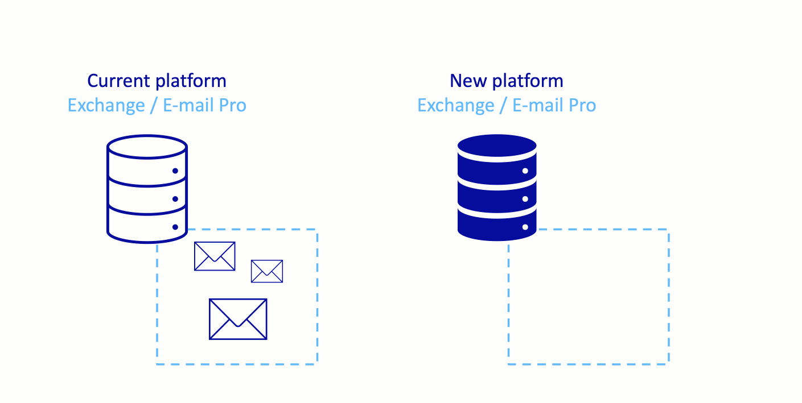
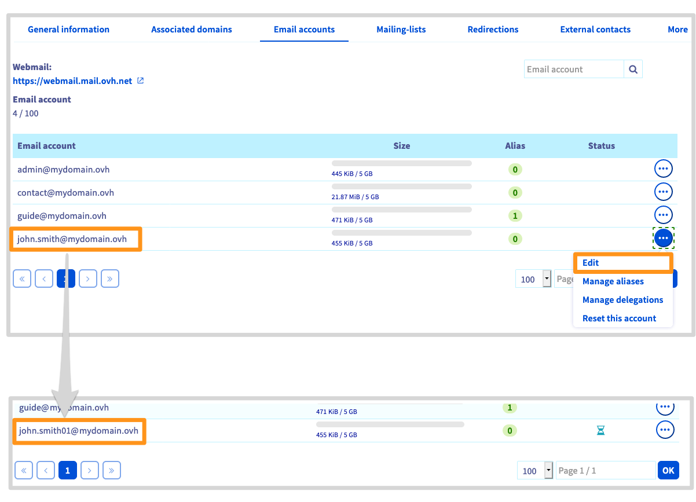

> [!primary]
> Tłumaczenie zostało wygenerowane automatycznie przez system naszego partnera SYSTRAN. W niektórych przypadkach mogą wystąpić nieprecyzyjne sformułowania, na przykład w tłumaczeniu nazw przycisków lub szczegółów technicznych. W przypadku jakichkolwiek wątpliwości zalecamy zapoznanie się z angielską/francuską wersją przewodnika. Jeśli chcesz przyczynić się do ulepszenia tłumaczenia, kliknij przycisk „Zaproponuj zmianę” na tej stronie.
>

## Wprowadzenie

Chcesz przenieść Twoje konta e-mail obecne na platformę Exchange lub E-mail Pro na inną platformę Exchange, E-mail Pro lub MX Plan. W tym przewodniku znajdziesz dwuetapowy proces migracji:

1. **Konfiguracja platformy docelowej**.
2. **Przeniesienie kont e-mail** z aktualnej platformy na nową.

{.thumbnail}

> [!primary]
>
> Aby przenieść rozwiązanie MX Plan na platformę Exchange lub E-mail Pro, zapoznaj się z naszym przewodnikiem [Migracja konta e-mail MX Plan na konto E-mail Pro lub Exchange](/pages/web_cloud/email_and_collaborative_solutions/migrating/migration_control_panel).
>

**Dowiedz się, jak przenieść konta e-mail z platformy Exchange lub E-mail Pro na inną platformę Exchange lub E-mail Pro.**

## Wymagania początkowe

- Posiadanie platformy **"źródłowej"** ze skonfigurowanymi kontami [Exchange](https://www.ovhcloud.com/pl/emails/hosted-exchange/){.external} lub [E-mail Pro](https://www.ovhcloud.com/pl/emails/email-pro/){.external}.
- Posiadanie platformy **"docelowej"** z kontami [Exchange](https://www.ovhcloud.com/pl/emails/hosted-exchange/){.external}, [E-mail Pro](https://www.ovhcloud.com/pl/emails/email-pro/){.external} lub MX Plan (w ramach usługi MX Plan lub pakietu [hostingowego OVHcloud](https://www.ovhcloud.com/pl/web-hosting/){.external}) Na platformie muszą znajdować się nieskonfigurowane lub dostępne konta e-mail, które mają być migrowane.
- Dostęp do [Panelu klienta OVHcloud](https://www.ovh.com/auth/?action=gotomanager&from=https://www.ovh.pl/&ovhSubsidiary=pl){.external}.

## W praktyce

### Konfiguracja platformy docelowej

Przed rozpoczęciem migracji, jeśli właśnie zamówiłeś nową ofertę e-mail, dodaj najpierw domenę do platformy [E-mail Pro](/pages/web/emails-pro/first_config#etap-2-dodanie-domeny) lub [Exchange](/pages/web_cloud/email_and_collaborative_solutions/microsoft_exchange/exchange_adding_domain). Jeśli przejdziesz na platformę MX Plan i przypisana do niej nazwa domeny to "stała", możesz przejść bezpośrednio [do kolejnego](#accountsmigration) etapu.

> Wybierz kartę `Domeny przypisane`{.action} do Twojej platformy, następnie kliknij `Dodaj domenę`{.action}. Skonfiguruj swoją domenę w trybie **nieautorytatywnym**. Po dodaniu domeny upewnij się, że w kolumnie `Status` znajduje się informacja `OK`.
>
> {.thumbnail}
>
> Aby uzyskać więcej informacji na temat dodania domeny, zapoznaj się [z przewodnikiem E-mail Pro](/pages/web/emails-pro/first_config#etap-2-dodanie-domeny) lub [przewodnikiem Exchange](/pages/web_cloud/email_and_collaborative_solutions/microsoft_exchange/exchange_adding_domain).

### Przenieś konta e-mail 

Migracja Twoich kont e-mail zostanie przeprowadzona w 3 krokach. **Zmień nazwę** oryginalnego konta e-mail, **założyć** nowe konto e-mail i **przejść** z pierwotnej platformy do nowej.

{.thumbnail}

> [!warning]
>
> Przypadek szczególny:
>
> - Jeśli musisz przenieść **konto Exchange** na konto **E-mail Pro**, upewnij się, że Twoje konta e-mail nie przekraczają 10GB. Funkcje do pracy zespołowej, synchronizacja kalendarzy i kontaktów nie są obecne w E-mail Pro i nie mogą być migrowane.
> - Jeśli musisz przenieść **konto Exchange lub E-mail Pro** na konto **MX Plan**, upewnij się, że Twoje konto e-mail nie przekracza 5GB. Funkcje do pracy zespołowej, synchronizacja kalendarzy i kontaktów nie są obecne w usłudze MX Plan i nie mogą być migrowane.

#### Zmień nazwę

Zmień nazwę konta e-mail, które chcesz przenieść, używając tymczasowej nazwy (na przykład: aby przenieść konto e-mail *john.smith@mydomain.ovh*, zmień nazwę konta na *john.smith01@mydomain.ovh*).

W karcie `Konta e-mail`{.action} Twojej platformy e-mail kliknij przycisk `...`{.action}, a następnie `Zmień`{.action}.

{.thumbnail}

#### Stwórz

Utwórz konto e-mail na nowym koncie w Twojej platformie E-mail Pro, Exchange lub MX Plan (w powyższym przykładzie utworzysz zatem *john.smith@mydomain.ovh* na nowej platformie)

W karcie `Konta e-mail`{.action} Twojej platformy kliknij przycisk `...`{.action} znajdujący się po prawej stronie docelowego konta e-mail, a następnie wybierz `Zmień`{.action}.

{.thumbnail}

#### Migracja

> [!warning]
> 
> Migracja zostanie przeprowadzona wyłącznie w przypadku danych przypisanych do konta e-mail (e-maile, kontakty, kalendarze, reguły skrzynki odbiorczej, etc.). Funkcje powiązane z Twoją platformą będą musiały zostać odtworzone na nowej platformie:
>
> - [Alias](/pages/web_cloud/email_and_collaborative_solutions/common_email_features/feature_redirections) 
> - [Uprawnienia](/pages/web_cloud/email_and_collaborative_solutions/microsoft_exchange/feature_delegation) 
> - [Grupy](/pages/web_cloud/email_and_collaborative_solutions/microsoft_exchange/feature_groups)
> - Kontakty zewnętrzne
> - [Stopka strony](/pages/web_cloud/email_and_collaborative_solutions/microsoft_exchange/feature_footers)

Przenieś konto e-mail "source" na konto Twojej nowej platformy, korzystając z naszego narzędzia [OMM](https://omm.ovh.net/) (OVH Mail Migrator).

> Jeśli chcesz migrować kilka kont e-mail, zalecamy użycie trybu [Project](/pages/web/emails/migration_omm#project) przez [OMM](https://omm.ovh.net/Project/Create), pozwoli Ci zaimportować tabelę w formacie CSV zawierającą informacje o kontach e-mail, które mają zostać migrowane.

Aby uzyskać więcej informacji na temat narzędzia OMM, zapoznaj się z naszym przewodnikiem [Migracja kont e-mail przez OVH Mail Migrator](/pages/web_cloud/email_and_collaborative_solutions/migrating/migration_omm).

{.thumbnail}

Czas migracji zależy od ilości danych, które chcesz przenieść na nowe konto. Może się on różnić od kilku minut do kilku godzin.

Po przeprowadzeniu migracji sprawdź, czy wszystkie Twoje dane znajdują się na stronie WWW pod linkiem <https://www.ovh.pl/mail/>.

Po przeprowadzeniu migracji możesz zachować lub usunąć konto źródłowe używając tymczasowej nazwy.

Jeśli chcesz go usunąć, przejdź do karty `Konta e-mail`{.action} Twojej pierwotnej platformy e-mail, kliknij przycisk `...`{.action}, a następnie `Zresetuj to konto `{.action}.

### Sprawdź lub zmodyfikuj konfigurację domeny

Na tym etapie Twoje konta e-mail muszą być migrowane i działać. Ze względów bezpieczeństwa sprawdź, czy konfiguracja Twojej domeny jest poprawna, sprawdzając w Panelu klienta.

W tym celu wybierz odpowiednią usługę E-mail Pro lub Exchange, następnie przejdź do zakładki `Powiązane domeny`{.action}. W tabeli, która się wyświetla, w kolumnie "Diagnostyka" możesz sprawdzić, czy konfiguracja DNS jest prawidłowa: czerwony przycisk pojawia się, jeśli konfiguracja wymaga zmiany.

> [!primary]
>
> Jeśli właśnie przeprowadziłeś migrację lub zmodyfikowałeś rekord DNS Twojej domeny, aktualizacja może potrwać kilka godzin, jeśli wyświetlenie się w [Panelu klienta OVHcloud](https://www.ovh.com/auth/?action=gotomanager&from=https://www.ovh.pl/&ovhSubsidiary=pl){.external}.
>

Aby zmienić konfigurację, kliknij czerwony przycisk i wykonaj żądaną operację. Efekty modyfikacji domeny staną się widoczne po upływie 4-24 godzin ze względu na niezbędny czas propagacji.

{.thumbnail}

### Korzystanie z migrowanych kont e-mail

Teraz możesz korzystać z migrowanych kont e-mail. W tym celu OVHcloud udostępnia aplikację online (_web app_) dostępną pod adresem <https://www.ovh.pl/mail/>. Wpisz dane dostępowe do Twojego konta e-mail.

Jeśli skonfigurowałeś jedno z kont przeniesionych na klienta poczty elektronicznej (na przykład: Outlook, Thunderbird), należy ponownie skonfigurować ustawienia. Dane do logowania do serwera OVHcloud zmieniły się po migracji.
 Aby pomóc Ci w przeprowadzeniu operacji, zapoznaj się z naszą dokumentacją w sekcjach przewodników dotyczących [E-mail Pro](/products/web-cloud-email-collaborative-solutions-email-pro){.external} i [Hosted Exchange](/products/web-cloud-email-collaborative-solutions-microsoft-exchange){.external}. Jeśli nie jesteś w stanie zmienić konfiguracji konta w tej chwili, dostęp przez aplikację online jest zawsze możliwy.

> [!primary]
>
> Możesz również ręcznie przenieść konta e-mail do OVHcloud przy użyciu narzędzia [OVH Mail Migrator (OMM)](https://omm.ovh.net/){.external}. W tym celu powinieneś posiadać informacje (użytkownik, hasło, serwery) dotyczące źródłowego e-maila i docelowego e-maila.
>

## Sprawdź również

[Zarządzanie kontaktami swoich usług](/pages/account_and_service_management/account_information/managing_contacts){.external}.

[Przewodniki E-mail Pro](/products/web-cloud-email-collaborative-solutions-email-pro){.external}.

[Przewodniki Exchange](/products/web-cloud-email-collaborative-solutions-microsoft-exchange){.external}.

Dołącz do społeczności naszych użytkowników na stronie <https://community.ovh.com/en/>.
