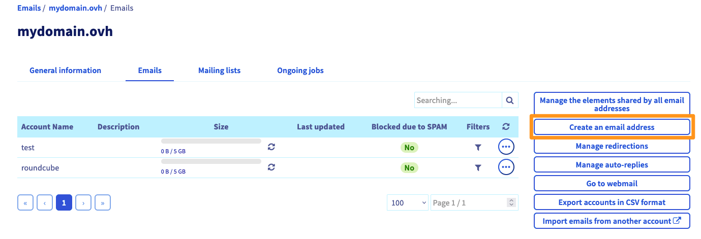
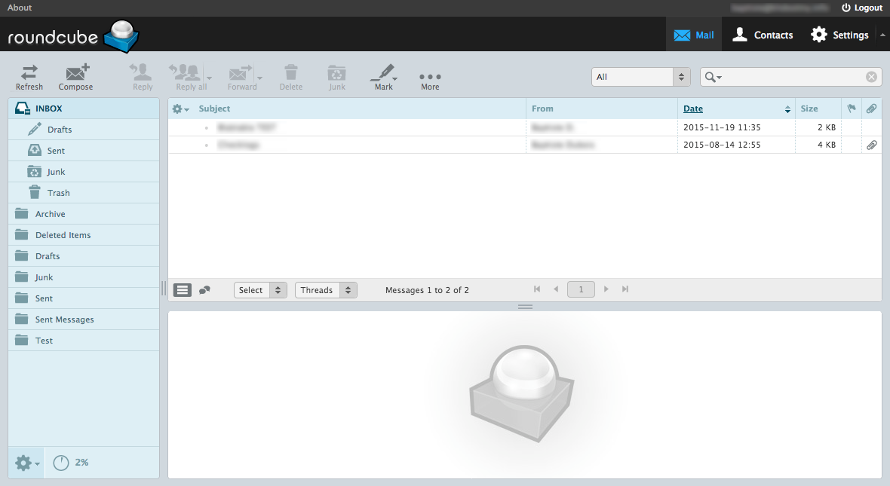

> [!primary]
> Esta tradução foi automaticamente gerada pelo nosso parceiro SYSTRAN. Em certos casos, poderão ocorrer formulações imprecisas, como por exemplo nomes de botões ou detalhes técnicos. Recomendamos que consulte a versão inglesa ou francesa do manual, caso tenha alguma dúvida. Se nos quiser ajudar a melhorar esta tradução, clique em "Contribuir" nesta página.
>

**Última atualização: 07/10//2022**

## Objetivo

Adquiriu um serviço de e-mail MX Plan. que lhe permite beneficiar de endereços de e-mail associados a um domínio.

**Saiba como criar um endereço de e-mail com a oferta MX Plan.**

## Requisitos

- Ter uma oferta MX Plan (incluída num plano de [alojamento web](https://www.ovhcloud.com/pt/web-hosting/){.external}, num [Alojamento gratuito 100M](https://www.ovhcloud.com/pt/domains/free-web-hosting/){.external} ou disponível em separado).
- Ter acesso à [Área de Cliente OVHcloud](https://www.ovh.com/auth/?action=gotomanager&from=https://www.ovh.pt/&ovhSubsidiary=pt){.external}, na secção `Web Cloud`{.action}.

> [!primary]
>
> **Casos especiais**
>
> - Relativamente ao alojamento gratuito 100M: é obrigatório ativá-lo antes para poder criar um endereço de e-mail. Pode efetuar esta operação a partir da [Área de Cliente OVHcloud](https://www.ovh.com/auth/?action=gotomanager&from=https://www.ovh.pt/&ovhSubsidiary=pt){.external}, posicionando-se no domínio em questão.
> - No âmbito de um [alojamento web](https://www.ovhcloud.com/pt/web-hosting/){.external}, é necessário ativar a oferta MX Plan incluída antes de continuar a ler este manual. Para isso, consulte o nosso manual "[Ativar os endereços de e-mail incluídos no seu alojamento web](/pages/web_cloud/web_hosting/activate-email-hosting)".

## Instruções 

A versão da sua oferta MX Plan (antiga ou nova) irá depender da data de ativação ou de [se o serviço foi migrado recentemente](https://www.ovhcloud.com/pt/web-hosting/mxplan-migration/){.external}. Antes de continuar, deve verificar a versão de que dispõe. 

Para isso, aceda à [Área de Cliente OVHcloud](https://www.ovh.com/auth/?action=gotomanager&from=https://www.ovh.pt/&ovhSubsidiary=pt){.external}, na secção `Web Cloud`{.action}. Clique em `E-mails`{.action} e escolha o nome do serviço MX Plan em causa. Continue a ler em função da sua versão:

|Versão antiga da oferta MX Plan|Nova versão da oferta MX Plan|
|---|---|
|{.thumbnail}  Consulte o tipo de oferta na secção “Subscrição”.|{.thumbnail} Consulte a `Referência do servidor` na secção “Resumo”.|
|Continuar a ler na secção “[Versão antiga da oferta MX Plan](#mxplanlegacy)”.|Continuar a ler na secção “[Nova versão da oferta MX Plan](#newmxplann)”.|

### Nova versão da oferta MX Plan 

#### Aceder à gestão do serviço de e-mail

Se possuir a nova versão da oferta MX Plan, a secção “Informações gerais” deverá apresentar as mesmas informações que a imagem abaixo. Caso contrário, [volte para a secção anterior](#instructions) e certifique-se de que está a consultar a versão correta.  

{.thumbnail}

#### Criar uma conta de e-mail

Para obter um novo endereço de e-mail, aceda a `Contas de e-mail`{.action}. Poderá consultar as contas de e-mail disponíveis e adicionar novas contas. Para isso, clique no botão `Adicionar uma conta`{.action}.

{.thumbnail}

Na nova janela que aparecerá, preencha as informações necessárias:

- **Conta de e-mail**: Um nome temporário já está pré-preenchido na zona de texto. Substitua-o pela que deseja para o seu endereço de e-mail (o seu nome.apelido, por exemplo). O domínio que fará parte do endereço de e-mail aparecerá pré-selecionado na lista.
- **Nome**: Introduza um nome.
- **Nome**: Introduza um sobrenome.
- **Nome a apresentar**: Insira o nome que pretende que figure como remetente quando envia e-mails a partir deste endereço.
- **Password**: Indique uma palavra-passe e introduza-a novamente para confirmar. Por razões de segurança, recomendamos que não utilize duas vezes a mesma palavra-passe. Escolha uma palavra-passe que não possa ser relacionada com as suas informações pessoais (evite qualquer referência ao seu sobrenome, nome ou data de nascimento, por exemplo) e renove-a regularmente.

Depois de preencher os campos, clique em `Seguinte`{.action}. 

{.thumbnail}

De seguida, verifique as informações apresentadas no resumo. Se estiverem corretas, clique novamente em `Validar`{.action}. A conta adicionada por último deverá aparecer na tabela. Aguarde alguns instantes até a conta ficar disponível.

Repita este passo sempre que necessário, de acordo com o número de contas disponíveis.

#### Consultar os e-mails

Aceda à página “[Ligação ao webmail](https://www.ovhcloud.com/pt/mail/){.external}” e introduza o seu endereço de e-mail e respetiva palavra-passe. De seguida, clique no botão `Ligação`{.action}.

Ao aceder pela primeira vez ao webmail, deverá definir o idioma da interface e o fuso horário no qual se encontra. A seguir, poderá consultar a sua caixa de entrada. Para obter mais informações, consulte o nosso manual "[Utilizar um endereço de e-mail a partir do Outlook Web App (OWA)](/pages/web_cloud/email_and_collaborative_solutions/using_the_outlook_web_app_webmail/email_owa){.external}".

{.thumbnail}

Para consultar os seus e-mails a partir de um software de correio eletrónico, consulte a rubrica "[Consultar uma conta de e-mail a partir de um dispositivo](#configdevices)".

#### Eliminar uma conta de e-mail

A partir da nova versão MXplan, fala-se de *reinicialização de conta* quando tem de a eliminar.

> [!warning]
>
> Antes de eliminar as contas de e-mail, certifique-se de que estas não são utilizadas. Pode ser necessário um backup destas contas. Se necessário, consulte o guia [Migrar manualmente o seu endereço de e-mail](/pages/web_cloud/email_and_collaborative_solutions/migrating/manual_email_migration), que lhe descreverá como exportar os dados de uma conta a partir da Área de Cliente ou a partir de um software de correio eletrónico.

No separador `Contas de e-mail`{.action}, clique no botão `...`{.action} à direita da conta a eliminar e, a seguir, em `Reinicializar esta conta`{.action}.

{.thumbnail}

### Versão antiga da oferta MX Plan 

#### Aceder à gestão do serviço de e-mail

Se possuir a versão antiga da oferta MX Plan, a secção “Informações gerais” deverá apresentar as mesmas informações que a imagem abaixo. Caso contrário, [volte para a secção anterior](#instructions) e certifique-se de que está a consultar a versão correta. 

{.thumbnail}

#### Criar uma conta de e-mail

Para obter um novo endereço de e-mail, aceda a `E-mails`{.action}. Aparecerá uma tabela com todas as contas de e-mail criadas com a oferta MX Plan. De seguida, clique no botão `Criar um endereço de e-mail`{.action}.

{.thumbnail}

Na nova janela que aparecerá, preencha as informações necessárias:

- **Nome da conta**: Indique o nome que deseja para o seu endereço de e-mail (por exemplo, o seu nome.apelido). O domínio em questão já está completado por predefinição.|  
- **Descrição da conta**: Insira uma breve descrição que lhe permita reconhecer esta conta entre as outras presentes na sua Área de Cliente OVHcloud.|  
- **Tamanho da conta**: Selecione o tamanho da conta que pretende. Trata-se do espaço de que beneficiará o seu endereço para armazenar as mensagens.|  
- **Password**: Indique uma palavra-passe e introduza-a novamente para confirmar. Por razões de segurança, recomendamos que não utilize duas vezes a mesma palavra-passe, selecione uma palavra-passe que não tenha qualquer relação com as suas informações pessoais (evite as referências ao seu sobrenome, nome e data de nascimento, por exemplo) e que a renove regularmente.|

Depois de preencher os campos, clique em `Seguinte`{.action}. 

{.thumbnail}

De seguida, verifique as informações apresentadas no resumo. Se estiverem corretas, clique novamente em `Seguinte`{.action}. Finalmente, clique em `Validar`{.action} para lançar a criação do endereço de e-mail. Aguarde alguns instantes até a conta ficar disponível.

Repita este passo sempre que necessário, de acordo com o número de contas disponíveis.

#### Consultar os e-mails 

Aceda à página “[Ligação ao webmail](https://www.ovhcloud.com/pt/mail/){.external}” e introduza o seu endereço de e-mail e respetiva palavra-passe. De seguida, clique no botão `Ligação`{.action}.

A seguir, poderá consultar a sua caixa de entrada. Para obter mais informações, consulte o nosso manual “[Guia de utilização do Roundcube](/pages/web_cloud/email_and_collaborative_solutions/mx_plan/email_roundcube){.external}”.

{.thumbnail}

Para consultar os seus e-mails a partir de um software de correio, consulte a rubrica [Consultar uma conta de e-mail a partir de um dispositivo](#configdevices)

#### Eliminar uma conta de e-mail

> [!warning]
>
> Antes de eliminar as contas de e-mail, certifique-se de que estas não são utilizadas. Pode ser necessário um backup destas contas. Se necessário, consulte o guia [Migrar manualmente o seu endereço de e-mail](/pages/web_cloud/email_and_collaborative_solutions/migrating/manual_email_migration), que lhe descreverá como exportar os dados de uma conta a partir da Área de Cliente ou a partir de um software de correio eletrónico.

No separador `Contas de e-mail`{.action}, clique no botão `...`{.action} à direita da conta a eliminar e, a seguir, em `Eliminar a conta`{.action}

{.thumbnail}

### Consultar uma conta de e-mail a partir de um dispositivo 

Pode configurar o seu endereço de e-mail no dispositivo que desejar (smartphone ou tablet, por exemplo). Para isso, pode consultar os nossos manuais:

> [!tabs]
> **Windows**
>>
>> - [Correio no Windows 10](/pages/web_cloud/email_and_collaborative_solutions/mx_plan/how_to_configure_windows_10)(EN)
>> - [Outlook](/pages/web_cloud/email_and_collaborative_solutions/mx_plan/how_to_configure_outlook_2016)
>> - [Thunderbird](/pages/web_cloud/email_and_collaborative_solutions/mx_plan/how_to_configure_thunderbird_windows)
>>
> **Apple**
>>
>> - [Mail de macOS](/pages/web_cloud/email_and_collaborative_solutions/mx_plan/how_to_configure_mail_macos)
>> - [Mail para iPhone ou iPad](/pages/web_cloud/email_and_collaborative_solutions/mx_plan/how_to_configure_ios)
>> - [Outlook Mac OS](/pages/web_cloud/email_and_collaborative_solutions/mx_plan/how_to_configure_outlook_2016_mac)
>> - [Thunderbird](/pages/web_cloud/email_and_collaborative_solutions/mx_plan/how_to_configure_thunderbird_mac)
>>
> **Android**
>>
>> - [Android](/pages/web_cloud/email_and_collaborative_solutions/mx_plan/how_to_configure_android)(EN)
>>
> **Outro**
>>
>> - [Interface Gmail](/pages/web_cloud/email_and_collaborative_solutions/mx_plan/how_to_configure_gmail)(EN)
>>

Se pretender obter mais informações sobre os elementos necessários para configurar o seu endereço de e-mail, consulte as configurações que deverá utilizar:

> [!tabs]
> **Configuração em IMAP (recomendado)**
>>
>> |Tipo de servidor|Nome do servidor|Porta (com SSL)|Porta (sem SSL)|
>> |---|---|---|---|
>> |De entrada|SSL0.OVH.NET|993|143|
>> |De saída|SSL0.OVH.NET|465|587|
>>
> **Configuração em POP**
>>
>> |Tipo de servidor|Nome do servidor|Porta (com SSL)|Porta (sem SSL)|
>> |---|---|---|---|
>> |De entrada|SSL0.OVH.NET|995|110|
>> |De saída|SSL0.OVH.NET|465|587|
>>

> [!warning]
>
> Se tiver problemas em configurar o endereço de e-mail no seu dispositivo, [consulte os nossos manuais de configuração](/products/web-cloud-email-collaborative-solutions-mx-plan) ou entre em contacto com o editor da aplicação que estiver a utilizar.
>

## Quer saber mais?
 
Fale com a nossa comunidade de utilizadores: <https://community.ovh.com/en/>.
