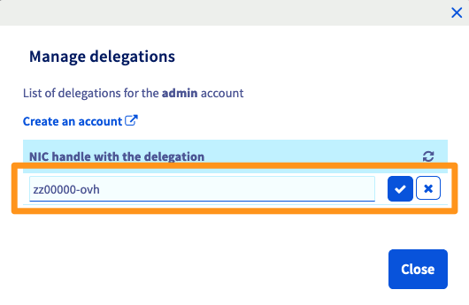

> [!primary]
> Esta traducción ha sido generada de forma automática por nuestro partner SYSTRAN. En algunos casos puede contener términos imprecisos, como en las etiquetas de los botones o los detalles técnicos. En caso de duda, le recomendamos que consulte la versión inglesa o francesa de la guía. Si quiere ayudarnos a mejorar esta traducción, por favor, utilice el botón «Contribuir» de esta página.
>

## Objetivo 

La delegación ofrece al usuario de una cuenta de correo la posibilidad de gestionar por sí mismo distintas funcionalidades (especialmente el cambio de la contraseña). Estas funciones dependen del tipo de delegación:

- Gestionar **todas sus cuentas de correo** en una o más cuentas de OVHcloud. Este tipo de delegación permite a las cuentas de cliente receptoras gestionar los filtros, los contestadores de correo, las redirecciones/alias y las listas de correo.

- Consultar **una o más cuentas de correo** y sus filtros en una sola cuenta de OVHcloud. Este tipo de delegación no permite a los beneficiarios gestionar los contestadores de correo, las redirecciones o las listas de correo. Tampoco permite a los beneficiarios eliminar las cuentas de correo en cuestión, importar los mensajes de correo de otra cuenta o gestionar las delegaciones.

**Esta guía explica cómo transferir las cuentas de correo de un MX Plan.**

## Requisitos

- Tener una solución MX Plan  (disponible en: un [plan de hosting Cloud](https://www.ovhcloud.com/es-es/web-hosting/), un [Alojamiento gratuito 100M](https://www.ovhcloud.com/es-es/domains/free-web-hosting/) o un MX Plan contratado por separado.
- Estar conectado al [área de cliente de OVHcloud](https://www.ovh.com/auth/?action=gotomanager&from=https://www.ovh.es/&ovhSubsidiary=es), en la sección `Web Cloud`{.action}.

> [!warning]
>
> La siguiente guía se dirige a los titulares de la solución MX Plan "histórico". Para el nuevo producto, no hay delegaciones. El cambio de la contraseña, los filtros y contestadores de una dirección de correo electrónico pueden cambiarse directamente a través del webmail OWA (**O**utlook **W**eb **A**pplication). **Identifique su producto utilizando la siguiente tabla.**
>

|Versión histórica de la solución MX Plan|Nueva versión de la solución MX Plan|
|---|---|
|{.thumbnail}  El nombre del producto aparece en el recuadro «Suscripción», en el epígrafe «Producto».|{.thumbnail} El nombre del producto aparece en el recuadro Resumen, en el epígrafe Referencia del servidor.|
|Continúe leyendo esta guía en el apartado "[Procedimiento](#oldmxplan)".|Consulte nuestra guía "[Consultar su cuenta Exchange desde la interfaz OWA](/pages/web_cloud/email_and_collaborative_solutions/using_the_outlook_web_app_webmail/email_owa#cambiar-la-contrasena)"|

## Procedimiento 

> [!primary]
>
>La delegación en una cuenta de correo electrónico lo hace evidente en [el área de cliente](https://www.ovh.com/auth/?action=gotomanager&from=https://www.ovh.es/&ovhSubsidiary=es). Sin embargo, en esta situación solo serán posibles los cambios indicados en la sección [Objetivo](#objective) de esta guía.
>

Conéctese al [área de cliente de OVHcloud](https://www.ovh.com/auth/?action=gotomanager&from=https://www.ovh.es/&ovhSubsidiary=es){.external} en la sección `Web Cloud`.

Haga clic en `Correo electrónico`{.action} y seleccione el servicio MX Plan correspondiente.

Para ver la lista de cuentas de correo de su solución MXplan, haga clic en la pestaña `Correo electrónico`{.action}.

{.thumbnail}

### Consultar todas sus cuentas de correo en una o más cuentas de OVHcloud

Este tipo de delegación permite al beneficiario gestionar las contraseñas, los filtros, los contestadores de correo, las redirecciones/alias y las listas de correo.

Haga clic en `Gestionar los elementos compartidos para todas las direcciones de correo`{.action}

{.thumbnail}

Se abrirá una nueva ventana. Haga clic en el botón `+`{.action} situado al final de la línea `Añadir un identificador`. Introduzca el usuario OVHcloud que se beneficiará de esta delegación y valide su elección.

{.thumbnail}

Puede delegar la gestión de su servicio MXplan en varias claves de OVHcloud.

### Designar una o más cuentas de correo tiene un identificador

Esta delegación permite cambiar la contraseña de la cuenta de correo y gestionar los filtros.

A la derecha de la cuenta de correo que quiera delegar, haga clic en el botón `...`{.action} y luego en `Gestión de la delegación`{.action}.

{.thumbnail}

Introduzca el usuario de OVHcloud que se beneficiará de esta delegación y acepte su elección.

{.thumbnail}

Es posible añadir varias claves de OVHcloud para gestionar cada dirección de correo electrónico.

## Más información

[Primeros pasos con la solución MX Plan](/pages/web_cloud/email_and_collaborative_solutions/mx_plan/email_generalities)

Interactúe con nuestra comunidad de usuarios en <https://community.ovh.com/en/>.
