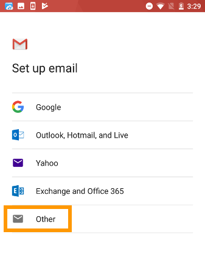
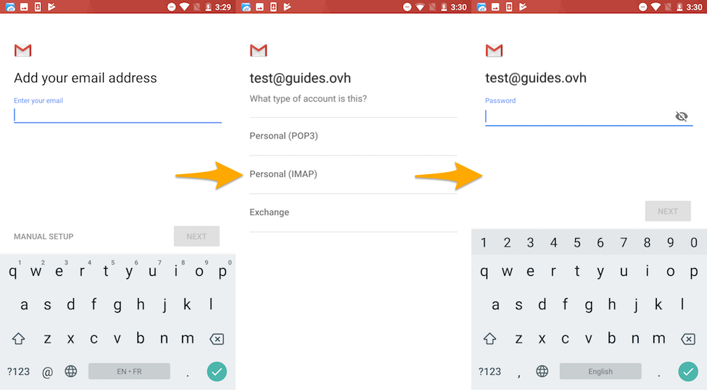

## Wprowadzenie

Konta usługi MX Plan mogą być skonfigurowane w jednym z kompatybilnych programów pocztowych. Dzięki temu możesz wysyłać i odbierać wiadomości, korzystając z wybranej przez Ciebie aplikacji.

**Dowiedz się, jak skonfigurować konto Exchange na urządzeniach z systemem Android poprzez aplikację Gmail.**

## Wymagania początkowe

- Posiadanie konta e-mail MX Plan (zawartego w pakiecie MX Plan lub w usłudze [hostingu OVHcloud](https://www.ovhcloud.com/pl/web-hosting/){.external})
- Instalacja aplikacji Gmail na Twoim urządzeniu (możesz pobrać ją z Google Play Store)
- Dane do logowania do konta e-mail, które chcesz skonfigurować

> [!primary]
>
> Niniejszy przewodnik został stworzony w oparciu o urządzenie Nexus 6 z wersją systemu Android 7.1.1. W celu ujednolicenia procedury korzystamy z aplikacji Gmail, którą można pobrać z Play Store. Jeśli wybierzesz inną aplikację, sposób postępowania będzie wyglądał inaczej.
>

## W praktyce

### Etap 1: dodanie konta

Na ekranie Twojego urządzenia wybierz aplikację `Gmail`{.action}. Dodanie konta może zostać przeprowadzone na dwa różne sposoby.

- **jeśli nie jest skonfigurowane żadne konto**: postępuj zgodnie z instrukcjami etapu powitalnego, następnie kliknij `Dodaj konto e-mail`{.action}. Wybierz `Inne`{.action}; 

- **jeśli inne konto jest już skonfigurowane**: kliknij piktogram w postaci trzech myślników na górze po lewej stronie, a następnie piktogram w postaci strzałki po prawej stronie nazwy skonfigurowanego konta. Następnie kliknij `Dodaj konto`{.action} i wybierz `Inne`{.action}. 

{.thumbnail}

Wpisz hasło wybrane dla Twojego konta e-mail, po czym kliknij `Dalej`{.action}.

Na etapie wyboru konta rekomendujemy zaznaczenie protokołu **IMAP**. Możesz również wybrać **POP**: wybór ten wiąże się z przechowywaniem wiadomości lokalnie w aplikacji Gmail, nie jest zatem rekomendowany, jeśli łączysz się z kontem e-mail przy użyciu kilku programów pocztowych.

Wpisz hasło wybrane dla Twojego konta e-mail, po czym kliknij `Dalej`{.action}.

{.thumbnail}

Wpisz parametry serwera poczty przychodzącej:

|Informacja|Opis| 
|---|---| 
|Nazwa użytkownika|Wpisz pełny adres e-mail.|
|Hasło|Wpisz hasło wybrane dla tego konta e-mail.|
|Serwer|Wpisz serwer "ssl0.ovh.net".|

Kliknij `Dalej`{.action}, po czym wpisz parametry serwera poczty wychodzącej:

|Informacja|Opis| 
|---|---| 
|Wymaga logowania|Upewnij się, że to pole zostało zaznaczone.|
|Nazwa użytkownika|Wpisz pełny adres e-mail.|
|Hasło|Wpisz hasło wybrane dla tego konta e-mail.|
|Serwer SMTP|Wpisz serwer "ssl0.ovh.net".|

Następnie kliknij `Dalej`{.action}. Jeśli wpisane informacje są poprawne, logowanie zakończy się sukcesem.

{.thumbnail}

Wybierz opcje konta, po czym kliknij `Dalej`{.action}. Na koniec możesz wybrać dla konta nazwę umożliwiającą odróżnienie go od innych kont w Twojej aplikacji, a także nazwę, która będzie się wyświetlała jako nazwa nadawcy wiadomości e-mail. Po zakończeniu tych operacji kliknij `Dalej`{.action}.

Wykonaj test wysyłki e-maili, aby sprawdzić, czy konto zostało poprawnie skonfigurowane.

Jeśli wprowadzasz ręcznie dane techniczne w ustawieniach konta, poniżej znajdziesz parametry, których należy użyć w przypadku oferty MX Plan:

- **konfiguracja IMAP**

|Typ serwera|Nazwa serwera|Typ zabezpieczenia|Port|
|---|---|---|---|
|Poczta przychodząca|ssl0.ovh.net|SSL/TLS|993|
|Poczta wychodząca|ssl0.ovh.net|SSL/TLS|465|

- **konfiguracja POP**

|Typ serwera|Nazwa serwera|Typ zabezpieczenia|Port|
|---|---|---|---|
|Poczta przychodząca|ssl0.ovh.net|SSL/TLS|995|
|Poczta wychodząca|ssl0.ovh.net|SSL/TLS|465|

### Etap 2: korzystanie z konta e-mail

Po zakończeniu konfiguracji konto jest gotowe do użytku. Możesz teraz zacząć wysyłać i odbierać wiadomości.

OVHcloud oferuje aplikację internetową umożliwiającą korzystanie z Twojego konta e-mail przy użyciu przeglądarki, dostępną pod adresem <https://www.ovh.pl/mail/>. Możesz się do niej zalogować, używając tych samych danych, których użyłeś podczas konfiguracji konta e-mail.

## Sprawdź również

[Konfiguracja konta Exchange na urządzeniu z systemem Android przy użyciu aplikacji Gmail](/pages/web_cloud/email_and_collaborative_solutions/microsoft_exchange/how_to_configure_android){.external}

Przyłącz się do społeczności naszych użytkowników na stronie <https://community.ovh.com/en/>.