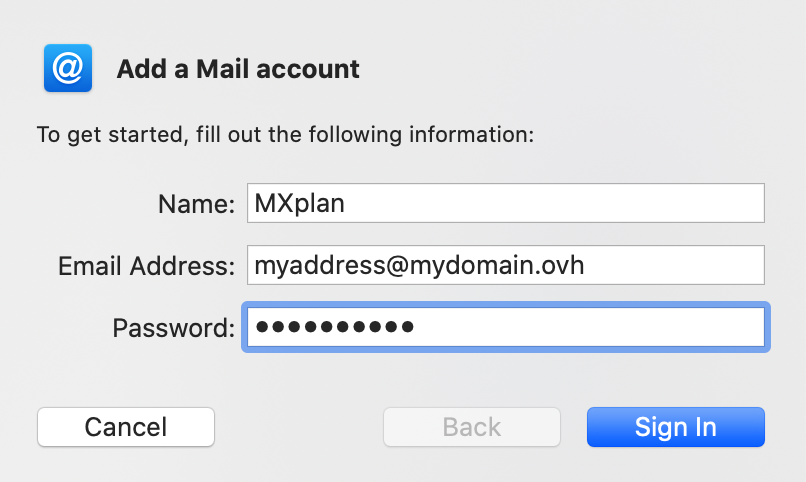
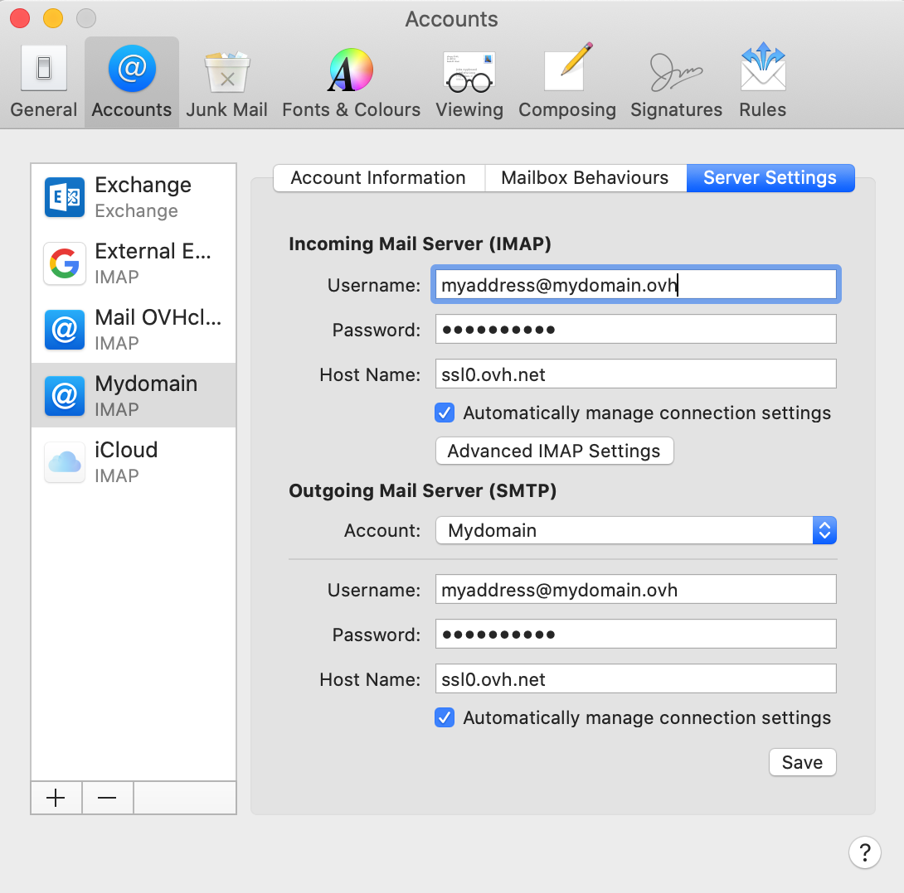

> [!primary]
> Questa traduzione è stata generata automaticamente dal nostro partner SYSTRAN. I contenuti potrebbero presentare imprecisioni, ad esempio la nomenclatura dei pulsanti o alcuni dettagli tecnici. In caso di dubbi consigliamo di fare riferimento alla versione inglese o francese della guida. Per aiutarci a migliorare questa traduzione, utilizza il pulsante "Contribuisci" di questa pagina.
>

## Obiettivo

Gli account MX Plan possono essere configurati su client di posta compatibili, per permetterti di utilizzare il tuo account email dal dispositivo che preferisci. L'applicazione Mail su macOS è disponibile gratuitamente su tutti i Mac.

**Questa guida ti mostra come configurare il tuo indirizzo email MX Plan su Mail di macOS.**

> [!warning]
>
> OVHcloud mette a tua disposizione servizi di cui tu sei responsabile per la configurazione e la gestione. Garantirne quotidianamente il corretto funzionamento è quindi responsabilità dell’utente.
> 
> Questa guida ti aiuta a eseguire le operazioni necessarie alla configurazione del tuo account. Tuttavia, in caso di difficoltà o dubbi, ti consigliamo di contattare un fornitore specializzato o l’amministratore del servizio. OVHcloud non può fornirti alcuna assistenza. Per maggiori informazioni consulta la sezione "Per saperne di più" di questa guida.
> 

## Prerequisiti

- Disporre di un account email MX Plan incluso nel servizio MX Plan o in una [soluzione di hosting Web OVHcloud](https://www.ovhcloud.com/it/web-hosting/)
- Disporre del software Mail installato sul tuo Mac
- Disporre delle credenziali associate all’indirizzo email da configurare
 
## Procedura

### Aggiungi l'account

- **Al primo avvio dell'applicazione**: un assistente di configurazione apparirà direttamente e ti inviterà a scegliere il tipo di account.

- **Se è già stato impostato un account**: clicca su `Mail`{.action} in alto nello schermo e poi su `Account`{.action}.

| | |
|---|---|
|{.thumbnail}|Seleziona `Altro account Mail`{.action} e clicca su `Account Mail`{.action}.|
|Nella finestra "**Aggiungi account Mail**" inserisci le seguenti informazioni:  - il **Nome** del tuo account email  - Il tuo **indirizzo email**  - La **password** del tuo indirizzo email |{.thumbnail}|
|{.thumbnail}|Nella nuova finestra, inserisci le informazioni:  - Lascia il tuo **indirizzo email** già inserito  - Inserisci il tuo indirizzo email completo nel **nome utente**  - Lascia la tua **password** già inserita  - Seleziona `POP` o `IMAP`(consigliato) in **Tipo di account** - Inserisci `ssl0.ovh.net` sul **server di ricezione**  - Inserisci anche `ssl0.ovh.net` sul **server di invio**  Per completare la configurazione, clicca su `Accedi`{.action}|

### Utilizza l'indirizzo email

Una volta configurato l’indirizzo email, non ti resta che utilizzarlo! A partire da questo momento puoi inviare e ricevere messaggi.

OVHcloud propone anche un'applicazione Web che permette di accedere al tuo indirizzo email da un browser Internet. disponibile alla pagina <https://www.ovh.it/mail/> accessibile utilizzando le credenziali del tuo account. Se hai bisogno di aiuto per effettuare questa operazione, consulta [il tuo account dall'interfaccia OWA](/pages/web_cloud/email_and_collaborative_solutions/using_the_outlook_web_app_webmail/email_owa) o [Utilizza il tuo indirizzo email dalla Webmail RoundCube](/pages/web_cloud/email_and_collaborative_solutions/mx_plan/email_roundcube).

### Recuperare un backup del tuo indirizzo email

Se è necessario effettuare un'operazione che potrebbe comportare la perdita dei dati del tuo account email, ti consigliamo di effettuare un backup preliminare dell'account email in questione. Per effettuare questa operazione consulta il paragrafo "**Esporta**" nella sezione "**Mail su Mac OS**" della nostra guida [Migra manualmente il tuo indirizzo email](/pages/web_cloud/email_and_collaborative_solutions/migrating/manual_email_migration#esportare).

### Modifica i parametri esistenti

Se il tuo account email è già configurato e devi accedere alle impostazioni dell'account per modificarle:

- Clicca su `Mail`{.action} nella barra dei menu in alto nello schermo e poi su `Preferenze`{.action}.
- Seleziona l'account nella colonna di sinistra e clicca su `Regolamenti del server`{.action}.

{.thumbnail}

### Informazioni aggiuntive

Nell'ambito di una configurazione **IMAP**, i valori sono i seguenti:

|Tipo di server|Nome del server|Metodo di cifratura|Porta|
|---|---|---|---|
|In entrata (IMAP)|ssl0.ovh.net|SSL/TLS|993|
|Uscita (SMTP)|ssl0.ovh.net|SSL/TLS|465|

Nell'ambito di una configurazione in **POP**, i valori sono i seguenti:

|Tipo di server|Nome del server|Metodo di cifratura|Porta|
|---|---|---|---|
|In entrata (POP)|ssl0.ovh.net|SSL/TLS|995|
|Uscita (SMTP)|ssl0.ovh.net|SSL/TLS|465|

> [!primary]
>
> **Modifica la configurazione**
>
> Quando configuri il tuo indirizzo email in **IMAP** e vuoi modificare la configurazione in **POP**, è necessario eliminare l'account di Mail da Mac e crearlo in **POP** per modificare la configurazione.

## Per saperne di più

Contatta la nostra Community di utenti all’indirizzo <https://community.ovh.com/en/>.
