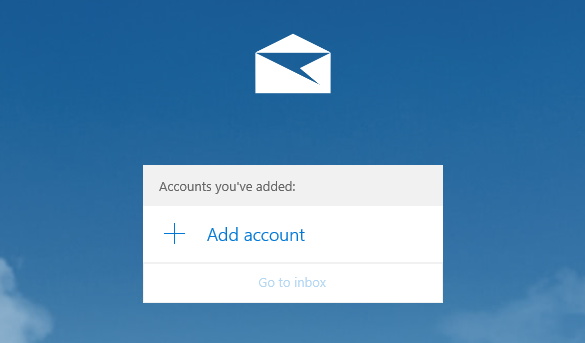

## Objectif

Les adresses e-mail de l'offre MX Plan peuvent être configurées sur un logiciel de messagerie compatible. Cela vous permet d'envoyer et de recevoir vos messages depuis l'application de votre choix.

**Apprenez à configurer votre adresse e-mail MX Plan sur l'application Courrier pour Windows.**

> [!warning]
>
> OVHcloud met à votre disposition des services dont la configuration, la gestion et la responsabilité vous incombent. Il vous revient de ce fait d'en assurer le bon fonctionnement.
> 
> Nous mettons à votre disposition ce guide afin de vous accompagner au mieux sur des tâches courantes. Néanmoins, nous vous recommandons de faire appel à un [prestataire spécialisé](https://partner.ovhcloud.com/fr/) et/ou de contacter l'éditeur du service si vous éprouvez des difficultés. En effet, nous ne serons pas en mesure de vous fournir une assistance. Plus d'informations dans la section « Aller plus loin » de ce guide.
> 

## Prérequis

- Disposer d’une adresse e-mail MX Plan (comprise dans l’offre MX Plan ou dans une offre d’[hébergement web OVHcloud](https://www.ovhcloud.com/fr/web-hosting/){.external}).
- Disposer de l'application Courrier installée sur votre appareil.
- Posséder les identifiants relatifs à l'adresse e-mail que vous souhaitez paramétrer.

> [!primary]
>
> Vous utilisez une version antérieure de Windows ? Consultez notre documentation : [Configurer son adresse e-mail sur l'application Courrier pour Windows 8](/pages/web_cloud/email_and_collaborative_solutions/mx_plan/how_to_configure_windows_10){.external}.
>

## En pratique

### Étape 1 : ajouter le compte

Une fois l'application Courrier lancée sur votre appareil, l'ajout d'un compte peut être effectué de deux manières différentes.

- **Lors du premier démarrage de l'application** : une fenêtre vous invite à cliquer sur `Ajouter un compte`{.action}.

- **Si un compte a déjà été paramétré** : cliquez sur `Comptes`{.action} dans la barre de menu à gauche de l'application, puis sur `Ajouter un compte`{.action} dans le menu qui apparaît à droite.

{.thumbnail}

Dans la fenêtre qui s'affiche, cliquez sur `Configuration avancée`{.action}, puis choisissez `Courrier Internet`{.action} comme type de compte.

Renseignez à présent les informations demandées :

|Information|Description|
|---|---|
|Adresse de courrier|Renseignez l'adresse e-mail complète.|
|Nom d'utilisateur|Indiquez l'adresse e-mail complète.|
|Mot de passe|Renseignez le mot de passe de l'adresse e-mail.|
|Nom du compte|Précisez le nom vous permettant de reconnaître ce compte parmi d'autres affichés dans votre application Courrier.|
|Envoyer vos messages en utilisant ce nom|Renseignez le nom qui s'affichera dans le champ d'expéditeur lorsque des e-mails seront envoyés avec cette adresse.|
|Serveur de courrier entrant|Renseignez le serveur « ssl0.ovh.net:993 ».|
|Type de compte|Nous vous conseillons une utilisation en **IMAP4**. Vous pouvez cependant sélectionner **POP** (stockage des e-mails en local sur votre application Mail) dans le menu déroulant.|
|Serveur de courrier sortant|Renseignez le serveur « ssl0.ovh.net:465 ».|

Assurez-vous que les cases sont bien cochées pour les choix suivants :

- « Le serveur sortant requiert l'authentification » ;
- « Utiliser le même nom d'utilisateur et mot de passe pour l'envoi du courrier » ;
- « Exiger le protocole SSL pour le courrier entrant » ;
- « Exiger le protocole SSL pour le courrier sortant ».

Une fois les informations complétées, cliquez sur `Se connecter`{.action}. Si les informations renseignées sont correctes, la connexion au compte réussira.

Vous pouvez effectuer un test d'envoi pour vérifier que le compte est correctement paramétré.

{.thumbnail}

Si vous êtes amené à renseigner manuellement des champs techniques dans les préférences du compte, vous trouverez ci-dessous les paramètres à utiliser avec notre offre MX Plan :

- **Pour une configuration en IMAP4**

|Type de serveur|Nom du serveur|SSL|Port|
|---|---|---|---|
|Entrant|ssl0.ovh.net|Oui|993|
|Sortant|ssl0.ovh.net|Oui|465|

- **Pour une configuration en POP**

|Type de serveur|Nom du serveur|SSL|Port|
|---|---|---|---|
|Entrant|ssl0.ovh.net|Oui|995|
|Sortant|ssl0.ovh.net|Oui|465|

### Étape 2 : utiliser l'adresse e-mail

Une fois l'adresse e-mail configurée, il ne reste plus qu’à l'utiliser ! Vous pouvez dès à présent envoyer et recevoir des messages.

OVHcloud propose une application web permettant d'accéder à votre adresse e-mail depuis votre navigateur internet accessible sur l’adresse <https://www.ovh.com/fr/mail/>. Vous pouvez vous y connecter grâce aux identifiants relatifs à votre adresse e-mail.
 
## Aller plus loin

[Configurer son compte E-mail Pro sur l'application Courrier pour Windows](/pages/web_cloud/email_and_collaborative_solutions/email_pro/how_to_configure_windows_10){.external}

[Configurer son compte Exchange sur l'application Courrier pour Windows](/pages/web_cloud/email_and_collaborative_solutions/microsoft_exchange/how_to_configure_windows_10){.external}

Échangez avec notre communauté d'utilisateurs sur <https://community.ovh.com>.