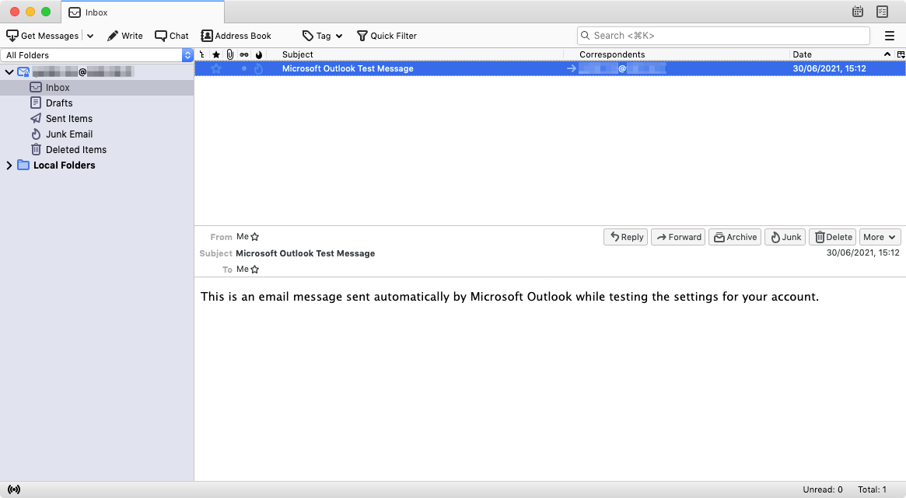
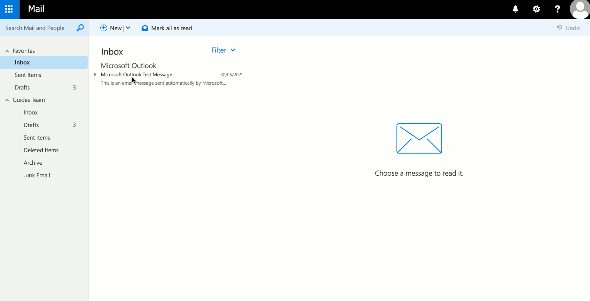

> [!primary]
> Questa traduzione è stata generata automaticamente dal nostro partner SYSTRAN. I contenuti potrebbero presentare imprecisioni, ad esempio la nomenclatura dei pulsanti o alcuni dettagli tecnici. In caso di dubbi consigliamo di fare riferimento alla versione inglese o francese della guida. Per aiutarci a migliorare questa traduzione, utilizza il pulsante "Contribuisci" di questa pagina.
>

**Ultimo aggiornamento: 19/11/2021**

## Obiettivo

Un intestazione email ha il compito di tracciare il percorso seguito da questa email sulla rete, dal mittente al destinatario. 
che permette di identificare un'email malevola o rilevare rallentamenti nella ricezione.

Ogni email ricevuta dispone di un header (*header*) che non compare di default quando consulti la tua email. Ma è possibile recuperarlo dal client di posta o dalla Webmail.

El e-mail può anche essere estrapolata nella sua integralità come file `.eml`. Questo file può esserti richiesto per analizzare un'email malevola ricevuta. 
Per recuperare un file `.eml`, consulta la sezione [Webmail](#webmail).

**Questa guida ti mostra come recuperare un intestazione email dal tuo client di posta.**

## Prerequisiti

- Disporre di un indirizzo email su una delle nostre [soluzioni OVHcloud](https://www.ovhcloud.com/it/emails/) o esterna
- Avere accesso all'indirizzo email tramite la Webmail o un client di posta

## Procedura

### Comprendere il contenuto di un intestazione

L'intestazione è composta da diversi elementi che indicano il percorso dell'email. È composto da elementi gerarchizzati in modo anecoologico, dai più recenti ai più vecchi, e da informazioni supplementari. 
Di seguito è riportato un elenco non esaustivo degli elementi che possono essere costituiti da un intestazione e il loro significato. 

- Il campo `Received` è presente nell'intestazione ad ogni passaggio dell'email su un server di invio (SMTP). In genere è possibile trovare l'hostname del server con l'indirizzo IP e la data. I record `Received` sono classificati dal passaggio più recente al passaggio più antico su un server:
<pre class="console"><code>
Received: from mxplan7.mail.ovh.net (unknown [10.109.143.250])
	by mo3005.mail-out.ovh.net (Postfix) with ESMTPS id 448F4140309
	for &lt;john@mydomain.ovh&gt; ;Wed, 30 Jun 2021 13:12:40 +0000 (UTC)
</code></pre>
  *L'email è stata inviata dal server mxplan7.mail.ovh.net al server mo3005.mail-out.ovh.net il 30 giugno 2021 alle 13:12:40 (fuso orario UTC)*

- Il campo `Return-Path` corrisponde all'indirizzo di ritorno quando l'invio del messaggio non è andato a buon fine. l'indirizzo di ritorno è generalmente quello che ha effettuato l'invio. 
<pre class="console"><code>
Return-Path: &lt;john@mydomain.ovh&gt;
</code></pre>

- Il campo `From` designa l'indirizzo del mittente dell'email e il suo nome di visualizzazione.
<pre class="console"><code>
From: John &lt;john@mydomain.ovh&gt;
</code></pre>

- Il record `To` designa l'indirizzo del destinatario dell'email e il suo nome di visualizzazione.
<pre class="console"><code>
To: Robert &lt;robert@hisdomain.ovh&gt;
</code></pre>

- Il record `Subject` designa l'oggetto dell'email.
<pre class="console"><code>
Subject: Hello my friend
</code></pre>

- Il campo `Message-ID` designa l'identificativo univoco dell'email e termina con il nome del server d'invio (dopo "@"). 
<pre class="console"><code>
Message-ID: &lt;Dc55+mK3j7hdZkf5_r-ff=fjq380ozc2h5@mailserver.domain.ovh&gt;
</code></pre>

- Il record `Received-SPF` mostra il risultato del controllo [SPF](/pages/web_cloud/domains/dns_zone_spf) effettuato sul dominio del mittente. L'argomento `client-ip` permette in particolare di rilevare l'indirizzo IP del server che è server utilizzato per spedire l'email. 
<pre class="console"><code>
Received-SPF: Pass (mailfrom) identity=mailfrom; client-ip=000.11.222.33; helo=mail-smtp-001.domain.ovh; envelope-from=john@mydomain.ovh; receiver=robert@hisdomain.ovh 
</code></pre>

- I record `X-` sono dei campi personalizzati e completano i campi standard. Vengono implementati dai server sui quali transitano le email.
<pre class="console"><code>
X-OVH-Remote: 000.11.222.33 (mail-smtp-001.domain.ovh)
X-Ovh-Tracer-Id: 1234567891011121314
X-VR-SPAMSTATE: OK
X-VR-SPAMSCORE: 0
X-VR-SPAMCAUSE: 
</code></pre>

### Recupera un header su un client di posta

#### Microsoft Outlook 

Per leggere l'intestazione, apri l'email che preferisci in una finestra separata cliccando su due volte nella lista.

Nella nuova finestra, clicca su `File`{.action} in alto a destra.

{.thumbnail}

Seleziona `Informazioni`{.action} sulla sinistra e clicca su `Proprietà`{.action}.

{.thumbnail}

L'intestazione completa dell'email compare nel riquadro inferiore. Puoi selezionare l'insieme del testo e copiarlo in un file.

{.thumbnail}

#### Mozilla Thunderbird

Per visualizzare l'intestazione, seleziona l'email che preferisci e clicca simultaneamente sui tasti `Ctrl` + `U`.

{.thumbnail}

L'intestazione completa dell'email compare in una finestra separata, puoi selezionare l'intero testo e copiarlo in un file.

#### Mail di macOS

Per visualizzare l'intestazione, seleziona l'email che preferisci, clicca su `Presentazione`{.action} nella barra del menu superiore, poi su `Message`{.action} e clicca su `Tutte le intestazioni`{.action}.

{.thumbnail}

L'intestazione completa dell'email compare in una finestra separata. Puoi selezionare l'insieme del testo e copiarlo in un file.

### Recuperare un header su una Webmail 

#### Roundcube

##### **Recupera l'intestazione**

Per visualizzare l'intestazione, seleziona l'email che preferisci. Clicca sul pulsante `... Più`{.action}, poi su `< > Vedi sorgente`{.action}.

{.thumbnail}

Si apre una nuova finestra con l'intestazione completa dell'email. Puoi selezionare l'insieme del testo e copiarlo in un file.

##### **Recupera il file.eml**

Per scaricare il file.`eml`, seleziona l'email che preferisci. Clicca sul pulsante `... Più`{.action} poi su `Scarica (.eml)`{.action}.

{.thumbnail}

#### Outlook Web App (OWA) 

##### **Recupera l'intestazione**

Seleziona l'email di cui vuoi visualizzare l'intestazione. Clicca **sulla freccia** a destra di `Rispondi a tutti`{.action} e poi su `Mostra i dettagli del messaggio`{.action}. Si apre una nuova finestra con l'intestazione completa dell'email, che ti permette di scaricarla.

{.thumbnail}

Guarda anche il video tutorial:

<iframe width="560" height="315" src="https://www.youtube-nocookie.com/embed/UeNdpFwdXm0?start=36" title="YouTube video player" frameborder="0" allow="accelerometer; autoplay; clipboard-write; encrypted-media; gyroscope; picture-in-picture" allowfullscreen></iframe>

##### **Recupera il file.eml**

Per scaricare il file.`eml`, clicca su `(+) Nuovo`{.action} per creare una nuova email. 

Seleziona l'email che vuoi estrarre e trascina nel contenuto del nuovo messaggio. 

Clicca sulla freccia che punta verso il basso accanto all'allegato appena generato e poi clicca su `Scarica`{.action} per salvare il file sulla tua macchina.

{.thumbnail}

### Recupera un intestazione su un altro client di posta

#### Gmail

Per recuperare l'intestazione, seleziona l'email in questione, clicca sui 3 punti verticali a destra e poi su `Mostra la fonte del messaggio`{.action}. Si apre una nuova finestra con l'intestazione completa dell'email, che ti permette di scaricarla anche in formato `.eml`.

{.thumbnail}

#### Outlook.com

Per visualizzare l'intestazione nell'interfaccia Web <Outlook.com>, consulta la sezione [Outlook Web Application](#owa) di questa guida.

## Per saperne di più

[FAQ E-mail](/pages/web_cloud/email_and_collaborative_solutions/mx_plan/faq-emails)

Contatta la nostra Community di utenti all’indirizzo <https://community.ovh.com/en/>.
