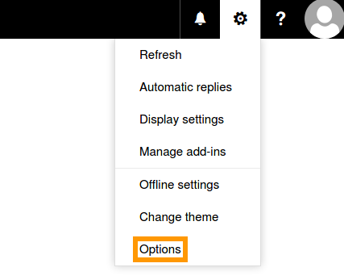
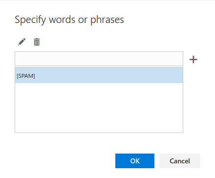

## Sumário

Através da opção "Regras inbox", poderá criar um conjunto elaborado de regras para gerir os e-mails que entram na sua caixa de correio eletrónica. Estas regras podem ajudar a manter a sua conta de e-mail organizada, colocando automaticamente os e-mails em pastas. É também a forma de definir as configurações de redirecionamento e de filtrar mensagens de SPAM.

**Saiba como criar filtros e redirecionar e-mails através do Outlook Web App (OWA).**

## Requisitos

- uma solução de e-mail OVHcloud já configurada (**MX Plan**, disponível como parte dos nossos [planos Web Hosting](https://www.ovhcloud.com/pt/web-hosting/), incluída num [Alojamento gratuito 100M](https://www.ovhcloud.com/pt/domains/free-web-hosting/) ou encomendada separadamente como solução autónoma; [**Hosted Exchange**](https://www.ovhcloud.com/pt/emails/hosted-exchange/) ou [**E-mail Pro**](https://www.ovhcloud.com/pt/emails/email-pro/))
- credenciais de login para o endereço de e-mail que deseja configurar

## Instruções

### Passo 1: Navegar dentro da secção “Opções”

Aceda à sua conta Exchange através do [webmail OVHcloud](https://www.ovh.pt/mail/). Clique no símbolo da engrenagem na parte superior direita para abrir o menu e selecione `Opções`{.action}.

{.thumbnail}

Depois, selecione `Regras Inbox e sweep`{.action} para aceder às regras da interface. Aqui pode ver a lista das regras aplicadas a esta conta. Crie uma nova regra clicando no ícone `+`{.action}.

{.thumbnail}

### Passo 2: Criar regras

{.thumbnail}

O editor de regras ajuda-o a configurar medidas diferenciadas para todos os e-mails que entram na sua caixa de correio em função de vários pressupostos. Uma regra pode ser especificada em três fases:

|Fase|Descrição|
|---|---|
|Adicionar condição|Selecionar uma ou mais condições que vão desencadear a regra.|
|Adicionar ação|Escolher o que irá acontecer aos e-mails que estiverem nessas condições.|
|Adicionar exceção (opcional)|Redefinir a regra adicionando uma ou mais condições para a exclusão de certos e-mails.|

Por exemplo, pode definir como condição “Recebido de...” e especificar um endereço de e-mail, e depois optar por mover essas mensagens para uma determinada pasta.

#### Selecionar a opção "Parar de processar regras"

Se criou várias regras, é possível que mais do que uma se aplique a um e-mail de entrada. Deixe esta opção ativada para qualquer regra que não deva ser seguida por outras regras; esta é uma forma simples de prevenir qualquer tratamento adicional dos e-mails que se enquadram em condições múltiplas.

### Criar regras úteis através de dois exemplos: Redirecionamento e filtragem de SPAM 

Uma vez que existem várias condições e ações disponíveis, não é possível abranger todas neste guia. Abaixo encontram-se dois exemplos que o podem orientar na utilização de uma conta de e-mail OVHcloud. 

> [!warning]
>A OVHcloud presta-lhe serviços cuja configuração e gestão é da sua inteira responsabilidade, cabendo-lhe a si assegurar o seu correto funcionamento. 
>
>Este guia foi concebido para o ajudar, tanto quanto possível, nas tarefas mais comuns. No entanto, caso tenha alguma dificuldade, recomendamos que contacte um fornecedor especializado e/ou o editor do software do serviço, uma vez que não poderemos assisti-lo pessoalmente. Para mais informações, consulte a secção “Vá mais longe” neste guia.
>

#### Exemplo 1: Redirecionar e-mails para outro endereço

Crie uma nova regra clicando no ícone `+`{.action}. Atribua um nome à sua regra e selecione abaixo a que e-mails se deve aplicar. Para este exemplo, optamos por incluir inicialmente **todas as mensagens**. Prossiga selecionando a ação adequada. De momento, vamos focar-nos exclusivamente na forma de efetuar um **redirecionamento**. Chamamos a usa atenção para a existência de uma diferença técnica: sempre que “encaminha” um e-mail, o destinatário final visualiza o seu endereço de e-mail como remetente. Por outro lado, quando “redireciona” um e-mail está a enviá-lo para o seu endereço de destino sem alterar o endereço do remetente original. 

{.thumbnail}

Na interface seguinte, selecione os seus contactos  (`+`{.action}) ou insira um endereço de e-mail na barra superior. Também pode pesquisar utilizadores não listados como contactos. No final, clique em `Guardar`{.action} para voltar à interface "Nova regra inbox". É possível ampliar esta regra clicando em `Adicionar ação`{.action}. Caso se justifique, pode igualmente adicionar as exceções abaixo indicadas. Isto permite-lhe evitar, entre outros, o redirecionamento de um e-mail que lhe tenha sido enviado por um endereço específico ou que inclua determinadas palavras-chave. Guarde a regra clicando em `OK`{.action}.

A  nova regra está agora listada com uma descrição e pode ser editada, desativada ou eliminada.

{.thumbnail}

#### Exemplo 2: Filtrar e-mails indesejados (SPAM)

> [!primary]
>
Estas instruções aplicam-se apenas se o seu domínio estiver a utilizar os registos OVHcloud MX de forma adequada. O serviço permite outras configurações, mas estas podem não utilizar o nosso sistema de proteção anti-SPAM.
>

Crie uma nova regra clicando no ícone `+`{.action}.

{.thumbnail}

Atribua um nome à sua regra e selecione como condições "Inclui estas palavras" e "no assunto...". Na interface seguinte, introduza "\[SPAM]" para destacar as mensagens que foram previamente assinaladas pelo nosso sistema anti-SPAM. Adicione-as clicando no ícone `+`{.action} e depois em `OK`{.action}.

{.thumbnail}

Visto que nenhum sistema de proteção anti-SPAM automático consegue decidir com total exatidão se um e-mail é de facto uma mensagem indesejável, a melhor prática é sempre recolher esses e-mails numa pasta destinada para o efeito. Desta forma, poderá verificar o respetivo conteúdo antes de a esvaziar. Para o fazer, selecione "Mover, copiar ou eliminar" e, em seguida, "Mover mensagem para a pasta...". Selecione uma pasta da lista. Guarde a regra clicando em `OK`{.action}.

{.thumbnail}

> [!primary]
>
Tenha em atenção que os falsos positivos de SPAM não podem ser declarados através do OWA. Se receber e-mails falsamente assinalados como \[SPAM], recomendamos que informe o nosso Apoio ao Cliente solicitando um pedido de assistência através da sua [Área de Cliente OVHcloud](https://www.ovh.com/manager/dedicated/#/support/tickets/new).  
>

## Vá mais longe

[Criar respostas automáticas no OWA](/pages/web_cloud/email_and_collaborative_solutions/using_the_outlook_web_app_webmail/owa_automatic_replies)

[Partilhar calendários em OWA](/pages/web_cloud/email_and_collaborative_solutions/using_the_outlook_web_app_webmail/owa_calendar_sharing)

[Utilizar o Outlook Web App com uma conta de e-mail](/pages/web_cloud/email_and_collaborative_solutions/using_the_outlook_web_app_webmail/email_owa)

Junte-se à nossa comunidade de utilizadores em <https://community.ovh.com/en/>.