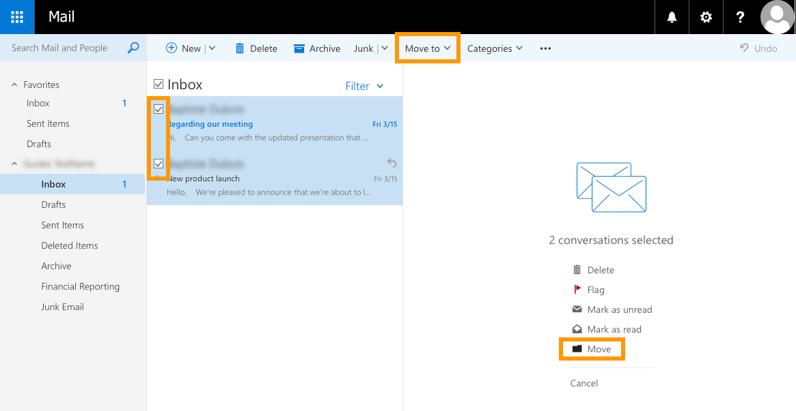
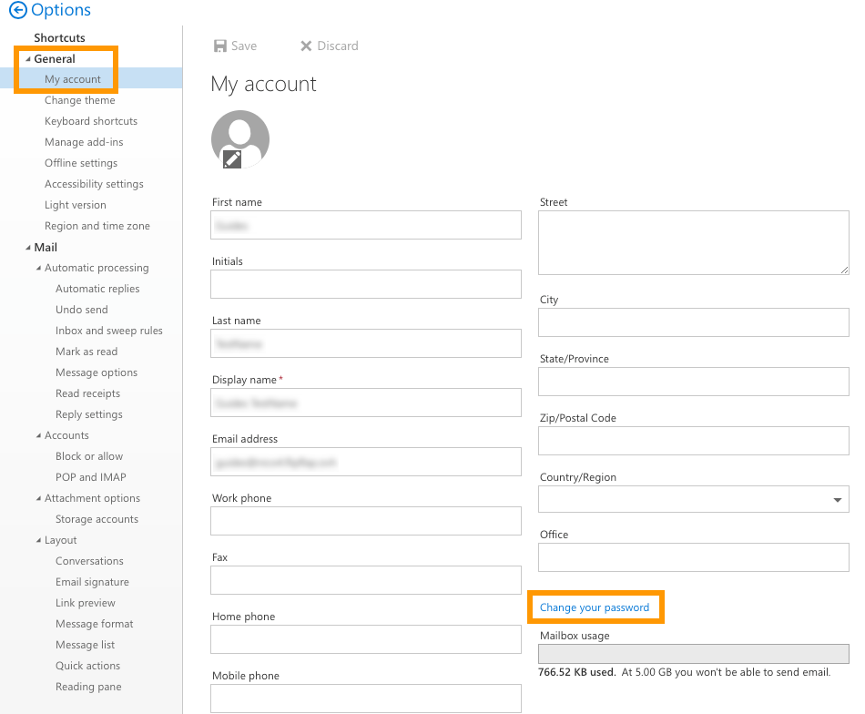

## Objective

With an OVHcloud Email offer you can send and receive your emails using a device and client of your choice. To access an account from anywhere via web browser, OVHcloud provides an online email client called Outlook Web Application (OWA). Our [webmail login page](https://www.ovh.com.au/mail/) is the single point of access to the respective OWA for all active email accounts on your Email offer.

**This guide explains how to use your email address with OWA and exemplifies the most important features of this interface.**

## Requirements

- an OVHcloud email solution already set up (**MX Plan**, available as part of our [Web Hosting plans](https://www.ovhcloud.com/en-au/web-hosting/)
- login credentials for the email address you want to configure

## Instructions

This guide will give you a better understanding of the usual email account tasks available in the OWA webmail. However, since this interface was not originally created by OVHcloud, we are unable to provide specific instructions about any settings not mentioned in this guide.

> [!primary]
>
> After the first two steps, the instructions don't have to be considered in a particular order. You can use the navigation bar on the left-hand side of this guide to jump to the paragraphs that are useful to you.
>

### 1. Accessing OWA webmail

To log in to OWA webmail with your email address, go to the general [webmail login page](https://www.ovh.com.au/mail/). Enter your full email address and password, then click the `Login`{.action} button.

{.thumbnail}

If this is your first time logging in to OWA webmail with this email address, you will be prompted to set the interface language and time zone. Click `Save`{.action} to continue.

{.thumbnail}

From now on, your inbox view will appear by default after login.

{.thumbnail}

### 2. Understanding the OWA display

There are several sections to the OWA interface. Please refer to the table and the image below to familiarise yourself with it.

|Parts|Description|  
|---|---|  
|Top section (1)|Contains two tab bars: the first one allows access to general settings (such as the [options section](./#accessing-the-options-section)), and the second one can be used to perform specific actions with your address (such as sending or replying to emails).|  
|Left-hand side (2)|Displays the list of folders for your email address. These appear as a tree-view that you can expand or hide.|
|Central segment (3)|Displays the list of messages (read and unread) from the folder selected in the left-hand menu. This section can also display search results.|
|Right-hand side (4)|Displays the reading pane when an email has been selected.|

{.thumbnail}

Note that you can change the size of the vertical sections by clicking and dragging their border lines.

### Viewing emails

To view your emails, select a folder on the left-hand side. Incoming emails that are not treated by inbox rules will arrive in the "Inbox" folder. To see if you have received any new emails, check if a number appears next to the respective folder.

{.thumbnail}

To read an email, select its folder if necessary. Now click on the email to show its content in the reading section. Unread messages appear in a different colour to set them apart from messages that have been read.

{.thumbnail}

### Sending and replying

**To send a new email**, click the `New`{.action} button at the top of the webmail interface. The editing pane will appear on the right-hand side. Fill in the fields for your email (recipients, subject, message body, attachments). Once you are ready to send it, click the `Send`{.action} button.

{.thumbnail}

**To reply to an email**, [click on it first](./#viewing-emails) to display it. Then click on the `Reply all`{.action} button. Use the down-arrow button instead if you only want to reply to the sender of the email (leaving out any recipient who is in copy).

{.thumbnail}

When you choose to reply, the quick-reply editor will appear above the email. Compose your reply here, and once you are ready to send your mail, click `Send`{.action}. Please note that for all reply options (like adding a signature), it must be extended to the full editing pane first by clicking on the double-arrow symbol.

{.thumbnail}

### Organising your inbox

OWA provides several ways to organise your inbox. You can

- [create folders and subfolders](./#creating-a-folder)
- [move emails](./#moving-emails)
- [set rules](./#creating-inbox-rules) so that actions are performed automatically when a new email is received

#### Creating a folder

To create a new folder, right-click on the name of your email address in the folder tree and then choose `Create new folder`{.action}. You can create a subfolder in existing folders in the same way (`Create new subfolder`{.action}). 

{.thumbnail}

#### Moving emails

**To move an email**, you can simply drag-and-drop it to the target folder or right-click it and select `Move`{.action}.
**To move multiple emails** at once, select them by checking their tick boxes, and click `Move`{.action} (on the right-hand side) or `Move to`{.action} (in the top section). Then choose the destination folder.

{.thumbnail}

#### Creating inbox rules

To manage rules, click on the gear icon at the top, then click on `Options`{.action}.

{.thumbnail}

On the new page that appears, click on `Inbox and sweep rules`{.action} in the left-hand menu. In the "Options" tree-view, you can find this item under "Mail", then "Automatic processing". From here, you can create, edit, delete and move rules in the list. 

To add a new rule, click the `+`{.action} button. 

{.thumbnail}

Fill in the requested information depending on the action you want the rule to carry out. Afterwards, click `OK`{.action}. 

{.thumbnail}

### Managing a contact list

To manage your contacts, click the blue "app launcher" button at the top, then click on `People`{.action}.

{.thumbnail}

On the new page, you can add a new contact, create a contact list, and remove existing contacts.

**To add a new contact**, click `New`{.action}, and enter the contact details you want to add. Once you have done this, click `Save`{.action}.

{.thumbnail}

**To create a contact list**, click the down-arrow button next to "New", then click `Contact List`{.action}. Give it a name, add contacts to it, then click `Save`{.action}.

{.thumbnail}

### Changing the password

You can change your account password when you are logged in to OWA. To do this, click the gear icon at the top, then click `Options`{.action}.

{.thumbnail}

On the new page, expand the "General" tab in the tree on the left-hand side, then click `My Account`{.action}. Finally, click `Change Password`{.action}.

{.thumbnail}

In the new window that pops up, enter your current password. Then enter a new password, and re-enter to confirm it. Click the `Save`{.action} button to save the new password.

> [!primary]
>
> Remember to also enter your new password on any device i.e. email client used to access this account. In case of any issues with your password, contact your service administrator.
>

{.thumbnail}

### Adding an auto-reply

In OWA, you can create an automatic reply on your email address to not leave emails unanswered during absences. To do this, click the gear icon at the top, then click `Automatic Replies`{.action}.

{.thumbnail}

In the window that appears, select the option "Send automatic replies". You can then set the auto-responder to fit several criteria:

- send auto-reply emails for a fixed time interval, or continuously until it is manually disabled
- define which senders will receive auto-reply emails (internal senders only, or include external senders)

Now, fill in the requested information depending on the action you want it to carry out. Once you have done so, click `OK`{.action}.

{.thumbnail}

### Adding a signature

To add an email signature, click the gear icon at the top, then click `Options`{.action}.

{.thumbnail}

On the left-hand side of the new page, click `Email signature`{.action}. In the options tree, this item is under "Mail" and "Layout". From here you can enable, disable and edit the signature.

{.thumbnail}

Compose your electronic signature in the editor box. You can specify whether you want to include the signature by default in new emails only or in replies and forwarded emails as well. Once you have finished, click `Save`{.action} to confirm.

### Accessing the options section

To access all your settings, click the gear icon at the top, then click `Options`{.action}.

{.thumbnail}

You can then browse the "Options" tree-view on the left-hand side of the page. Further adjustments to the layout and behaviour of your email account can be set from here. Please note that some of the account options may be disabled from our side for security reasons.

{.thumbnail}

### Cookie management

The webmail that is used for our email offers is based on Microsoft Outlook Web Application software. It is therefore likely to exchange metadata with Microsoft servers, in the form of cookies called `appsforoffice.microsoft.com`.

If you want to disable these exchanges, you can use a content blocking extension (such as uBlock Origin or Ghostery) on your browser.
However, disabling these cookies may affect the stability of your webmail.

## Go further

Join our community of users on <https://community.ovh.com/en/>.
