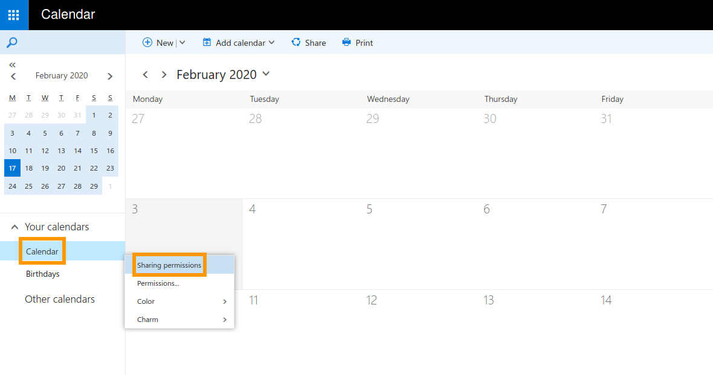

## Ziel

Mit dieser Exchange Funktion können Sie anderen Personen Zugriff auf Ihre Kalender gewähren.

**In dieser Anleitung wird erläutert, wie Kalender freigegeben und mit der Outlook Web App (OWA) abgerufen werden.**

## Voraussetzungen

- Sie haben bereits einen [OVHcloud Exchange](https://www.ovhcloud.com/de/emails/) Dienst eingerichtet.
- Sie haben Zugriff auf Ihren Exchange Account (E-Mail-Adresse und Passwort)

## In der praktischen Anwendung

### Schritt 1: Auswahl eines Kalenders, der freigegeben werden soll

Melden Sie sich über [OVHcloud Webmail](https://www.ovh.de/mail) bei Ihrem Exchange Account an. Wechseln Sie zur Benutzeroberfläche „Kalender“, indem Sie oben links auf den „App Launcher“ klicken und dann das`Kalender`{.action}-Symbol auswählen.

{.thumbnail}

Links sehen Sie die Liste der in diesem Konto verfügbaren Kalender. Klicken Sie mit der rechten Maustaste auf den Kalender, der freizugeben ist und wählen Sie `Freigabeberechtigungen`{.action} im Kontextmenü.

{.thumbnail}

### Schritt 2: Kalenderbenutzer einladen und autorisieren

Fügen Sie im neuen Fenster Benutzer hinzu, für die Sie den Kalender freigeben möchten. Beginnen Sie mit der Eingabe, um Vorschläge aus Ihren Kontakten anzuzeigen, geben Sie eine vollständige E-Mail-Adresse ein oder verwenden Sie die Suchoption über `Verzeichnis durchsuchen`{.action}. 

{.thumbnail}

Im Folgenden können Sie eine Betreffzeile für die E-Mail definieren, die gesendet wird, um die Kalenderfreigabe zu akzeptieren.

{.thumbnail}

Für jeden Benutzer können diese Zugriffsberechtigungen wie folgt angegeben werden:

|Name|Beschreibung|
|---|---|
|Nur Verfügbarkeit|Zeigt die Verfügbarkeit an, jedoch keine Details zu Kalenderereignissen.|
|Eingeschränkte Details|Zeigt Verfügbarkeit, Titel und Veranstaltungsorte an.|
|Vollständige Details|Zeigt alle Ereignisinformationen an|
|Bearbeiter|Ermöglicht das Bearbeiten Ihres Kalenders.|
|Stellvertreter|Ermöglicht die Bearbeitung und Weitergabe Ihres Kalenders.|

Bitte beachten Sie, dass für externe Kontakte nur die ersten drei Optionen verfügbar sind. Wenn Sie alle Empfänger hinzugefügt haben, bestätigen Sie dies, indem Sie auf `Senden`{.action} klicken. Freigabeeinladungen werden jetzt verschickt.

### Schritt 3: Einen geteilten Kalender abrufen

Einladungen zum Freigeben eines Kalenders können direkt aus der Bestätigungsmail angenommen werden. Klicken Sie hierzu auf die blaue Schaltfläche `Akzeptieren`{.action}.

{.thumbnail}

Der freigegebene Kalender ist dann in der Benutzeroberfläche „Kalender“ in diesem Konto unter „Weitere Kalender“ verfügbar.

> [!primary]
>
Es ist im Allgemeinen möglich, Kalender für externe Benutzer freizugeben. Je nach verwendetem E-Mail-Client oder Webdienst können jedoch Kompatibilitätsprobleme auftreten. Weitere Informationen zu diesem Thema finden Sie in der offiziellen [Microsoft Dokumentation](http://go.microsoft.com/fwlink/?LinkId=57561).
>

### Kalenderberechtigungen ändern

Sie können vorhandene Berechtigungen für freigegebene Kalender ändern oder den Zugriff widerrufen. Navigieren Sie dazu zum Abschnitt "Kalender", klicken Sie mit der rechten Maustaste auf den jeweiligen Kalender und wählen Sie im Kontextmenü die Option `Berechtigungen...`{.action}. Löschen Sie im neuen Fenster einfach Benutzer aus der Liste oder ändern Sie deren Zugriffsberechtigungen. Denken Sie daran, den Vorgang mit `Speichern`{.action} zu bestätigen.

{.thumbnail}

### Kalender in OWA verwenden

Im Folgenden sehen Sie ein Beispiel für den OWA-Bereich „Kalender" mit mehreren angezeigten Kalendern:

{.thumbnail}

Durch Klicken auf einen Kalender in der Liste wird dieser hinzugefügt oder aus der Übersichtsanzeige in der Mitte wieder entfernt. Über das Suchfeld können Sie auch Verfügbarkeitskalender von Personen aus Ihrer Organisation hinzufügen. Sobald sie hinzugefügt wurden, können sie durch Klicken auf das Sternsymbol als „Favorit“ markiert werden.

## Weiterführende Informationen

[OWA mit einem Exchange Account verwenden](/pages/web_cloud/email_and_collaborative_solutions/using_the_outlook_web_app_webmail/email_owa)

[Ordner in OWA freigeben](/pages/web_cloud/email_and_collaborative_solutions/using_the_outlook_web_app_webmail/owa_directory_sharing)

[Kontaktgruppen erstellen](/pages/web_cloud/email_and_collaborative_solutions/microsoft_exchange/feature_groups)

Für den Austausch mit unserer User Community gehen Sie auf <https://community.ovh.com/en/>.