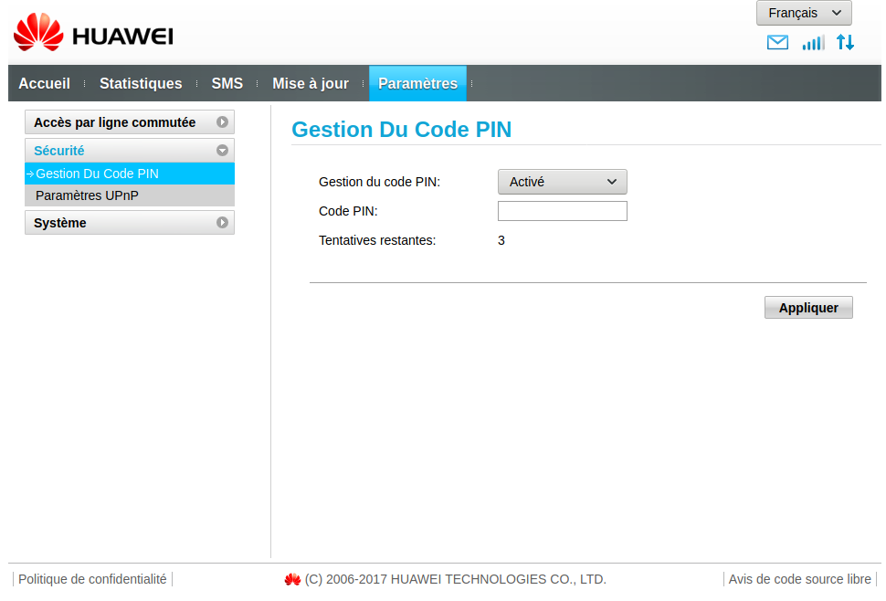
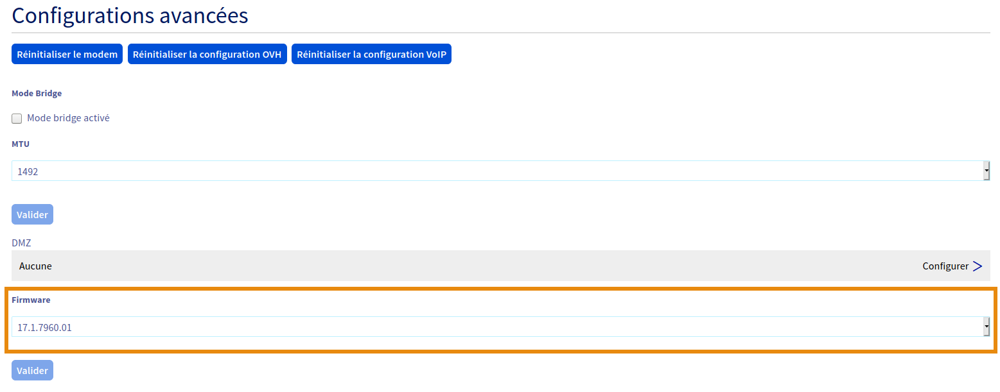
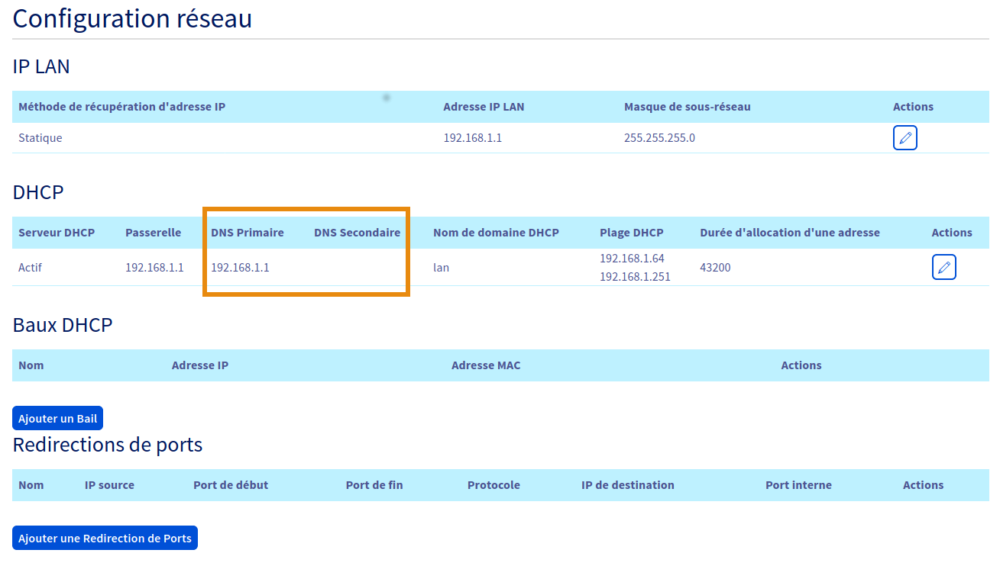

## Objectif

Un lien de secours LTE permet de sécuriser votre connexion en cas de perte. Si votre connexion cuivre ou fibre dysfonctionne, une clé LTE branchée au dos du modem prend alors le relais en se connectant au réseau 3G ou 4G.

**Apprenez à activer un lien de secours LTE sur votre modem**

## Prérequis

- Disposer d’un [accès internet xDSL ou fibre OVHcloud](https://www.ovhtelecom.fr/offre-internet/){.external} et d'un modem Zyxel ou Technicolor TG799vac fourni par OVHcloud.
- Disposer d'une clé LTE Huawei E3372 ainsi qu'une carte SIM permettant l'accès au réseau mobile de données.

## En pratique

Cette fonctionnalité est disponible même si la configuration à distance du modem (via l'espace client OVHcloud) est désactivée.

### Étape 1 : Configurer la clé LTE Huawei E3372

Insérez la carte SIM dans votre clé Huawei E3372, puis branchez la clé sur votre ordinateur. Accédez à la clé via votre navigateur à l'adresse `192.168.8.1`.

Une fois connecté, accédez au menu `Paramètres`, puis dans le menu `Gestion Du Code PIN` entrez le code PIN de votre carte SIM.

{.thumbnail}

Retournez sur l'onglet `Accueil` pour vérifier que vous êtes bien connecté. Si la clé est correctement connectée, la LED sur celle-ci doit également être de couleur fixe, de couleur cyan pour un réseau 4G ou verte pour un réseau 3G.

{.thumbnail}

### Étape 2 : Configurer le modem

#### Modem Zyxel

> [!warning]
>
> En cas de perte de connexion, la VoIP reste fonctionnelle lorsque le modem bascule sur le lien de secours LTE. Par contre, un reboot est nécessaire pour que la VoIP soit de nouveau fonctionnelle après le rétablissement du lien cuivre ou fibre.
>

Par défaut, le modem Zyxel est déjà configuré pour supporter les liens de secours LTE, il suffit donc uniquement de brancher votre clé Huawei E3372 sur le port USB du modem.

Des configurations plus avancées sont disponibles à partir de l'interface locale. Consultez le [guide utilisateur du modem Zyxel](http://files.isp.ovh.net/zyxel/VMG8825-T50K_V5.13_5.50-1.pdf){.external} (en anglais) pour plus de détails.
En complément, une liste des clés LTE supportées par Zyxel est disponible [ici](http://files.isp.ovh.net/zyxel/LTE_dongle_supportList.pdf){.external}

#### Modem Technicolor TG799vac

> [!warning]
>
> En cas de perte de connexion, la VoIP sur le modem n'est plus fonctionnelle lorsque le modem bascule sur le lien de secours LTE. Par contre, elle redevient automatiquement fonctionnelle après le rétablissement du lien cuivre.
>

Activer le lien de secours LTE sur un modem TG799vac nécessite quelques configurations supplémentaires.

##### **Mettre à jour le modem**

Pour que le lien de secours LTE fonctionne, le modem doit être sur le firmware « 17.1.7960.01 ».

Afin de mettre à jour le modem, vous devez vous connecter à votre [espace client OVHcloud](https://www.ovh.com/auth/?action=gotomanager&from=https://www.ovh.com/fr/&ovhSubsidiary=fr){.external}, partie « Télécom ». Cliquez sur `Accès Internet`{.action}, puis sélectionnez le pack et l’accès Internet concerné. Assurez-vous d'être positionné sur l'onglet `Mon Modem`{.action}.

Dans le cadre « Configurations avancées », sélectionnez le firmware « 17.1.7960.01 » dans la liste déroulante de la section `Firmware`.

{.thumbnail}

##### **Changer les DNS DHCP**

Une fois le modem à jour avec le firmware « 17.1.7960.01 », il faut modifier les DNS du serveur DHCP du modem.

Dans le cas où la configuration à distance est activée, vous pouvez effectuer la modification depuis la section `DHCP` dans le cadre « Configuration réseau ». Il faut remplacer le champs DNS primaire par « 192.168.1.1 »  et supprimer le DNS secondaire.

{.thumbnail}

##### **Brancher la clé usb Huawei E3372**

Votre modem est prêt pour supporter le lien de secours LTE. Il ne vous reste plus qu'à brancher la clé Huawei E3372 sur le port USB du modem.

## Aller plus loin

Échangez avec notre communauté d'utilisateurs sur <https://community.ovh.com>.
