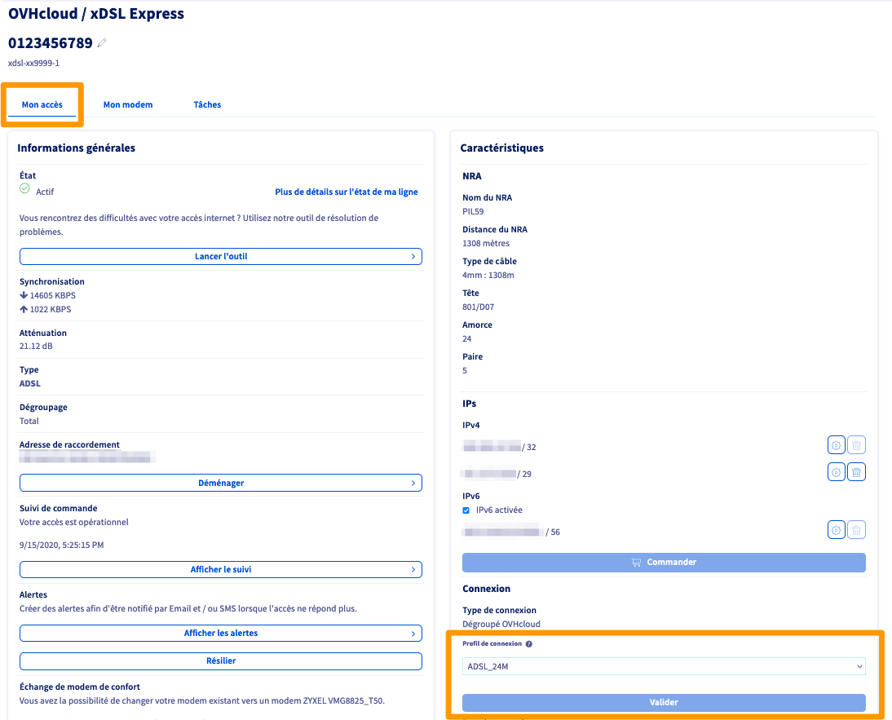
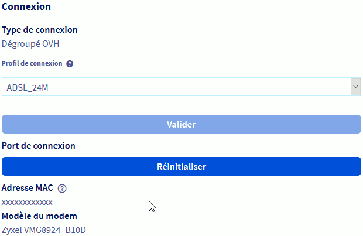
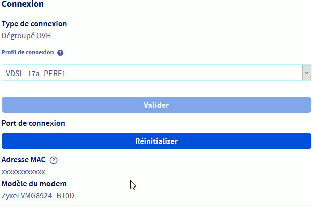

## Objectif

Votre espace client OVHcloud Telecom regroupe un certain nombre de fonctionnalités, dont la gestion de vos profils de synchronisation.

## Prérequis

- Disposer d'un accès xDSL actif.
- Être raccordé sur un NRA dégroupé par OVHcloud.

## En pratique

### Ligne dégroupée OVHcloud

### Comment accéder au changement de profil

Connectez-vous à la rubrique `Telecom` de votre [espace client OVHcloud](https://www.ovh.com/auth/?action=gotomanager&from=https://www.ovh.com/fr/&ovhSubsidiary=fr). Cliquez ensuite sur `Accès Internet`{.action}, sélectionnez votre offre puis cliquez sur la référence de votre accès. 

Par défaut, l'onglet affiché est `Mon accès`.

Vous retrouverez, dans les `Caractéristiques`, la possibilité de modifier le profil de synchronisation de votre accès.

{.thumbnail}

**Pour un accès ADSL :**

{.thumbnail}

**Pour un accès VDSL :**

{.thumbnail}

### Explication des différents profils

Généralement, on applique un nouveau profil quand on souhaite obtenir un débit plus important ou corriger une instabilité. Les profils permettent d'agir directement sur la **marge au bruit (SNR)** de votre ligne.

Lors de son activation, votre accès est livré sur le profil par défaut, avec une marge au bruit à 6 dB lors de la synchronisation.
Suivant le SNR défini, le débit sera plus ou moins élevé et l'accès subira plus ou moins de perturbations.

> [!primary]
> Plus concrètement :
>
> Plus le SNR est faible, meilleur est le débit mais moins stable est la ligne.
>  Plus le SNR est élevé, moins bon est le débit et plus stable est la ligne.
>

Voici la correspondance des profils avec la marge au bruit :

| Profil | SNR |
| ------------- | ------------- |
| 512K  | SNR 6 avec limite de débit à 512K  |
| 2M  | SNR 6 avec limite de débit à 2M  |
| 24M  | SNR 6 sans limite de débit  |
| SAFE1  | SNR 10  |
| SAFE2  | SNR 16  |
| PERF1  | SNR 3  |
| PERF2  | SNR 1  |

24M est le débit maximum atteignable avec un SNR à 6 dB.
Si votre accès est très proche du NRA, vous obtiendrez peut-être 24M.
Cependant si votre ligne est distante de 1 km du NRA, 24M ne sera pas atteignable. Vous obtiendrez peut-être 15M, cela dépendra de la qualité de la ligne et de la marge au bruit.

#### Profils VDSL

En VDSL, d’autres modulations de fréquence s’offrent à vous :

- **17a**, recommandé pour les lignes de moins de 1 km : le profil 17a permet aux abonnés se trouvant à moins d’un kilomètre du NRA de bénéficier des meilleures performances sur leur ligne. Pour connaître cette distance, il suffit de tester son numéro sur le [test d’éligibilité OVHcloud Télécom](https://www.ovhtelecom.fr/offre-internet/eligibilite/). En fonction de la qualité de la ligne, le profil 17a ne sera pas systématiquement la meilleure option pour un abonné se trouvant à moins d’un kilomètre du NRA.
- **8b**, pour les lignes plus longues : de manière générale, le profil 8b sera plus avantageux pour les abonnés situés à plus d’un kilomètre du nœud de raccordement téléphonique.

### Ligne non dégroupée OVHcloud

Malheureusement, la modification du profil de synchronisation n'est pas disponible pour les lignes raccordées sur les équipements d'opérateurs de collecte.

## Aller plus loin

Échangez avec notre communauté d'utilisateurs sur <https://community.ovh.com>
