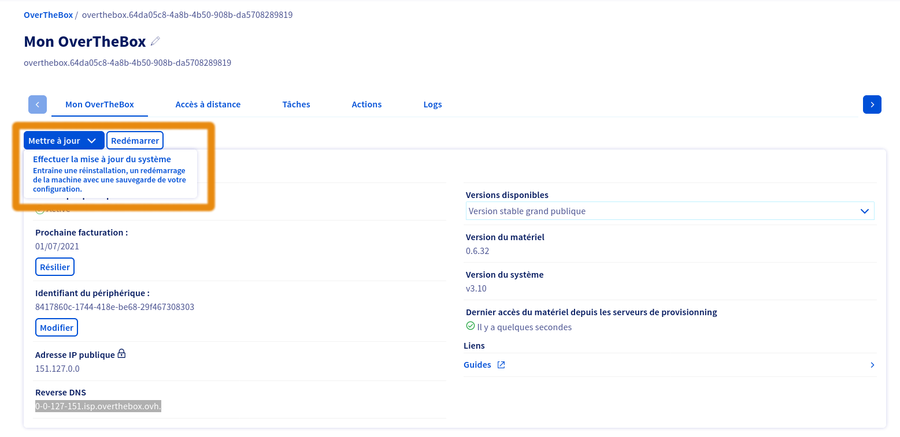
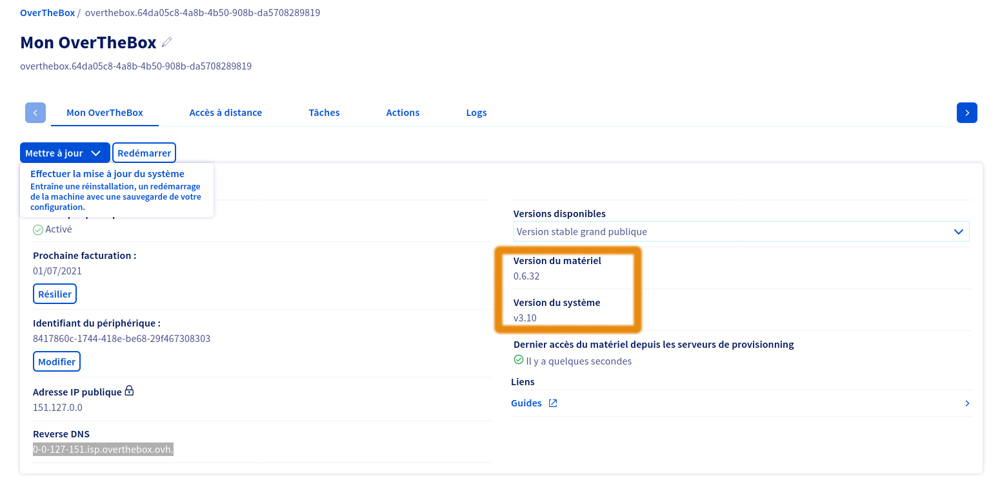
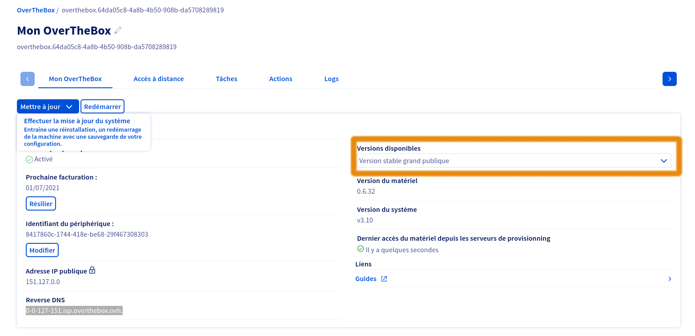

## Objectif

Découvrez comment mettre à jour votre équipement OverTheBox, afin de profiter des dernières améliorations apportées sur cette solution.

## Prérequis

- Disposer d'une **OverTheBox** fournie par OVHcloud.
- Être connecté à l'[espace client OVHcloud](https://www.ovh.com/auth?onsuccess=https%3A%2F%2Fwww.ovhtelecom.fr%2Fmanager&ovhSubsidiary=fr)
dans la partie `Telecom`{.action}.

## En pratique

### Mettre à jour votre OverTheBox

Il existe plusieurs méthodes pour mettre à jour votre équipement OverThebox.

#### Méthode n°1 : mise à jour par l'espace client

La méthode recommandée est de mettre à jour votre OverTheBox depuis l'espace client OVHcloud.

Connectez-vous à votre [espace client OVHcloud](https://www.ovh.com/auth?onsuccess=https%3A%2F%2Fwww.ovhtelecom.fr%2Fmanager&ovhSubsidiary=fr), partie `Telecom`{.action}.

Cliquez sur `OverThebox`{.action} dans la barre de services à gauche, puis sélectionnez le service OverTheBox que vous souhaitez mettre à jour.

Cliquez ensuite sur le bouton `Mettre à jour`{.action}, puis cliquez une seconde fois sur l'encart explicatif, la mise à jour commencera alors.

{.thumbnail}

Attendez quelques minutes afin que l'**OverTheBox** soit de nouveau opérationnelle.

> [!success]
>
> Votre  OvertheBox  est maintenant mise à jour, votre configuration a été réappliquée automatiquement.
>

#### Méthode n°2 : mise à jour par l'interface web locale

Vous pouvez mettre à jour votre équipement OverTheBox depuis l'interface web locale.

- Téléchargez la dernière image sur votre ordinateur : [http://downloads.overthebox.net/stable/v5.0.0/targets/x86/64/latest.img.gz](http://downloads.overthebox.net/stable/v5.0.0/targets/x86/64/latest.img.gz){.external}.
- Rendez-vous sur [http://overthebox.ovh (192.168.100.1)](http://overthebox.ovh){.external}.
- Cliquez sur `System`{.action}.
- Cliquez sur `Backup/Flash Firmware`{.action}.

{.thumbnail}

Ensuite, dans la section **Flash new firmware image** :

- Cliquez sur `Parcourir`{.action}.
- Choisissez le fichier image que vous venez de télécharger.
- Laissez la case **"Keep settings"** cochée si vous souhaitez conserver vos configurations.
- Cliquez sur `Flash image`{.action}.

{.thumbnail}

- Attendez quelques minutes afin qu'**OverTheBox** soit de nouveau opérationnelle.

> [!success]
>
> Votre  OvertheBox  est maintenant mise à jour, votre configuration a été réappliquée automatiquement si la case **Keep settings** n'a pas été décochée.
>

#### Méthode n°3 : mise à jour par le CLI

Vous pouvez également mettre à jour votre équipement OverTheBox depuis le CLI, accessible depuis une connexion SSH.

- Connectez vous en SSH à votre **OverTheBox** :

```bash
ssh root@overthebox.ovh
```

- Une fois connecté, entrez la commande suivante :

```bash
otb-action-sysupgrade
```

- Attendez quelques minutes afin qu'**OverTheBox** soit de nouveau opérationnelle.

> [!success]
>
> Votre  OvertheBox  est maintenant mise à jour, votre configuration a été réappliquée automatiquement.
>

#### Méthode n°4 : réinstallation manuelle

> [!warning]
>
> Cette méthode n'est pas recommandée et n'est utile uniquement que pour certains usages avancés.
>

Vous pouvez suivre le guide « [Installer l’image OverTheBox sur votre matériel](/pages/web_cloud/internet/overthebox/advanced_installer_limage_overthebox_sur_votre_materiel) » pour installer manuellement la dernière image du système OverTheBox.


### Voir les différences entre versions

L'OverTheBox est un projet open-source hébergé sur la plateforme GitHub. Le code est librement accessible et vous permet de consulter concrètement ce qui change entre chaque version.

Sur l'espace client OVHcloud, deux informations de versions vous sont présentées : **Version du matériel** et **Version du système**.

- La **version du matériel** est la version « principale » utilisée pour déterminer la version de votre équipement OverTheBox. Elle est basée sur le dépôt [overthebox-feeds](https://github.com/ovh/overthebox-feeds/tags){.external} qui regroupe les différents logiciels utilisés par le système **OverTheBox**.

- La **version du système** est la version du système **OverTheBox** sur lequel a été construite l'image. Elle est basée sur le dépôt [overthebox](https://github.com/ovh/overthebox/tags){.external}.

{.thumbnail}

### Passer sur une version alpha ou beta

> [!warning]
>
> Il n'est pas recommandé de modifier la version de votre image si vous n'êtes pas un utilisateur expert.
>

Vous pouvez modifier le canal de votre version via l'espace client OVHcloud, ce qui vous permet d'utiliser des versions plus récentes en status alpha ou beta. Ce sont des versions fonctionnelles qui seront, à terme, déployées sur le canal stable.

{.thumbnail}

### Installer la version Raspberry Pi

> [!warning]
>
> Seul les équipements Raspberry Pi 3 sont actuellement supportés.
>

Dans un premier temps, il vous faut installer manuellement [la dernière image disponible](http://downloads.overthebox.net/stable/v5.0.0/targets/brcm2708/bcm2710/latest.img.gz){.external}.
Une fois l'image installée et votre service OverTheBox configuré, votre Raspberry Pi se comportera comme une OverTheBox standard. Il vous sera également possible de modifier le canal de version si vous souhaitez utiliser les canaux alpha et beta.

## Aller plus loin

N'hésitez pas à échanger avec notre communauté d'utilisateurs sur vos produits Télécom sur notre site [OVHcloud Community](https://community.ovh.com/c/telecom)
