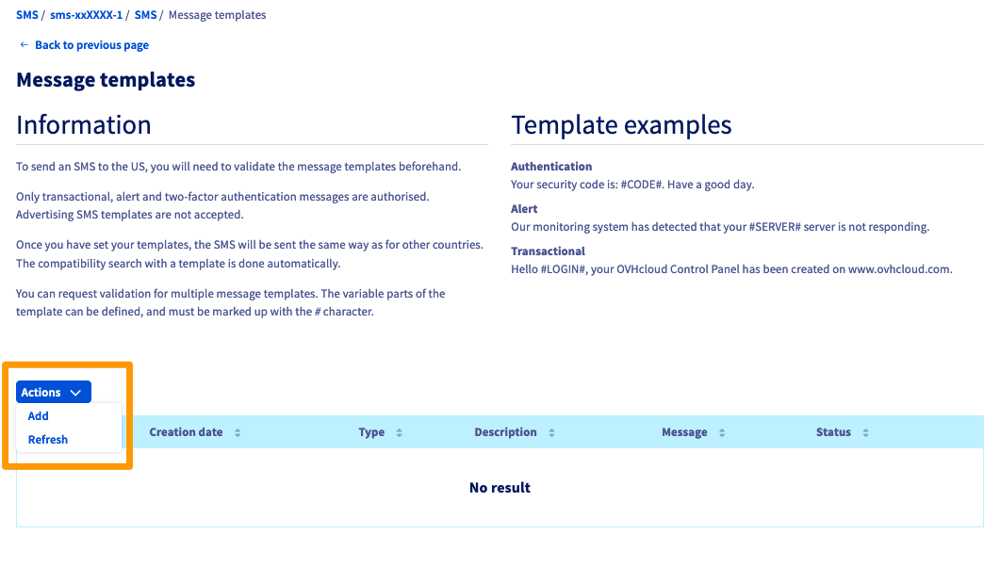
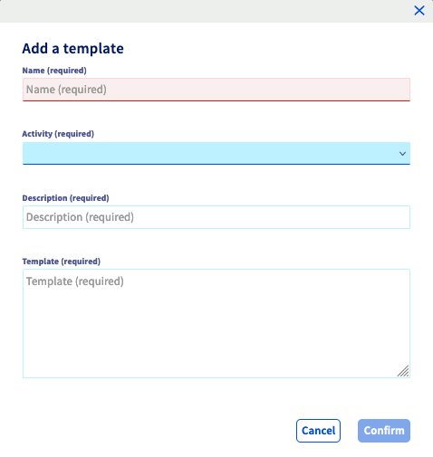
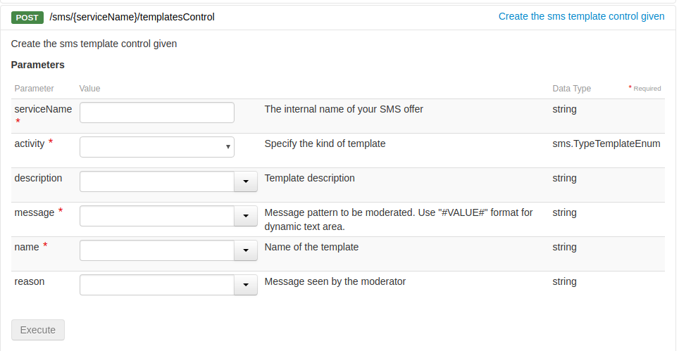

## Objectif

L'envoi de SMS aux Etats-Unis est soumis à des règles spécifiques. Ce guide a pour but de vous les expliquer et vous montrer comment les appliquer afin de pouvoir envoyer vos SMS vers cette destination.

## Prérequis

- Disposer d’un compte SMS OVHcloud avec des crédits SMS.
- Être connecté aux [API OVHcloud](https://api.ovh.com/) (uniquement pour la méthode d'envoi via API).
- Être connecté à l'[espace client OVHcloud](https://www.ovh.com/auth?onsuccess=https%3A%2F%2Fwww.ovhtelecom.fr%2Fmanager&ovhSubsidiary=fr){.external}, partie `Télécom`{.action} puis `SMS`{.action}.

{.thumbnail}

## En pratique

### Étape 1 : connaître les restrictions

En accord avec l’autorité de régulation des SMS des Etats-Unis (Neustar), l'envoi de SMS vers cette destination doit faire l'objet d'une validation préalable par nos services d'un modèle de message.
Seuls les messages d’alerte et de double authentification sont autorisés et aucun modèle de SMS publicitaire ne sera accepté. Une fois votre modèle validé, l’envoi se fera de la même manière que pour les autres destinations.

Vous pouvez demander la validation de plusieurs modèles de messages.

> [!primary]
>
> La validation des modèles de messages est gratuite et effectuée par les équipes de OVHcloud sous un à deux jours ouvrés.
>

### Étape 2 : Ajouter un modèle

#### 2.1 Depuis l'espace client

Connectez-vous à votre [espace client OVHcloud](https://www.ovh.com/auth?onsuccess=https%3A%2F%2Fwww.ovhtelecom.fr%2Fmanager&ovhSubsidiary=fr){.external} puis sélectionnez `Télécom`{.action}. Cliquez ensuite sur `SMS`{.action} et choisissez votre compte SMS. Cliquez sur l'onglet `Message et campagne`{.action} (3) puis sur `Gestion des SMS`{.action}. 

Enfin, cliquez sur `Gérer les modèles`{.action}.

{.thumbnail}

Sur la page qui s'affiche alors, cliquez sur `Action`{.action} puis sur `Ajouter`{.action}.

{.thumbnail}

Une pop-up apparaît avec les champs à remplir.

{.thumbnail}

| Champ       | Description                                                                                                      |
|-------------|------------------------------------------------------------------------------------------------------------------|
| Nom         | Nom du template                                                                                                  |
| Activité    | Sélectionnez le type de modèle :<br>- Alerte<br>- Authentification<br>- Système de traitement transactionnel |
| Description | Description du modèle                                                                                            |
| Modèle      | Écrire le modèle comprenant la variable entre #                                                                  |

#### 2.2 Via les API

> [!success]
> Si vous n'êtes pas familier avec l'utilisation de l'API OVHcloud, consultez notre guide « [Premiers pas avec les API OVHcloud](/pages/manage_and_operate/api/first-steps)».

Connectez-vous sur [api.ovh.com](https://api.ovh.com/) puis utilisez l’API suivante :

> [!api]
>
> @api {v1} /sms POST /sms/{serviceName}/templatesControl
>

{.thumbnail}

Remplissez les champs requis et cliquez sur `Execute`{.action}

#### Exemples de modèles

Vous trouverez ci dessous 2 exemples de modèles de messages à destination des Etats-Unis.

- Exemple de template d'authentification :

```bash
Your security code is #CODE#, have a good day
```

- Exemple de template d'alerte :

```bash
Our monitoring system detected your server #SERVER# doesn't respond to ping requests
```

### Étape 3 : analyser les retours

Une fois votre modèle de message créé et validé, l'envoi d'un SMS génère une comparaison automatique de son contenu avec vos modèles. Si la comparaison est positive, le SMS est envoyé de manière identique à un envoi vers une autre destination.

Si vous envoyez un SMS aux Etats-Unis sans avoir au préalable créé et validé un modèle, le SMS sera refusé et un Premium Tracking Transaction Code (PTT code) à 1999 vous sera adressé. Ce code correspond au message d'erreur « No templates available » (pas de modèle de messages créé).

Vous pouvez consulter les autres codes de retour possibles sur [ce guide](/pages/web_cloud/messaging/sms/tout_savoir_sur_les_utilisateurs_sms).

## Aller plus loin

Échangez avec notre communauté d'utilisateurs sur <https://community.ovh.com>.
