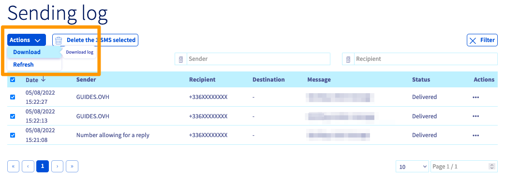

> [!primary]
> Esta traducción ha sido generada de forma automática por nuestro partner SYSTRAN. En algunos casos puede contener términos imprecisos, como en las etiquetas de los botones o los detalles técnicos. En caso de duda, le recomendamos que consulte la versión inglesa o francesa de la guía. Si quiere ayudarnos a mejorar esta traducción, por favor, utilice el botón "Contribuir" de esta página.
>

## Objetivo

Esta guía explica cómo consultar y descargar el historial de SMS enviados desde el área de cliente de OVHcloud.

## Requisitos

- Tener una cuenta de SMS de OVHcloud con la que haya enviado al menos un SMS.
- Haber iniciado sesión en el [área de cliente de OVHcloud](https://www.ovh.com/auth/?action=gotomanager&from=https://www.ovh.es/&ovhSubsidiary=es){.external}, en la sección `Telecom`{.action}{.action} > `SMS`{.action}.

{.thumbnail}

## Procedimiento

El historial de envíos incluye información sobre la fecha, el remitente, el destinatario y el contenido del SMS enviado.

> [!primary]
>
> El área de cliente solo permite consultar los últimos seis meses del historial de envío. Para consultar los SMS anteriores a esta fecha, vaya al paso [2. Descargar el historial de sus SMS en CSV](#csv).
>

### 1. Consultar el historial en el área de cliente

Conéctese a su [área de cliente de OVHcloud](https://www.ovh.com/auth/?action=gotomanager&from=https://www.ovh.es/&ovhSubsidiary=es) y seleccione `Telecom`{.action}. Haga clic en `SMS`{.action} y seleccione su cuenta de SMS.

En la barra de pestañas, haga clic en `Mensage y campaña`{.action} y, seguidamente, en `Gestión de SMS`{.action} para acceder al historial de sus SMS unitarios o en `Gestión de campañas`{.action} para acceder al historial de sus campañas de SMS.

A continuación, haga clic en el botón `Historial de envíos`{.action} o `Estadísticas e historial`{.action}.

{.thumbnail}

Para filtrar el historial de SMS por fecha de envío, haga clic sobre la palabra «Fecha» en la primera columna a la izquierda.

{.thumbnail}

Para consultar o eliminar un SMS, haga clic en el icono con forma de tres puntos (`...`{.action}) en la columna «Acciones».

{.thumbnail}

Para eliminar varios SMS a la vez, selecciónelos marcando las casillas correspondientes y haga clic en el botón `Eliminar el SMS seleccionado`{.action}.

{.thumbnail}
 
El botón `Filtrar`{.action} permite filtrar la búsqueda por remitente (si hubiera más de uno) o por destinatario.

{.thumbnail}
 
### 2. Descargar el historial de sus SMS en CSV 
 
Para descargar el historial de los SMS enviados en formato «.CSV», haga clic en el botón `Acciones`{.action} en la esquina superior izquierda y seleccione `Descargar`{.action}. 
 
{.thumbnail}
 
También puede consultar el historial desde un programa de hojas de cálculo. La información aparecerá como se muestra a continuación:

{.thumbnail}

Detalles de la información incluida en el historial:

|  Título  |  Descripción  |
|  :-----          |  :-----          |
|  id |  Identificador único en nuestros servidores del SMS enviado |
|  date | Fecha y hora de envío del SMS  |
|  sender |  Remitente desde el que se ha enviado el SMS |
|  receiver |  Número del móvil destinatario del SMS |
|  ptt |  Código de respuesta con el estado del SMS |
|  operatorCode |  Identificador de red del operador móvil al que se le ha transmitido el SMS |
|  descriptionDlr |  Descripción del código ptt recibido y estado del SMS |
|  tag |  Etiqueta que se atribuye manualmente a través de las API (a uno o varios SMS) o automáticamente a través de nuestros servidores a cada uno de los SMS (o a cada campaña de SMS) enviados |
|  message |  Contenido del SMS |

Para más información sobre los códigos ptt y los diferentes ID del DLR, consulte la última sección de la guía [Usuarios de la API](/pages/telecom/sms/tout_savoir_sur_les_utilisateurs_sms#5-especificar-una-url-de-callback).
 
## Más información

Interactúe con nuestra comunidad de usuarios en <https://community.ovh.com/en/>.