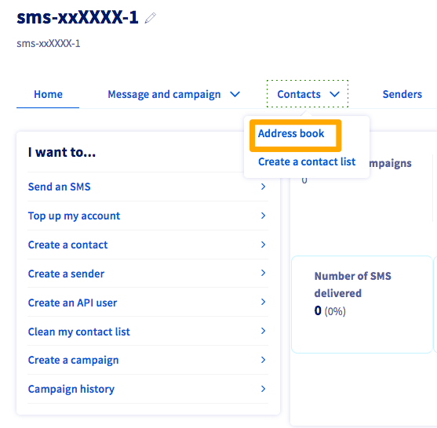
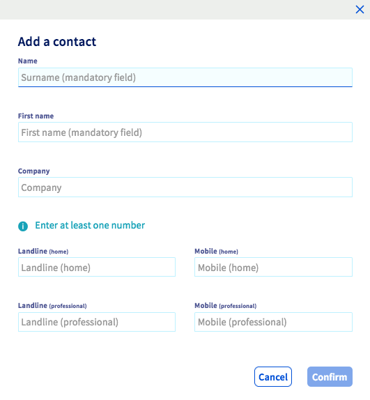
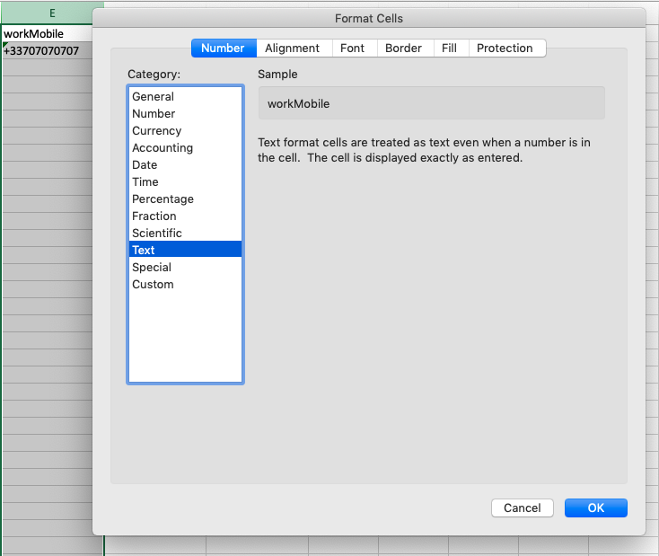
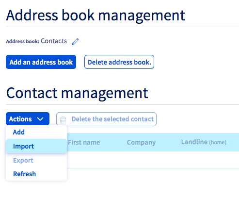

## Objective

All OVHcloud SMS accounts can use one or more address books. This guide explains how to create them in the OVHcloud Control Panel.

## Requirements

- an active OVHcloud SMS account
- a spreadsheet or text editor tool
- You must be logged in to [OVHcloud Control Panel](https://www.ovh.com/auth/?action=gotomanager&from=https://www.ovh.co.uk/&ovhSubsidiary=GB){.external}, in the `Telecom`{.action} section, then `SMS`{.action}.

{.thumbnail}

## Instructions

### Step 1: Create an address book via the OVHcloud Control Panel

Log in to the [OVHcloud Control Panel](https://www.ovh.com/auth/?action=gotomanager&from=https://www.ovh.co.uk/&ovhSubsidiary=GB), and go to the `Telecom`{.action} section. Next, select `SMS`{.action}.

Click on the SMS account concerned, and select the `Contacts`{.action} tab, then `Address book`{.action}.

{.thumbnail}

Click `Add an address book`{.action}, and give it a name.

{.thumbnail}

### Step 2: Add contacts to your address book

You have now created the address book, but it does not contain any contacts. There are several ways of adding contacts.

### Add them individually via the OVHcloud Control Panel

Select the `Actions`{.action} button, and click `Add`{.action}.

{.thumbnail}

You will access a window that enables you to enter the contact details.

{.thumbnail}

Fill out the fields you need to, and confirm to save your changes. The contact will then be added to your address book. You will need to repeat this process to add more contacts.

### Add multiple contacts by importing a contact file to the OVHcloud Control Panel

#### Prepare a file in your spreadsheet

If you would like to use or create a document in a spreadsheet format, you will need to design it as per the layout below, and export it in .csv format.

{.thumbnail}

The vast majority of spreadsheet tools will not take into account the international format expected for telephone/fax numbers (+44xxxxxxxxxx). This means you will need to change the format of the cells that contain these numbers (workPhone, workMobile, etc.). To do this, select the columns concerned, and select a “Text” format for them.

{.thumbnail}

Once the document is ready, save it in a spreadsheet format to edit later.

At the same time, save or export it in .csv format to prepare the import.

> [!primary] 
>
> **Recommendations**
>
> Save your spreadsheet file in .csv format (separator: semi-colon).
>
> Special characters like accents are not included in the .csv file import, and contacts that contain special characters will not be imported.
>
> Please follow the international format +44xxxxxxxxxx for your phone numbers.
>
> We advise ensuring that your address books do not contain more than 2,000 contacts.
>
> All of your contacts must be on the same sheet in your spreadsheet file.
>
>

#### Import the file into the OVHcloud Control Panel

Go back to the OVHcloud Control Panel, select the `Actions`{.action} button, and click `Import`{.action}.

{.thumbnail}

A pop-up window will appear. Next, click `Contact file`{.action} to select your .csv file, then confirm.

{.thumbnail}

Wait a few seconds while the file is imported in to the OVHcloud Control Panel.

### Step 3: Edit or delete an address book

If you would like to edit the name of an address book, select it in the dropdown menu (1) (if you have created several address books), then click on the pencil icon (2) across from the address book name. 

To delete an address book, click `Delete address book`{.action} after you have selected it in the dropdown menu (1).

To edit or delete a contact, click `...`{.action} in the Actions column (4) across from the contact concerned. You will then see a menu offering you these choices.

{.thumbnail}

## Go further

Join our community of users on [https://community.ovh.com/en/](https://community.ovh.com/en/).
