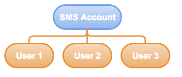
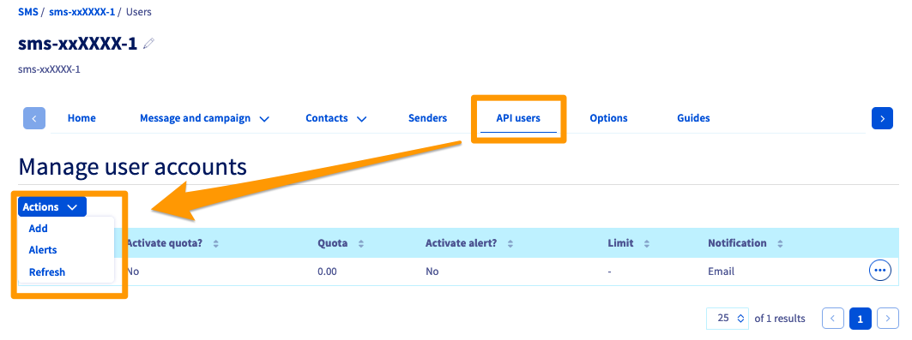
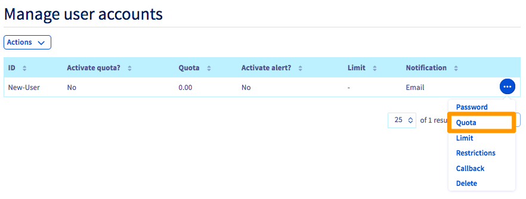

## Objectif

Ce guide vous explique comment créer et gérer des utilisateurs API.

## Prérequis

- Disposer d'un compte SMS OVHcloud
- Être connecté à l'[espace client OVHcloud](https://www.ovh.com/auth?onsuccess=https%3A%2F%2Fwww.ovhtelecom.fr%2Fmanager&ovhSubsidiary=fr){.external}, partie `Télécom`{.action} puis `SMS`{.action}.

{.thumbnail}

## En pratique

{.thumbnail}

Un utilisateur SMS API peut être utile pour plusieurs raisons :

- Il permet au propriétaire du compte SMS de sécuriser ses accès lors d'un envoi de SMS via une API externe.
En effet, le script appelant ne connaît que l'identifiant de l'utilisateur et son mot de passe, et non la session de l'identifiant client du propriétaire.

- La création de plusieurs utilisateurs API peut être utile dans une entreprise, notamment pour une meilleure traçabilité.
Un utilisateur API qui envoie des SMS de manière abusive peut de suite être décelé par le propriétaire du compte.

- Un utilisateur API peut être soumis à des restrictions (quotas) dans ses crédits SMS.
Ainsi il est possible pour le propriétaire du compte SMS de diviser ses crédits sur ses différents comptes utilisateurs API.

Afin de gérer au mieux le crédit de votre compte SMS, il est possible de fixer une limite et un quota à vos utilisateurs API.

- Le **quota** est la quantité de crédits SMS disponibles pour l’utilisateur API.

- La **limite** est le seuil minimum de crédits SMS restant à un utilisateur API avant réception d'une alerte pour recharger, ou pas, le nombre de ces crédits.

### Étape 1 : créer un utilisateur API

Connectez-vous à votre [espace client](https://www.ovh.com/auth/?action=gotomanager&from=https://www.ovh.com/fr/&ovhSubsidiary=fr), puis sélectionnez `Télécom`{.action}. Cliquez ensuite sur `SMS`{.action} et choisissez votre compte SMS.

Cliquez sur l'onglet `Utilisateurs API`{.action}. Pour ajouter un utilisateur, cliquez sur le bouton `Actions`{.action} puis sur `Ajouter`{.action}.

{.thumbnail}

La définition du nom de l'utilisateur API est libre. Le mot de passe d'un utilisateur API doit être composé de 8 caractères alphanumériques.

### Étape 2 : attribuer un quota à un utilisateur API

La gestion du quota s'effectue depuis l'onglet `Utilisateurs API`{.action}. En face de l'utilisateur choisi, cliquez sur les `...`{.action} puis sur `Quota`{.action}.

{.thumbnail}

Vous pourrez alors effectuer deux actions.

- **Activer quota ?** : vous permet de définir si cet utilisateur est soumis à un quota.
- **Nouveau quota** : définit le quota de l’utilisateur. Une fois ce quota atteint, l’envoi de SMS sera bloqué pour cet utilisateur.

{.thumbnail}

> [!primary]
>
> L'affectation d'un quota à un utilisateur API va réduire d'autant le crédit total du compte SMS.
>
> Exemple : un compte SMS dispose au total de 200 crédits. L'affectation de 150 crédits à un utilisateur API va défalquer 150 crédits du compte SMS qui ne disposera alors plus que de 50 crédits.
>

### Étape 3 : attribuer une limite à un utilisateur API

La configuration d'une limite pour un utilisateur s'effectue depuis le même menu, en cliquant sur les `...`{.action} puis sur `Limite`{.action}.

Les paramètres suivants sont alors disponibles :

- **Activer l’alerte ?** : permet d'activer l'alerte de limite.
- **Seuil d’alerte** : définit le niveau de crédits SMS restant à partir duquel la notification est envoyée.
- **Notification** : permet de choisir le type de notification : e-mail (renseignez alors votre adresse e-mail), SMS (renseignez votre numéro au format international) ou les deux.

> [!warning]
>
> L'envoi d'une notification par SMS sera déduit de votre crédit SMS.
>

{.thumbnail}

### Étape 4 : définir une restriction par IP pour la fonction http2sms

Vous pouvez sécuriser la fonction http2sms en appliquant des restrictions par IP pour chaque utilisateur API.

Pour l'activer, cliquez sur les `...`{.action} à droite de l'utilisateur puis sur `Restrictions`{.action}.

Vous pouvez renseigner jusqu'à 5 adresses IP publiques différentes pour les envois de vos requêtes https.

{.thumbnail}

Pour plus d'informations sur la fonction http2sms, consultez le guide [Envoyer des SMS depuis une URL](/pages/web_cloud/messaging/sms/envoyer_des_sms_depuis_une_url_-_http2sms).

### Étape 5 : spécifier une URL de Callback

Pour un suivi personnalisé des accusés de réception SMS (Delivery reporting ou DLR), il est possible de spécifier une URL dite de Callback en cliquant sur les `...`{.action} à droite de l'utilisateur puis sur `Callback`{.action}.

{.thumbnail}

Lorsque le statut d'envoi du SMS est mis à jour, nous appelons l'URL spécifiée. Les valeurs suivantes sont automatiquement insérées dans la querystring :

- id : numéro d'identification du SMS
- ptt : code qui correspond à un état du SMS. Les différents codes ptt sont décrits dans le premier tableau ci-dessous.
- date : date du DLR
- description : ID du DLR . Les différents ID sont décrits dans le second tableau ci-dessous
- descriptionDlr : description du status du DLR

#### Les codes ptt

Pour obtenir la description d'un code ptt spécifique, vous pouvez utiliser l'API suivante :

> [!api]
>
> @api {GET} /sms/ptts
>

Pour plus d'informations sur l'utilisation des API OVHcloud, consultez notre guide [Premiers pas avec les API OVHcloud](/pages/manage_and_operate/api/first-steps).

Vous retrouverez dans le tableau ci-dessous une liste **non-exhaustive** des codes ptt principaux.

|Code|Description|
|---|---|
|1|Notification d'état intermédiaire indiquant que le message n'a pas encore été livré en raison d'un problème de téléphone, mais est en cours de nouvel essai (Intermediate state notification that the message has not yet been delivered due to a phone related problem but is being retried).|
|2|Utilisé pour indiquer que le message n'a pas encore été livré en raison d'un problème d'opérateur, mais est en cours de nouvel essai au sein du réseau (Used to indicate that the message has not yet been delivered due to some operator related problem but is being retried within the network).|
|3|Utilisé pour indiquer que le message a été accepté par l'opérateur (Used to indicate that the message has been accepted by the operator).|
|4|Le message a été livré (The message was delivered).|
|5|Le message a été confirmé comme non livré, mais aucune information détaillée relative à l'échec n'est connue (The message has been confirmed as undelivered but no detailed information related to the failure is known).|
|6|Impossible de déterminer si le message a été livré ou a échoué, en raison d'un manque d'information de livraison de la part de l'opérateur (Cannot determine whether this message has been delivered or has failed due to lack of final delivery state information from the operator).|
|8|Utilisé quand un message a expiré (ne pouvait pas être livré dans la durée de vie du message) au sein de l'opérateur SMSC, mais non associé à une raison de l'échec (Used when a message expired (could not be delivered within the life time of the message) within the operator SMSC but is not associated with a reason for failure).|
|20|Utilisé quand un message n'est pas livrable dans sa forme actuelle (Used when a message in its current form is undeliverable).|
|21|Utilisé uniquement lorsque l'opérateur accepte le message avant d'effectuer la vérification de crédit de l'abonné. Si les crédits sont insuffisants, l'opérateur retente l'envoi jusqu'à ce qu'il y ait assez de crédit ou que le message expire. Si le message epire et que la dernière raison de l'échec est liée au crédit, alors ce code d'erreur sera utilisé (Only occurs where the operator accepts the message before performing the subscriber credit check. If there is insufficient credit then the operator will retry the message until the subscriber tops up or the message expires. If the message expires and the last failure reason is related to credit then this error code will be used).|
|23|Utilisé lorsque le message est non distribuable en raison d'un MSiSDN incorrect / invalide / sur liste noire / définitvement interndit pour cet opérateur. Ce MSISDN ne doit pas être utilisé à nouveau pour les requêtes de messages à cet opérateur(Used when the message is undeliverable due to an incorrect / invalid / blacklisted / permanently barred MSISDN for this operator. This MSISDN should not be used again for message submissions to this operator).|
|24|Utilisé quand un message est non distribuable parce que l'abonné est temporairement absent, par exemple si son téléphone est éteint ou s'il ne peut pas être localisé sur le réseau (Used when a message is undeliverable because the subscriber is temporarily absent, e.g. their phone is switch off, they cannot be located on the network).|
|25|Utilisé lorsque le message a échoué en raison d'un état temporaire dans le réseau de l'opérateur. Cela pourrait être lié à la couche SS7, la passerelle ou SMSC (Used when the message has failed due to a temporary condition in the operator network. This could be related to the SS7 layer, SMSC or gateway).|
|26|Utilisé lorsque le message a échoué en raison d'un erreur temporaire du téléphone, par exemple la carte SIM est pleine, PME occupée, mémoire pleine etc. Cela ne signifie pas que le téléphone est incapable de recevoir ce type de message / contenu (voir code d'erreur 27) (Used when a message has failed due to a temporary phone related error, e.g. SIM card full, SME busy, memory exceeded etc. This does not mean the phone is unable to receive this type of message/content (refer to error code 27)).|
|27|Utilisé lorsqu'un combiné est définitivement incompatible ou incapable de recevoir ce type de messages (Used when a handset is permanently incompatible or unable to receive this type of message).|
|28|Utilisé si un message échoue ou est rejeté en raison de soupçons de SPAM sur le réseau de l'opérateur. Cela pourrait indiquer dans certaines zones géographiques que l'opérateur n'a aucune trace de la MO obligatoire requis pour un MT (Used if a message fails or is rejected due to suspicion of SPAM on the operator network. This could indicate in some geographies that the operator has no record of the mandatory MO required for an MT).|
|29|Utilisé lorsque ce contenu spécifique n'est pas autorisé sur le réseau / shortcode (Used when this specific content is not permitted on the network / shortcode).|
|33|Utilisé lorsque l'abonné ne peut pas recevoir un contenu pour adultes en raison d'un verrouillage parental (Used when the subscriber cannot receive adult content because of a parental lock).|
|39|Nouvelle panne de l'opérateur (New operator failure).|
|73|Le message a échoué car les combinaisons portées sont inaccessibles (The message was failed due to the ported combinations being unreachable).|
|74|Le message a échoué car le MSISDN est en itinérance (The message was failed due to the MSISDN being roaming).|
|76|Le message a échoué car les combinaisons portées sont bloquées pour le client (le client a été sur mis liste noire pour la destination portée) (The message was failed due to the ported combinations being blocked for client (the client has been blacklisted from the ported destination)).|
|202|Le message a échoué en raison des combinaisons portées bloquées pour le client. Contactez le support client pour plus d'informations (The message was failed due to the ported combinations being blocked for the client. Please contact Client Support for additional information).|

#### Les différents ID du DLR

|État|Description|
|---|---|
|0|En création ou en attente (Creating or pending)|
|1|Succès (Success)|
|2|Echoué (Failed)|
|4|En attente (Waiting)|
|8|Tampon (Buffered)|
|16|En erreur / non facturé (Error / not billed)|

## Aller plus loin

Échangez avec notre communauté d'utilisateurs sur <https://community.ovh.com>
