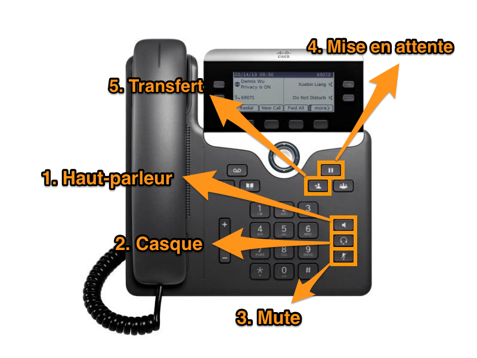

## Objectif

**Ce guide vous présente les différentes fonctionnalités de votre téléphone Cisco 7841 fourni par OVH.**

## Prérequis

- Posséder [une ligne téléphonique OVH](https://www.ovhtelecom.fr/telephonie/){.external}.
- Avoir réceptionné et installé le téléphone Cisco 7841 fourni par OVH.

## En pratique

{.thumbnail}

### Passer un appel

|Mode de réponse|Procédure|
|---|---|
|Via le combiné|Composez le numéro sur le clavier et décrochez le combiné de votre téléphone.|
|Via le haut-parleur|Composez le numéro sur le clavier et appuyez sur la touche `Haut-parleur`{.action} (1).|
|Via le casque|Composez le numéro sur le clavier une fois le casque branché et appuyez sur la touche `Casque`{.action} (2).|

### Répondre à un appel

|Mode de réponse|Procédure|
|---|---|
|Via le combiné|Lors de la réception d'un appel, décrochez simplement le combiné de votre téléphone.|
|Via le haut-parleur|Lors de la réception d'un appel, appuyez sur la touche `Haut-parleur`{.action} (1).|
|Via le casque|Lors de la réception d'un appel, appuyez sur la touche `Casque`{.action} (2). Assurez-vous que votre casque est bien relié à votre téléphone.|

### Recomposer un appel

Pour recomposer un appel, repérez la mention « bis » dans l'écran rétroéclairé de votre téléphone, puis appuyez sur la touche en dessous de celle-ci.

### Mettre un appel en sourdine puis rétablir le son

Pendant un appel, appuyez sur la touche `Mute`{.action} (3) pour couper le son du microphone. Appuyez une nouvelle fois pour le réactiver.

### Mettre en attente et reprendre un appel

Pour mettre un appel en attente, appuyez sur la touche `Mise en attente`{.action} (4) pendant un appel actif. Appuyez une nouvelle fois pour reprendre l'appel.

### Transférer un appel

#### Effectuer un transfert en aveugle

Pendant un appel, appuyez sur la touche `Transfert`{.action} (5) de votre téléphone. Entrez ensuite le numéro vers lequel vous souhaitez transférer l'appel ou appuyez sur un bouton de numérotation simplifiée.

Enfin, appuyez de nouveau sur la touche `Transfert`{.action} (5) sans avoir attendu que le nouveau destinataire décroche. L'appel est connecté au nouveau numéro que vous avez renseigné.

#### Effectuer un transfert accompagné

Pendant un appel, appuyez sur la touche `Transfert`{.action} (5) de votre téléphone. Entrez ensuite le numéro vers lequel vous souhaitez transférer l'appel ou appuyez sur un bouton de numérotation simplifiée.

Dès lors, patientez le temps que le nouveau destinataire décroche, puis appuyez de nouveau sur la touche `Transfert`{.action} (5). L'appel est connecté au nouveau numéro que vous avez renseigné.

### Permuter

Lorsque deux appels sont actifs, un en cours et l'autre en attente, vous avez la possibilité de permuter d'un appel à l'autre. Ceci vous permet par exemple de discuter en privé avec chaque interlocuteur avant de les mettre en relation grâce à un transfert.

Pour cela, repérez la mention « Permuter » dans l'écran rétroéclairé de votre téléphone, puis appuyez sur la touche en dessous de celle-ci.

### Mettre fin à un appel

|Mode de fin d'appel|Procédure|
|---|---|
|Via le combiné|Pour mettre fin à une communication, raccrochez le combiné de votre téléphone ou appuyez sur la touche située en dessous de la mention « Fin d'appel » dans l'écran rétroéclairé de votre téléphone.|
|Via le haut-parleur|Pour mettre fin à une communication, appuyez sur la touche `Haut-parleur`{.action} (1) ou appuyez sur la touche située en dessous de la mention « Fin d'appel » dans l'écran rétroéclairé de votre téléphone.|
|Via le casque|Pour mettre fin à une communication, appuyez sur la touche `Casque`{.action} (2) ou appuyez sur la touche située en dessous de la mention « Fin d'appel » dans l'écran rétroéclairé de votre téléphone.|

## Aller plus loin

Échangez avec notre communauté d'utilisateurs sur <https://community.ovh.com>.
