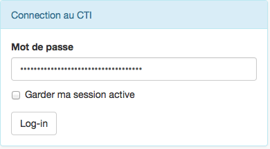
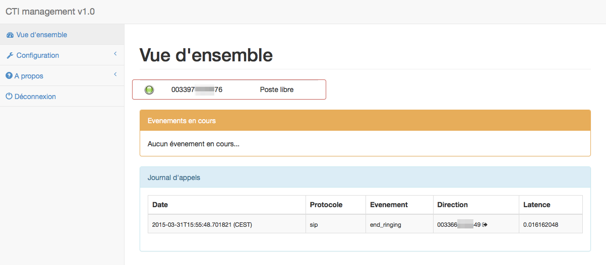
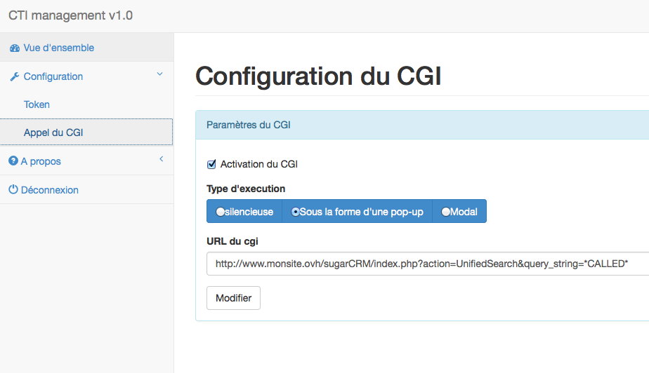
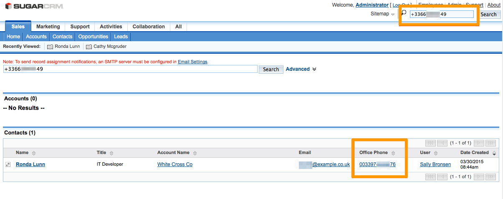

## Objectif

Ce guide montre un exemple de remontée de fiche avec le CRM [SugarCRM](http://www.sugarcrm.com/fr). Il peut servir d'exemple pour le couplage avec d'autres logiciels.

## Définitions

- **CTI (Computer Telephony Integration)** : Dispositif permettant d’interfacer le système de téléphonie aux applicatifs informatiques. Il permet principalement de gérer la remontée de fiches.

- **ERP (Enterprise Resource Planning)** : Application dont le but est de coordonner l'ensemble des activités d'une entreprise (activités dites verticales telles que la production, l'approvisionnement ou bien horizontales comme le marketing, les forces de vente, la gestion des ressources humaines, etc.) autour d'un même système d'information. 

- **CRM (Customer Relationship Management)** : Application dont le but est d’optimiser la qualité de la relation client, de fidéliser et de maximiser le chiffre d’affaires ou la marge par client.

- **TOKEN (Jeton d'authentification)** : Jeton utilisé en complément ou à la place d'un mot de passe pour identifier la ligne du client.

- **CGI (Common Gateway Interface)** : Méthode standard utilisée pour générer un contenu dynamique de pages et d'applications web. Il fournit une interface entre le serveur web et l'application qui l'utilise.

## Contexte

De nombreuses entreprises utilisent des logiciels tels que les CRM et ERP pour gérer les données de leurs contacts : clients, fournisseurs,...
Avec les fonctionnalités CTI d'OVHcloud, il est possible de coupler la téléphonie avec les logiciels de gestion afin notamment de gagner en rapidité. L'usage le plus courant est la remontée de fiche, nous allons expliquer dans ce guide comment récupérer le numéro de l'appelant pour lancer automatiquement une recherche de contact dans le CRM SugarCRM.

## Descriptif technique du fonctionnement

- Création d'un token pour récupérer tous les évenements d'une ligne téléphonique
- Réglage du poste informatique pour lier le token de la ligne et le CRM
- Déclenchement d'un événement lors d'un appel sur la ligne
- Ouverture d'une recherche dans le CRM pour tous les événements d'appels entrants

## Prérequis

- Une [ligne de téléphonie OVHcloud](https://www.ovhtelecom.fr/telephonie/voip/)
- Une installation opérationnelle de [SugarCRM](https://www.sugarcrm.com/fr/){.external}
- Un poste informatique avec un navigateur web

## En pratique

> [!primary]
>
> Pour plus d'informations sur le fonctionnement des API OVHcloud, consultez notre guide « [Premiers pas avec les API OVHcloud](/pages/manage_and_operate/api/first-steps) ».
>

### Étape 1 : création du token

Pour créer un token nous allons utiliser la console API (il est possible de créer un token directement en API sans passer par la console). Rendez-vous sur la page des [API](https://api.ovh.com/), connectez-vous et utilisez le call API suivant :

> [!api]
>
> @api {POST} /telephony/{billingAccount}/service/{serviceName}/eventToken
> 

{.thumbnail}

Indiquez votre groupe de facturation (*billingAccount*), votre identifiant de ligne (*serviceName*) et une durée d'expiration du token (de 5 minutes à illimité).

Pour récupérer votre *billingAccount* vous pouvez utiliser l'API suivante :

> [!api]
>
> @api {POST} /telephony
> 

Pour récupérer votre *serviceName* vous pouvez utiliser :

> [!api]
>
> @api {GET} /telephony/{billingAccount}/service
> 

Exécutez la requete *POST* et en retour vous recevez votre token pour votre ligne. Par exemple : "XXXXXXXX-XXXX-XXXX-XXXX-XXXXXXXXXXXX"

{.thumbnail}

### Étape 2 : couplage de la téléphonie avec SugarCRM

Pour réaliser le couplage téléphonie informatique, nous allons utiliser le projet communautaire CTI d'OVHcloud : CTI management. En ouvrant la page Web, le navigateur va récupérer tous les événements de la ligne associée au token et pourra déclencher l'ouverture du CRM. La page d'accueil est disponible [ici](https://events.voip.ovh.net/demo/cti/).

{.thumbnail}

Sur la page `Vue d'ensemble`{.action} vous retrouvez tous les événements qui se sont produits depuis l'ouverture de la page.

{.thumbnail}

Rendez-vous dans la partie `Configuration`{.action} puis `Appel du CGI`{.action}.

Le site propose trois types d’exécution d'URL :

- *Modal* => pour ouvrir une page dans une petite fenêtre
- *Popup* => pour ouvrir une page dans un nouvel onglet du navigateur
- *Silencieux* => pour ouvrir un script sans affichage

Dans l'url vous allez devoir indiquer l'url de recherche d'un contact dans SugarCRM avec un champ dynamique

- *CALLING* => Le numéro de l'appelant
- *CALLED* => Le numéro de l'appelé
- *EVENT* => Le type d’événement (start_ringing)

Voici l'url avec le champ dynamique : <http://www.monsite.ovh/sugarCRM/index.php?action=UnifiedSearch&query_string=*CALLED*>.

{.thumbnail}

Dès lors, à chaque appel téléphonique sur votre ligne, la page CTI management va lancer une recherche avec le numéro de l'appelant suivant le format "0033XXXXXXXXX".

Si les informations téléphoniques sont enregistrées sous ce format, le couplage est terminé. Si vos informations téléphoniques sont enregistrées suivant un autre format, nous allons voir dans la dernière partie comment l'adapter à vos besoins.


### Étape 3 : adapter au format de saisie du téléphone

Si vous avez stocké vos informations téléphoniques suivant le format "+33XX...", nous vous proposons cette améliorations à intégrer dans le fichier *./js/cti.js*.

Remplacez ce morceau de code à partir de la ligne 180 :

```bash
var callingOtherFormat = eventData.Calling.replace('00', '%2B'); //remplace 00 par + en encodé
var url = $scope.cgiPath;
url = url.replace("*CALLING*",callingOtherFormat);//intègre la bonne variable
```

### Étape 4 : tests

Pour clore cette phase d'intégration, laissez la page CTI management ouverte, appelez la ligne et vérifiez que SugarCRM s'ouvre bien en mode recherche sur votre numéro d'appelant.

{.thumbnail}

## Aller plus loin

Échangez avec notre communauté d'utilisateurs sur <https://community.ovh.com>.
