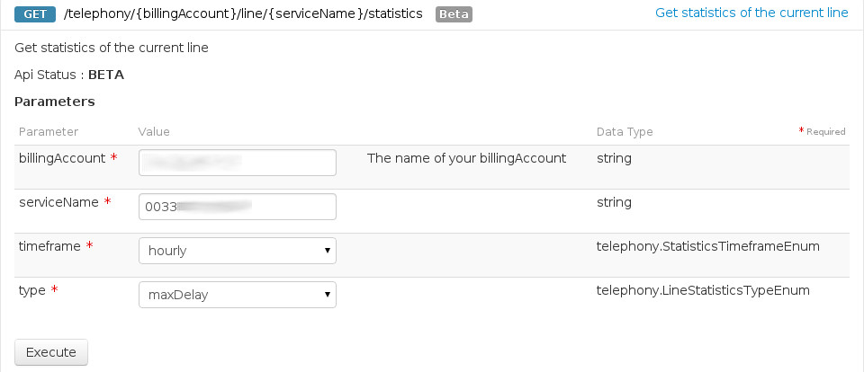

## 
Pour connaitre les bases de notre API :

[Bases de l'API](/pages/manage_and_operate/api/first-steps)

## 
L'ensemble des points relatifs aux derniers appels selon le choix de la métrique :

```
/telephony/{billingAccount}/line/{serviceName}/statistics
```

## 
Vous pouvez récuperer l'ensemble des points relatifs aux derniers appels via la méthode REST :

```
/telephony/{billingAccount}/line/{serviceName}/statistics
```

4 métriques sont disponibles :

- maxDelay : Le délais maximum entre deux paquets SIP
- maxJitter : Le jitter maximal au cours de l'appel (en seconde)
- rtpMos : Le MOS des paquets RTP (entre 0 et 5000, plus il est important, mieux c'est)
- sumRtpLost : La somme des paquets RTP perdus

{.thumbnail}

## 
Cette section porte sur l'exploitation des données pour en faire un graphique. Dans notre exemple, 
nous allons utiliser la librairie highcharts en javascript.

L'idée est de rafraichir l'ensemble des points fournis par l'API via une requête AJAX pour peupler 
un graphique highcharts.

Le language serveur utilisé dans notre exemple est celui de Perl. 4 fichiers seront créés au total :

- static/app.js
- partials/statistics.html
- getStatistics.cgi
- index.html

Assurez-vous du bon télechargement des librairies suivantes (angular, jquery, highcharts) dans le répertoire static comme indiqué dans le code :

index.html

```
<html ng-app="statisticsApp" lang="en">
    <head>
        <title ng-bind-template="{{title}}">statistics demo</title>

        <link rel="stylesheet" href="static/bootstrap-3.2.0/bootstrap.min.css" type="text/css">

        <script src="static/angularjs-1.2.5/angular.min.js"></script>
        <script src="static/angularjs-1.2.5/angular-route.min.js"></script>
        <script src="static/jquery-1.8.3/jquery.min.js"></script>
        <script src="static/highcharts-3.0.6/highcharts.js"></script>

        <script src="static/app.js"></script>
    </head>

    <body>
        <div ng-view></div>
    </body>
</html>
```

Créer le fichier statistics.html dans le répertoire partials :

```
<div class="container">
    <p style="text-align: center;" ng-show="loading"></p>
    <div class="alert alert-danger" role="alert" ng-show="error">
        <p>{{ error }}</p>
    </div>
</div>

<div id="size" style="width: 1000px; height: 500px; margin-left: 50px;" >
    <div ng-show="series" id="graph" item="item" config="config"></div>
    <p style="margin-top: 3em;" ng-show="requestTime">fetched in {{requestTime}} seconds.</p>
</div>
```

Créer le fichier app.js dans le répertoire static :

```
var statisticsApp = angular.module('statisticsApp', [
    'ngRoute',
    'statisticsControllers',
]);

statisticsApp.config(['$routeProvider',
    function($routeProvider) {
        $routeProvider.
        when('/statistics', {
            templateUrl: 'partials/statistics.html',
            controller: 'StatisticsCtrl'
        }).
        otherwise({
            redirectTo: '/statistics'
        });
    }
]);

var statisticsControllers = angular.module('statisticsControllers', []);

statisticsControllers.controller('StatisticsCtrl', ['$scope', '$http', function($scope, $http) {
    $scope.loading = true;

    var before = new Date().getTime();
    var url = './getStatistics.cgi';
    $http.get(url).
        success(function(data) {
            if(data.values) {

                var graph = {
                    title: { text: "statistics of max jitter" },
                    chart: { renderTo: 'graph', type: 'scatter', zoomType: 'x', height: 500, width:1000, marginLeft: 50 },
                    xAxis: { type: 'datetime' },
                    yAxis: { min: 0, minRange: 1 },
                    legend: { enabled: false },
                    plotOptions: { "series": { animation: false } },
                    tooltip: {
                        valueDecimals: 4,
                        formatter: function () { return this.y; },
                        shadow: false,
                        animation: false,
                        hideDelay: 0,
                        snap: 25,
                    },
                    credits: { enabled: false },
                    series: [{}]
                };

                $scope.series = data.values;
                graph.series[0].data = $scope.series;
                graph.series[0].name = $scope.type;
                graph.series[0].marker = { radius: 2 };
                var chart = new Highcharts.Chart(graph);

                var after = new Date().getTime();
                $scope.requestTime = (after - before)/1000;
            }
            else {
                $scope.error = data;
            }
            $scope.loading = false;
        }).
        error(function(data, status)  {
            $scope.error = "http error " + status + " at " + url;
            $scope.loading = false;
        });

}]);
```

Enfin, il ne reste plus qu'à créer le script Perl qui sera executé par le Javascript. Celui-ci utilise la librairie OvhApi.pm disponible [ici](https://github.com/ovh/perl-ovh).

getStatistics.cgi

```
#!/usr/bin/perl

use strict;
use utf8;
use OvhApi;

use CGI;
use JSON;
my $Cgi     = CGI->new();
my $Json    = JSON->new()->allow_nonref()->allow_blessed()->convert_blessed()->utf8();

my $AK      = 'AKCODE';
my $AS      = 'ASCODE';
my $CK      = 'CKCODE';

my $Api     = OvhApi->new(type => OvhApi::OVH_API_EU, applicationKey => $AK, applicationSecret => $AS, consumerKey => $CK);
my $Answer  = $Api->rawCall(path => '/telephony/{billingAccount}/line/{serviceName}/statistics?timeframe=monthly&type=maxJitter', method => 'GET');

print $Cgi->header;
my $rawAnswerJson = $Answer->{response}->content;
my $rawAnswerHash = $Json->decode($rawAnswerJson);

my @data;

if(not defined $rawAnswerHash->{values})
{
    print $rawAnswerJson;
    exit;
}

foreach my $point ( @{$rawAnswerHash->{values}} )
{
    if(defined $point->{value})
    {
        push @data, [ $point->{timestamp} * 1000, $point->{value}*1 ];
    }
}

$rawAnswerHash->{values} = \@data;

print $Json->encode($rawAnswerHash);
```

Bien sûr, les valeurs AKCODE, ASCODE et CKCODE sont à remplacer par les identifiants de l'API.

{.thumbnail}

