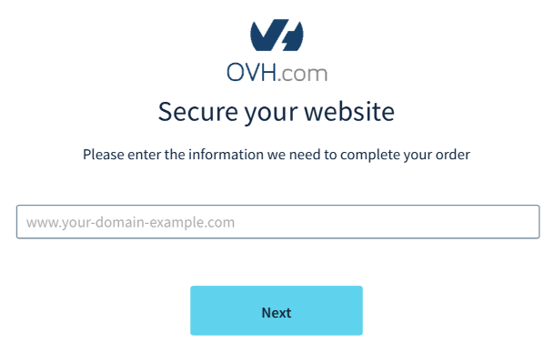

**Ultimo aggiornamento: 01/12/2022**

## Informazioni generali

### Prerequisiti

> [!primary]
>
> - 
> Un dominio o sottodominio attivo.
> - 
> Accesso alla zona DNS del dominio o sottodominio.
> 
> 

## Effettua lordine
- Per ordinare la soluzione SSL Gateway, accedi a [questa pagina](https://www.ovh.it/ssl-gateway/){.external}.
- Scegli l’offerta e clicca su `Attivalo subito`{.action} o `Ordina`{.action}.

{.thumbnail}

- Inserisci il tuo dominio o sottodominio attivo e clicca su `Seguente`{.action}.

{.thumbnail}

> [!warning]
>
> - 
> Offerta Free:
> 
> Disponibile solo per i domini fino al 3° livello (www.example.org).
> - 
> Offerte Advanced e Enterprise:
> 
> Disponibili per i domini di 4° livello (blog.italia.example.org) e superiori.
> 

A questo punto il nostro sistema rileverà automaticamente il o gli indirizzi IP del tuo sito configurati sul dominio o sottodominio.

- Se disponi di più IP, selezionane uno.
- Scegli la zona geografica del tuo servizio SSL Gateway.
- Se la zona DNS del dominio o sottodominio è gestita dal tuo account OVHcloud, seleziona la casella corrispondente per autorizzarci a modificare la configurazione per impostare il puntamento verso il tuo SSL Gateway.
- Clicca su `Ordina`{.action}.

{.thumbnail}

> [!primary]
>
> Se disponi di più indirizzi IP per il tuo sito, dovrai sceglierne solo uno per ordine.
> Se hai attivato l’offerta Advanced, in un secondo momento potrai aggiungere fino a 2 IP supplementari tramite lo Spazio Cliente OVHcloud.
> 

- Segui gli step e conferma il tuo ordine.

## Configura la tua zona DNS
Se non hai selezionato l’opzione relativa alla modifica automatica, una volta confermato l’ordine ricevi un’email in cui ti viene chiesto di impostare entro 3 giorni il puntamento del tuo dominio o sottodominio verso l’infrastruttura OVHcloud.

> [!warning]
>
> Se non apporti le modifiche alla tua zona DNS entro questo termine, il tuo ordine verrà annullato.
> 

- 

> [!faq]
>
> Caso 1: la tua zona DNS è gestita dai server DNS condivisi OVHcloud.
>> 
>>     - Se il tuo identificativo è contatto amministratore o tecnico della zona DNS, potrai modificarla dallo Spazio Cliente OVHcloud.
>>     - Se non sei contatto amministratore o tecnico della zona DNS, per modificarla dovrai rivolgerti alla persona autorizzata.

>> 
>> > [!primary]
>> >
>> > Guida disponibile:
>> > - 
>> > Gestisci il tuo server DNS.
>> > 
>> > 
>> 
>
- 

> [!faq]
>
> Caso 2: la tua zona DNS non è gestita dai server DNS condivisi OVHcloud.
>> 
>>     - In questo caso, modifica l'IP nella tua zona DNS accedendo all'interfaccia del tuo provider o del tuo server dedicato.
>

Una volta effettuate le operazioni necessarie, riceverai un'altra email con la conferma del completamento della configurazione del servizio.

> [!warning]
>
> La propagazione delle modifiche della tua zona DNS può richiedere fino a 24 ore a causa delle informazioni memorizzate in cache presso i provider Internet.
> 

## Per saperne di più

Per prestazioni specializzate (referenziamento, sviluppo, ecc...), contatta i [partner OVHcloud](https://partner.ovhcloud.com/it/).

Per usufruire di un supporto per l'utilizzo e la configurazione delle soluzioni OVHcloud, è possibile consultare le nostre soluzioni [offerte di supporto](https://www.ovhcloud.com/it/support-levels/).

Contatta la nostra Community di utenti all'indirizzo <https://community.ovh.com>.