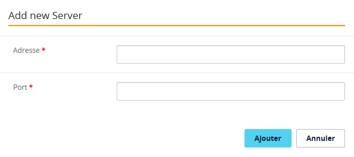
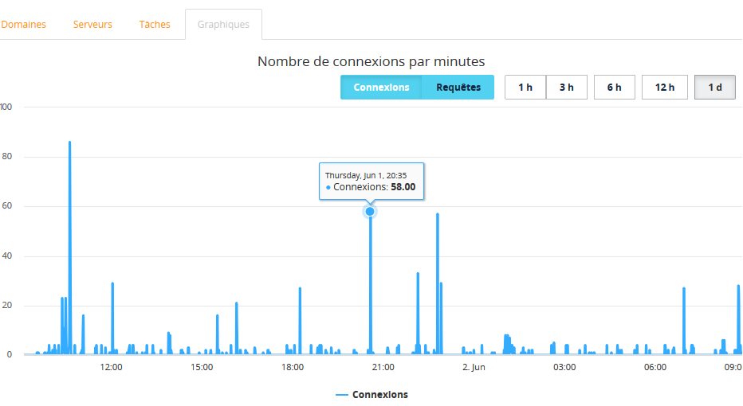

## Informazioni generali

### Prerequisiti

> [!primary]
>
> - Aver ordinato un [SSL Gateway](/pages/web_cloud/ssl_gateway/order-ssl-gateway).
> - Avere accesso allo Spazio Cliente OVHcloud Sunrise.
>

## Utilizzo
Questa guida ti mostra come configurare e rinnovare il tuo servizio SSL Gateway OVHcloud.


### Configurazione del servizio
- Accedi al tuo [Spazio Cliente OVHcloud](https://www.ovh.com/manager){.external}.
- Clicca su `Sunrise`{.action}.

{.thumbnail}

- Clicca su `SSL Gateway`{.action} nel menu a sinistra per visualizzare il servizio.

{.thumbnail}

- Seleziona l’offerta che vuoi configurare.

{.thumbnail}

- Verrai reindirizzato alla pagina di gestione della tua offerta.

{.thumbnail}

- Descrizione delle informazioni:

{.thumbnail}

|||
|---|---|
|IPv4|Indirizzo IPv4 del gateway OVHcloud a cui deve puntare il tuo servizio|
|IPv6|Indirizzo IPv6 del gateway OVHcloud a cui deve puntare il tuo servizio|
|Zona|Zona geografica dell’indirizzo IP del tuo SSL Gateway|
|IPv4 di uscita|Indirizzi IPv4 OVHcloud che si connetteranno al tuo server|
|Offerta|Tipo di offerta sottoscritta|
|Documentazione|Link a questa guida|
|Stato|Stato del tuo SSL Gateway|
|Data di scadenza|Data di scadenza del tuo SSL Gateway|
|Disattiva|Pulsante per richiedere la disattivazione del tuo SSL Gateway|
|Migra all'offerta Advanced|Permette di passare dall’offerta Free all’offerta Advanced|

- Descrizione della configurazione:

{.thumbnail}

|||
|---|---|
|Configurazione|Pulsante che permette di modificare i parametri del tuo servizio SSL Gateway|
|HSTS [[1]](#id5){.note-ref #id1}|Forza il browser a effettuare le prossime connessioni al tuo sito in HTTPS|
|Reverse|Permette di assegnare un host name al tuo indirizzo IP SSL Gateway|
|Reindirizzamento HTTPS [[2]](#id6){.note-ref #id2}|Reindirizza l’utente alla versione HTTPS del tuo sito quando viene effettuato un accesso in HTTP|
|Server HTTPS [[3]](#id7){.note-ref #id3}|Attiva l’HTTPS tra il server SSL Gateway e il tuo server|
|Restrizioni degli IP sorgente|Se questo campo è inserito, solo gli IP e reti specificate potranno connettersi all’SSL Gateway|
|Configurazione dei Ciphers [[4]](#id8){.note-ref #id4}|Permette di scegliere un livello di sicurezza per il tuo certificato SSL/TLS|


> [!primary]
>
> [[1]](#){.note-ref #id5} - ([1](#id1){.fn-backref}) 
> <cite>Maggiori informazioni sull’HSTS</cite>
> 
> [[2]](#){.note-ref #id6} - ([1](#id2){.fn-backref}) 
> <cite>Una volta verificato il corretto funzionamento del tuo sito con il protocollo HTTPS, è possibile reindirizzare tutto il traffico HTTP in HTTPS.
> Dopo aver configurato il puntamento del tuo dominio verso il servizio SSL Gateway è consigliabile attendere 24 ore prima di attivare questo reindirizzamento, in modo che i visitatori del tuo sito utilizzino la nuova configurazione DNS.</cite>
> 
> [[3]](#){.note-ref #id7} - ([1](#id3){.fn-backref}) 
> <cite>Permette di proteggere la connessione end-to-end. Il server SSL Gateway si connetterà al tuo server sulla porta standard dell’HTTPS (443). Attenzione: per abilitare questa opzione è necessario che sul tuo server sia presente un certificato SSL/TLS. In caso contrario, il tuo sito non sarà raggiungibile. Per il corretto funzionamento del servizio non sarà invece necessario rinnovare il certificato.</cite>
> 
> [[4]](#){.note-ref #id8} - ([1](#id4){.fn-backref}) 
> <cite>Il livello più elevato garantirà una protezione maggiore ma potrebbe non funzionare con i browser più datati.</cite>
>

[Maggiori informazioni sui Cipher](https://it.wikipedia.org/wiki/Cipher){.external}


### Configurazione del dominio
Il riquadro successivo include 4 schede:

- **Domini**
- **Server**
- **Operazioni**
- **Grafici**


{.thumbnail}

La scheda **Domini** permette di aggiungere ed eliminare i tuoi domini e sottodomini al servizio SSL Gateway.

- Per aggiungere un dominio o sottodominio, clicca sul pulsante `+ Domini`{.action}.

> [!faq]
>
> Hai attivato un’offerta **Free**
>> 
>> Potrai disporre esclusivamente di un **dominio**, del suo **sottodominio "www"** e di un secondo **sottodominio a tua scelta**:
>> 
>> 
>> > [!primary]
>> >
>> > |||
>> > |---|---|
>> > | Dominio | esempio.com |
>> > | Sottodominio www | www.esempio.com |
>> > | Sottodominio di tua scelta | blog.esempio.com |
>> > 
>> 
>> 
>> > [!warning]
>> >
>> > Offerta Free:
>> > 
>> > Disponibile solo per i domini fino al 3° livello (www.esempio.org).
>> > 
>> 
>> Indica la tua scelta e clicca su `Aggiungi`{.action} per confermare.
>> 
>> {.thumbnail}
>>
>
> Hai attivato un’offerta **Advanced**
>> 
>> Potrai aggiungere qualsiasi dominio o sottodominio attivo
>> 
>> 
>> > [!primary]
>> >
>> > Offerta Advanced:
>> > 
>> > Disponibile per i domini di 4° livello (blog.italia.esempio.org) e superiori.
>> > 
>> 
>> Indica la tua scelta e clicca su `Aggiungi`{.action} per confermare.
>>
>> {.thumbnail}
>>
>


> [!warning]
>
> Per ogni dominio o sottodominio aggiunto, riceverai un’email che ti ricorda di impostare il suo puntamento verso l’IP dell’SSL Gateway entro 3 giorni.
> Questa operazione è necessaria per confermare la generazione del certificato SSL/TLS.
> 


La scheda **Server** permette di gestire gli indirizzi IP dei server che ospitano il tuo sito.

- Clicca su `+ Server`{.action} per aggiungere l’indirizzo IP e la porta del server che ospita il tuo sito.

{.thumbnail}


> [!faq]
>
> Hai attivato un’offerta **Free**
>> 
>> Potrai utilizzare un solo indirizzo IP/PORTA.
>> 
>
> Hai attivato un’offerta **Advanced**
>> 
>> Potrai aggiungere fino a 3 indirizzi IP/PORTE per i tuoi domini e sottodomini.
>> 
>> 
>> > [!primary]
>> >
>> > Se indichi più indirizzi IP/PORTE, il tuo SSL Gateway distribuirà il traffico con il sistema Round Robin.
>> > Maggiori informazioni sul DNS Round Robin
>> > 
>> 
>> Indica la tua scelta e clicca su `Aggiungi`{.action} per confermare.
>> 
>> {.thumbnail}
>>
>


> [!warning]
>
> Al momento non è possibile aggiungere indirizzi IPv6 per i tuoi server.
> Questo tuttavia non rappresenta un problema, perché il tuo dominio o sottodominio può puntare all’SSL Gateway in IPv6.
> L’SSL Gateway si occuperà in seguito di reindirizzare il traffico IPv6 verso l’indirizzo IPv4 del tuo server in totale trasparenza.
> 


La scheda **Operazioni** permette di visualizzare tutte le operazioni in corso sul tuo SSL Gateway.


{.thumbnail}


> [!warning]
>
> Se i nostri sistemi non hanno ancora rilevato il puntamento del tuo dominio o sottodominio verso l’IP dell’SSL Gateway, il certificato SSL/TLS non verrà generato.
> L’accesso sarà comunque possibile in HTTP. In questo caso, visualizzerai il riquadro HTTP nella scheda Record.
> 
> {.thumbnail}
>
La scheda **Grafici** permette di visualizzare il numero di connessioni e di richieste al minuto effettuate sul tuo SSL Gateway.


{.thumbnail}

> [!faq]
>
> Hai attivato un’offerta **Free**
>> 
>> Potrai visualizzare le metriche delle ultime 24 ore.
>> 
>
> Hai attivato un’offerta **Advanced**
>> 
>> Potrai visualizzare le metriche dell’ultimo mese.
>> 
>


## Rinnovo del certificato SSL

### Importante


> [!primary]
>
> Per poter rinnovare il certificato Let’s Encrypt, è necessario che il dominio o sottodominio punti verso l’IP dell’offerta SSL Gateway.
> - In caso contrario, qualora i nostri sistemi rilevino una configurazione non corretta 7 giorni prima della data di scadenza del certificato SSL/TLS, riceverai un’email e avrai 3 giorni per apportare le modifiche necessarie.
> - Se non intervieni entro questo termine, il certificato non verrà rinnovato e sarà necessario rigenerarlo manualmente tramite questo pulsante:
> 
> {.thumbnail}
> 
>

## Suggerimenti

### Correzione dellIP sorgente nei log

#### Descrizione
Quando un cliente visita il tuo sito, si connette in HTTPS sull’SSL Gateway, inoltra la richiesta verso il tuo server dopo averla decifrata e filtrato eventuali attacchi. Tutte le richieste in arrivo sul tuo server provengono quindi dall’SSL Gateway.

Per poter tracciare l’indirizzo del tuo visitatore, l’SSL Gateway aggiunge automaticamente i seguenti header HTTP standard:

- X-Forwarded-For e X-Remote-Ip: indirizzo del cliente
- X-Forwarded-Port e X-Remote-Port: porta sorgente del cliente

Questi campi potrebbero essere sfruttati anche da clienti malevoli e devono quindi essere presi in considerazione solo se le richieste provengono da una sorgente affidabile come l’SSL Gateway. La lista degli IP sorgente utilizzati dall’SSL Gateway è disponibile nel tuo Spazio Cliente OVHcloud Sunrise > Sezione SSL Gateway > Campo “IPv4 di uscita”

Al momento della pubblicazione di questa guida gli indirizzi sono **213.32.4.0/24** e **144.217.9.0/24**, ma in futuro potrebbero aggiungersene altri.

Se supporta queste tipologie di reindirizzamento, il tuo server può essere configurato in modo da riconoscere automaticamente gli indirizzi IP sorgente forniti dall’IP SSL Gateway.


#### Apache
- Crea il file qui sotto:
/etc/apache2/conf-available/remoteip.conf
- Inserisci queste righe:

```bash
# Autorizza gli header X-Forwarded-For da SSL Gateway
# Vedi https://www.ovh.com/manager/sunrise/sslGateway/index.html#/sslGateway per la lista aggiornata degli header IP
RemoteIPHeader X-Forwarded-For
RemoteIPInternalProxy 213.32.4.0/24
```


Sostituisci le variabili %h con %a nelle direttive LogFormat della configurazione di Apache.

- Una volta completata la configurazione, attivala eseguendo questi comandi:

```bash
# Attiva il modulo, poi la configurazione
a2enmod remoteip
a2enconf remoteip

# Riavvia Apache per eseguire il modulo (il reload è sufficiente per la configurazione)
service apache2 restart
```


Per maggiori informazioni su questa funzionalità, consulta la [documentazione ufficiale](https://httpd.apache.org/docs/current/en/mod/mod_remoteip.html){.external} di Apache.


#### Nginx
- Apri il file di configurazione relativo al sito da proteggere. In genere si trova in: `/etc/nginx/sites-enabled`
- Inserisci queste righe nella sezione server:

```bash
# Autorizza gli header X-Forwarded-For da SSL Gateway
# Vedi https://www.ovh.com/manager/sunrise/sslGateway/index.html#/sslGateway per la lista aggiornata degli header IP
set_real_ip_from 213.32.4.0/24;
real_ip_header X-Forwarded-For;
```

Per maggiori informazioni su questa funzionalità, consulta la [documentazione ufficiale](http://nginx.org/en/docs/http/ngx_http_realip_module.html){.external} (in inglese).

## Per saperne di più

Per prestazioni specializzate (referenziamento, sviluppo, ecc...), contatta i [partner OVHcloud](https://partner.ovhcloud.com/it/).

Per usufruire di un supporto per l'utilizzo e la configurazione delle soluzioni OVHcloud, è possibile consultare le nostre soluzioni [offerte di supporto](https://www.ovhcloud.com/it/support-levels/).

Contatta la nostra Community di utenti all'indirizzo <https://community.ovh.com>.