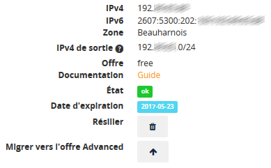
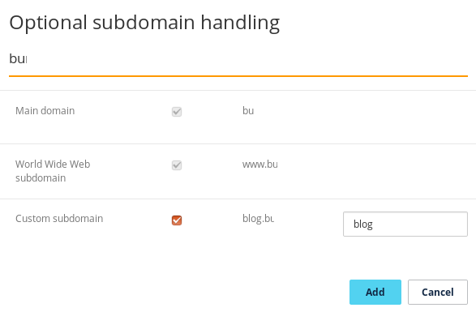

**Ostatnia aktualizacja z dnia 01-12-2022**

## Wprowadzenie

### Wymagania


> [!primary]
>
> - Zamówienie usługi [SSL Gateway](/pages/web_cloud/ssl_gateway/order-ssl-gateway).
> - Dostęp do Panelu klienta Sunrise.
>

## W praktyce
Zobaczymy teraz, jak korzystać z usługi SSL Gateway.


### Konfiguracja usługi
- Zaloguj się do [Panelu klienta](https://www.ovh.com/manager){.external}.
- Kliknij na zakładkę `Sunrise`{.action}.

{.thumbnail}

- Następnie kliknij na `SSL Gateway`{.action}, aby wyświetlić informacje o usłudze.

{.thumbnail}

- Wybierz usługę, którą chcesz skonfigurować.

{.thumbnail}

- Pojawi się strona do zarządzania usługą.

{.thumbnail}

- Opis informacji

{.thumbnail}

|Pole|Opis|
|---|---|
|IPv4|Adres IPv4 bramy OVHcloud, na który powinieneś wskazywać.|
|IPv6|Adres IPv6 bramy OVHcloud, na który powinieneś wskazywać.|
|Strefa|Geograficzna strefa adresu IP usługi SSL Gateway|
|IPv4 wyjściowe|Adresy IPv4 OVHcloud, które będą się łączyć z Twoim serwerem|
|Oferta|Typ zamówionej oferty|
|Dokumentacja|Link do przewodników|
|Status|Status usługi SSL Gateway|
|Data wygasania|Data wygasania usługi SSL Gateway|
|Rezygnacja|Przycisk rezygnacji z usługi SSL Gateway|
|Migracja na ofertę Advanced|Pozwala na przejście z oferty Free na ofertę Advanced|

- Opis konfiguracji

{.thumbnail}

|Pole|Opis|
|---|---|
|Konfiguracja|Przycisk pozwalający na zmianę konfiguracji usługi SSL Gateway|
|HSTS [[1]]|Wymusza na przeglądarce wykonywanie kolejnych połączeń z Twoją stroną przez HTTPS|
|Rewers|Pozwala na nadanie nazwy hosta adresowi IP SSL Gateway|
|Przekierowanie HTTPS [[2]]|Przekierowuje osobę odwiedzającą na wersję HTTPS Twojej strony, gdy ma ona dostęp przez HTTP|
|Serwer HTTPS [[3]]|Uruchamia HTTPS między serwerem SSL Gateway i Twoim serwerem|
|Ograniczenia IP źródłowych|Jeśli to pole jest wypełnione, tylko wskazane IP lub sieci będą mogły łączyć się z SSL Gateway|
|Konfiguracja ciphers [[4]]|Pozwala na wybranie poziomu bezpieczeństwa dla Twojego certyfikatu SSL/TLS|


> [!primary]
>
> [[1]] Więcej informacji na temat HSTS</cite>
> 
> [[2]] Po sprawdzeniu prawidłowego działania Twojej strony z protokołem HTTPS, można przekierować cały ruch HTTP na HTTPS. Zaleca się poczekać 24 godziny po przekierowaniu domeny na usługę SSL Gateway zanim wykona się to przekierowanie. Dzięki temu osoby odwiedzające Twoją stronę będą korzystać z nowej działającej konfiguracji DNS.
> 
> [[3]] Pozwala na zabezpieczenie całego połączenia. Serwer SSL Gateway połączy się z Twoim serwerem na standardowym dla HTTPS porcie 443. Uwaga: Należy obowiązkowo dysponować certyfikatem SSL/TLS na serwerze, aby włączyć tę opcję. W przeciwnym razie Twoja strona nie będzie działać. Certyfikat ten nie musi być odnawiany na Twoim serwerze.
> 
> [[4]] Najwyższy poziom zapewnia najlepszą ochronę, ale może nie działać z najstarszymi przeglądarkami.</cite>
>


### Konfiguracja domeny
Kolejny blok zawiera 4 zakładki:

- **Domeny**
- **Serwery**
- **Zadania**
- **Wykresy**


{.thumbnail}

Zakładka **"Domeny"** pozwala na dodawanie i usuwanie domen oraz subdomen z usługi SSL Gateway.

- Kliknij na `Dodaj domenę`{.action}, aby dodać domenę lub subdomenę.

> [!faq]
>
> Posiadasz ofertę **"Free"**
>> 
>> Będziesz mógł dodać tylko jedną **domenę**, jak również jej **subdomenę "www"** i drugą **wybraną subdomenę**:
>> 
>> > [!primary]
>> >
>> > |Domena|example.com|
>> > |Subdomena www|www.example.com|
>> > |Wybrana subdomena|blog.example.com|
>> > 
>> 
>> 
>> > [!warning]
>> >
>> > - Oferta Free:
>> > 
>> > Można podać wyłącznie domeny do 3 poziomu (www.example.org).
>> > 
>> 
>> - Dokonaj wyboru i kliknij na `Dodaj`{.action}.
>> 
>> {.thumbnail}
>
> Posiadasz ofertę **"Advanced"**
>> 
>> Będziesz mógł dodać wybrane aktywne domeny i subdomeny.
>> 
>> 
>> > [!primary]
>> >
>> > - Oferta Advanced:
>> > 
>> > Można podać domeny 4. i wyższego poziomu (log.france.example.org)
>> > 
>> 
>> - Dokonaj wyboru i kliknij na `Dodaj`{.action}.
>> 
>> {.thumbnail}
>>
>


> [!warning]
>
> W przypadku dodania domeny lub subdomeny otrzymasz e-mail z informacjami o IP SSL Gateway i o wymogu wykonania przekierowania w ciągu 3 dni.
> Operacja ta jest niezbędna do zatwierdzenia utworzenia certyfikatu SSL/TLS.
> 


Zakładka **"Serwery"** pozwala na zarządzanie adresem lub adresami IP serwera (lub serwerów), na którym zainstalowana jest Twoja strona.

- Kliknij na `Dodaj serwer`{.action}, aby dodać adres IP oraz port odnoszące się do serwera, na którym zainstalowana jest Twoja strona.

{.thumbnail}

> [!faq]
>
> Posiadasz ofertę **"Free"**
>> 
>> Dysponujesz jednym adresem IP/PORT.
>> 
>> 
>
> Posiadasz ofertę **"Advanced"**
>> 
>> Będziesz mógł dodać do 3 adresów IP/PORT dla swoich domen i subdomen.
>> 
>> 
>> > [!primary]
>> >
>> > Jeśli podasz kilka adresów IP/PORT, usługa SSL Gateway rozdzieli ruch za pomocą systemu Round Robin.
>> > Więcej informacji na temat DNS Round Robin
>> > 
>> 
>>  - Dokonaj wyboru i kliknij na `Dodaj`{.action}.
>> 
>> {.thumbnail}
>> 
>


> [!warning]
>
> Aktualnie nie można dodawać adresów IPv6 na serwerach.
> Twoja domena lub subdomena może wskazywać na usługę SSL Gateway za pomocą IPv6.
> Usługa SSL Gateway zajmie się transparentnym przełączeniem ruchu IPv6 na adres IPv4 Twojego serwera.
> 


Zakładka **"Zadania"** pozwala na wyświetlenie operacji w trakcie na Twojej usłudze SSL Gateway.


{.thumbnail}


> [!warning]
>
> Jeśli nie wykryjemy przekierowania Twojej domeny lub subdomeny na IP SSL Gateway, certyfikat SSL/TLS nie zostanie utworzony.
> Nadal będzie możliwy dostęp przez "HTTP". Oznaczenie "HTTP" będzie widoczne w tym przypadku w zakładce "Wpisy".
> 
> {.thumbnail}
>

Zakładka **"Wykresy"** pozwala na wyświetlenie liczby połączeń i zapytań na minutę wykonywanych w ramach usługi SSL Gateway.


{.thumbnail}


> [!faq]
>
> Posiadasz ofertę **"Free"**
>> 
>> Będziesz mógł wyświetlić metryki z 24 godzin.
>> 
>
> Posiadasz ofertę **"Advanced"**
>> 
>> Będziesz mógł wyświetlić metryki z 1 miesiąca.
>> 
>


## Odnowienie certyfikatu SSL

### Uwaga


> [!primary]
>
> Aby móc odnowić certyfikat Let’s Encrypt, domena lub subdomena musi wskazywać na IP usługi SSL Gateway.
> - Jeśli jest inaczej i nasze roboty wykryją to 7 dni przed datą odnowienia certyfikatu SSL/TLS, otrzymasz e-mail i będziesz mieć 3 dni na wykonanie tej operacji.
> - Jeśli po 3 dniach operacja ta nie zostanie wykonana, certyfikat nie zostanie odnowiony i będziesz musiał wygenerować go ręcznie za pomocą tego przycisku:
> 
> {.thumbnail}
> 
>

## Ważne informacje

### Poprawienie IP źródłowego w Logach

#### Prezentacja
Gdy użytkownik odwiedza Twoją stronę, łączy się z SSL Gateway w HTTPS, a następnie SSL Gateway kontynuuje zapytanie do Twojego serwera, po odszyfrowaniu i przefiltrowaniu ataków. Wszystkie zapytania do Twojego serwera pochodzą więc z SSL Gateway.

Aby wskazać Ci adres osoby odwiedzającej, SSL Gateway automatycznie dodaje standardowe nagłówki HTTP:

- X-Forwarded-For i X-Remote-Ip: Adres użytkownika widziany przez SSL Gateway.
- X-Forwarded-Port i X-Remote-Port: Port źródłowy użytkownika widziany przez SSL Gateway.

Pola te mogą zostać sfałszowane przez użytkownika o nielegalnych zamiarach. Powinny być brane pod uwagę te, które pochodzą ze sprawdzonego źródła, jakim jest SSL Gateway. Lista IP źródłowych używanych przez SSL Gateway znajduje się w:

- Panelu klienta Sunrise
- W zakładce SSL Gateway
- W polu "IPv4 wyjściowe"

W momencie przygotowywania tego przewodnika adresy te to **213.32.4.0/24** i **144.217.9.0/24**. W przyszłości mogą zostać dodane inne adresy.

Jeśli Twój serwer ma taką opcję, może on zostać skonfigurowany do automatycznego rejestrowania tej informacji zamiast IP usługi SSL Gateway.


#### Apache
- Utwórz poniższy plik:
/etc/apache2/conf-available/remoteip.conf
- Wprowadź następujące linie:

```bash
# Trust X-Forwarded-For headers from the SSL Gateway
# See https://www.ovh.com/manager/sunrise/sslGateway/index.html#/sslGateway for an up to date list
RemoteIPHeader X-Forwarded-For
RemoteIPInternalProxy 213.32.4.0/24
```


Możesz teraz zmienić zmienne %h na %a w dyrektywach LogFormat w konfiguracji oprogramowania Apache.

- Gdy konfiguracja jest gotowa, wystarczy ją włączyć za pomocą poniższych poleceń:

```bash
# Włącz moduł i konfigurację.
a2enmod remoteip
a2enconf remoteip

# Zrestartuj Apache’a, aby wprowadzić zmiany na poziomu modułu i konfiguracji.
service apache2 restart
```


Więcej informacji na temat tej funkcjonalności oprogramowania Apache odnajdziesz w [oficjalnej dokumentacji](https://httpd.apache.org/docs/current/en/mod/mod_remoteip.html){.external}.


#### Nginx
- Otwórz plik konfiguracyjny strony, którą chcesz zabezpieczyć. Zazwyczaj znajduje się on w:
/etc/nginx/sites-enabled
- Wprowadź poniższe linie w sekcji server:

```bash
# Trust X-Forwarded-For headers from the SSL Gateway
# See https://www.ovh.com/manager/sunrise/sslGateway/index.html#/sslGateway for an up to date list
set_real_ip_from 213.32.4.0/24;
real_ip_header X-Forwarded-For;
```


Więcej informacji na temat tej funkcjonalności w oprogramowaniu Nginx odnajdziesz w [oficjalnej dokumentacji](http://nginx.org/en/docs/http/ngx_http_realip_module.html){.external}.

## Sprawdź również

W przypadku wyspecjalizowanych usług (pozycjonowanie, rozwój, etc.) skontaktuj się z [partnerami OVHcloud](https://partner.ovhcloud.com/pl/).

Jeśli chcesz otrzymywać wsparcie w zakresie konfiguracji i użytkowania Twoich rozwiązań OVHcloud, zapoznaj się z naszymi [ofertami pomocy](https://www.ovhcloud.com/pl/support-levels/).

Dołącz do społeczności naszych użytkowników na stronie <https://community.ovh.com/en/>. 
