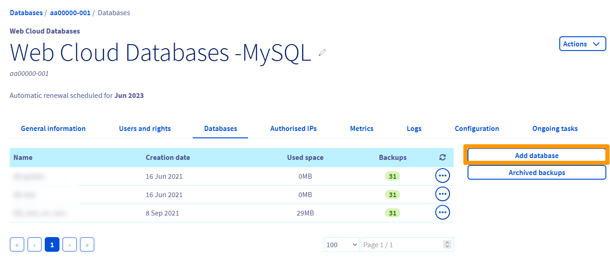

> [!primary]
> Diese Übersetzung wurde durch unseren Partner SYSTRAN automatisch erstellt. In manchen Fällen können ungenaue Formulierungen verwendet worden sein, z.B. bei der Beschriftung von Schaltflächen oder technischen Details. Bitte ziehen Sie im Zweifelsfall die englische oder französische Fassung der Anleitung zu Rate. Möchten Sie mithelfen, diese Übersetzung zu verbessern? Dann nutzen Sie dazu bitte den Button "Beitragen" auf dieser Seite.
>

## Ziel

In einer Datenbank (DB) können sogenannte dynamische Elemente, wie zum Beispiel Kommentare oder Artikel, gespeichert werden. Diese Datenbanken werden heute von praktisch allen Content Management Systemen (CMS) wie WordPress oder Joomla! verwendet.

**Diese Anleitung erklärt, wie Sie eine Datenbank auf Ihrem Datenbankserver erstellen und Benutzern Zugriff gewähren.**

## Voraussetzungen

- Sie verfügen über eine [Web Cloud Databases Instanz](https://www.ovh.de/cloud/cloud-databases/){.external} (auch in einem [Performance Web Hosting](https://www.ovhcloud.com/de/web-hosting/) Angebot enthalten).
- Sie haben Zugriff auf Ihr [OVHcloud Kundencenter](https://www.ovh.com/auth/?action=gotomanager&from=https://www.ovh.de/&ovhSubsidiary=de).

## In der praktischen Anwendung

### Datenbank erstellen

Loggen Sie sich in Ihr [OVHcloud Kundencenter](https://www.ovh.com/auth/?action=gotomanager&from=https://www.ovh.de/&ovhSubsidiary=de) ein und klicken Sie im Bereich `Web Cloud`{.action} auf `Web Cloud Databases`{.action}. Wählen Sie den Datenbanknamen aus, wechseln Sie zum Tab `Datenbanken`{.action} und klicken Sie dann auf `Datenbank hinzufügen`{.action}.

{.thumbnail}

Füllen Sie die Felder gemäß den angegebenen Kriterien ein. Sie können direkt einen Benutzer erstellen, indem Sie **Benutzer erstellen** anhaken.

- **Name der Datenbank** (Pflichtfeld): Dies ist der Name Ihrer zukünftigen Datenbank.
- **Benutzername**: Geben Sie hier den Namen des Benutzers ein, der sich mit Ihrer Datenbank verbinden und Anfragen ausführen kann (nur relevant, wenn bei **Benutzer erstellen** ein Haken gesetzt wird).
- **Rechte** (nur, wenn das Feld angehakt wurde): Hier handelt es sich um die Benutzerrechte, die dem Benutzer der Datenbank gewährt werden. Für eine standardmäßige Verwendung wählen Sie `Administrator`{.action} aus. Berechtigungen können im Nachhinein verändert werden.
- **Passwort**/**Passwort bestätigen** (nur, wenn das Feld angehakt wurde): Geben Sie das gewünschte Passwort ein und bestätigen Sie es anschließend durch erneute Eingabe.

Klicken Sie dann auf `Bestätigen`{.action}.

{.thumbnail}

### Benutzer erstellen

Um einen Datenbankserver von OVHcloud zu verwenden, müssen Benutzer mit spezifischen Rechten für die Verbindung mit einer Datenbank erstellt werden. 

Loggen Sie sich in Ihr [OVHcloud Kundencenter](https://www.ovh.com/auth/?action=gotomanager&from=https://www.ovh.de/&ovhSubsidiary=de) ein und klicken Sie im Bereich `Web Cloud`{.action} auf `Web Cloud Databases`{.action}. Wählen Sie den Datenbanknamen aus, wechseln Sie zum Tab `Benutzer und Rechte`{.action} und klicken Sie dann auf `Einen Benutzer hinzufügen`{.action}.

{.thumbnail}

Geben Sie einen "Benutzernamen" und ein "Passwort" ein und klicken Sie anschließend auf `Bestätigen`{.action}. 

### Verwaltung der Benutzerrechte

Um einem Benutzer die Durchführung von Aktionen auf einer Datenbank zu ermöglichen, müssen ihm Rechte zugewiesen werden.

Um die Rechte jedes Benutzers zu verwalten, loggen Sie sich in Ihr [OVHcloud Kundencenter](https://www.ovh.com/auth/?action=gotomanager&from=https://www.ovh.de/&ovhSubsidiary=de) ein und klicken Sie im Bereich `Web Cloud`{.action} auf `Web Cloud Databases`{.action}. Wählen Sie den Datenbanknamen aus und wechseln Sie zum Tab `Benutzer und Rechte`{.action}.

Klicken Sie auf die Schaltfläche `...`{.action} rechts neben dem jeweiligen Benutzer, dann auf `Rechte verwalten`{.action}.

{.thumbnail}

In der linken Spalte **Datenbank** finden Sie die Liste der Datenbanken Ihres Datenbankservers.

Benutzern können die folgenden Berechtigungen erteilt werden:

- `Administrator`: Freigabe von Anfragen des Typs: **Select / Insert / Update / Delete / Create / Alter / Drop**.
- `Lesen/Schreiben`: Freigabe von Anfragen des Typs: **Select / Insert / Update / Delete**.
- `Lesen`: Freigabe von Anfragen des Typs: **Select**.
- `Keine`: Keine Rechte auf der Datenbank.

> [!primary]
> 
> Die Segmentierung der oben genannten Rechte ist OVHcloud vorbehalten. So kann ein Benutzer mit der `Administrator`-Berechtigung **DLL** (Data Definition Language) und **DML** (Data Manipulation Language) verwenden, während ein Benutzer mit der Berechtigung `Lesen/Schreiben` nur **DLL** nutzen kann.
>

{.thumbnail}

#### Eine Datenbank löschen

> [!warning]
>
> Beim Löschen einer Datenbank auf einem Datenbankserver findet keine Überprüfung der Datenbank statt. Diese wird daher auch dann gelöscht, wenn
> Inhalte existieren. Daher wird empfohlen, vor jeder Löschung ein Backup zu erstellen und ggf. auch eine lokale Sicherung herunterzuladen.
> 

Um die Rechte jedes Benutzers zu verwalten, loggen Sie sich in Ihr [OVHcloud Kundencenter](https://www.ovh.com/auth/?action=gotomanager&from=https://www.ovh.de/&ovhSubsidiary=de) ein und klicken Sie im Bereich `Web Cloud`{.action} auf `Web Cloud Databases`{.action}. Wählen Sie den Datenbanknamen aus und wechseln Sie zum Tab `Datenbanken`{.action}.

Um eine Datenbank auf Ihrem Datenbankserver zu löschen, klicken Sie auf `...`{.action} rechts neben der betreffenden Datenbank und anschließend auf `Die Datenbank löschen`{.action}.

{.thumbnail}

## Weiterführende Informationen

Kontaktieren Sie für spezialisierte Dienstleistungen (SEO, Web-Entwicklung etc.) die [OVHcloud Partner](https://partner.ovhcloud.com/de/directory/).

Wenn Sie Hilfe bei der Nutzung und Konfiguration Ihrer OVHcloud Lösungen benötigen, beachten Sie unsere [Support-Angebote](https://www.ovhcloud.com/de/support-levels/).

Für den Austausch mit unserer User Community gehen Sie auf <https://community.ovh.com/en/>.
