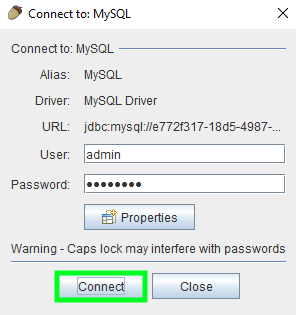

> [!primary]
> Esta tradução foi automaticamente gerada pelo nosso parceiro SYSTRAN. Em certos casos, poderão ocorrer formulações imprecisas, como por exemplo nomes de botões ou detalhes técnicos. Recomendamos que consulte a versão inglesa ou francesa do manual, caso tenha alguma dúvida. Se nos quiser ajudar a melhorar esta tradução, clique em "Contribuir" nesta página.
>

## Objetivo

Deseja utilizar MySQL ou MariaDB para as suas bases de dados?

### O que e uma base de dados MYSQL?

O MYSQL é um sistema de gestão de bases de dados relacionais desenvolvido para performances elevadas em escrita, ao contrário de outros sistemas.

Este motor é open source, e a sua case mãe é nada mais nada menos que a Oracle.

### O que e uma base de dados MariaDB ?

A MariaDB é uma derivação (fork) do sistema de gestão de bases de dados MySQL.

Este motor é 100% compatível, e é mais "livre" que o seu irmão mais velho MySQL. Todos os bugs e roadmaps estão acessíveis gratuitamente, ao contrário da versão da Oracle.

**Descubra como criar e gerir as suas bases de dados MySQL ou MariaDB**

## Pre-requisitos

- Dispor de uma [instância Web Cloud Databases](https://www.ovhcloud.com/pt/web-cloud/databases/){.external} (incluída numa oferta de [alojamento web performance](https://www.ovhcloud.com/pt/web-hosting/)
- Ter acesso à [Área de Cliente OVHcloud](https://www.ovh.com/auth/?action=gotomanager&from=https://www.ovh.pt/&ovhSubsidiary=pt)
- Consultar o [guia de arranque do Web Cloud Databases](/pages/web_cloud/web_cloud_databases/starting_with_clouddb)

## Instruções

### Ligacao a base de dados

> [!primary]
>
> Há que ter em consideração que esta oferta não dá acesso ao Host, mas sim às bases de dados alojadas. Os comandos SQL genéricos funcionam sem qualquer problema, e os softwares do tipo HeidiSQL ou SQuirreL SQL são perfeitamente compatíveis.
> 

> [!primary]
>
> MariaDB sendo um derivado do MySQL, os diferentes comandos são exatamente os mesmos para estes 2 tipos de bases de dados.
> 

De forma a poder ligar-se à base de dados, assegure-se que:

- Ter o endereço da instância Web Cloud Databases
- Dispor da porta da instância Web Cloud Databases
- Ter o nome de utilizador da instância Web Cloud Databases
- Ter a palavra-passe associada ao utilizador
- Ter o nome da base de dados

Todas estas informações estão disponíveis no seu [Espaço Cliente OVHcloud](https://www.ovh.com/auth/?action=gotomanager&from=https://www.ovh.pt/&ovhSubsidiary=pt).

Temos á sua disposição um guia que será útil: [Web Cloud Databases - primeira utilização](/pages/web_cloud/web_cloud_databases/starting_with_clouddb).

#### Ligacao atraves de linha de comandos

```bash
mysql --host=servidor --user=utilizador --port=port --password=password nome_da_base
```

#### Ligacao em script PHP

```php
1. <?php
2. $db = new PDO('mysql:host=host;port=port;dbname=dbname', 'username', 'password');
3. ?>
```

#### Ligacao a partir de um software (SQuirreL SQL)

- Inicie o SQuirreL SQL e clique em `Aliases`{.action}, e depois em `+`{.action}.

{.thumbnail}

- Preencha os campos em baixo e valide com o botão `OK`{.action} :
    - **Name**: Escolha um nome
    - **Driver**: Escolha `MySQL Driver`
    - **URL**: Indique o endereço do servidor e a porta sob a forma `jdbc:mysql://server:port`
    - **User Name**: Indique o nome do utilizador
    - **Password**: Indique a password

{.thumbnail}

- Valide novamente com o botão `Connect`{.action}.

{.thumbnail}

Está atualmente ligado à sua base de dados:

{.thumbnail}

#### Ligacao atraves do phpMyAdmin

Pode utilizar phpMyAdmin para explorar o conteúdo da sua base de dados. Para isso, instale o phpMyAdmin no seu próprio servidor ou alojamento web. Durante esta instalação, certifique-se de que as informações relativas ao seu servidor Web Cloud Databases e à base de dados pretendida estão configuradas de forma a que o phpMyAdmin possa aceder à mesma.

### Exportar e importar uma base de dados MySQL ou MariaDB

- **Exportar a minha base de dados atraves de linha de comandos**

```bash
mysqldump --host=serveur --user=utilizador --port=port --password=password nom_da_base > nome_da_base.sql
```

- **Importar a minha base de dados atraves de linha de comandos**

```bash
cat nome_da_base.sql | mysql --host=servidor --user=utilizador --port=port --password=password nome_da_base
```

> [!primary]
>
> Em certos casos, é possível que a RAM disponível na instância Web Cloud Databases não permita realizar a exportação ou a importação desejadas. Se for o caso, recomendamos que utilize a ferramenta OVHcloud na Área de Cliente. Consulte a documentação ["Primeiros passos com o serviço Web Cloud Databases"](/pages/web_cloud/web_cloud_databases/starting_with_clouddb) se necessário.
>

## Quer saber mais?

Para serviços especializados (referenciamento, desenvolvimento, etc), contacte os [parceiros OVHcloud](https://partner.ovhcloud.com/pt/directory/).

Se pretender usufruir de uma assistência na utilização e na configuração das suas soluções OVHcloud, consulte as nossas diferentes [ofertas de suporte](https://www.ovhcloud.com/pt/support-levels/).

Fale com nossa comunidade de utilizadores: <https://community.ovh.com/en/>. 