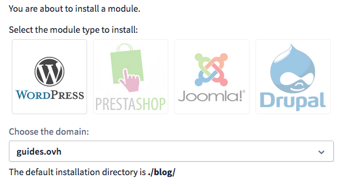
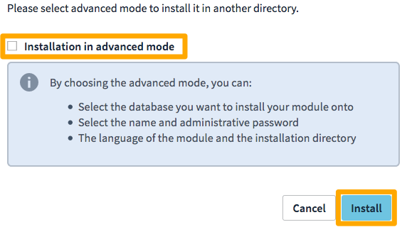
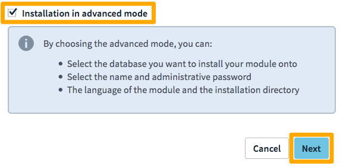
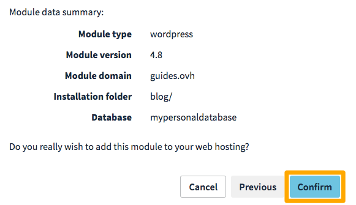

## Objectif

Les « modules en 1 clic » permettent l'installation facile et rapide d'un site web (sans compétences techniques requises). Les « modules en 1 clic » sont en réalité des **C**ontent **M**anagement **S**ystem **(CMS)**. Par ce biais, OVHcloud propose l'installation des CMS les plus connus : *WordPress*, *Joomla!*, *Drupal* et *PrestaShop*.

**Découvrez comment installer votre site via nos « module en 1 clic ».**

<iframe width="560" height="315" src="https://www.youtube.com/embed/ZrYmmPbMl4I?rel=0&amp;showinfo=0" frameborder="0" allow="autoplay; encrypted-media" allowfullscreen></iframe>

## Prérequis

- Disposer d'une offre d'[hébergement web OVHcloud](https://www.ovhcloud.com/fr/web-hosting/) incluant au moins une base de données.
- Être connecté à votre [espace client OVHcloud](https://www.ovh.com/auth/?action=gotomanager&from=https://www.ovh.com/fr/&ovhSubsidiary=fr).
- Utiliser [une version de PHP compatible](/pages/web_cloud/web_hosting/php_configure_php_on_your_web_hosting_2014) sur votre hébergement web OVHcloud.
- Avoir [configuré correctement votre fichier .ovhconfig](/pages/web_cloud/web_hosting/php_configure_php_on_your_web_hosting_2014).
- Le répertoire (dossier racine) où sera installé votre « module en 1 clic » doit être vide ou actuellement inexistant.
- Le domaine (avec sous-domaine si souhaité) qui sera utilisé pour votre site web doit être déclaré en tant que [Multisite](/pages/web_cloud/web_hosting/multisites_configure_multisite) sur votre hébergement web OVHcloud.

## En pratique

### Étape 1 - choisir correctement son CMS

Un CMS permet de concevoir un site web via une interface facile d'utilisation. Plusieurs types de CMS existent, certains sont préconçus par exemple pour réaliser un site de E-commerce, d'autres pour mettre en place un site vitrine, un blog, etc. Vous pourrez ainsi bénéficier d'une structure de site prête à l'emploi et personnalisable (thème, extensions, textes, etc.) à votre convenance.

Parmi tous les CMS, OVHcloud en propose 4 en installation automatique avec ses « modules en 1 clic ». 

En utilisant cette solution, vous devrez choisir parmi les 4 CMS cités plus haut. Si votre choix est déjà fait, poursuivez la lecture des différentes étapes de ce guide. Dans le cas contraire, consultez notre [comparatif des CMS](https://www.ovhcloud.com/fr/web-hosting/uc-cms-comparison/) pour faire votre choix.

Si vous souhaitez installer un CMS indisponible via nos « modules en 1 clic », vous pouvez l'installer manuellement sur votre hébergement. Ceci sous réserve que ce CMS soit compatible avec nos offres d'[hébergement web OVHcloud](https://www.ovhcloud.com/fr/web-hosting/).

{.thumbnail}

### Étape 2 - accéder à la gestion des « modules en 1 clic »

Connectez-vous à votre [espace client OVHcloud](https://www.ovh.com/auth/?action=gotomanager&from=https://www.ovh.com/fr/&ovhSubsidiary=fr) puis sélectionnez `Web Cloud`{.action}. Cliquez sur `Hébergements`{.action}, choisissez l'offre d'hébergement sur laquelle vous souhaitez installer un « module en 1 clic » puis cliquez sur l'onglet `Modules en 1 clic`{.action}.

Vous y retrouverez les éventuels « modules en 1 clic » déjà installés. Vous pourrez y gérer vos « modules en 1 clic » et en installer de nouveaux.

{.thumbnail}

### Étape 3 - ajouter un « module en 1 clic »

Dans l'onglet `Modules en 1 clic`{.action} de votre hébergement, cliquez sur le bouton `Ajouter un module`{.action} pour ajouter un nouveau « module en 1 clic ».

Dans la fenêtre qui s'affiche, choisissez le CMS souhaité puis sélectionnez le domaine avec lequel vous désirez installer votre site web :

{.thumbnail}

Si votre domaine n'est pas dans la liste, rendez-vous dans l'onglet `Multisite`{.action} pour l'ajouter. Consultez notre guide [Comment partager mon hébergement web entre plusieurs sites](/pages/web_cloud/web_hosting/multisites_configure_multisite) si besoin.

Une fois votre domaine correctement ajouté, essayez à nouveau d'ajouter un « module en 1 clic ».

Une fois le CMS sélectionné, choisissez entre une installation **rapide** ou **avancée** :

- Installation  **rapide** (sélectionnée par défaut) : OVHcloud réalise l'installation du CMS et vous communique vos identifiants pour l'administrer par e-mail sur votre adresse e-mail de contact OVHcloud. Il s'agit de la manière la plus facile et la plus rapide pour installer un « module en 1 clic ».
- Installation **avancée** : elle vous permet de personnaliser la configuration à appliquer pour l'installation du CMS. Vous devrez renseigner toutes les informations nécessaires au bon fonctionnement du CMS : 
    - informations de connexion à votre base de données (serveur, nom d'utilisateur, port, mot de passe, etc.)
    - chemin d'installation dans l'espace de stockage FTP de votre hébergement
    - langue du CMS
    - identifiants administrateur (Nom d'administrateur, mot de passe, adresse e-mail, etc.)

#### Installation rapide d'un « module en 1 clic »

Choisissez le nom de domaine de votre CMS, contrôlez le répertoire cible qui apparaît automatiquement après le choix du nom de domaine puis vérifiez que la case `Installation en mode avancé`{.action} n'est pas cochée. Enfin, cliquez directement sur le bouton `Installer`{.action}.

> [!warning]
>
> Le répertoire d'installation de votre « module en 1 clic » doit être vide et vous devez disposer d'au moins une base de données disponible en création sur votre hébergement web OVHcloud pour que l'installation s'effectue.
>
> Pour une installation rapide, ne créez pas la base de données au préalable, le robot d'installation s'en chargera.
> 

{.thumbnail}

Une fois l'installation terminée, vous recevrez un e-mail contenant les informations de connexion à l'interface administrateur (*back office*) de votre CMS. Connectez-vous à celle-ci pour personnaliser votre site web.

#### Installation avancée d'un « module en 1 clic »

Pour réaliser cette méthode d'installation, assurez-vous que la case `Installation en mode avancé`{.action} est cochée, puis cliquez sur le bouton `Suivant`{.action} :

{.thumbnail}

##### Choisir la base de données

Renseignez les informations de connexion à votre base de données. 

{.thumbnail}

Il existe plusieurs possibilités :

- La base de données est déjà créée sur votre hébergement web: choisissez-la dans le menu déroulant `Sélectionnez la base de données`{.action} puis complétez les informations demandées.
- La base de données n'est pas encore créée sur votre hébergement web : [créez votre base de données incluse avec votre hébergement](/pages/web_cloud/web_hosting/sql_create_database), retournez ensuite jusqu'au menu déroulant `Sélectionnez la base de données`{.action} puis complétez les informations demandées.
- La base de données est [créée sur votre instance Web Cloud Databases](/pages/web_cloud/web_cloud_databases/create-db-and-user-on-db-server) : dans le menu déroulant `Sélectionnez la base de données`{.action}, sélectionnez le choix `Base de données en dehors de votre hébergement web`{.action} et complétez les informations demandées. L'instance et l'hébergement web doivent être hébergés dans le même centre de données (datacentre).
- La base de données est créée sur un autre hébergement Web OVHcloud : dans le menu déroulant `Sélectionnez la base de données`{.action}, sélectionnez le choix `Base de données en dehors de votre hébergement web`{.action} et complétez les informations demandées. La base de données et l'hébergement web doivent être hébergés dans le même centre de données.

Le reste des informations demandées pour la base de données sont les suivantes :

- *Adresse du serveur* : renseignez le nom du serveur de votre base de données, présent dans l'e-mail d'installation ou dans votre espace client OVHcloud. 

> [!primary]
> 
> - Le nom du serveur d'une bases de données incluse avec votre offre d'hébergement Web a généralement cette forme : `NameOfYourDatabase.mysql.db`. 
>
> - Le nom du serveur d'une base de données Web Cloud Databases commence par votre identifiant client OVHcloud et a la forme suivante : `OVHID(without-ovh)-XXX.eu.clouddb.ovh.net` où les **« X »** sont à remplacer par la référence de votre service Web Cloud Databases.
>

- *Nom de la base* : ce nom a été défini lors de la création de la base de données dans l'[espace client OVHcloud](https://www.ovh.com/auth/?action=gotomanager&from=https://www.ovh.com/fr/&ovhSubsidiary=fr).

- *Port* : indiquez systématiquement le numéro **3306** (port par défaut) pour une base de données incluse avec votre hébergement web. Pour une base présente sur une instance Web Cloud Databases, consultez [ce guide](/pages/web_cloud/web_cloud_databases/starting_with_clouddb).

- *Nom d'utilisateur* : il est identique au nom de la base de données si vous utilisez une base de données incluse avec votre hébergement web.
Pour les bases de données créées sur une offre Web Cloud Databases, référez-vous aux informations indiquées dans [ce guide](/pages/web_cloud/web_cloud_databases/starting_with_clouddb).

- *Mot de passe* : il vous a été envoyé par e-mail lors de la création de la base de données. Il est possible que vous l'ayez modifié entre temps.

Une fois les informations complétées, cliquez sur le bouton `Suivant`{.action}.

> [!warning]
>
> Si les informations que vous indiquez sont incorrectes, l'installation n'arrivera pas à son terme. Pour éviter cela, nous vous invitons en premier lieu à tester la connexion à votre base de données.
> 
> Pour récupérer les identifiants de connexion à votre base de données incluse avec votre hébergement web, consultez [ce guide](/pages/web_cloud/web_hosting/sql_create_database).
>
> Pour récupérer les identifiants de connexion à votre base de données créée sur une instance Web Cloud Databases, consultez [ce guide](/pages/web_cloud/web_cloud_databases/starting_with_clouddb).
>

##### Configurer le module

Renseignez les informations suivantes pour la configuration du module :

- *nom ou e-mail de l'administrateur :* identifiant que vous utiliserez pour vous connecter à l'interface d'administration de votre CMS (Back Office).
- *mot de passe :* mot de passe que vous utiliserez pour vous connecter à l'interface d'administration de votre CMS.
- *domaine :* nom de domaine avec lequel vous souhaitez installer votre CMS. Si besoin, consultez notre guide [Comment partager mon hébergement web entre plusieurs sites](/pages/web_cloud/web_hosting/multisites_configure_multisite).
- *langue :* langue dans laquelle le CMS sera installé.
- *chemin d’installation :* ce dernier est automatiquement renseigné à la sélection du nom de domaine. Vous pouvez le compléter en y renseignant des sous-répertoires (pour les utilisateurs avertis).

Une fois ces informations complétées, cliquez sur le bouton `Suivant`{.action} :

> [!warning]
>
> Le dossier final indiqué dans le chemin d'installation renseigné doit être obligatoirement et entièrement vide pour que l'installation aboutisse.
> 

{.thumbnail}

##### Confirmer l'installation

Vérifiez les informations affichées puis cliquez sur `Valider`{.action} si tout est en ordre :

{.thumbnail}

### Étape 4 - personnaliser mon site

L'installation peut prendre une dizaine de minutes.

Une fois terminée, vous recevrez un e-mail confirmant la bonne installation du CMS. Cet e-mail vous invitera à vous connecter à l'interface d'administration de votre CMS. Vous pourrez ainsi modifier le thème de votre site web et y publier vos premiers contenus.

> [!warning]
>
> Le support OVHcloud n'effectue pas d'accompagnement sur l'utilisation des CMS. Nous les proposons uniquement en installation **en 1 clic**.
>

Si vous désirez obtenir de l'aide concernant les fonctionnalités de votre CMS, rapprochez-vous de l'éditeur du CMS que vous avez installé. Vous trouverez auprès de ce dernier de la documentation pour vous accompagner dans votre projet.

|CMS|Documentation officielle|
|---|---|
|WordPress|[Premiers pas avec WordPress](https://codex.wordpress.org/fr:Premiers_pas_avec_WordPress){.external}|
|PrestaShop|[Documentation en français PrestaShop](http://doc.prestashop.com/pages/viewpage.action?pageId=2424836){.external}|
|Joomla|[Infos techniques Joomla](https://www.joomla.fr/actualites/infos-techniques){.external}|
|Drupal|[Bien démarrer avec Drupal](https://www.drupal.fr/documentation/bien-demarrer-drupal){.external}|

## Aller plus loin

[Choisir un CMS pour créer un site web](https://www.ovhcloud.com/fr/web-hosting/uc-cms-comparison/){.external}

[Comment partager mon hébergement Web entre plusieurs sites](/pages/web_cloud/web_hosting/multisites_configure_multisite){.external}

[Gestion d’une base de données depuis un hébergement mutualisé](/pages/web_cloud/web_hosting/sql_create_database){.external}

Découvrez nos [offres Web Cloud Databases](https://www.ovh.com/fr/cloud/cloud-databases/){.external}

[Gérer votre CMS](/pages/web_cloud/web_hosting/cms_manage_1_click_module)

[Désinstaller votre CMS](/pages/web/hosting/cms_manage_1_click_module#etape-3-supprimer-votre-module)

Pour des prestations spécialisées (référencement, développement, etc), contactez les [partenaires OVHcloud](https://partner.ovhcloud.com/fr/directory/).

Si vous souhaitez bénéficier d'une assistance à l'usage et à la configuration de vos solutions OVHcloud, nous vous proposons de consulter nos différentes [offres de support](https://www.ovhcloud.com/fr/support-levels/).

Échangez avec notre communauté d'utilisateurs sur <https://community.ovh.com>.
