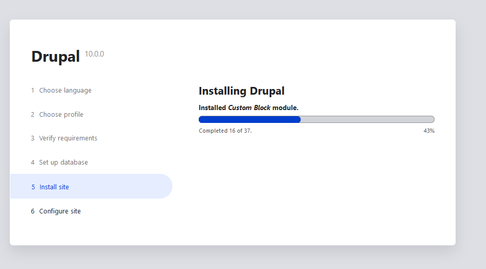

**Ostatnia aktualizacja z dnia 07-04-2023**

> [!primary]
> Tłumaczenie zostało wygenerowane automatycznie przez system naszego partnera SYSTRAN. W niektórych przypadkach mogą wystąpić nieprecyzyjne sformułowania, na przykład w tłumaczeniu nazw przycisków lub szczegółów technicznych. W przypadku jakichkolwiek wątpliwości zalecamy zapoznanie się z angielską/francuską wersją przewodnika. Jeśli chcesz przyczynić się do ulepszenia tłumaczenia, kliknij przycisk "Zgłóś propozycję modyfikacji" na tej stronie.
>
  
## Wprowadzenie

Tutaj znajdziesz wszystkie elementy, które pozwolą Ci ręcznie zainstalować CMS (Content Management System) Drupal.

> [!warning]
>
> OVHcloud oddaje do Twojej dyspozycji usługi, których konfiguracja, zarządzanie i odpowiedzialność spoczywają na Ciebie. W związku z tym należy zapewnić ich prawidłowe funkcjonowanie.
> 
> Oddajemy do Twojej dyspozycji niniejszy tutorial, którego celem jest pomoc w jak najlepszym wykonywaniu bieżących zadań. W przypadku trudności zalecamy skorzystanie z pomocy [wyspecjalizowanego usługodawcy](https://partner.ovhcloud.com/pl/directory/) lub [producenta CMS Drupal](https://www.drupal.org/support){.external}. Niestety firma OVHcloud nie będzie mogła udzielić wsparcia w tym zakresie. Więcej informacji znajduje się w sekcji ["Sprawdź również"](#go-further) niniejszego tutoriala.
>

> [!success]
>
> Aby zainstalować Drupal **automatycznie** z poziomu [Panelu klienta OVHcloud](https://www.ovh.com/auth/?action=gotomanager&from=https://www.ovh.pl/&ovhSubsidiary=pl), zapoznaj się z naszą dokumentacją dotyczącą [instalacji modułu za pomocą jednego kliknięcia](/pages/web_cloud/web_hosting/cms_install_1_click_modules).
>
> Aby zainstalować **ręcznie inny CMS** (WordPress, Joomla!, PrestaShop), zapoznaj się z naszą dokumentacją dotyczącą [ręczna instalacja CMS](/pages/web_cloud/web_hosting/cms_manual_installation).
>

**Dowiedz się, jak ręcznie zainstalować CMS Drupal**
  
## Wymagania początkowe

- Posiadanie oferty [hostingu](https://www.ovhcloud.com/pl/web-hosting/), która zawiera co najmniej jedną bazę danych.
- Posiadanie [domeny](https://www.ovhcloud.com/pl/domains/)
- Dostęp do [Panelu klienta OVHcloud](https://www.ovh.com/auth/?action=gotomanager&from=https://www.ovh.pl/&ovhSubsidiary=pl){.external}
  
## W praktyce

### Etap 1 - przygotowanie instalacji 

Aby zainstalować CMS **Drupal** na Twoim [hostingu](https://www.ovhcloud.com/pl/web-hosting/), potrzebne są jakieś przygotowania.

Postępuj zgodnie z **wszystkie etapy** opisane w tutorialu dotyczącym [Ręczna instalacja CMS](/pages/web_cloud/web_hosting/cms_manual_installation) i przejdź do etapu 2 poniżej.

### Etap 2 - zakończenie ręcznej instalacji 

> [!success]
>
> Przed kontynuowaniem instalacji, usuń cache przeglądarki internetowej, aby uniknąć błędów.
>

#### 2.1 - Przejście na stronę Drupal przy użyciu przeglądarki

Wpisz nazwę domeny na pasku wyszukiwania przeglądarki internetowej.

Jeśli pliki źródłowe Drupal zostały poprawnie umieszczone w katalogu głównym, wyświetli się strona z listą wyboru języka dla Drupal:

{.thumbnail}

Wybierz język strony i kliknij na `Save and Continue`{.action}.

#### 2.2 - Wybierz typ instalacji

Drupal oferuje kilka poziomów instalacji:

- wersja standardowa (zalecana), 
- wersja minimalna
- wersja prezentacji 

{.thumbnail}

Zalecamy przeprowadzenie instalacji **Standard**. Następnie kliknij polecenie `Save and Continue`{.action}.

#### 2.3 - Powiązanie systemu Drupal z bazą danych

Wpisz wymagane informacje dotyczące bazy danych:

{.thumbnail}

Przygotuj dane dostępowe do bazy danych (w razie potrzeby sprawdź **etap 1.4** w przewodniku dotyczącym [ręczna instalacja CMS](/pages/web_cloud/web_hosting/cms_manual_installation).

- *Database type*: wybierz rodzaj bazy danych spośród zaproponowanych rozwiązań.

- *Database name*: nazwa ta została zdefiniowana podczas tworzenia bazy danych w [Panelu klienta OVHcloud](https://www.ovh.com/auth/?action=gotomanager&from=https://www.ovh.pl/&ovhSubsidiary=pl).

- *Database username*: nazwa bazy danych jest identyczna, jeśli korzystasz z bazy danych zawartej w Twoim hostingu. W przypadku baz danych utworzonych w ramach usługi WWW Cloud Databases, zapoznaj się z informacjami podanymi w przewodniku **etap 1.4** w sprawie [ręczna instalacja CMS](/pages/web_cloud/web_hosting/cms_manual_installation).

- *Database password*: zdefiniowałeś ją podczas tworzenia bazy danych. Możliwe, że zmieniłeś ją w międzyczasie.

Kliknij `Advanced Options`{.action}, aby wyświetlić resztę menu.

- *Host*: wprowadź nazwę serwera Twojej bazy danych, zawartą w e-mailu instalacyjnym lub w Panelu klienta. 

> [!primary]
> 
> - Nazwa serwera bazy danych zawartej w ofercie hostingu WWW ma zazwyczaj taką formę: `NameOfYourDatabase.mysql.db`. 
>
> - Nazwa serwera bazy danych Cloud Databases zaczyna się od Twojego identyfikatora klienta OVHcloud i ma następującą formę: `aa00000-XXX.eu.clouddb.ovh.net`, **"aa00000"** odnosi się do twojego identyfikatora OVHcloud bez **"-ovh"**, a **"X"** należy zastąpić pozostałą częścią odniesienia do usługi Web Cloud Databases.
>

- *Port number*: jeśli korzystasz z bazy danych zawartej w Twoim hostingu OVHcloud, pozostaw domyślną bazę danych **3306**. Jeśli korzystasz z usługi Web Cloud Databases, sprawdź **etap 1.4** tutoriala w panelu [ręczna instalacja CMS](/pages/web_cloud/web_hosting/cms_manual_installation), aby uzyskać poprawny numer portu.

- *Table name prefix*: jeśli instalacja jest wykonywana z nową bazą danych, wprowadź odpowiedni prefiks. Jeśli korzystasz z bazy danych wykorzystywanej już przez inną stronę WWW, sprawdź **etap 1.4** tutoriala w panelu [ręczna instalacja CMS](/pages/web_cloud/web_hosting/cms_manual_installation), aby nie wpisywać prefiksu tabeli używanego już w bazie danych.

Kliknij polecenie `Save and Continue`{.action}.

Jeśli wszystko zostało poprawnie zrealizowane, Drupal zostanie uruchomiony:

{.thumbnail}

#### 2.4 - Skonfiguruj informacje o stronie WWW i dostęp "Administrator"

Po zakończeniu poprzedniego etapu wyświetli się następująca strona:

{.thumbnail}

Wpisz wymagane elementy:

- *Site name*: wprowadź nazwę Twojej przyszłej strony Drupal.

- *Site email address*: wprowadź poprawny adres e-mail, który będzie używany przez Twoją stronę WWW Drupal.

- *Username*: zdefiniuj nazwę użytkownika, aby zalogować się do Twojej przestrzeni administracyjnej Drupal (Back Office).

- *Password* i *Confirm password*: zdefiniuj hasło, które będzie przypisane do Twojej nazwy użytkownika i uzyskaj dostęp do Twojej usługi *Back Office* Drupal.

Następnie przejdź do dołu strony:

{.thumbnail}

- *Email address*: wprowadź Twój adres e-mail. W idealnym przypadku wprowadź ten sam adres, który został wskazany powyżej w formularzu *Adres e-mail strony*.

- *Default country*: wybierz kraj, w którym najczęściej odwiedzana będzie Twoja strona.

- *Default time zone*: wybierz domyślną strefę czasową dla swojej strony www.

Kliknij polecenie `Save and Continue`{.action}.

Jeśli wszystko przebiegło pomyślnie, wyświetli się następna strona:

{.thumbnail}

> [!success]
>
> Instalacja Drupal'a została zakończona. Możesz teraz rozpocząć tworzenie zawartości Twojej strony Drupal!
>
  
## Sprawdź również 

[Oficjalna strona Drupal](https://www.drupal.org/){.external}
 
W przypadku wyspecjalizowanych usług (pozycjonowanie, rozwój, etc.) skontaktuj się z [partnerami OVHcloud](https://partner.ovhcloud.com/pl/directory/).
 
Jeśli chcesz otrzymywać wsparcie w zakresie konfiguracji i użytkowania Twoich rozwiązań OVHcloud, zapoznaj się z naszymi [ofertami pomocy](https://www.ovhcloud.com/pl/support-levels/).
 
Dołącz do społeczności naszych użytkowników na stronie <https://community.ovh.com/en/>.