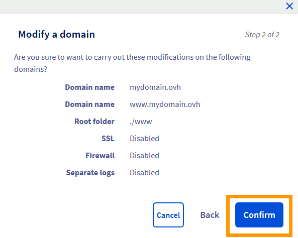

> [!primary]
> Questa traduzione è stata generata automaticamente dal nostro partner SYSTRAN. I contenuti potrebbero presentare imprecisioni, ad esempio la nomenclatura dei pulsanti o alcuni dettagli tecnici. In caso di dubbi consigliamo di fare riferimento alla versione inglese o francese della guida. Per aiutarci a migliorare questa traduzione, utilizza il pulsante "Contribuisci" di questa pagina.
>

## Obiettivo

Una pagina **"Index of"** compare in almeno uno dei seguenti casi:

- La configurazione [Multisito](/pages/web_cloud/web_hosting/multisites_configure_multisite) del tuo dominio non è correttamente configurata verso la tua directory di destinazione
- La cartella di destinazione verso cui il tuo dominio punta non contiene file **"index.html"** o **"index.php"**

{.thumbnail}

**Questa guida ti mostra come correggere la visualizzazione di una pagina "Index of"**.

> [!warning]
>
> OVHcloud mette a tua disposizione servizi di cui tu sei responsabile per la configurazione e la gestione. Assicurarne il corretto funzionamento è quindi responsabilità dell'utente.
>
> Questa guida ti aiuta a eseguire le operazioni necessarie. Tuttavia, in caso di difficoltà o dubbi, ti consigliamo di rivolgerti a uno [specialista del settore](https://partner.ovhcloud.com/it/directory/) o di contattare l'amministratore del servizio. OVHcloud non potrà fornirti alcuna assistenza. Per maggiori informazioni consulta la sezione [Per saperne di più](#gofurther) di questa guida.

>

## Prerequisiti

- Disporre di un [dominio](https://www.ovhcloud.com/it/domains/)
- Disporre di una [soluzione di hosting Web](https://www.ovhcloud.com/it/web-hosting/)
- Avere accesso allo [Spazio Cliente OVHcloud](https://www.ovh.com/auth/?action=gotomanager&from=https://www.ovh.it/&ovhSubsidiary=it)

## Procedura

### Comprendere l'origine della pagina "Index of"

Il tuo dominio è stato dichiarato per accedere a una directory di destinazione (una "`Cartella root`") sul server [FTP](/pages/web_cloud/web_hosting/ftp_connection) del tuo hosting web condiviso. accedendo alla scheda [Multisito](/pages/web_cloud/web_hosting/multisites_configure_multisite) del tuo hosting Web presente nel tuo [Spazio Cliente OVHcloud](https://www.ovh.com/auth/?action=gotomanager&from=https://www.ovh.it/&ovhSubsidiary=i).

La pagina **Index of** indica che la directory di destinazione non contiene file **index.php** o **index.html**. Un file di questo tipo costituisce il "*punto di accesso*" del tuo sito Web. Il nome del file è normalizzato.

Per visualizzare il tuo sito Web, accedi alla sezione `Multisito`{.action} del tuo hosting e associa il tuo dominio alla `Cartella di root` che contiene questo file **index.php** o **index.html**.

> [!primary]
>
> Per collegare temporaneamente il tuo dominio a una `Cartella root` che non contiene file **index.php** o **index.html***, puoi vietare la visualizzazione della lista delle cartelle del tuo sito seguendo questo [tutorial](/pages/web_cloud/web_hosting/htaccess_what_else_can_you_do#impedire-il-listing-del-contenuto-di-una-directory). È inoltre possibile proteggere l'accesso alle cartelle tramite una [password](/pages/web_cloud/web_hosting/htaccess_protect_directory_by_password).
>
> In caso di difficoltà nell'implementare questa configurazione, ti consigliamo di rivolgerti a un [provider specializzato](https://partner.ovhcloud.com/it/directory/). Il nostro team di supporto non sarà infatti in grado di fornirti assistenza su eventuali modifiche della programmazione interna del tuo sito.

### Risolvere il caso più comune di una pagina "Index of"

Hai importato i file del tuo sito **mydomain.ovh** nella cartella `www` del tuo hosting tramite [FTP](/pages/web_cloud/web_hosting/ftp_connection). Il tuo dominio non è associato a questa cartella nella colonna `Cartella di root` del tuo `Multisito`{.action}.

{.thumbnail}

Modifica la `Cartella di root` cliccando sul pulsante `...`{.action} a destra della tabella e poi su `Modifica il dominio`{.action}:

{.thumbnail}

Nella finestra che appare:

* Seleziona la casella `Modifica anche il sottodominio www.mydomain.ovh`{.action} (1)
* Indica la directory contenente il file **index.php** o **index.html** del tuo sito come `Cartella di root` (2);
* Clicca su `Continua` (3).

{.thumbnail}

> [!primary]
>
> Utilizzare la directory `www` come `Cartella di root` non è in nessun caso obbligatorio. Puoi installare il tuo sito in un'altra cartella del tuo [server FTP](/pages/web_cloud/web_hosting/ftp_connection).
>

Nella nuova finestra, clicca su `Conferma`{.action}.

{.thumbnail}

In pochi minuti (rinfrescando il browser) otterrai questo risultato:

{.thumbnail}

e verifica che il tuo sito venga visualizzato correttamente. In caso contrario, riavvia il tuo dispositivo e svuota la cache del tuo browser se necessario.

Assicurati inoltre che nella tua directory di destinazione sia presente un file **index.php** o **index.html**.

## Per saperne di più 

[Risolvere gli errori più frequenti associati ai moduli in 1 click](/pages/web_cloud/web_hosting/diagnostic_errors_module1clic)

[Risolvere l’errore «Sito non installato»](/pages/web_cloud/web_hosting/multisites_website_not_installed)

[Ospitare più siti su uno stesso hosting](/pages/web_cloud/web_hosting/multisites_configure_multisite)

Per prestazioni specializzate (referenziamento, sviluppo, ecc...), contatta i [partner OVHcloud](https://partner.ovhcloud.com/it/directory/).

Per usufruire di un supporto per l'utilizzo e la configurazione delle soluzioni OVHcloud, è possibile consultare le nostre soluzioni [offerte di supporto](https://www.ovhcloud.com/it/support-levels/).

Contatta la nostra Community di utenti all'indirizzo <https://community.ovh.com/en/>.
