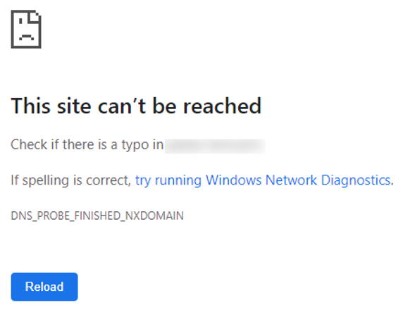

> [!primary]
> Tłumaczenie zostało wygenerowane automatycznie przez system naszego partnera SYSTRAN. W niektórych przypadkach mogą wystąpić nieprecyzyjne sformułowania, na przykład w tłumaczeniu nazw przycisków lub szczegółów technicznych. W przypadku jakichkolwiek wątpliwości zalecamy zapoznanie się z angielską/francuską wersją przewodnika. Jeśli chcesz przyczynić się do ulepszenia tłumaczenia, kliknij przycisk "Zgłóś propozycję modyfikacji" na tej stronie.
>

**Ostatnia aktualizacja z dnia 02/08/2022**

## Wprowadzenie 

W przypadku niedostępności Twojej strony możesz wyświetlić w przeglądarce kilka zwrotów błędów. Poniższe przykłady wskazują na nieprawidłową konfigurację Twoich [DNS](/pages/web_cloud/domains/dns_server_general_information#zrozumienie-pojecia-dns) lub domeny zawieszonej (jeśli Twoja strona nie wyświetla żadnego z komunikatów o błędzie opisanych tutaj, sprawdź sekcję [Sprawdź również](#gofurther)):

|Przeglądarka|Komunikat błędu|
|-|---|
|Chrome: "Ta witryna jest nieosiągalna"|{.thumbnail}|
|Firefox: "Niestety, nie udało się odnaleźć tej strony"|{.thumbnail}|
|Edge: "Niestety… nie można przejść do tej strony"|{.thumbnail}|
|Safari: "Safari nie może znaleźć serwera"|{.thumbnail}|

**Dowiedz się, jak usunąć błędy związane z plikiem "Ta witryna jest nieosiągalna"**

> [!warning]
>
> OVHcloud udostępnia różnorodne usługi, jednak to Ty odpowiadasz za ich konfigurację i zarządzanie nimi. Ponosisz więc odpowiedzialność za ich prawidłowe funkcjonowanie.
>
> Oddajemy w Twoje ręce niniejszy przewodnik, którego celem jest pomoc w wykonywaniu bieżących zadań. W przypadku trudności zalecamy skorzystanie z pomocy wyspecjalizowanego webmastera lub kontakt z producentem oprogramowania. Niestety firma OVHcloud nie będzie mogła udzielić wsparcia w tym zakresie. Więcej informacji znajduje się w sekcji [Sprawdź również](#gofurther) ten przewodnik.
>

## Wymagania początkowe

- Zarządzanie serwerami i [strefą DNS](/pages/web_cloud/domains/dns_zone_edit#zrozumienie-pojecia-dns) domeny
- Zalogowanie do [Panelu klienta OVHcloud](https://www.ovh.com/auth/?action=gotomanager&from=https://www.ovh.pl/&ovhSubsidiary=pl)
- Aktualizacja w [płatności](/pages/account_and_service_management/managing_billing_payments_and_services/invoice_management#pay-bills) i [odnowienie](/pages/account_and_service_management/managing_billing_payments_and_services/how_to_use_automatic_renewal#renewal-management) powiązanych usług (domena i hosting)

## W praktyce

### Etap 1: sprawdź ważność Twojej domeny

> [!warning]
>
> Odnowienie usług należy do Ciebie. 
> OVHcloud, jako dostawca hostingu, ma obowiązek definitywnie usunąć usługi (domeny, hosting, e-maile, itp.), które nie zostały odnowione na czas, jak również wszystkie zawarte w nich dane.
>
> W związku z tym zalecamy włączenie automatycznego odnowienia wszystkich Twoich subskrypcji OVHcloud.
>

Aby sprawdzić poprawność subskrypcji Twojej domeny, w prawym górnym rogu Panelu klienta kliknij Twoją nazwę, aby wyświetlić menu PPM, następnie `Produkty i usługi`{.action}.

{.thumbnail}|

Odnów Twoją domenę, jeśli to konieczne, za pomocą przycisku `...`{.action}. po prawej stronie ekranu, a następnie `Odnów usługę`{.action}.

{.thumbnail}

Po odnowieniu domeny Twoja strona będzie dostępna w ciągu 48 godzin.

### Etap 2: sprawdź serwery DNS

Aby sprawdzić poprawność Twoich [serwerów DNS](/pages/web_cloud/domains/dns_server_general_information), w [Panelu klienta OVHcloud](https://www.ovh.com/auth/?action=gotomanager&from=https://www.ovh.pl/&ovhSubsidiary=pl) kliknij `Domeny`{.action}, a następnie domenę na Twojej stronie.

#### Scenariusz 1: brak anomalii na serwerach DNS

Sprawdź serwery podane w zakładce `Serwery DNS`{.action}:

{.thumbnail}

Jeśli są identyczne z celami wpisów typu `NS` w `Strefa DNS`{.action}, przejdź do [Etap 3](#step3):

{.thumbnail}

#### Scenariusz 2: nad strefą DNS pojawi się ostrzeżenie

Ostrzeżenie w zakładce `Strefa DNS`{.action} wskazuje, że serwery DNS używane przez Twoją domenę nie są serwerami pokazywanymi w Twojej strefie. Możliwe są dwa scenariusze:

- Pod frazą "Aktualnie korzystasz z następujących serwerów DNS:", wskazane serwery są typu "ns **?** ovh.net" i "dns **?** ovh.net" (zastąp "**?**" na dowolny numer):

{.thumbnail}

Zmień serwery DNS zgodnie z instrukcjami zawartymi w [tym przewodniku](/pages/web_cloud/domains/dns_server_general_information#zmien-serwery-dns), aby były one identyczne z celami wpisów typu `NS` w `Strefa DNS`{.action}.

Twoja strona będzie dostępna w ciągu maksymalnie 48 godzin.

- Pod frazą "Aktualnie korzystasz z następujących serwerów DNS:", wskazane serwery nie są typu "ns **?** ovh.net" i "dns **?** ovh.net".

{.thumbnail}

> [!warning]
>
> W takiej sytuacji przed przystąpieniem do jakichkolwiek czynności, należy skontaktować się z dostawcą usług hostowanych w strefie DNS, webmasterem lub [partnerami OVHcloud](https://partner.ovhcloud.com/pl/directory/).
>
> Możliwe, że serwery DNS używane przez Twoją domenę działają i że problem z dostępem do Twojej strony jest związany z brakującym lub nieprawidłowym wpisem w [strefie DNS](/pages/web_cloud/domains/dns_zone_edit#zrozumienie-pojecia-dns). Każda zmiana serwerów DNS może spowodować niedostępność Twoich kont e-mail lub innych aplikacji online.
>

#### Scenariusz 3: w strefie DNS nie pojawia się żaden wpis typu NS

W `Strefa DNS`{.action} Twojej domeny nie ma wpisu typu `NS`:

{.thumbnail}

Wykonaj kopię zapasową aktualnej strefy, klikając przycisk `Modyfikacja w trybie tekstowym`{.action} po prawej stronie ekranu:

{.thumbnail}

Następnie skopiuj/wklej zawartość `Strefa DNS`{.action} do dokumentu tekstowego. Zapisz lokalnie ten dokument.

Następnie kliknij `Zresetuj strefę DNS`{.action} i wybierz `Nie, ale chcę zresetować strefę DNS.`{.action}, wskaż serwery e-mail i hosting, a następnie kliknij `Zatwierdź`{.action}.

{.thumbnail}

Twoja strona będzie dostępna w ciągu maksymalnie 24 godzin.

### Etap 3: sprawdź strefę DNS 

Na tym etapie odnajdziesz adres IP Twojego hostingu, po czym dodaj go do Twojej `Strefa DNS`{.action}.

Jeśli Twoja strona nie jest hostowana w infrastrukturze OVHcloud lub jest zarządzana przez innego dostawcę, skontaktuj się z odpowiednią pomocą techniczną.

Jeśli Twoja strona jest zainstalowana w jednej z naszych [ofert Web Cloud](https://www.ovhcloud.com/pl/web-hosting/), kliknij zakładkę `Hosting`{.action}, a następnie wybierz odpowiednią ofertę.

W zakładce `Informacje ogólne`{.action} skopiuj adres IPV4 i/lub IPV6 Twojej domeny.

{.thumbnail}

Następnie przenieś domenę do [strefy DNS](/pages/web_cloud/domains/dns_zone_edit#modyfikacja-strefy-dns-domeny), modyfikując lub dodając jeden lub więcej rekordów typu `A`.

{.thumbnail}

Twoja strona będzie dostępna w ciągu maksymalnie 24 godzin.

## Sprawdź również 

[Usunięcie błędu “Strona nie została zainstalowana”](/pages/web_cloud/web_hosting/multisites_website_not_installed)

[Co zrobić w przypadku błędu 500 Internal Server Error?](/pages/web_cloud/web_hosting/diagnostic_fix_500_internal_server_error)

[Rozwiąż najczęstsze błędy związane z modułami za pomocą 1 kliknięcia](/pages/web_cloud/web_hosting/diagnostic_errors_module1clic)

Skontaktuj się z [partnerami OVHcloud](https://partner.ovhcloud.com/pl/directory/), jeśli szukasz zaawansowanych rozwiązań (indeksowanie, rozwój, etc).

Jeśli chcesz otrzymywać wsparcie w zakresie konfiguracji i korzystania z rozwiązań OVHcloud, sprawdź naszą [ofertę wsparcia](https://www.ovhcloud.com/pl/support-levels/).

Dołącz do społeczności naszych użytkowników na stronie <https://community.ovh.com/en/>.
