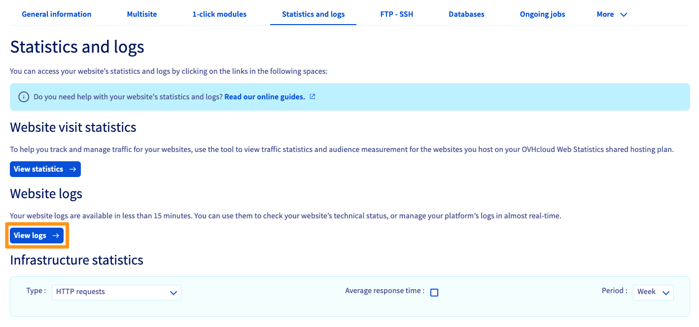
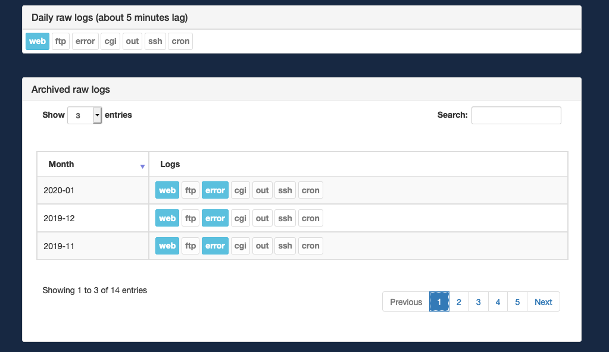

## Ziel 

In dieser Anleitung werden die Schritte zum Exportieren aller Elemente einer Webseite im Standardformat von einem unserer Webhosting-Dienste beschrieben.

**Erfahren Sie hier, wie Sie Ihre OVHcloud Webseite exportieren können.**

## Voraussetzungen

- Sie haben ein [OVHcloud Webhosting](https://www.ovhcloud.com/de/web-hosting/).
- Sie haben Zugriff auf Ihr [OVHcloud Kundencenter](https://www.ovh.com/auth/?action=gotomanager&from=https://www.ovh.de/&ovhSubsidiary=de).

## In der praktischen Anwendung

### Schritt 1: Dateien von Ihrem FTP-Speicherplatz abrufen

#### 1.1 In den Speicherplatz einloggen

Um sich in Ihren Speicherplatz einzuloggen, benötigen Sie:

- einen aktiven FTP- oder SSH-Benutzer
- das Passwort für diesen Nutzeraccount
- die Server-Adresse
- den Verbindungsport des Servers

Diese Informationen wurden Ihnen per E-Mail bei der Installation Ihres Webhostings mitgeteilt. Wenn Sie nicht mehr im Besitz dieser Daten sind, loggen Sie sich in Ihr [OVHcloud-Kundencenter](https://www.ovh.com/auth/?action=gotomanager&from=https://www.ovh.de/&ovhSubsidiary=de) ein und öffnen Sie im Bereich `Web Cloud`{.action} unter `Hosting-Pakete`{.action} das betreffende Hosting aus. Gehen Sie dann auf den Tab `FTP - SSH`{.action}. 

{.thumbnail}

Es werden nun die Informationen Ihres Speicherplatzes angezeigt. Sie sollten hier alle Elemente finden, die Sie für das Einloggen in Ihren FTP-Speicherplatz brauchen. Falls nötig, konsultieren Sie unsere Anleitung: [Mit dem Speicherplatz eines Webhostings verbinden](/pages/web_cloud/web_hosting/ftp_connection). Wenn Sie das Passwort nicht kennen, lesen Sie bitte die Anleitung [Passwort eines FTP-Benutzers ändern](/pages/web_cloud/web_hosting/ftp_change_password).

Wenn Sie alle nötigen Informationen bereit haben, können Sie Ihre Dateien auf dem Speicherplatz abrufen. Hierfür haben Sie zwei Möglichkeiten:

- **FTP- oder SFTP-kompatibles Programm verwenden**: Installieren Sie einen FTP-Client auf Ihrem Computer, wie [FileZilla](/pages/web_cloud/web_hosting/ftp_filezilla_user_guide). Kontaktieren Sie den Herausgeber der eingesetzten Anwendung, falls Sie für deren Verwendung Hilfe brauchen, da OVHcloud keine Unterstützung zu externer Software anbieten kann.

- **SSH-Zugang verwenden**: Um auf Ihren Speicherplatz zuzugreifen, müssen die entsprechenden Befehle in einem Terminal ausgeführt werden. Für diesen Zugriffstyp sind fortgeschrittene Kenntnisse sowie ein kompatibles [OVHcloud Webhosting](https://www.ovhcloud.com/de/web-hosting/) erforderlich. Weitere Informationen hierzu finden Sie in unserer [Anleitung](/pages/web_cloud/web_hosting/ssh_on_webhosting). 

#### 1.2 Dateien von Ihrem Speicherplatz herunterladen

Nachdem Sie sich in Ihren Speicherplatz eingeloggt haben, können Sie die Dateien Ihrer Webseite herunterladen. **Achten Sie bitte besonders auf das Verzeichnis, in dem Sie Ihre Seite installiert haben.** Standardmäßig werden diese im „www“-Ordner abgelegt. Sollten Sie über Ihr Webhosting mehrere Webseiten betreiben, haben Sie mit Sicherheit mehrere **Multisites** angelegt.

Gehen Sie in Ihrem OVHcloud-Kundencenter auf den Tab `Multisite`{.action}, um herauszufinden, in welchem Ordner Ihre Webseite gespeichert ist. In der angezeigten Tabelle wird das Wurzelverzeichnis für die gewünschte Domain angegeben.

{.thumbnail}

### Schritt 2: Backup Ihrer Datenbank abrufen (optional)

> [!primary]
>
> Dieser Schritt ist optional, wenn Ihre Webseite keine Datenbank verwendet.
>

Informationen zum Abrufen eines Backups Ihrer Datenbank finden Sie in unserer Anleitung:
[Backup einer Webhosting-Datenbank exportieren](/pages/web_cloud/web_hosting/sql_database_export).

Wenn Sie eine Datenbank **Web Cloud Databases** für Ihre Website verwenden, lesen Sie den Abschnitt "Backup" in unserer Anleitung:
[Eine Datenbank Ihres Datenbankservers sichern und exportieren](/pages/web_cloud/web_cloud_databases/save-export-on-database-server){.external}.

### Schritt 3: Logs Ihres OVHcloud Webhostings abrufen

Wenn Sie den Protokollverlauf Ihrer Webseite aufbewahren möchten, haben Sie die Möglichkeit, die Logs im OVHcloud Kundencenter herunterzuladen.

Wählen Sie unter `Hosting-Pakete`{.action} den gewünschten Dienst aus. Klicken Sie auf den Tab `Statistiken und Logs`{.action}. Klicken Sie auf den Link unter dem Eintrag `Logs anzeigen`{.action}:

{.thumbnail}

Ein Fenster mit den verschiedenen verfügbaren Logtypen wird angezeigt. Sie sind nach Monaten unterteilt:

| Typ  	| Beschreibung                                                                                                                                                                                         	|
|-------	|-----------------------------------------------------------------------------------------------------------------------------------------------------------------------------------------------------	|
| Web   	| Hier finden Sie die verschiedenen Logs zum Zugriff auf Ihre Webseite sowie die verschiedenen Aktionen, die von Ihrer Seite ausgeführt wurden. Auf diese Weise können Sie beispielsweise versuchte Hacks erkennen. 	|
| FTP   	| Die verschiedenen FTP-Verbindungen werden aufgezeichnet und in diesen Logs gespeichert.                                                                                                                     	|
| Error 	| Die verschiedenen Fehler, die von Ihrer Site generiert werden.                                                                                                                                                    	|
| CGI   	| Die verschiedenen Aufrufe der cgi.bin-Skripte.                                                                                                                                     	|
| Out   	| Die Statistiken Ihres Hostings zu den verschiedenen externen Aufrufen.                                                                                                                  	|
| SSH   	| Diese Logs zeigen die Verbindungen an, die mit dem SSH-Protokoll durchgeführt wurden.                                                                                                                      	|
| Cron  	| Das Ergebnis der Ausführung Ihrer geplanten Aufgaben.                                                                                                                                                	|

{.thumbnail}

Nachdem Sie den Logtyp und Monat ausgewählt haben, sind die Logs nach Tag archiviert abrufbar:

{.thumbnail}

## Weiterführende Informationen

[Mit dem Speicherplatz eines Webhostings verbinden](/pages/web_cloud/web_hosting/ftp_connection)

[Passwort eines FTP-Benutzers ändern](/pages/web_cloud/web_hosting/ftp_change_password)

[Verwendung von FileZilla](/pages/web_cloud/web_hosting/ftp_filezilla_user_guide)

[SSH auf Ihren Webhostings verwenden](/pages/web_cloud/web_hosting/ssh_on_webhosting)

[Backup einer Webhosting-Datenbank exportieren](/pages/web_cloud/web_hosting/sql_database_export)

Für den Austausch mit unserer Community gehen Sie auf <https://community.ovh.com/en/>.
