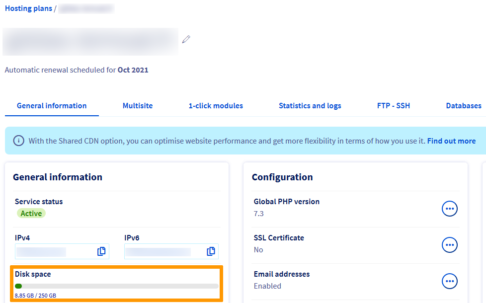

> [!primary]
> Tłumaczenie zostało wygenerowane automatycznie przez system naszego partnera SYSTRAN. W niektórych przypadkach mogą wystąpić nieprecyzyjne sformułowania, na przykład w tłumaczeniu nazw przycisków lub szczegółów technicznych. W przypadku jakichkolwiek wątpliwości zalecamy zapoznanie się z angielską/francuską wersją przewodnika. Jeśli chcesz przyczynić się do ulepszenia tłumaczenia, kliknij przycisk "Zgłóś propozycję modyfikacji" na tej stronie.
>

## Wprowadzenie 

Korzystanie z oprogramowania FTP podczas logowania do [hostingu Cloud](https://www.ovhcloud.com/pl/web-hosting/) może spowodować różne nieprawidłowości. Niniejszy przewodnik pozwoli Ci rozwiązać najczęstsze z nich.

**Dowiedz się, jak usunąć błędy związane z oprogramowaniem FTP.**

> [!warning]
>
> OVHcloud udostępnia różnorodne usługi, jednak to Ty odpowiadasz za ich konfigurację i zarządzanie nimi. Ponosisz więc odpowiedzialność za ich prawidłowe funkcjonowanie.
>
> Oddajemy w Twoje ręce niniejszy przewodnik, którego celem jest pomoc w wykonywaniu bieżących zadań. W przypadku trudności zalecamy skorzystanie z pomocy wyspecjalizowanego webmastera lub kontakt z producentem oprogramowania. Niestety firma OVHcloud nie będzie mogła udzielić wsparcia w tym zakresie. Więcej informacji znajduje się w sekcji [Sprawdź również](#gofurther) ten przewodnik.
>

## Wymagania początkowe

- Posiadanie [oferty hostingu WWW Cloud](https://www.ovhcloud.com/pl/web-hosting/)
- Dostęp do [Panelu klienta OVHcloud](https://www.ovh.com/auth/?action=gotomanager&from=https://www.ovh.pl/&ovhSubsidiary=pl)

## W praktyce

### "Ten serwer nie obsługuje FTP na TLS" (FileZilla)

{.thumbnail}

Ten komunikat w programie [FileZilla](/pages/web_cloud/web_hosting/ftp_filezilla_user_guide) wskazuje, że nie włączyłeś opcji SFTP lub SSH w [Panelu klienta OVHcloud](https://www.ovh.com/auth/?action=gotomanager&from=https://www.ovh.pl/&ovhSubsidiary=pl). W związku z tym informacje wymieniane między serwerem hostingowym OVHcloud a komputerem nie będą szyfrowane.

Jeśli dane, które chcesz wymienić za pomocą tego kanału nie są poufne, kliknij `OK`{.action}.

W przeciwnym razie przejdź do [Panelu klienta OVHcloud](https://www.ovh.com/auth/?action=gotomanager&from=https://www.ovh.pl/&ovhSubsidiary=pl), sekcja `Web Cloud`{.action}, a następnie wybierz `Hosting`{.action}. Wybierz odpowiedni hosting i wybierz kartę `FTP-SSH`{.action}.

Jeśli dysponujesz hostingiem [Perso](https://www.ovhcloud.com/pl/web-hosting/personal-offer/), zaznacz kratkę `Wyłączone`{.action} w kolumnie `SFTP`{.action}, następnie odczekaj kilka minut.

Jeśli dysponujesz hostingiem [Pro](https://www.ovhcloud.com/pl/web-hosting/professional-offer/) lub [Performance](https://www.ovhcloud.com/pl/web-hosting/performance-offer/), kliknij przycisk `...`{.action} po prawej stronie odpowiedniego użytkownika FTP a następnie kliknij `Zmien`{.action}.

Wybierz `SFTP`{.action} lub `Aktywny`{.action} (aby aktywować protokół SSH na Twoim hostingu), kliknij `Dalej`{.action} i `Zatwierdź`{.action}. Odczekaj kilka minut.

> [!primary]
>
> W przypadku innych wiadomości o błędzie sprawdź sekcję `Diagnostyka` naszych przewodników dotyczących [Hosting](/products/web-cloud-hosting).
>

### Przeniosłem pliki za pomocą programu FTP, ale moja strona nie wyświetla się.

Sprawdź najpierw, czy pliki i foldery Twojej strony są obecne w [katalogu głównym](/pages/web_cloud/web_hosting/hosting_how_to_get_my_website_online#3-zapisanie-plikow-na-przestrzeni-dyskowej) Twojego hostingu.

Jeśli przeprowadziłeś zmianę w [serwerach lub strefie DNS](/pages/web_cloud/domains/dns_zone_edit#zrozumienie-pojecia-dns) mniej niż 48 godziny temu, odczekaj chwilę i zrestartuj urządzenia, aby usunąć pamięć podręczną.

### Moje identyfikatory FTP nie działają.

Jeśli nie możesz się zalogować, zmień hasło FTP zgodnie z instrukcjami zawartymi w tym [przewodniku](/pages/web_cloud/web_hosting/ftp_change_password).

### Na mojej stronie są losowe błędy.

Brak przestrzeni dyskowej na hostingu może spowodować usterki na Twojej stronie WWW podczas prób jej zmiany lub aktualizacji.

Aby sprawdzić pozostałą przestrzeń dyskową Twojego hostingu, zaloguj się do [Panelu klienta OVHcloud](https://www.ovh.com/auth/?action=gotomanager&from=https://www.ovh.pl/&ovhSubsidiary=pl). Kliknij `Web Cloud`{.action}, a następnie `Hosting`{.action}. Wybierz odpowiedni hosting.

Ilość danych zapisanych na serwerze hostingowym (poza bazami danych) wyświetla się w części `Informacje ogólne`{.action} > `Przestrzeń dyskowa`.

{.thumbnail}

### Nie mogę przenieść moich plików na serwer FTP.

Sprawdź, czy Twoje oprogramowanie FTP jest podłączone do "Tryb Passif" (Tryb konfiguracji serwera FTP, na którym serwer determinuje port połączenia).

Na przykład dla [Filezilla](/pages/web_cloud/web_hosting/ftp_filezilla_user_guide) kliknij `Edytuj`{.action}, następnie `Ustawienia`{.action}, `Połączenie`{.action}, `FTP`{.action}, `Pasywny (zalecany)`{.action} i wybierz opcjęposit.

Ogranicz również rozmiar transferu danych (nie będziesz mógł wysyłać więcej niż **5000 plików i folderów** na serwery współdzielone OVHcloud w ramach jednego transferu). W razie potrzeby możesz wykonać kilka importu przy użyciu skompresowanych katalogów.

Jeśli dysponujesz [formułą Pro](https://www.ovhcloud.com/pl/web-hosting/professional-offer/) lub [Performance](https://www.ovhcloud.com/pl/web-hosting/performance-offer/), najlepiej użyć [protokołu SSH](/pages/web_cloud/web_hosting/ssh_on_webhosting) do wykonywania importu plików na przestrzeni dyskowej plików Twojego hostingu.

### Nie mogę usunąć łącza symbolicznego "index.html" na mojej przestrzeni FTP

Link jest domyślnie zainstalowany na hostingu OVHcloud. Wyświetla się go:

{.thumbnail}

Jeśli nie korzystałeś z funkcji "[Moduł za 1 kliknięciem](/pages/web_cloud/web_hosting/cms_install_1_click_modules)" do tworzenia Twojej strony WWW, powinieneś użyć oprogramowania [Net2FTP](/pages/web_cloud/web_hosting/ftp_connection#1-logowanie-przez-ftp-explorer) dostępnego w [Panelu klienta OVHcloud](https://www.ovh.com/auth/?action=gotomanager&from=https://www.ovh.pl/&ovhSubsidiary=pl), aby ręcznie usunąć stronę "Strona w budowie".

## Sprawdź również 

[Korzystanie z programu FileZilla na Twoim hostingu](/pages/web_cloud/web_hosting/ftp_filezilla_user_guide)

Skontaktuj się z [partnerami OVHcloud](https://partner.ovhcloud.com/pl/directory/), jeśli szukasz zaawansowanych rozwiązań (indeksowanie, rozwój, etc).

Jeśli chcesz otrzymywać wsparcie w zakresie konfiguracji i użytkowania Twoich rozwiązań OVHcloud, sprawdź naszą [ofertę pomocy](https://www.ovhcloud.com/pl/support-levels/).

Dołącz do społeczności naszych użytkowników na stronie<https://community.ovh.com/en/>.
