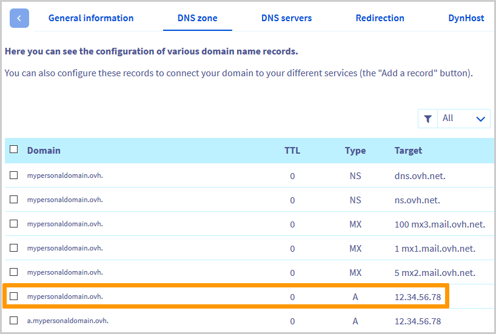

## Objective

You may see a `Site not installed` error page appear on your web browser, particularly when you first install your website.

{.thumbnail}

**This guide explains how to resolve a “Website not installed” error.**

> [!warning]
> OVHcloud is providing you with services for which you are responsible, with regard to their configuration and management. You are therefore responsible for ensuring they function correctly.
>
>This guide is designed to assist you in common tasks as much as possible. Nevertheless, we recommend that you contact a [specialist service provider](https://partner.ovhcloud.com/en-sg/directory/) and/or discuss the issue with our community on if you have difficulties or doubts. You can find more information in the [Go further](#gofurther) section of this guide.
>

## Requirements

- an [OVHcloud Web Hosting plan](https://www.ovhcloud.com/en-gb/web-hosting/)
- access to the [OVHcloud Control Panel](https://ca.ovh.com/auth/?action=gotomanager&from=https://www.ovh.com/sg/&ovhSubsidiary=sg)
- access to the [DNS zone](/pages/web_cloud/domains/dns_zone_edit) your domain name is attached to.

## Instructions

The `Site not installed` page appears in two situations:

1. Your domain is not present in the [Multisite](/pages/web/hosting/multisites_configure_multisite#step-1-access-multisite-management) part of your hosting plan.

2. Your domain name is not linked to your hosting plan via its `DNS zone`{.action}.

The following steps will help you correct the `Site not installed` error in these two situations.

### Step 1: Check the Multisite section of your hosting plan

In the [OVHcloud Control Panel](https://ca.ovh.com/auth/?action=gotomanager&from=https://www.ovh.com/sg/&ovhSubsidiary=sg), click on `Web Cloud`{.action}, then `Hosting plans`{.action}.

Select the concerned hosting plan in the list, then click on the `Multisite`{.action} tab.

|Scenario|What to do|
|---|---|
|Your website name appears in the table.|If you just added your website name to the `Multisite` section of your hosting plan, wait for about twenty minutes and then empty your web browser’s cache.  If the message `Site not installed` still appears, proceed to [step 2](#checkdomainlink).|
|The domain or subdomain linked to your website does not appear in the table.|Add your domain to the `Multisite`{.action} by following the dedicated section of the guide [Hosting multiple websites on your Web Hosting plan](/pages/web/hosting/multisites_configure_multisite#step-2-add-a-domain-or-subdomain).|
|The domain name has been deleted from the Multisite without any action on your part.|Your domain or its DNS zone may be managed from another account.  Add your domain to the `Multisite` by following the dedicated section of the guide [Hosting multiple websites on your Web Hosting plan](/pages/web/hosting/multisites_configure_multisite#step-22-adding-an-external-domain).|

### Step 2: Check your domain’s DNS zone 

> [!primary]
> This step involves checking that your domain name is linked to your website’s hosting plan via a record in its `DNS zone`{.action}.
> To find out more about the concept of `DNS`, please refer to our guide on [Editing an OVHcloud DNS zone](/pages/web/domains/dns_zone_edit#understanding-dns).

#### 2\.1 Identify the IP address of your OVHcloud web hosting plan

To find the IP address, click `Hosting plans`{.action} in your [OVHcloud Control Panel](https://ca.ovh.com/auth/?action=gotomanager&from=https://www.ovh.com/sg/&ovhSubsidiary=sg), then select the concerned Hosting plan.

{.thumbnail}

#### 2\.2 Check the IP addresses in your domain’s DNS zone

The active DNS zone of your domain name has to contain the correct IP address in order to point to your hosting.

To verify this, go to the `Domain names`{.action} section, select your domain name, then go to the `DNS zone`{.action} tab.

|Scenario|What to do|
|---|---|
|In the DNS zone, your domain name is linked to your hosting plan’s IP address by an A record (for IPv4) or an AAAA record (for IPv6) :  {.thumbnail}|This means your domain name has been correctly configured.  After changes to your DNS configuration, your website will be displayed within a maximum of 48 hours.  Additionally, you can restart your devices (PC, mobile phone, Internet box, etc.) and clear your browser’s cache.|
|Your DNS zone does not have an A or AAAA record linking your domain name to your hosting plan’s IP address or one of these records points to a different IP address.|Add a new A or AAAA record or modify the existing record by following [this guide](/pages/web_cloud/domains/dns_zone_edit).|
|Your domain name is not listed in the `Domain names`{.action} section of the OVHcloud Control Panel or your domain name's `DNS zone`{.action} tab looks like in this screenshot :  {.thumbnail}|This means that your domain not is not managed in your OVHcloud Control Panel.  Determine its registrar and the DNS servers it is currently using with our [WHOIS tool](https://www.ovh.co.uk/support/tools/check_whois.pl).  You can find and modify the relevant DNS zone by following [this guide](/pages/web/hosting/multisites_configure_multisite#step-22-adding-an-external-domain).|
|The following warning message about DNS servers appears in the `DNS zone`{.action} tab :  {.thumbnail}|You will need to modify your domain’s DNS servers accordingly by following [this guide](/pages/web_cloud/domains/dns_server_general_information).|

## Go further 

[IP address list for Web Hosting clusters](/pages/web_cloud/web_hosting/clusters_and_shared_hosting_IP)

If you would like assistance using and configuring your OVHcloud solutions, please refer to our [support offers](https://www.ovhcloud.com/en-sg/support-levels/).

Join our community of users on <https://community.ovh.com/en/>.