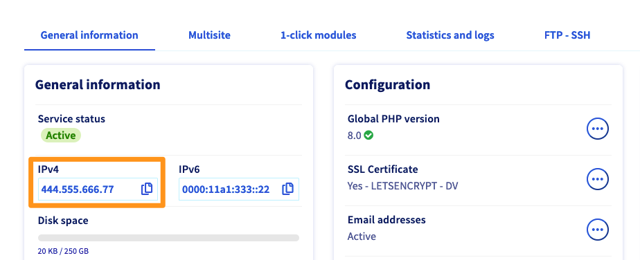
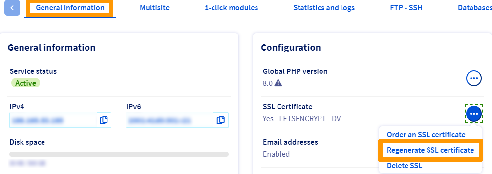

> [!primary]
> Esta traducción ha sido generada de forma automática por nuestro partner SYSTRAN. En algunos casos puede contener términos imprecisos, como en las etiquetas de los botones o los detalles técnicos. En caso de duda, le recomendamos que consulte la versión inglesa o francesa de la guía. Si quiere ayudarnos a mejorar esta traducción, por favor, utilice el botón «Contribuir» de esta página.
>

## Objetivo

Los alojamientos web de OVHcloud son compatibles con los certificados SSL. Puede contratar un certificado SSL con OVHcloud u obtenerlo de otro proveedor e importarlo en el alojamiento. Una vez que haya configurado e instalado el certificado, sus sitios web podrán disponer de una conexión SSL segura y, por consiguiente, podrán funcionar en HTTPS.

**Esta guía explica las distintas operaciones relativas a los certificados SSL en los alojamientos web de OVHcloud.**

## Requisitos

- Tener contratado un [plan de hosting de OVHcloud](https://www.ovhcloud.com/es/web-hosting/){.external}.
- Tener al menos un [dominio](https://www.ovhcloud.com/es/domains/){.external}.
- Tener acceso al [área de cliente de OVHcloud](https://ca.ovh.com/auth/?action=gotomanager&from=https://www.ovh.com/world/&ovhSubsidiary=ws){.external}, en la sección `Web Cloud`{.action}.

## Procedimiento

Es necesario seguir varios pasos para generar un certificado SSL en un alojamiento web de OVHcloud. Le recomendamos que siga los pasos que se describen a continuación **en el orden**.

[1.Activar un certificado SSL en un multisitio](#multisite): si su solución o su certificado SSL lo permiten, puede hacer beneficiarse de una conexión segura SSL en varios multisitios.

[2. Activar un certificado SSL en un alojamiento web](#enablessl): le ayuda a activar un certificado SSL en su alojamiento web. Puede tratarse de un certificado gratuito o de pago contratado con OVHcloud. También puede importar su propio certificado SSL contratado a otro proveedor.

[3.Regenerar un certificado SSL en un alojamiento web](#regeneratessl): permite regenerar un certificado SSL Let's Encrypt en un alojamiento web al activar el SSL en uno o más multisitios.

También puede [eliminar el certificado SSL de un alojamiento web](#deletessl). **Tenga en cuenta que puede plantear riesgos si uno de sus sitios web utiliza actualmente el certificado que tiene previsto eliminar**.

### 1. Activar un certificado SSL en un multisitio 

Según el [certificado SSL](https://www.ovhcloud.com/es/web-hosting/options/ssl/){.external} que quiera contratar, puede activar una conexión SSL segura en uno o más multisitios. Para ello, conéctese al [área de cliente de OVHcloud](https://ca.ovh.com/auth/?action=gotomanager&from=https://www.ovh.com/world/&ovhSubsidiary=ws){.external} y seleccione `Web Cloud`{.action}. Haga clic en `Alojamientos`{.action} y seleccione el alojamiento correspondiente. A continuación, abra la pestaña `Multisitio`{.action}.

Se mostrará una tabla que contiene todos los dominios añadidos al alojamiento web. La columna SSL muestra el estado de activación de las conexiones SSL seguras en los multisitios.

{.thumbnail}

Pueden aparecer tres estados:

|Estado|Descripción|
|---|---|
|Activado|Indica que ya hay un certificado SSL activado en el multisitio. Si su sitio web no está disponible en HTTPS, consulte las indicaciones ofrecidas en la guía [Habilitar HTTPS en un sitio web con certificado SSL](/pages/web_cloud/web_hosting/ssl-activate-https-website){.external}.|
|Por generar|Indica que ya se ha activado un certificado SSL en el multisitio, pero que dicho certificado todavía no está técnicamente activo. Para activarlo, deberá regenerarlo para que incluya los nuevos dominios del multisitio.|
|Desactivado|Indica que no hay ningún certificado SSL activo en el multisitio. Para activarlo, siga los pasos que se indican a continuación.|

Para activar el SSL en un multisitio, haga clic en el botón `...`{.action} situado al final de la línea correspondiente al multisitio y seleccione `Cambiar el dominio`{.action}. En la nueva ventana, marque la casilla `SSL`{.action}. También puede activar la opción para cambiar el subdominio www junto con el dominio asociado. Siga los pasos que se le indican para confirmar el cambio.

Una vez enviada la solicitud de activación, el estado de la conexión segura SSL para el multisitio debe actualizarse al cabo de unos segundos, sustituyéndose el estado por "Por generar". Repita esta operación para todos los multisitios en los que quiera activar el SSL.

> [!primary]
>
> Puede haber dos situaciones en este estado:
>
> - **No hay certificados.**
> Continúe leyendo esta guía en el apartado [Activar un certificado SSL en su alojamiento web](#enablessl) y seleccione el certificado gratuito ("Let's Encrypt") que permite crear un sitio web multisitio.
>
> - **El certificado SSL está activo, pero ha añadido otros sitios multisitio.**
> Continúe leyendo esta guía en el apartado [Regenerar un certificado SSL en un alojamiento web](#regeneratessl) para regenerar el certificado SSL en el multisitio restante.
>

### 2. Activar un certificado SSL en un alojamiento 

Antes de realizar esta configuración, asegúrese de que ha realizado correctamente el paso anterior de [activar un certificado SSL en un sitio multisitio](#multisitio). Al menos un dominio debe tener la opción SSL `Activada` o el estado `A generar` para activar el certificado SSL. 
**Esta información no es pertinente si selecciona `Certificado de pago`{.action} o `Importar su certificado SSL`{.action}.**

> [!warning]
>
> Antes de continuar, asegúrese también de que el registro o registros multisitio para los que está activando la opción SSL apuntan a la dirección IP del alojamiento web. Esta configuración se ofrece automáticamente al añadir o modificar una entrada multisitio, pero debe realizarse manualmente para un dominio que no esté gestionado en el área de cliente.
> - Localice la dirección IP de su alojamiento en la pestaña `Información general`{.action}, debajo de `IPv4`.
> {.thumbnail}
> - Configure la zona DNS del nombre de dominio declarado en multisitio, en la sección `Dominios`{.action}, pestaña `Zona DNS`{.action}. Modifique o añada un registro `A` correspondiente al registro multisitio e indique la dirección IP de su alojamiento en el campo `Destino`.
> {.thumbnail}
>
> Para más información, consulte nuestras guías [sobre la configuración de un registro multisitio](/pages/web_cloud/web_hosting/multisites_configure_multisite) o [sobre la configuración de una zona DNS](/pages/web_cloud/domains/dns_zone_edit).

Existen diversas fórmulas para disponer de un [certificado SSL](https://www.ovhcloud.com/es/web-hosting/options/ssl/){.external} en un alojamiento web de OVHcloud:

- certificado SSL gratuito Let's Encrypt, [incluido con los planes de hosting compatibles](https://www.ovhcloud.com/es/web-hosting/options/ssl/){.external};
- certificado SSL de pago, [disponible como opción en los planes de hosting compatibles](https://www.ovhcloud.com/es/web-hosting/options/ssl/){.external};
- importación de un certificado SSL contratado con otro proveedor.

Para activar el certificado, conéctese al [área de cliente de OVHcloud](https://ca.ovh.com/auth/?action=gotomanager&from=https://www.ovh.com/world/&ovhSubsidiary=ws){.external} y seleccione `Web Cloud`{.action}.Haga clic en `Alojamientos`{.action} y seleccione el alojamiento correspondiente. Por defecto, se abrirá la pestaña `Información general`{.action}. En la pestaña Certificado SSL, aparecerá la indicación "No", indicando que no hay ningún certificado SSL configurado ni instalado en el alojamiento web.

Haga clic en el botón `···`{.action} situado junto a **Certificado SSL** y seleccione `Contratar un certificado SSL`{.action}.

Si, por el contrario, se indica «Sí», significa que ya hay un certificado SSL instalado y configurado en el alojamiento web. No es posible contratar un nuevo certificado mientras tenga uno instalado.

{.thumbnail}

En el cuadro de diálogo, seleccione el tipo de certificado SSL que quiera contratar. Es posible que, en función del [plan de hosting](https://www.ovhcloud.com/es-es/web-hosting/){.external} o de su configuración, algunas de las opciones que explicamos a continuación no estén disponibles. Una vez que haya seleccionado el tipo de certificado, haga clic en `Siguiente`{.action}.

{.thumbnail}

En función del tipo de certificado seleccionado, puede ser necesario realizar más acciones:

- **Si ha seleccionado un certificado SSL gratuito**, no será necesaria ninguna otra acción, a menos que algún problema técnico impida activar el certificado SSL (en cuyo caso aparecerá un mensaje en el área de cliente indicándole los elementos que debe comprobar) o validar el dominio para la entrega del certificado SSL. Si eso ocurre, siga las indicaciones que aparezcan en el mensaje de aviso.

- **Si ha seleccionado un certificado SSL de pago**, deberá finalizar el pedido para obtener el certificado. Para determinados tipos de certificado SSL, puede ser necesaria una validación específica. Es posible, pues, que reciba uno o más mensajes de correo electrónico relativos a la validación. En ese caso, lea la información que contienen dichos mensajes y siga sus indicaciones hasta finalizar la configuración.

- **Si ha seleccionado la importación de un certificado SSL**, deberá introducir los datos del certificado en los campos de texto. Si tiene cualquier duda, consulte la información que le haya proporcionado el proveedor del certificado. Normalmente proporcionan 3 archivos: `certificate.crt`, `private.key` y `ca_bundle.crt`. Después de seleccionar `Importar su certificado SSL`{.action} haga clic en `Siguiente`{.action}. En la primera sección "Copiar el contenido de su certificado (solo RSA):", copie el contenido del archivo "certificate.crt", en la segunda sección "Copiar el contenido de su clave privada (no cifrada):", copie el contenido del archivo "private.key" y en la tercera sección "Copiar el contenido de su cadena de certificados:", copie el contenido del archivo "ca_bundle.crt" y haga clic en `Confirmar`{.action}.

La configuración del certificado podría tardar desde unos minutos hasta varios días en función del tipo de certificado elegido. Para comprobar si el certificado SSL está configurado en el alojamiento web, vaya a la pestaña **Información general** del área de cliente de OVHcloud. Bajo el epígrafe **Certificado SSL** debería aparecer la indicación «Sí».

{.thumbnail}

### 3. Regenerar el certificado SSL de un alojamiento 

> [!primary]
>
> Esta operación solo se aplica a los certificados SSL gratuitos Let's Encrypt [incluidos con un plan de hosting compatible](https://www.ovhcloud.com/es/web-hosting/options/ssl/) que permiten activar una conexión SSL segura para varios multisitios.
>

Una vez que haya activado la conexión segura SSL en uno o más multisitios, su estado cambiará a «Por generar». Es necesario generar (o regenerar) el certificado SSL de un alojamiento web para poder añadir dominios a dicho certificado.

Para ello, conéctese al [área de cliente de OVHcloud](https://ca.ovh.com/auth/?action=gotomanager&from=https://www.ovh.com/world/&ovhSubsidiary=ws){.external} y seleccione `Web Cloud`{.action}. Haga clic en `Alojamientos`{.action} y seleccione el alojamiento correspondiente. Por defecto, se abrirá la pestaña `Información general`{.action}. Haga clic en el botón `···`{.action} situado junto a **Certificado SSL** y seleccione `Regenerar el certificado SSL`{.action}.

{.thumbnail}

En el cuadro de diálogo, lea la información que se muestra y haga clic en `Aceptar`{.action} para confirmar la operación. Espere hasta que se regenere su certificado SSL. La operación podría tardar varias horas.

Tenga en cuenta que Let's Encrypt, la autoridad que emite el certificado SSL incluido con el alojamiento web, impone un [límite de cinco regeneraciones por semana](https://letsencrypt.org/docs/rate-limits/){.external}. Así pues, preste atención al número de veces que regenera su certificado para evitar un posible bloqueo temporal.

{.thumbnail}

### Eliminar el certificado SSL de un alojamiento 

También es posible eliminar el certificado SSL instalado en un alojamiento web. Antes de realizar esta operación, **le recomendamos encarecidamente que se asegure previamente de que la eliminación del certificado no afectará al acceso a sus sitios web**. Por otro lado, tenga en cuenta que los internautas verán una advertencia de seguridad cuando accedan a un sitio web que funcione en HTTPS pero carezca de una conexión SSL segura.

Esta comprobación se realiza directamente en la configuración del propio sitio web. Si necesita ayuda, le recomendamos que contacte con un [proveedor especializado](https://partner.ovhcloud.com/es/directory/). Nosotros no podremos asistirle.

Una vez que esté listo para eliminar el certificado SSL, conéctese al [área de cliente de OVHcloud](https://ca.ovh.com/auth/?action=gotomanager&from=https://www.ovh.com/world/&ovhSubsidiary=ws){.external} y seleccione `Web Cloud`{.action}. Haga clic en `Alojamientos`{.action} y seleccione el alojamiento correspondiente. Por defecto, se abrirá la pestaña `Información general`{.action}. Haga clic en el botón `···`{.action} situado junto a **Certificado SSL** y seleccione `Eliminar el SSL`{.action}.

En el cuadro de diálogo, confirme que desea eliminar el certificado haciendo clic en `Aceptar`{.action}. La eliminación tardará unas horas en aplicarse.

{.thumbnail}

## Más información

Para servicios especializados (posicionamiento, desarrollo, etc.), contacte con [partners de OVHcloud](https://partner.ovhcloud.com/es/directory/).

Si quiere disfrutar de ayuda para utilizar y configurar sus soluciones de OVHcloud, puede consultar nuestras distintas soluciones [pestañas de soporte](https://www.ovhcloud.com/es/support-levels/).

Interactúe con nuestra comunidad de usuarios en <https://community.ovh.com/en/>.