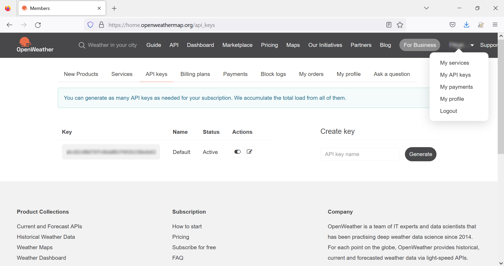
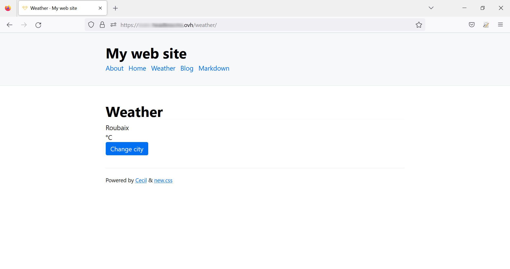
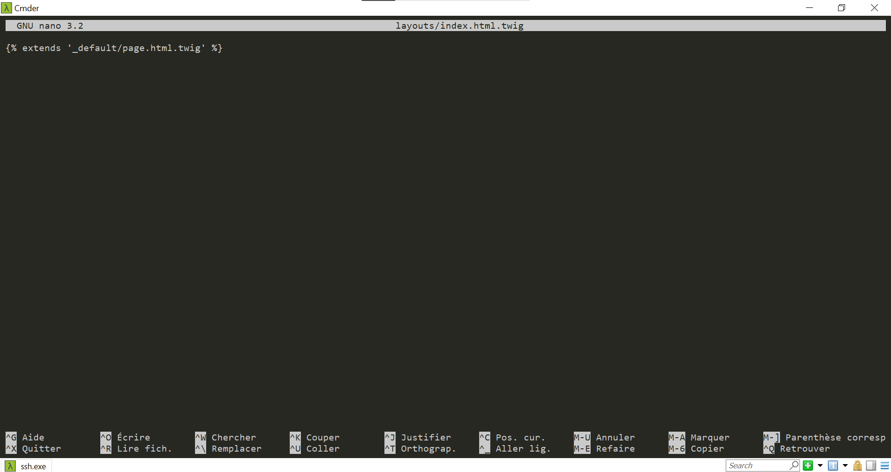
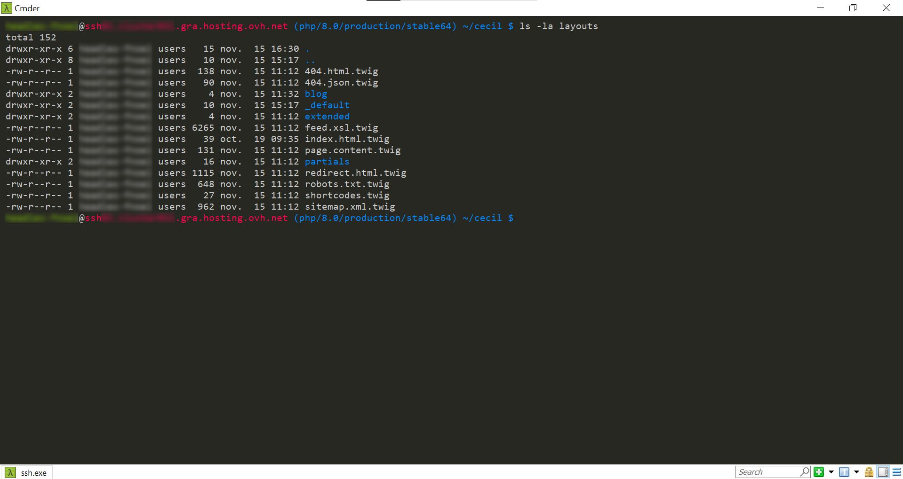

> [!primary]
> Esta traducción ha sido generada de forma automática por nuestro partner SYSTRAN. En algunos casos puede contener términos imprecisos, como en las etiquetas de los botones o los detalles técnicos. En caso de duda, le recomendamos que consulte la versión inglesa o francesa de la guía. Si quiere ayudarnos a mejorar esta traducción, por favor, utilice el botón «Contribuir» de esta página.
>

**Última actualización: 20/01/2023**

## Objetivo

Este tutorial explica cómo utilizar el generador de sitios web [Cecil](https://cecil.app){.external} para mostrar el contenido de una página dinámica. Llamando a una API para recuperar y mostrar la información en una página generada a través de **Cecil**.

**Esta guía explica cómo añadir una llamada a una API externa desde su página web estática.**

> [!warning]
>
> La configuración, la gestión y la responsabilidad de los servicios que OVHcloud pone a su disposición recaen sobre usted. Por lo tanto, usted deberá asegurarse de que estos funcionen correctamente.
> 
> Si necesita ayuda para seguir los pasos de este tutorial, le recomendamos que contacte con un [proveedor especializado](https://partner.ovhcloud.com/es-es/directory/) . Nosotros no podremos asistirle al respecto. Para más información, consulte el apartado ["Más información"](#go-further) de esta guía.
>

## Requisitos

- Tener contratado un plan de [hosting de OVHcloud](https://www.ovhcloud.com/es-es/web-hosting/) con acceso SSH. Este acceso permite instalar en línea de comandos una o más soluciones alternativas a las que ofrecen nuestros planes de hosting por defecto.
- Estar familiarizado con la entrada en línea de comandos.
- Haber instalado y configurado la aplicación **Cecil** en su alojamiento (consulte nuestro tutorial sobre [la instalación y configuración de Cecil](/pages/web_cloud/web_hosting/static_website_installation_cecil)).

## Procedimiento

El ejemplo elegido es utilizar una de las API de un servicio que proporciona datos meteorológicos. Esto depende de la ciudad que el usuario haya introducido.

Los pasos son los siguientes:

- crear una nueva página en Cecil y añadir esta página al menú del sitio web.
- crear una cuenta y recuperar la llave para realizar consultas a la API meteorológica.
- modificar el archivo `.md` creado añadiendo código HTML.
- Añadir `elementos` (JavaScript y CSS).
- generar y probar la solución.

### Crear una página nueva

Prepare su entorno conectándose por SSH a su alojamiento web y consulte el tutorial "[Instalar y configurar Cecil](/pages/web_cloud/web_hosting/static_website_installation_cecil)" para instalar su aplicación **Cecil** en un directorio dedicado.

Cree un directorio y sitúese en él:

```bash
mkdir myWebSite
cd myWebSite
```

### Uso de la API OpenWeather

Para este tutorial, utilizaremos una API proporcionada por el sitio web [OpenWeather](https://openweathermap.org/){.external}. Permite conocer la información meteorológica en función del nombre de una ciudad.

Cree una cuenta en <https://home.openweathermap.org/users/sign_up><br>
Una vez que haya validado su cuenta (mediante el envío de un email de confirmación), acceda al menú "My API keys". Se ha generado una clave por defecto, recuperándola y conservándola para el resto de este tutorial.

{.thumbnail}

### Añadir código HTML

Cree una nueva página con el siguiente comando:

```bash
php cecil.phar new:page weather.md
```

Edite la página generada:

```bash
nano pages/weather.md
```

Modifique el encabezado del archivo para que la página aparezca en el menú:

```
---
title: "Weather"
date: 2022-11-28
published: true
menu: main
---
```

Después de la cabecera, añada el código HTML para mostrar la ciudad seleccionada, las temperaturas devueltas por la API y un botón para cambiar de parámetro:

```html
---
title: "Weather"
date: 2022-11-28
published: true
menu: main
---
<h1>Weather</h1>
<div>
    <span id="city">Roubaix</span>
    <div id="temperatura"><span id="temperaturaValue">>>>> °C</div>
    <div id="modify">Change city</div>
</div>
```

Genere la página HTML con el siguiente comando:

```bash
php cecil.phar build
```

Compruebe el resultado en su navegador y haga clic en el enlace "Weather" que se ha añadido al menú principal:

{.thumbnail}

### Añadir el código JavaScript

No se puede añadir una etiqueta `<script>` a un archivo de Markdown. Deberá modificar la plantilla predeterminada.

#### Editar la plantilla

Las plantillas están dispuestas en el repertorio `layouts`. Para visualizarlas, utilice el siguiente comando:

```bash
ls -la layouts
```

El archivo contiene un directorio `blog` y un archivo `index.html.twig` :

{.thumbnail}

Abra el archivo `index.html.twig`:

{.thumbnail}

El archivo hace referencia a una plantilla que no está presente en el directorio. Este archivo (y otros) están en realidad en el archivo `cecil.phar`. Las extensiones `.phar` designan archivos de PHP que pueden manipularse sin descomprimirse.
Descomprima los archivos de este archivo comprimido para hacerlos visibles :

```bash
php cecil.phar util:extract
```

Vuelva a mostrar el contenido del directorio `layouts`:

{.thumbnail}

Modifique la plantilla por defecto para insertar una etiqueta `<script>` que contenga el código que permite la llamada a la API:

```bash
nano layouts/_default/page.html.twig
```

Esta etiqueta y su contenido deben colocarse antes de la etiqueta de cierre `</body>` al pie de página:

```twig
    </footer>
    
    
    <script src="{{ asset('script.js', {minify: true}) }}"></script>
    
  </body>
</html>
```

Cuando se modifiquen uno o más archivos `assets`, reconstruya la caché con el siguiente comando:

```bash
php cecil.phar cache:clear:assets
```

Si los cambios no son efectivos en su navegador de internet, vacíe la caché del navegador.
También puede eliminar los archivos generados en su alojamiento web:

```bash
php cecil.phar clear
```

Reconstruya su solución utilizando el siguiente comando:

```bash
php cecil.phar build
```

#### Añadir el archivo JavaScript

Los archivos JavaScript, como los archivos CSS, se deben colocar en el directorio `assets` amplio. Las puede organizar en distintos directorios.

Cree el archivo `script.js` anteriormente mencionado en la raíz del directorio `assets` :

```bash
nano assets/script.js
```

Sustituya el valor de la variable `apiKey` por la clave obtenida anteriormente en el sitio [OpenWeather](https://openweathermap.org/){.external}

```javascript
let apiKey = '123456789'; // Reemplace este valor
let city = 'Roubaix'; // Indique aquí la ciudad predeterminada que se mostrará en la página del clima
getTemperature(city);  // Llamada de la función que llama a la API con el parámetro 'city'

// Incorporación de un evento en el clic del botón "Cambiar ciudad"
let button = document.querySelector('#modify');
button.addEventListener('click', () => {
    city = prompt('Choose a city');
    getTemperature(city);
});

// Función de llamada a la API utilizando un objeto XMLHttpRequest para una consulta asíncrona
function getTemperature(city) {
    let url = 'https://api.openweathermap.org/data/2.5/weather?q=' + city + '&appid=' + apiKey + '&units=metric';
    let xhrQuery = new XMLHttpRequest();
    xhrQuery.open('GET', url);
    xhrQuery.responseType = 'json';
    xhrQuery.send();

    xhrQuery.onload = function() {
        if (xhrQuery.readyState === XMLHttpRequest.DONE) {
            if (xhrQuery.status === 200) {
                let city = xhrQuery.response.name;
                let temperature = xhrQuery.response.main.temp;
                document.querySelector('#city').textContent = city;
                document.querySelector('#temperatureValue').textContent = temperature;
            } else {
                alert('A problem has occurred, please come try later.');
            }
        }
    };
}
```

### Tests

Consulte su sitio web en un navegador de internet:

{.thumbnail}

Haga clic en "Cambie de ciudad" e introduzca el nombre de una comuna:

{.thumbnail}

{.thumbnail}

### Conclusiones

Este tutorial muestra un ejemplo de integración de datos dinámicos recuperados de fuentes externas a través de la API. Construya y soporte un sitio web cambiando manualmente el contenido de estas páginas o creando nuevas. Además, enriquece su contenido desde otros sitios web.

## Más información

- Algunas API a probar en su sitio web
    - [Numbers API](http://numbersapi.com/#42){.external}
    - [NASA](https://api.nasa.gov/){.external}
    - [Nueva API](https://newsapi.org/){.external}
    - [Polygon.io](https://polygon.io/){.external}
    - una lista de [API públicas](https://github.com/public-api-lists/public-api-lists){.external}
- Las [órdenes de Cecil](https://cecil.app/documentation/commands/){.external}.

Para servicios especializados (posicionamiento, desarrollo, etc.), contacte con los [partners de OVHcloud](https://partner.ovhcloud.com/es-es/directory/).

Si quiere disfrutar de ayuda para utilizar y configurar sus soluciones de OVHcloud, puede consultar nuestros distintos [servicios de soporte](https://www.ovhcloud.com/es-es/support-levels/).

Interactúe con nuestra comunidad de usuarios en <https://community.ovh.com/en/>.
