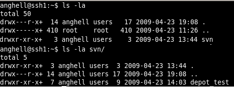

**Ultimo aggiornamento: 28/10/2020**

> [!primary]
> Questa traduzione è stata generata automaticamente dal nostro partner SYSTRAN. I contenuti potrebbero presentare imprecisioni, ad esempio la nomenclatura dei pulsanti o alcuni dettagli tecnici. In caso di dubbi consigliamo di fare riferimento alla versione inglese o francese della guida. Per aiutarci a migliorare questa traduzione, utilizza il pulsante "Contribuisci" di questa pagina.
>


## Obiettivo

SVN, che è l'abbreviazione di "sovversione", è un sistema di gestione delle versioni. 

**Scopri come utilizzare SVN in SSH sul tuo hosting Web**

> [!warning]
>
> OVHcloud mette a tua disposizione servizi di cui tu sei responsabile per la configurazione e la gestione. Garantirne quotidianamente il corretto funzionamento è quindi responsabilità dell’utente.
> 
> Questa guida ti aiuta a eseguire le operazioni necessarie alla configurazione del tuo account. Tuttavia, in caso di difficoltà o dubbi, ti consigliamo di contattare un fornitore specializzato o l’amministratore del servizio. OVHcloud non può fornirti alcuna assistenza. Per maggiori informazioni consulta la sezione “Per saperne di più”.
> 

## Pre-obbligatorio

- Disporre di un'[offerta di hosting Web](https://www.ovhcloud.com/it/web-hosting/) che permette una connessione SSH (**a partire dall'offerta Pro**)
- Connettersi in SSH al tuo hosting Web (consulta la nostra guida [Utilizzare l'accesso SSH al tuo hosting Web](/pages/web_cloud/web_hosting/ssh_on_webhosting))

## Procedura

### Creazione del deposito

Una volta connesso in [SSH al tuo hosting](/pages/web_cloud/web_hosting/ssh_on_webhosting){.external}, crea la directory di root dei depositi SVN e poi la deposizione.

Ti basta digitare il comando:

```bash
mkdir svn
```

e

```bash
svnadmin create svn/depot_test
```

Verifica che le directory siano state create utilizzando il comando:

```bash
ls -la
```

È necessario ottenere le directory come indicato nell'immagine seguente:

{.thumbnail}

### Crea chiavi pubbliche/private

Prima di proseguire, sarà necessario creare un paio di chiavi SSH dal dispositivo che utilizzerai per connetterti al deposito SVN.

Segui la guida [Creare chiavi SSH](/pages/public_cloud/compute/public-cloud-first-steps#step-1-crea-chiavi-ssh/). Non è necessario seguire lo step [Importa la tua chiave SSH nello Spazio Cliente OVHcloud](/pages/public_cloud/compute/public-cloud-first-steps#step-1-crea-chiavi-ssh/#importa-la-chiave-ssh-nello-spazio-cliente) in questa guida.

### Aggiunta della chiave pubblica sull'hosting

Dopo aver ottenuto la chiave, aggiungla sul tuo hosting nel file .ssh/authorized_keys2. inserisci la riga di comando qui sotto:

```bash
mkdir .ssh
chmod 700 .ssh
vi .ssh/authorized_keys2
```

Una volta avviato il file, inserisci questa riga:

```bash
command="/sr/bin/svnserve —root=/homez.XXX/loginFTP/svn —tunnel —tunnel-user=john",no-port-forwarding,no-agente-forwarding,no-X11-forwarding,no-pty
```

Segui la chiave precedentemente creata, il tutto sulla stessa linea.

> [!primary]
>
> Sostituisci "/home.XXX/loginFTP" e "john" con le credenziali SSH.
> Per conoscere le cifre da utilizzare per sostituire "/home.XXX/loginFTP", digita il comando "pwd" in SSH.
>
> Per maggiori informazioni, consulta la guida [Utilizzare l'accesso SSH di un hosting Web](/pages/web_cloud/web_hosting/ssh_on_webhosting){.external}.
> 

{.thumbnail}

È possibile recuperare il contenuto del deposito senza connettersi direttamente in SSH sulla macchina.

> [!warning]
>
> Attenzione, una stessa chiave non deve essere utilizzata per SVN e SSH in
> riga di comando
> 

### Esempi

#### Con Linux

Puoi effettuare un test dal computer che si connette al depot SVN digitando la linea:

```bash
svn checkout svn+ssh://loginFTP@clusterXXX/depot_test
```

#### Windows con TortoiseSVN

- Scarica e installa [TortoiseSVN](https://tortoisesvn.net/downloads.html){.external}.
- Fai un click destro sulla chiave privata. L'icona compare in basso a destra e la chiave viene caricata nell'autenticazione.
- Crea una directory, clicca con il tasto destro e seleziona "SVN Checkout". 
- Inserisci `svn+ssh://loginFTP@xxplan.ovh.net/depot_test` nel campo "URL of repository" e clicca su `OK`:

{.thumbnail}

Per Subversion esiste una documentazione molto buona in inglese: [http://svnbook.red-bean.com/en/1.5/index.html](http://svnbook.red-bean.com/en/1.5/index.html){.external}

### Casi specifici

#### Crea più account

Per prima cosa è necessario aver creato diverse chiavi SSH. Successivamente, durante l'aggiunta della chiave pubblica sull'hosting:

```bash
command="/usr/bin/svnserve --root=/home.XXX/loginFTP/svn --tunnel --tunnel-user=marc",no-port-forwarding,no-agent-forwarding,no-X11-forwarding,no-pty
```

È necessario modificare questo parametro aggiungendo i diversi utenti:

```bash
--tunnel-user
```

aggiungendo il parametro, è possibile autorizzare l'accesso in sola lettura:

```bash
--read-only.
```

#### Verifica in locale dal server

Quando vuoi effettuare una verifica in locale, gli esempi forniti non funzionano. Utilizza:

```bash
svn+ssh://login@ftp.nom-du-site.tld/home.XXX/login/svn/depot_test
```

## Per saperne di più

[Utilizza l'accesso SSH di un hosting Web](/pages/web_cloud/web_hosting/ssh_on_webhosting){.external}

Contatta la nostra Community di utenti all’indirizzo <https://community.ovh.com/en/>.
