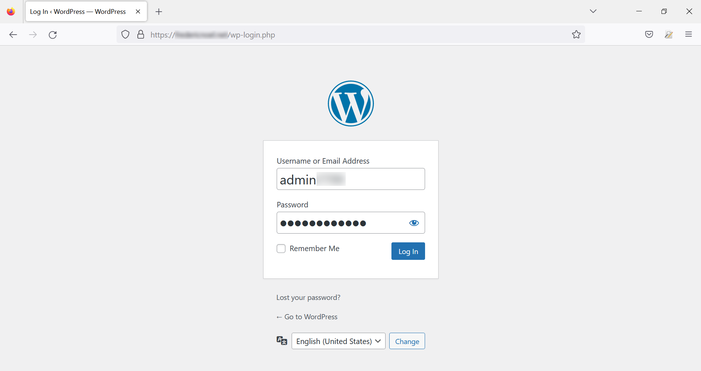
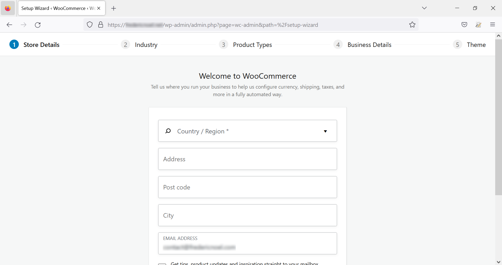
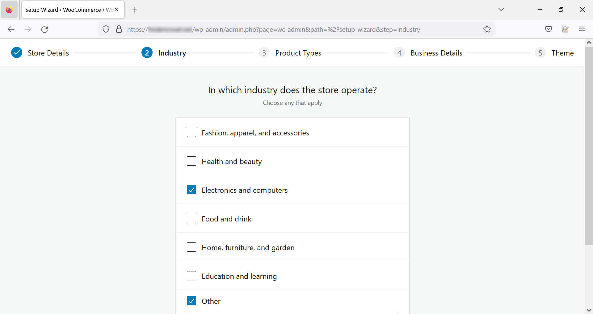
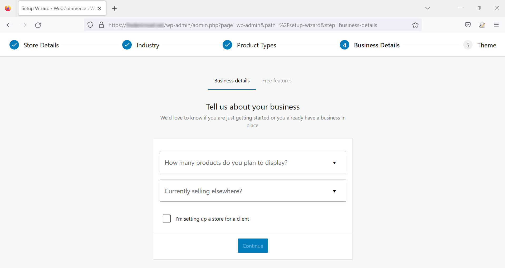

**Última atualização: 23/02/2023**

> [!primary]
> Esta tradução foi automaticamente gerada pelo nosso parceiro SYSTRAN. Em certos casos, poderão ocorrer formulações imprecisas, como por exemplo nomes de botões ou detalhes técnicos. Recomendamos que consulte a versão inglesa ou francesa do manual, caso tenha alguma dúvida. Se nos quiser ajudar a melhorar esta tradução, clique em "Contribuir" nesta página.
>
  
## Objetivo

Saiba como criar uma loja online com a extensão open source **WooCommerce** com o Content Management System (CMS) **WordPress**. 

> [!warning]
>
> A OVHcloud disponibiliza serviços cuja configuração, gestão e responsabilidade lhe incumbem. Assim, deverá certificar-se de que estes funcionam corretamente.
> 
> Colocamos à sua disposição este tutorial para o acompanhar o melhor possível em tarefas comuns. No entanto, se encontrar dificuldades, recomendamos que recorra a um [fornecedor especializado](https://partner.ovhcloud.com/pt/directory/), ao [editor do CMS WordPress](https://wordpress.com/support/){.external} ou ao [editor do WooCommerce](https://woocommerce.com/){.external}. Não poderemos proporcionar-lhe assistência técnica. Para mais informações, aceda à secção ["Quer saber mais?"](#go-further) deste tutorial.
>
  
## Requisitos

- Ter um plano de [alojamento web](https://www.ovhcloud.com/pt/web-hosting/) que contenha, pelo menos, uma base de dados.
- Dispor de um [nome de domínio](https://www.ovhcloud.com/pt/domains/).
- Ter previamente [instalado WordPress](/pages/web_cloud/web_hosting/cms_install_1_click_modules) no seu alojamento web.

Se ainda não o fez, recomendamos que coloque o seu website em HTTPS antes de prosseguir com este tutorial, utilizando o guia "[Ativar o HTTPS num website com certificado SSL](/pages/web_cloud/web_hosting/ssl-activate-https-website)".
  
## Instruções
  
**WooCommerce** é uma extensão de **WordPress**. Instala-se como qualquer extensão.

### Instalação

Inicie sessão na sua interface de administração digitando `/wp-admin` ou `/wp-login` na sua barra de pesquisa após o URL do seu nome de domínio (o redireccionamento é feito automaticamente):

{.thumbnail}

No menu à esquerda, vá a `Plugins`{.action} e clique em `Adicionar novo`{.action}:

{.thumbnail}

Na nova página `Adicionar plugins`{.action}, introduza "woocommerce" na barra de pesquisa, no canto superior direito, e clique em `Installar`{.action} na caixa relativa à extensão **WooCommerce**:

{.thumbnail}

Clique agora em `Activar`{.action}:

{.thumbnail}

### Configuração 

#### Método 1 - utilização do assistente de configuração

Se ainda não configurou a sua extensão **WooCommerce**, um assistente de configuração ajuda-o a introduzir as informações relativas ao seu site de vendas online. Introduza o formulário e clique em `Continuar`{.action}:

{.thumbnail}

De seguida, selecione o(s) seu(s) domínio(s) de atividade:

{.thumbnail}

Escolha o tipo de produtos que deseja vender no seu website (algumas opções são pagas):

{.thumbnail}

A seguir, especifique a natureza da sua atividade:

{.thumbnail}

Adicione funcionalidades opcionais (e gratuitas) se desejar:

{.thumbnail}

Por fim, selecione um dos temas propostos:

{.thumbnail}

**WooCommerce** solicita-lhe para criar uma conta a fim de utilizar a extensão **Jetpack**, extensão instalada automaticamente além da extensão **WooCommerce**. Esta criação de conta é facultativa, terá acesso às funções limitadas de **Jetpack** sem ter de se autenticar.

A sua loja online foi configurada com os parâmetros gerais.

#### Método n°2 - configuração manual

Clique em `Plugins`{.action} para listar as extensões instaladas e depois `Plugins instalados`. Aparecerá a lista das suas extensões. Clique em `Opções`{.action} no módulo **WooCommerce**:

{.thumbnail}

Também tem acesso a estas configurações ao clicar diretamente em `WooCommerce`{.action} e depois em `Opções`{.action}:

{.thumbnail}

### Pagamentos

A página de regulação compreende vários separadores:

{.thumbnail}

#### Geral

Este separador permite-lhe definir os seguintes elementos:

- endereço da empresa
- zonas de venda e de entrega,
- localização predefinida do cliente (opcional)
- ativação/anulação das taxas
- cupões
- dados monetários (divisa do site, apresentação).

{.thumbnail}

#### Produtos

A gestão dos produtos faz-se através de um conjunto de sub-rubricas:

- **Geral**: serve para definir elementos como a página inicial que será apresentada de forma padrão (loja, menções legais, cabaz, etc.), as unidades de medida, a possibilidade ou não de fazer comentários sobre produtos ou notas.
- **Inventário**: serve para configurar ou não a gestão do seu stock e configurar o comportamento do website (stock decrescente quando um objeto está no carrinho, limiares de alerta, possibilidade de ocultar os produtos que já não estão armazenados).
- **Produtos descarregáveis**: diz respeito aos casos de disponibilização de documentos a descarregar pelos utilizadores.
- **Ficheiros de download aprovados**: especifica o ou os diretórios no servidor onde os ficheiros serão telecarregados.
- **Avançado**: serve para configurar de forma mais precisa os atributos dos produtos.

#### Expedição

Se ativou as extensões predefinidas oferecidas gratuitamente durante a instalação, dispõe da extensão [WooCommerce Shipping](https://woocommerce.com/woocommerce-shipping/){.external}. Caso contrário, poderá efetuar a instalação através do menu `Plugins`{.action}.

- **Zonas de expedição**: permite definir e configurar zonas de expedição.
- **Opções de entrega**: serve para configurar a aplicação em tudo o que diz respeito às despesas de expedição.
- **Classes de expedição**: podem ser utilizadas para agrupar produtos similares por tipo de remessa.

#### Pagamentos

Este separador serve para ativar/desativar os métodos de pagamento propostos no seu website. Recorra à [documentação oficial](https://woocommerce.com/document/payments/) para configurar o(s) seu(s) método(s) de pagamento.

#### Contas e confidencialidade

Esta rubrica reúne todas as funcionalidades relativas à gestão das contas e dos dados pessoais.

#### E-mails

Permite configurar os *e-mails tipo* enviados pela aplicação (inscrição, comandos, anulações de encomenda, etc.).

#### Integração

Para geolocalizar os seus clientes em função do seu endereço IP, pode, nesta sub-rubrica, introduzir a chave da licença de [MaxMind](https://www.maxmind.com/){.external}, serviço pago de geolocalização.

#### Avançado

- **Instalação das páginas**: útil para modificar as páginas para as quais serão reencaminhados os utilizadores durante o processo de encomenda.
- **API REST**: secção que permite configurar e configurar os acessos ao WooCommerce através da sua API REST.
- **Webhook**: gerir as suas funções de lembrete HTTP.
- **Antiga API**: reativar a antiga API de WooCommerce (desativada de forma padrão).
- **WooCommerce.com**: ativar ou desativar o tracking da atividade do seu site de vendas online pela WooCommerce, ter sugestões para extensões dedicadas (a maioria paga).
- **Funcionalidades**: página que reúne as funcionalidades em teste em WooCommerce ou recentemente adicionadas.
  
## Quer saber mais? 

Alguns links úteis:

- O [sítio oficial do WordPress](https://wordpress.org){.external}.
- A extensão [Jetpack](https://jetpack.com/){.external}.
- The [WooCommerce](https://woocommerce.com/){.external}
- A loja [WooCommerce extensões](https://woocommerce.com/products/){.external}

Para serviços especializados (referenciamento, desenvolvimento, etc), contacte os [parceiros OVHcloud](https://partner.ovhcloud.com/pt/directory/).

Se pretender usufruir de uma assistência na utilização e na configuração das suas soluções OVHcloud, consulte as nossas diferentes [ofertas de suporte](https://www.ovhcloud.com/pt/support-levels/).

Fale com nossa comunidade de utilizadores: <https://community.ovh.com/en/>.